# Documentação SAP - Módulo 7 - Inteli

## Grupo 4

### 👤<a href="https://www.linkedin.com/in/davi-motta/">Davi Motta</a>
### 👤<a href="https://www.linkedin.com/in/erik-batista-da-silva-455612215/">Erik Batista</a>
### 👤<a href="https://www.linkedin.com/in/izadoraluz-rsn/">Izadora Luz</a>
### 👤<a href="https://www.linkedin.com/in/marcelo-saadi-pessini/">Marcelo Saadi</a>
### 👤<a href="https://www.linkedin.com/in/michel-menahem-khafif-512791201/">Michel Menahem</a>
### 👤<a href="https://www.linkedin.com/in/sophianobrega/">Sophia Nobrega</a>
### 👤<a href="https://www.linkedin.com/in/stefano-parente/">Stefano Parente</a>

# Sumário
* [1. Introdução](#1-introdução)
    * [1.1 Pesquisa Exploratória](#11-pesquisa-exploratória)
    * [1.2 Pesquisa Desk](#12-pesquisa-desk)
    * [1.3 Personas](#13-personas)
    * [1.4 Mapa de Empatia](#14-mapa-de-empatia)
    * [1.5 User Stories](#15-user-stories)
* [2. Entendimento de Negócios](#2-entendimento-negócio)
    * [2.1 Matriz de Risco](#21-matriz-de-risco)
    * [2.2 Canvas Proposta de Valor](#22-canvas-proposta)    
* [3. Configurações Iniciais](#3-configurações-iniciais)
* [4. Solução Proposta](#4-solução-proposta)
* [5. Procedimentos e Regras de Negócio](#5-procedimentos-e-regras-de-negócio)
   * [5.1 Necessidades específicas do cliente](#51-Necessidades-específicas-do-cliente)
   * [5.2 Regras de Negócios](#52-regras-negocios)
   * [5.3 Funcionalidades do Sistema](#53-Funcionalidade-do-sistema)
   * [5.4 Instruções de Acesso às Funcionalidades](#54-instruções-de-acesso-as-funcionalidades)
   * [5.5 Documentação da Configuração do Sistema](#55-documentação-da-configuração-sistema)
   * [5.6 Documentação da Configuração do Sistema SAP](#56-documentação-configuração-sistema)
      * [5.6.1 Sprint 2](#561-sprint2)
      * [5.6.2 Sprint 3](#562-sprint3)
* [6. Documentação Carga dos Dados Mestres](#6-documentação-carga-dados-mestres)
    * [6.1. Métodos de carga de dados para o Sap B1](#61.Métodos-de-carga-de-dados-para-o-Sap-B1)
    * [6.2. Limpeza dos dados](#62.Limpeza-dos-dados)
    * [6.3. Devolução de Dados para o Cliente *G2 Tecnologia*](#63.Devolução-de-Dados-para-o-Cliente-G2-Tecnologia)
    * [6.4. Checklist da Carga](#64.-Checklis-da-Carga)
* [7. Outras Configurações](#7-outras-configurações)
    * [7.1 Configurações de Impostos](#71-configurações-de-impostos)
* [8. Análise Financeira](#8-analise-financeira)
    * [8.1 ROI](#81-roi)
      * [8.1.1 Levantamento de Informações](#811-levantamento-de-informacoes)
      * [8.1.2 o Cálculo](#812-calculo)
  


# <a name="1-introdução"></a> 1. Introdução

&emsp;&emsp;A sessão de "Introdução" procura estabelecer uma visão de experiência de usuário,detalhando o processo de entendimento das interações e percepções dos usuários em relação ao produto ou serviço em desenvolvimento. A análise da experiência do usuário (UX) garante que o produto final atenda às necessidades e expectativas do público-alvo, sendo um fator crítico para o sucesso do projeto.

&emsp;&emsp;Nessa seção, o grupo terá dois focos específicos: Uma pesquisa exploratória e a pesquisa desk. A pesquisa exploratória visa adquirir um entendimento inicial sobre o tema em questão, o que foi obtido por meio de observações em campo e pelo primeiro contato com o parceiro durante o Kick-off, que se deu no dia 7 (sete) de agosto de 2024. Este tipo de pesquisa é fundamental para construir uma base sólida para as etapas subsequentes, conforme discutido por Brown (2019), que destaca a importância de uma fase exploratória robusta para a criação de produtos centrados no usuário.

&emsp;&emsp;A pesquisa desk, por sua vez, requer a coleta de dados secundários a partir de fontes confiáveis, como livros, periódicos, publicações oficiais e relatórios de institutos reconhecidos. O objetivo dessa etapa é complementar os dados obtidos na pesquisa exploratória e fornecer uma visão abrangente do contexto do projeto. A eficácia da pesquisa desk está amplamente documentada na literatura, como aponta o estudo de Kumar (2020), que enfatiza a importância de utilizar múltiplas fontes secundárias para enriquecer o entendimento sobre o tema. Os temas escolhidos pela equipe para conduzir a pesquisa desk estão alinhados com o objetivos do módulo em questão, ou seja, o módulo SAP e a área de estoque.

## <a name="11-pesquisa-exploratória"></a> 1.1 Pesquisa Exploratória

&emsp;&emsp;A pesquisa exploratória para implementar o SAP Business One na G2 visa identificar e analisar os principais desafios e necessidades no processo de migração para um sistema ERP (Enterprise Resource Planning). A G2, que atua no mercado de tecnologia desde 2010, busca, segundo o TAPI, otimizar seus processos operacionais e melhorar a gestão empresarial por meio da centralização e eficiência dos dados mestres, tais como clientes, produtos e fornecedores. A relevância dessa implantação é proporcionar uma integração mais eficiente entre as diferentes áreas da empresa, otimizar o uso de recursos e permitir uma tomada de decisão mais informada, além de garantir uma infraestrutura de TI mais robusta e adaptável.

&emsp;&emsp;A pesquisa conduzida em aula no dia 7 de agosto revelou alguns desafios significativos. Um dos principais é a ausência de um mapeamento completo dos processos em algumas áreas da empresa, o que pode complicar a integração e migração dos dados para o SAP Business One. Em particular, a falta de mapeamento na área de estoque foi identificada como um ponto crítico que precisa ser abordado para garantir uma transição bem-sucedida para o novo sistema. Além disso, é essencial que a empresa defina com clareza quais dados mestres precisam ser migrados. Embora a resposta à pergunta sobre esse tema indique que há um número limitado de cadastros a serem migrados e que uma lista específica será definida, a ausência dessa definição precisa representa um risco potencial para o andamento do projeto.

&emsp;&emsp;Outro ponto relevante identificado na pesquisa, direcionado especificamente para a área de estoque, é em relação às funcionalidades que são consideradas essenciais para o MVP do SAP Business One. A gestão de licenças de SAP e a necessidade de uma visão clara sobre o tempo que uma licença permanece em estoque até ser vendida foram destacadas como funcionalidades prioritárias. Isso demonstra uma preocupação com a gestão eficiente dos recursos e a necessidade de que o sistema ofereça suporte adequado para essas operações.

&emsp;&emsp;Adicionalmente, a pesquisa explorou como a G2 Tecnologia gerencia seus dados, realiza vendas e lida com fatores críticos para o negócio. Foi constatado que, atualmente, a empresa utiliza ferramentas básicas, como calculadoras, para precificação de projetos, mas reconhece a necessidade de implementar dashboards que proporcionem uma visualização mais detalhada e de fácil acesso para os vendedores. Essa necessidade aponta para uma estrutura organizacional que pode ser significativamente aprimorada com a adoção do ERP.
Também foi abordada a questão de quem realiza os testes unitários dentro da empresa. A resposta indicou que os usuários finais estão envolvidos nesses testes, o que é positivo, pois garante que o sistema esteja alinhado com as necessidades reais de quem o utilizará. Entretanto, a pesquisa também sugere uma possível resistência ou preocupação em relação à transparência e à eficácia desses testes, o que deve ser cuidadosamente gerido para evitar problemas durante a fase de implementação.

&emsp;&emsp;Em suma, a pesquisa exploratória realizada destaca tanto os desafios quanto oportunidades que a G2 enfrenta na implantação do SAP Business One. A definição clara dos dados mestres a serem migrados, o mapeamento completo dos processos e a identificação das funcionalidades essenciais para o MVP são etapas cruciais para o sucesso do projeto. Além disso, o envolvimento dos usuários finais nos testes e a melhoria na gestão de dados e vendas através de novas ferramentas são pontos que podem potencializar os benefícios esperados com a implementação do sistema ERP. Então, ao abordar cuidadosamente essas questões, será possível alcançar os objetivos e garantir uma transição eficaz para o novo sistema de gestão empresarial.

## <a name="11-pesquisa-exploratória"></a> 1.2 Pesquisa Desk

### Introdução

&emsp;&emsp;Com o crescimento exponencial do uso de sistemas integrados de gestão empresarial (ERP) em todo o mundo, empresas de todos os portes buscam soluções para automatizar e otimizar seus fluxos de trabalho complexos. Considerando o cenário atual, 77% das transações ocorridas em todo o mundo passam por um sistema SAP<sup><a href="#referencia-1">1</a></sup>, evidenciando a relevância dessa tecnologia no ambiente de negócios global. No caso de uma loja de roupas com operação online, sistemas como o SAP Business One desempenham um papel crucial ao integrar todos os dados da empresa em um único banco de dados, permitindo que processos como verificação de estoque, confirmação de pagamento, emissão de notas fiscais e comunicação com o cliente sejam realizados de forma rápida e automatizada. A primeira parte desta pesquisa examina os benefícios da implementação do SAP Business One, abordando como ele transforma a gestão empresarial, reduzindo a complexidade e aumentando a eficiência operacional. A segunda parte dela foca na área de estoque, a área em que a equipe em questão tem enfoque dentro da extensão de implantação geral, explorando a sua existência e relevância para o universo empreesarial, com um enfoque maior em como as tecnologias de sistemas integrados de gestão podem agir para a facilitação dessa área, visando o crescimento de uma empresa completa a partir disso.

&emsp;&emsp;Posto isso, essa pesquisa tem como objetivo buscar dados referentes aos prováveis impactos da implantação do sistema ERP *Sap Business One*. Com isso, será possível avaliar a aplicabilidade da mesma solução na empresa *G2 Tecnologia*.

### Justificativa

&emsp;&emsp;A pesquisa é fundamental para justificar a implementação do sistema ERP, como o *SAP Business One*, pois é necessário compreender os impactos potenciais de seu uso nos processos da empresa. Neste documento, a empresa G2 Tecnologia busca implementar o *SAP Business One* para administrar seus macroprocessos. Portanto, é essencial realizar essa pesquisa para identificar os benefícios e determinar se esse sistema atende adequadamente às necessidades da empresa ou se são necessárias soluções mais robustas.

### Metodologia

&emsp;&emsp;Essa pesquisa é baseada em artigos e publicações de sites diversos. Através do cruzamento dessas informações serão gerados _insights_ os quais serão aproveitados para justificar a implementação do sistema de ERP *Sap Business One* na empresa *G2 Tecnologia*. Desses artigos foram retirados dados para metrificar os impactos, sejam positivos ou negativos, dada a implementação do sistema citado em empresas de pequeno e médio porte. Ou seja, utilizar da _Desk Research_ (ou Pesquisa Desk) é um passo importante para o entendimento do cenário a ser trabalhado e para coleta de dados cruciais para a tomada de decisão durante a implantação de um sistema de ERP. A pesquisa foi dividida em duas etapas, as duas com suas questões direcionadoras que procuram relacionar o projeto a ser realizado pela equipe com uma pesquisa aprofundada sobre temas relacionadas à ERP e a área de estoque, são elas:

&emsp;&emsp;**Questão direcionadora 1:** Quais são os impactos e benefícios da implementação do sistema ERP SAP Business One para a gestão de processos empresariais, com ênfase na área de estoque, na empresa G2 Tecnologia?

&emsp;&emsp;**Questão direcionadora 2:** O que é um estoque e como ele afeta os resultados das empresas e como sistemas ERP (enterprise resource planning) podem melhorar o desempenho dele?

&emsp;&emsp;Vale ressaltar que a Pesquisa Desk é a coleta e análise de informações já disponíveis em diversas fontes<sup><a href="#referencia-2">2</a></sup>. Isto é, não cabe a essa etapa a criação de novos dados, apenas entender estudos pré existentes. Nesse caso, no âmbito do uso de ERP's, seus principais impactos e a implementação destes em _warehouses_.

### Questão direcionadora 1

**Relatório de pesquisa**

&emsp;&emsp;Para encontrar os dados, primeiramente foi preciso entender o que são ERP's<sup><a href="#referencia-3">3</a></sup>. Então, entendendo suas principais características, vantagens e desvantagens sobre seu uso. Com isso, foi possível adquirir conhecimento necessário para compreender possíveis impactos e consequências do uso desses sistemas para a administração de processos empresariais.

&emsp;&emsp;Após essa compreensão do conceito e das características do sistema, é possível tentar começar a a responder a questão principal dessa pesquisa. Primeiramente, precisa-se entender quais setores podem ser afetados pela implementação da solução, com isso, pôde-se utilizar um estudo de caso que cobrisse todos os setores de alguma empresa com um sistema ERP<sup><a href="#referencia-4">4</a></sup>. E então filtrar para especificamente o setor de _warehouse_ <sup><a href="#referencia-5">5</a></sup>, considerando que esse é o foco de implementação do Grupo 4.

&emsp;&emsp;Por último, para afirmar ou não se o ERP SAP seria realmente o melhor sistema a ser implementado na empresa, foi realizado um estudo comparativo entre dois dos principais softwares de gestão de processos: o ERP SAP e outro concorrente<sup><a href="#referencia-6">6</a></sup>. O objetivo desse estudo foi analisar as características, funcionalidades e benefícios oferecidos por cada um desses sistemas, a fim de determinar qual deles seria mais adequado às necessidades e objetivos da empresa G2 Tecnologia.

&emsp;&emsp;Durante a pesquisa, foram considerados diversos critérios, como a capacidade de integração com outros sistemas, a flexibilidade para personalização, a facilidade de uso, a escalabilidade, o suporte técnico oferecido, entre outros. Além disso, foram analisados casos de sucesso, a fim de obter uma visão mais ampla sobre a eficácia e os resultados alcançados.

&emsp;&emsp;No entanto, é importante ressaltar que a escolha do sistema ERP mais adequado para a empresa G2 Tecnologia deve levar em consideração suas necessidades específicas, seu orçamento disponível e sua capacidade de implementação. Portanto, é recomendado que a empresa realize uma análise mais aprofundada, considerando também outros fatores relevantes, como o custo-benefício, a curva de aprendizado e a compatibilidade com os sistemas e processos já existentes.

**Dados encontrados**

&emsp;&emsp;Primeiramente, o uso de sistemas de ERP impacta diretamente a gestão de uma empresa em diversas vertentes, desde seus processos principais aos processos secundários. Segundo Todorov (2023)<sup><a href="#referencia-1">1</a></sup>, 77% das transações ocorridas em todo o mundo passam por um sistema SAP, evidenciando a relevância dessa tecnologia no ambiente de negócios global. No caso de uma loja de roupas, por exemplo, com operação online, sistemas como o SAP Business One desempenham um papel crucial ao integrar todos os dados da empresa em um único banco de dados, permitindo que processos como verificação de estoque, confirmação de pagamento, emissão de notas fiscais e comunicação com o cliente sejam realizados de forma rápida e automatizada.

&emsp;&emsp;A implementação do *SAP Business One* traz diversos benefícios para a gestão empresarial, reduzindo a complexidade e aumentando a eficiência operacional <sup><a href="#referencia-3">3</a></sup>. Além disso, destaca-se que a implementação de um sistema ERP como o *SAP Business One* pode trazer melhorias significativas em áreas como planejamento e controle de compras, integração com manutenção da planta, integração com catálogo de equipamentos e materiais da planta, e controle de documentos<sup><a href="#referencia-4">4</a></sup> Com isso, levando a uma melhora a operação do estoque. Com isso, a pesquisa comparativa realizada revelou que a implementação ERP's em _warehouses_ resultou em uma redução significativa do ciclo de entrada no estoque, de 3,71 dias para 1,02 dias, representando uma redução de 73% <sup><a href="#referencia-1">1</a></sup>. Além disso, houve uma redução do tempo de entrega para frete aéreo, de 9,94 dias para 4,29 dias, uma redução de 57%. A precisão do inventário também melhorou, passando de 98,34% para 99,52%. Houve uma redução significativa de erros operacionais que geravam reclamações de clientes, de 43% para 11%. A taxa de atendimento também apresentou melhora, passando de 82,3% para 86,3% <sup><a href="#referencia-5">5</a></sup>.

&emsp;&emsp;Esses resultados estão alinhados com o estudo comparativo realizado por Schrijvers (2023)<sup><a href="#referencia-6">6</a></sup>, que aponta o aumento de desempenho como a principal vantagem da implementação do ERP, seguido por disciplina, padronização, estabilidade e tomada de decisão.

&emsp;&emsp;Além disso, é importante também considerar outras soluções de ERP. Comparando os dois maiores sistemas do mercado, NetSuite e o *SAP Business One*, em termos de funcionalidades específicas:

- Consolidação financeira: O NetSuite oferece consolidação financeira robusta, enquanto o *SAP Business One* tem módulos financeiros amigáveis.
- Gerenciamento de estoque: O NetSuite tem gerenciamento de estoque em tempo real, enquanto o *SAP Business One* se destaca em vendas, fornecendo análises detalhadas.
- CRM: Ambos os sistemas têm CRM, mas o NetSuite se integra melhor com outros módulos. O *SAP Business One* se integra a aplicativos de terceiros.
- Relatórios e inteligência de negócios: Para relatórios e inteligência de negócios, o NetSuite tem ferramentas modernas que facilitam a análise de dados complexos. Os relatórios do *SAP Business One* podem ser menos atualizados em comparação.

&emsp;&emsp; Dados os resultados encontrados, justifica-se a aplicação da solução ERP *Sap Business One*. Isso porque, considerando as funcionalidades de soluções ERP, os resultados encontrados em outras empresas e o comparativo com outra grande solução do mercado, o uso desse sistema tornaria a administração dos processos empresariais na G2 Tecnologia mais eficientes e centralizados em uma única ferramenta. Assim, facilitando a identificação de possíveis problemas operacionais e mitigando erros processuais.

### Questão direcionadora 2

**Relatório de pesquisa**

&emsp;&emsp;Com técnica semelhante à descrita anteriormente, a Pesquisa Desk na questão direcionadora dois tem como objetivo objetificar um tema – Qual é a relevância do estoque nas empresas e como sistemas gerenciais podem melhorar os resultados da empresa? – dentro de gestão empresarial com enfoque na área de estoque. A equipe tem como objetivo revelar a importância dessa área, bem como os seus pontos de força e fraqueza, e a partir disso oferecer uma visão clara de como os métodos utilizados de forma usual, como planilhas, podem afetar o avanço de uma empresa, fazendo-a perder cenários dentro do mercado, e como os sistemas ERP podem atuar a partir disso dentro da área de estoque.

**Dados encontrados**

&emsp;&emsp;É importante iniciar a presente pesquisa destacando a importância de uma área de estoque dentro de um contexto de empresa. Segundo o blog da ContaAzul (2024)<sup><a href="#referencia-7">7</a></sup> em seu artigo “O que é estoque?”, os benefícios de uma boa gestão de estoque podem ser percebidos em diferentes áreas, como: financeiro, satisfação do cliente, vendas e fluxo produtivo. Em cada uma delas, existe uma vantagem a ser destacada. Dentro do financeiro, temos a rotatividade correta de produtos, a contabilização correta de compras, e a garantia de que as vendas realizadas serão entregues; Já em outras áreas, podemos enxergar benefícios como satisfação por agilidade e eficiência em entregas e processos, aumento da produtividade em atendimentos, vendas garantidas ou clientes prospectados por noção de estoque dos produtos e mais.  

&emsp;&emsp;Tendo os benefícios em mente, é interessante entender como funcionam os subprocessos que pertencem ao ambiente de estocagem. Com isso, é possível entender como esses benefícios são gerados e onde, exatamente, os resultados das empresas são impactados. Segundo a revista Exame (2022)<sup><a href="#referencia-7">7</a></sup>, as tarefas referentes ao controle de estoque são: a realização de um inventário de estoque por meio de uma tabela padronizada; a automatização do controle desses estoque para obter a contabilização de entradas e saídas; o treinamento dos colaboradores; a adoção de estratégias para melhorar a rotatividade de mercadorias; determinar a perda aceitável; calcular os custos de armazenamento; buscar estratégias de redução de prejuízos e a preparação dos pedidos para entrega. Sabendo dessa informação, podemos concluir então que possivelmente os resultados são impactados através da prevenção de perda e na metrificação de custos de fato necessários com a mercadoria. 

&emsp;&emsp;Ou seja, ao garantir a mobilidade de produtos, verificação de disponibilidade de materiais e controle de qualidade dos ativos da companhia, o estoque se torna uma chave importante em empresas, que dependem dele para previsões de outras áreas – como compras, vendas, financeiro e contábil – tornando o estoque uma área suporte que pretende atender diversos setores de uma empresa específica, melhorando dessa forma o desempenhos da organização e protegendo recursos valiosos, como tempo, força de trabalho e dinheiro, mas tendo igual poder, quando não administrada de forma eficiente, de causar a perda de bens.

&emsp;&emsp;Dada a importância da área de estoque para empresas, evidencia-se a necessidade de haver um sistema gerencial eficiente por trás do controle de estoque. Uma diversidade de empresas, principalmente de pequeno e médio porte, possuem o seu controle interno por meio de tecnologias não propícias e/ou ineficientes. Bavaresco (2024)<sup><a href="#referencia-11">11</a></sup> defende que a medida que os negócios se tornaram mais dinâmicos e as demandas por eficiência e precisão aumentaram, as limitações intrínsecas das planilhas, ferramenta ainda muito utilizada para controle de estoque, começaram a se destacar, por diversos motivos, sendo alguns deles a dificuldade em lidar com grandes volumes de dados, a ausência de funcionalidades colaborativas e a falta de controle de segurança. E uma das principais dificuldades, segundo Bavaresco, seria o controle de escalabilidade, pois lutam para gerenciar de forma eficiente volumes amplos de dados, que aumentam proporcionalmente com o tamanho de uma empresa, tornando inviável a continuidade de sua implementação em negócios que pretendem escalar e ampliar-se dentro do mercado, sendo um impeditivo para a conquista de novos cenários, bem como para a melhoria de eficiência dentro do contexto de escopo atual.

&emsp;&emsp;A solução para isso seria, primeiramente, compreender os processos internos da empresa em questão, segundo Nóbile (2016)<sup><a href="#referencia-12">12</a></sup>, o mapeamento de processos auxilia a assimilar o funcionamento dos aspectos internos da empresa, ou seja entender como o processo funciona na prática, para isso existem diversas técnicas específicas, denominadas mineração de processos como o Mapa de processos de negócios (BPMN), Mapa de cadeia de valor (VSM) ou o SIPOC (Suppliers, Inputs, Outputs, Customers). Quando compreende-se os fluxos com assertividade, é possível, entre outros pontos, decifrar as necessidades intraorganizacionais e escolher a ferramenta de gerenciamento que atende a essas necessidades. Segundo o site oficial do SAP Extended Warehouse Management (SAP EWM), algumas das vantagens intrínsecas de utilizar sistemas de gestão para o cenário de estoque são: processos de qualidade, produção, rastreamento e controle totalmente integrados, controle direto de equipamentos de automação de depósitos e regras inteligentes de planejamento do armazenamento para otimizar a utilização de espaço.

&emsp;&emsp;Dessa forma, a presente pesquisa realizada evidencia a relevância da gestão de estoque dentro do ambiente empresarial, demonstrando que o controle eficiente dessa área impacta diretamente diversos setores. A análise dos processos internos de estocagem mostra que a gestão adequada não apenas otimiza a operação da empresa, mas também previne perdas e facilita a tomada de decisões estratégicas. No entanto, a pesquisa também aponta as limitações das ferramentas tradicionais, como planilhas, que muitas vezes são incapazes de acompanhar o crescimento e as demandas complexas das empresas modernas.

&emsp;&emsp;Diante disso, a implementação de sistemas de gestão empresarial, como o ERP SAP Business One, surge como uma solução essencial para melhorar a eficiência e a precisão do controle de estoque. Esses sistemas oferecem funcionalidades avançadas que permitem uma gestão integrada e otimizada, atendendo às necessidades de escalabilidade e segurança que são fundamentais para empresas que buscam crescimento e competitividade no mercado.

## <a name="13-personas"></a> 1.3 Personas

&emsp;As personas são representações detalhadas de usuários típicos, criadas para ajudar equipes a entender melhor suas necessidades, desejos, e comportamentos. Cada persona é construída com base em pesquisas e insights reais, e serve como um guia prático para o desenvolvimento de produtos, serviços ou soluções que atendam de maneira eficaz e eficiente às demandas do público-alvo. Nesta seção, você encontrará perfis de personas meticulosamente desenvolvidos, cada um com informações específicas sobre suas responsabilidades profissionais, desafios enfrentados, e os objetivos que buscam alcançar. Ao explorar cada persona, perceberemos não apenas as características individuais, mas também como essas características influenciam suas necessidades e preferências no contexto profissional. Esta abordagem ajuda a garantir que as soluções propostas sejam adequadas e personalizadas para atender às exigências de cada perfil, maximizando assim a eficácia das estratégias implementadas.

### Persona 1

&emsp;Carol Bispo, com 52 anos, é a Gerenciadora de Produtos Indiretos em uma empresa de manufatura e varejo localizada em São Paulo. Carol é dedicada à melhoria contínua dos processos de estoque para aumentar a precisão e eficiência. Ela tem como meta estabelecer parcerias sólidas com fornecedores que ofereçam entregas no prazo, visando solidificar sua posição como uma líder de eficiência operacional na empresa. Seu principal objetivo é elevar a eficiência no gerenciamento de estoque, reduzindo custos operacionais e melhorando a resposta às demandas dos diversos departamentos da empresa.

&emsp;Carol enfrenta o desafio de manter o controle eficaz do estoque, especialmente em períodos de alta demanda, e busca reduzir custos sem comprometer a qualidade ou disponibilidade dos produtos. Ela precisa de tecnologias avançadas que proporcionem uma visão atualizada do estoque e de uma equipe que ofereça soluções práticas e adaptáveis às rápidas mudanças do mercado. Implementando soluções que aprimorem a previsão de demanda, reduzam o tempo de reposição e otimizem os custos de estoque, Carol visa garantir a eficiência operacional e melhorar a disponibilidade dos materiais, alinhando-se com os KPIs que ela acompanha rigorosamente.

<div align="center">
<sub>Figura 1 - Persona Carol Bispo</sub>

<sup>Fonte: Material produzido pelos autores (2024)</sup>
</div>

### Persona 2

&emsp;Cléber Martins, com 38 anos, é o gerenciador de licenças SAP de uma destacada empresa de software empresarial em São Paulo. Ele busca continuamente aperfeiçoar o gerenciamento de licenças para maximizar eficiência e assegurar conformidade dentro da empresa. Cléber é motivado pelo desafio de manter um controle preciso sobre o estoque de licenças, garantindo sempre que a quantidade disponível exceda o mínimo exigido pela gestão. Sua visão é clara: ele necessita de uma plataforma que forneça controle total e facilite a automação de relatórios, além de prever futuras necessidades para tomar decisões ágeis e embasadas.

&emsp;As necessidades de Cléber incluem um sistema integrado que simplifique a visualização do estoque de licenças e automatize as renovações e capacitações, assegurando um uso eficiente dos recursos. Ele enfrenta desafios significativos, como a dificuldade de acompanhar os pedidos de compra e a necessidade de construir relatórios sobre a movimentação de licenças de forma totalmente manual. Ele espera que uma solução robusta possa integrar alertas automáticos e facilitar a criação de pedidos de compra conforme os padrões do setor. Com essas ferramentas, Cléber busca não apenas responder rapidamente às demandas técnicas, mas também estabelecer uma base sólida para decisões estratégicas dentro da empresa.

<div align="center">
<sub>Figura 2 - Persona Cléber Martins</sub>
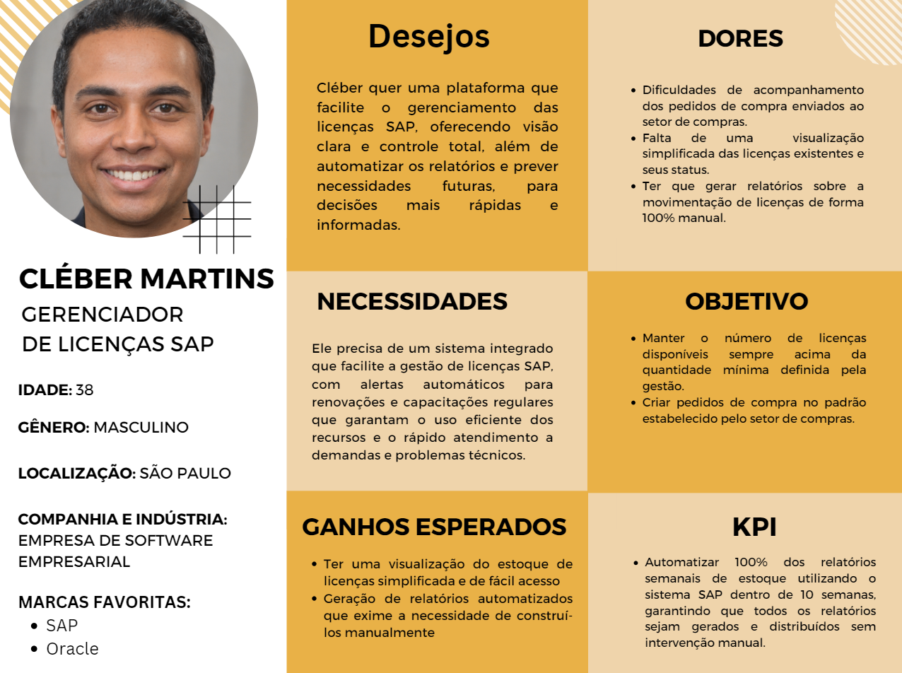
<sup>Fonte: Material produzido pelos autores (2024)</sup>
</div>

&emsp;Esta seção de personas conclui fornecendo insights detalhados sobre as necessidades específicas e os desafios enfrentados por usuários em diversas funções e indústrias. Cada perfil é meticulosamente desenvolvido para refletir características e preferências reais que impactam diretamente no ambiente de trabalho. Com esses perfis, podemos desenvolver soluções mais precisas e eficazes, assegurando que os produtos e serviços não só atendam, mas excedam as expectativas de cada usuário. A compreensão aprofundada oferecida por cada persona habilita uma abordagem personalizada no desenvolvimento de projetos, garantindo que cada decisão esteja alinhada com as verdadeiras necessidades do público-alvo. Assim, a seção serve como uma ferramenta essencial para impulsionar inovações centradas no usuário, resultando em impactos práticos e significativos.

## <a name="14-mapa-de-empatia"></a> 1.4 Mapa de Empatia

&emsp;Um mapa de empatia é uma ferramenta que ajuda a entender melhor como os usuários de um sistema, nesse caso o SAP, pensam e se sentem ao usá-lo. Ele é usado para compreender as necessidades, frustrações e expectativas das pessoas que interagem com o sistema, no caso os funcionários da G2. Ao criar o mapa de empatia, conseguimos visualizar o que os usuários vêem, ouvem, pensam e fazem ao utilizar o sistema, o que ajuda a melhorar a experiência deles com o SAP e tornar o sistema mais fácil e eficiente de usar.

&emsp;Para documentar o mapa de empatia apresentado e interpretar os itens com foco em como o projeto de implementação do SAP Business One pode resolver as dores, optamos por estruturar não só o mapa em si, mas uma descrição de nossas escolhas:

<div align="center">
<sub>Figura 3 - Mapa de Empatia Cléber Martins</sub>
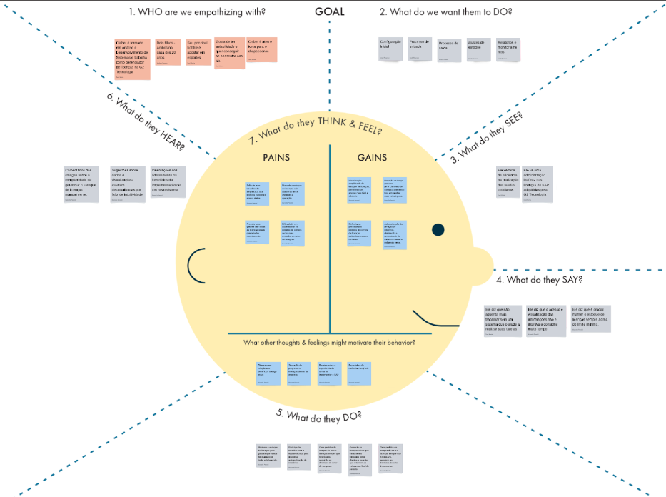
<sup>Fonte: Material produzido pelos autores (2024)</sup>
</div>

### **Quem estamos empatizando?**

&emsp;Cléber Martins é formado em Análise e Desenvolvimento de Sistemas e possui mais de 10 anos de experiência com SAP. Nos últimos dois anos, ele tem se concentrado exclusivamente no gerenciamento de licenças SAP, um papel crítico para o funcionamento da G2 Tecnologia. Cléber é casado, pai de dois filhos na faixa dos 20 anos, e aprecia a organização e a clareza em suas atividades diárias. No seu tempo livre, gosta de jogar videogames e viajar com sua esposa.

### **O que ele ouve?**

&emsp;Cléber frequentemente ouve comentários dos colegas sobre a complexidade de gerenciar o estoque de licenças manualmente, o que adiciona uma carga significativa ao seu trabalho. Além disso, ele recebe sugestões sobre a necessidade de automatizar e simplificar as tarefas relacionadas ao estoque de licenças. Os líderes da empresa orientam sobre os benefícios esperados com a implementação do SAP Business One, como a melhoria na eficiência operacional e a eliminação de processos manuais.

### **O que ele vê?**

&emsp;Cléber observa uma falta de eficiência nas atividades cotidianas, principalmente devido à necessidade de realizar muitas tarefas manualmente, como a geração de relatórios e o acompanhamento do estoque de licenças. Ele também percebe que a implementação do SAP Business One pode ser uma solução para centralizar e automatizar esses processos, melhorando a visualização das informações e o controle sobre o estoque de licenças.

### **O que ele diz?**

&emsp;Cléber expressa a necessidade urgente de uma solução que automatize a geração de relatórios e simplifique a gestão do estoque de licenças. Ele reconhece que manter o estoque acima do limite mínimo é crucial para o sucesso da operação, e que a implementação do SAP Business One será fundamental para alcançar esse objetivo. Ele também comenta sobre o tempo e esforço gastos com os processos manuais atuais, que poderiam ser eliminados com uma solução mais eficiente.

### **O que ele faz?**

&emsp;Atualmente, Cléber gerencia o estoque de licenças manualmente, acompanhando de perto o número de licenças disponíveis e gerando pedidos de compra quando necessário. Ele também se envolve em reuniões para discutir a implementação do SAP Business One e como o sistema pode ser configurado para atender às suas necessidades específicas, como a automatização de relatórios e a visualização em tempo real do estoque de licenças.

### **Dores**

&emsp;Cléber enfrenta dificuldades significativas no acompanhamento dos pedidos de compra e na gestão manual do estoque de licenças, o que aumenta a probabilidade de erros e consome muito tempo. A falta de uma visualização simplificada e de relatórios automatizados também é uma fonte de frustração, dificultando o controle eficiente do estoque.

### **Ganhos**

&emsp;Com a implementação do SAP Business One, Cléber espera obter uma visualização simplificada e centralizada do estoque de licenças, além de relatórios automatizados que eliminem a necessidade de processos manuais. Ele também acredita que o sistema ajudará a manter o estoque acima do limite mínimo, evitando problemas operacionais e garantindo um fluxo contínuo de licenças para os clientes.

### **Como o projeto pode resolver as dores?**

&emsp;Portanto, nosso projeto de implementação do SAP Business One pode resolver as dores de Cléber Martins de várias maneiras:

1. **Automatização de processos**: O SAP Business One pode automatizar a geração de relatórios e o monitoramento do estoque de licenças, reduzindo significativamente o tempo e esforço necessários para essas tarefas. Isso também minimiza a probabilidade de erros humanos.
2. **Visualização centralizada**: A implementação do sistema permitirá a Cléber visualizar o status das licenças de maneira simplificada e em tempo real, facilitando a tomada de decisões e o acompanhamento do estoque.
3. **Gestão eficiente do estoque**: O SAP Business One pode ser configurado para alertar Cléber quando o estoque de licenças estiver abaixo do limite mínimo, ajudando-o a tomar medidas proativas para evitar interrupções na operação.
4. **Integração com o setor de compras**: O sistema pode integrar o processo de pedidos de compra, garantindo que todas as licenças necessárias sejam adquiridas de forma eficiente e no momento certo, melhorando a comunicação entre Cléber e o setor de compras.
5. **Redução de sobrecarga manual**: Com processos automatizados e uma interface de fácil uso, Cléber poderá focar em atividades mais estratégicas e menos na execução de tarefas repetitivas e manuais.
6. **Apoio na adaptação e treinamento**: A implementação do SAP Business One incluirá treinamento para garantir que Cléber e sua equipe se adaptem rapidamente ao novo sistema, garantindo que todas as funcionalidades sejam bem aproveitadas desde o início.

## <a name="15-user-stories"></a> 1.5 User Stories

&emsp;User Stories são muito importantes em projetos ágeis porque ajudam a transformar o que os usuários precisam em tarefas claras para os desenvolvedores. Neste documento, usamos o método INVEST para criar cada User Story, garantindo que cada uma seja independente, possa ser negociada, traga valor, possa ser estimada, seja pequena e testável. Esse método ajuda a manter tudo organizado e claro para todos, desde os que pedem a funcionalidade até quem vai desenvolvê-la.

&emsp;Neste projeto, focamos nas tarefas diárias e desafios estratégicos de gerenciar estoques e licenças de software, descritas nas histórias de Carol e Cléber. Cada história tem seus próprios critérios claros para ser considerada completa, o que ajuda a equipe a trabalhar de forma mais rápida e a se adaptar às mudanças facilmente. Esta abordagem não só aumenta a precisão no trabalho como também faz com que todos saibam exatamente o que precisa ser feito.

&emsp;Além disso, usar o método INVEST ajuda a equipe a trabalhar melhor juntos, entendendo o que cada tarefa significa para o projeto e para o usuário final. Isso leva a um trabalho mais eficiente e a um produto final que realmente atende às necessidades de quem vai usá-lo, combinando com o que a empresa espera alcançar com o projeto.

## User Stories Carol Bispo 

### 1. Validação Diária de Quantidade de Recebimentos de Estoque
&emsp;A gestão eficaz do inventário começa com a precisão no recebimento dos produtos. Para Carol Bispo, validar diariamente a quantidade dos recebimentos de estoque é fundamental para manter a integridade dos dados e evitar discrepâncias que possam impactar as operações e a contabilidade da empresa.

| Atributo    | Descrição |
|-------------|-----------|
| **Título**  | Validação Diariamente Quantidades de Recebimentos de Estoque |
| **Descrição** | Como gerente de produtos indiretos, quero validar a quantidade dos recebimentos de estoque diariamente para garantir que os registros estejam precisos e atualizados. |
| **Independent** | Esta User Story pode ser implementada independentemente, não dependendo de outras funcionalidades. |
| **Negotiable** | Os métodos e ferramentas para validação podem ser discutidos e adaptados conforme necessário. |
| **Valuable** | Esta tarefa é crucial para manter a integridade dos dados de estoque e evitar discrepâncias financeiras. |
| **Estimable** | A tarefa é claramente definida e a equipe possui todas as informações necessárias para estimar o esforço requerido. |
| **Small** | A tarefa é suficientemente pequena para ser completada diariamente dentro do fluxo de trabalho regular. |
| **Testable** | Pode-se testar verificando a precisão dos registros de estoque após a validação diária. |
| **Critérios de Aceitação** | 1. A quantidade de todos os recebimentos de estoque devem ser validados no mesmo dia da chegada. 2. Os registros no sistema devem refletir exatamente os dados dos documentos de entrega. |
| **Notas/Comentários** | Assegurar a integração com o sistema ERP para atualizações em tempo real. |

### 2. Elaboração de Relatórios de Performance de Estoque
&emsp;Relatórios de desempenho são vitais para qualquer gestão eficiente de estoque, oferecendo insights sobre o status atual e ajudando a prever necessidades futuras. Para Carol, elaborar esses relatórios permite uma visão detalhada e atualizada da performance do estoque, identificando áreas de sucesso e pontos que necessitam de melhoria.

| Atributo    | Descrição |
|-------------|-----------|
| **Título**  | Gerar Relatórios de Performance de Estoque |
| **Descrição** | Como gerente de produtos indiretos, quero gerar relatórios de performance de estoque para identificar áreas de melhoria e sucesso. |
| **Independent** | Pode ser realizada independentemente de outras atividades, contanto que os dados necessários estejam disponíveis. |
| **Negotiable** | O formato e a frequência dos relatórios podem ser ajustados com base nas necessidades da gestão. |
| **Valuable** | Fornecer insights valiosos sobre a gestão de estoque, ajudando na tomada de decisões estratégicas. |
| **Estimable** | A clareza nos dados disponíveis e nas ferramentas de relatório permite uma estimativa precisa do tempo necessário para a elaboração dos relatórios de performance de estoque. |
| **Small** | O processo de elaboração de relatórios deve ser conciso e eficiente, podendo ser completado dentro de um ciclo de trabalho regular. |
| **Testable** | A exatidão e a utilidade dos relatórios podem ser avaliadas através do feedback dos stakeholders. |
| **Critérios de Aceitação** | 1. Os relatórios devem ser gerados mensalmente. 2. Deve incluir análise de tendências, status atual e previsões. |
| **Notas/Comentários** | Considerar a automatização da coleta de dados e da geração de relatórios. |

### 3. Controle de Qualidade na Recepção de Novos Lotes
&emsp;Manter altos padrões de qualidade é essencial para garantir a satisfação do cliente e a reputação da empresa. Carol Bispo realiza um controle de qualidade rigoroso para cada novo lote de produtos recebidos. Esta User Story detalha como ela inspeciona fisicamente cada item para garantir que atenda aos padrões requeridos antes de ser aceito no estoque, assegurando a continuidade da qualidade dos produtos ofertados pela empresa.

| Atributo    | Descrição |
|-------------|-----------|
| **Título**  | Controle de Qualidade na Recepção de Novos Lotes |
| **Descrição** | Como gerente de produtos indiretos, quero realizar controle de qualidade sempre que novos lotes de produtos chegarem, para assegurar que atendem aos padrões estabelecidos. |
| **Independent** | Esta tarefa é independente e pode ser realizada à medida que novos lotes chegam. |
| **Negotiable** | Os critérios de qualidade podem ser ajustados com base nas especificações do produto e feedback dos clientes. |
| **Valuable** | Essencial para manter a confiança na qualidade dos produtos armazenados e vendidos. |
| **Estimable** | O tempo e recursos necessários para inspeção são conhecidos e podem ser estimados com precisão. |
| **Small** | Cada inspeção é um processo contido que pode ser completado rapidamente dependendo do volume do lote. |
| **Testable** | A eficácia do controle de qualidade pode ser verificada através de relatórios de falhas pós-inspeção. |
| **Critérios de Aceitação** | 1. Todos os lotes recebidos devem ser inspecionados no prazo de 24 horas após a chegada. 2. Relatórios de inspeção devem ser arquivados e acessíveis para auditorias. |
| **Notas/Comentários** | Manter um registro digital das inspeções para facilitar o acesso e a revisão. |

### 4. Gerenciar a quantidade de licenças da SAP que a G2 tem
&emsp;O gerenciamento de licenças de software é uma tarefa crucial para maximizar a eficiência operacional e minimizar custos. Para Carol, é importante garantir que todas as licenças da SAP sejam adequadamente monitoradas e ajustadas conforme as necessidades da equipe. Esta User Story aborda como Carol mantém o equilíbrio entre ter recursos suficientes para os usuários e evitar despesas desnecessárias com licenças não utilizadas.

| Atributo    | Descrição |
|-------------|-----------|
| **Título**  | Gerenciar a Quantidade de Licenças da SAP que a G2 Tem |
| **Descrição** | Como gerente de produtos indiretos, preciso gerenciar efetivamente a quantidade de licenças da SAP para garantir que a equipe tenha os recursos necessários sem incorrer em custos excessivos. |
| **Independent** | Pode ser gerenciada independentemente de outros processos de TI. |
| **Negotiable** | O número de licenças pode ser ajustado com base nas mudanças na equipe ou nas necessidades operacionais. |
| **Valuable** | Garante que todos os usuários tenham acesso às ferramentas necessárias enquanto controlam os custos de software. |
| **Estimable** | A necessidade de licenças e o custo associado são claros e podem ser facilmente estimados. |
| **Small** | A gestão de licenças é uma tarefa regular que pode ser completada em um ciclo de trabalho normal. |
| **Testable** | A adequação do número de licenças pode ser testada através da verificação do uso e feedback da equipe. |
| **Critérios de Aceitação** | 1. As licenças devem ser suficientes para todos os usuários ativos, sem exceder o necessário. 2. Revisões periódicas devem ser realizadas para ajustar o número de licenças conforme necessário. |
| **Notas/Comentários** | Manter um registro detalhado do uso das licenças para facilitar as revisões e ajustes. |

## User Stories Cléber Martins

### 1. Automação de Relatórios de Estoque
&emsp;Na gestão moderna de estoques, a precisão e a eficiência são essenciais para sustentar as operações sem interrupções. Cléber, gerente de licenças SAP, enfrenta o desafio constante de manter essa precisão ao gerenciar informações cruciais. A automação da geração de relatórios semanais de estoque é uma iniciativa que busca eliminar os erros manuais e aumentar a eficiência do processo de gestão, garantindo que todos os relatórios sejam gerados e distribuídos automaticamente, sem falhas e dentro do cronograma estipulado.

| Atributo    | Descrição |
|-------------|-----------|
| **Título**  | Automação de Relatórios de Estoque |
| **Descrição** | Como gerente de licenças SAP, quero automatizar a geração dos relatórios semanais de estoque, para garantir que todos os relatórios sejam gerados automaticamente. |
| **Independent** | Esta User Story pode ser implementada independentemente, não dependendo de outras funcionalidades. |
| **Negotiable** | O formato dos relatórios e a frequência de automação podem ser ajustados conforme as necessidades da gestão. |
| **Valuable** | Esta tarefa é valiosa pois elimina erros manuais e aumenta a eficiência do processo de gestão de licenças. |
| **Estimable** | A tarefa é claramente definida e a equipe possui todas as informações necessárias para estimar o esforço requerido. |
| **Small** | A tarefa é pequena e específica, focando apenas na automação da geração dos relatórios. |
| **Testable** | Pode-se testar verificando se os relatórios são gerados automaticamente e distribuídos conforme especificado. |
| **Critérios de Aceitação** | 1. Todos os relatórios devem ser gerados automaticamente sem intervenção manual. 2. Relatórios devem ser distribuídos de acordo com o cronograma. |
| **Notas/Comentários** | Assegurar que o sistema ERP esteja configurado para suportar a automação dos relatórios. |

### 2. Visualização Simplificada das Licenças
&emsp;Para uma gestão eficaz, o acesso rápido e compreensível às informações atuais sobre as licenças é crucial. Cléber, como gerente responsável, percebe a necessidade de uma interface de visualização que permita a ele e à sua equipe monitorar as licenças de software em tempo real. Este desenvolvimento visa proporcionar uma ferramenta que simplifique o processo de visualização, tornando-o intuitivo e menos sujeito a complicações, facilitando assim as decisões rápidas e informadas que são vitais para a dinâmica operacional da empresa.

| Atributo    | Descrição |
|-------------|-----------|
| **Título**  | Visualização Simplificada das Licenças |
| **Descrição** | Como gerente de licenças SAP, quero ter uma visualização simplificada e de fácil acesso do status das licenças, para que eu possa monitorar o estoque em tempo real. |
| **Independent** | Esta User Story pode ser implementada independentemente, não dependendo de outras funcionalidades. |
| **Negotiable** | O design da interface e os detalhes da visualização podem ser ajustados conforme necessário durante o desenvolvimento. |
| **Valuable** | Esta tarefa é crucial para garantir o monitoramento eficiente do estoque de licenças e tomar decisões rápidas. |
| **Estimable** | A tarefa é estimável com base nos requisitos de visualização e no volume de dados. |
| **Small** | A tarefa é pequena e focada apenas na criação de uma visualização específica. |
| **Testable** | Pode-se testar verificando a exibição correta e atualizada do status das licenças na interface. |
| **Critérios de Aceitação** | 1. A interface deve exibir o status atualizado de todas as licenças em tempo real. 2. A visualização deve ser fácil de acessar e compreender. |
| **Notas/Comentários** | Considerar a integração com outras ferramentas de monitoramento para uma visão consolidada. |

### 3. Alerta de Estoque Baixo
&emsp;Na gestão de licenças de software, evitar a escassez que pode interromper as operações é um desafio crítico. Cléber implementa um sistema proativo de alertas que o informa automaticamente quando as licenças atingem um nível mínimo pré-estabelecido. Este sistema é essencial para permitir que ele reaja rapidamente e faça pedidos de compra antes que a situação se torne crítica, garantindo a continuidade dos serviços sem interrupções.

| Atributo    | Descrição |
|-------------|-----------|
| **Título**  | Alerta de Estoque Baixo |
| **Descrição** | Como gerente de licenças SAP, quero receber alertas automáticos quando o número de licenças atingir o nível mínimo, para que eu possa emitir pedidos de compra de forma proativa. |
| **Independent** | Esta User Story pode ser implementada independentemente, não dependendo de outras funcionalidades. |
| **Negotiable** | O método de alerta (e-mail, notificação no sistema) pode ser ajustado conforme necessário. |
| **Valuable** | Esta tarefa é valiosa pois ajuda a evitar a falta de licenças e garante a continuidade do serviço. |
| **Estimable** | A tarefa é estimável com base nas regras de negócio e nos critérios que disparam o alerta. |
| **Small** | A tarefa é pequena e específica para a implementação do sistema de alerta. |
| **Testable** | Pode-se testar verificando se os alertas são enviados corretamente ao atingir o nível mínimo de estoque. |
| **Critérios de Aceitação** | 1. Alertas devem ser enviados automaticamente ao atingir o nível mínimo de estoque. 2. O método de alerta deve ser configurável. |
| **Notas/Comentários** | Assegurar que os critérios para o disparo dos alertas estejam bem definidos e alinhados com as necessidades do negócio. |

### 4. Criação de Pedidos de Compra Automáticos
&emsp;A necessidade de manter um fluxo constante de licenças disponíveis impulsiona Cléber a buscar soluções que automatizem processos críticos. A criação automática de pedidos de compra quando o estoque atinge um ponto crítico é uma dessas soluções, visando garantir que nunca haja um déficit de licenças necessárias para a operação. Esta User Story foca no ajuste e implementação de um sistema que não apenas monitora os níveis de estoque, mas também inicia processos de compra de forma autônoma, assegurando a eficácia e a eficiência na gestão de recursos.

| Atributo    | Descrição |
|-------------|-----------|
| **Título**  | Criação de Pedidos de Compra Automáticos |
| **Descrição** | Como gerente de licenças SAP, quero que o sistema gere automaticamente pedidos de compra de licenças quando o estoque atingir um limite mínimo, para garantir que nunca faltem licenças disponíveis. |
| **Independent** | Esta User Story pode ser implementada independentemente, não dependendo de outras funcionalidades. |
| **Negotiable** | Os critérios que disparam a criação de pedidos podem ser ajustados conforme as regras de negócio. |
| **Valuable** | Esta tarefa é valiosa pois automatiza um processo crítico, garantindo a continuidade do serviço sem intervenção manual. |
| **Estimable** | A tarefa é estimável com base nas regras de negócio e na complexidade do fluxo de compras. |
| **Small** | A tarefa é pequena e focada apenas na automação da criação de pedidos de compra. |
| **Testable** | Pode-se testar verificando se os pedidos de compra são gerados automaticamente conforme o estoque diminui. |
| **Critérios de Aceitação** | 1. Pedidos de compra devem ser gerados automaticamente ao atingir o limite mínimo de estoque. 2. Pedidos gerados devem seguir o padrão estabelecido pelo setor de compras. |
| **Notas/Comentários** | Garantir que o sistema ERP esteja configurado para suportar a criação automática de pedidos de compra conforme as regras de negócio definidas. |

### 5. Histórico de Movimentação de Licenças
&emsp;Gerenciar com precisão o ciclo de vida das licenças SAP exige uma visão clara de todas as movimentações e entradas, saídas e renovações. Cléber busca implementar uma solução que registre detalhadamente cada uma dessas movimentações, proporcionando uma visão abrangente e acessível do histórico de licenças. Esta funcionalidade é projetada para apoiar decisões informadas, auditorias, e análises estratégicas, garantindo que a gestão das licenças seja feita com a máxima transparência e controle.

| Atributo    | Descrição |
|-------------|-----------|
| **Título**  | Histórico de Movimentação de Licenças |
| **Descrição** | Como gerente de licenças SAP, quero acessar um histórico detalhado de todas as movimentações de licenças (entrada, saída, renovação), para que eu possa ter uma visão clara e completa do ciclo de vida das licenças. |
| **Independent** | Esta User Story pode ser implementada independentemente, não dependendo de outras funcionalidades. |
| **Negotiable** | O nível de detalhe e o período coberto pelo histórico podem ser ajustados conforme necessário. |
| **Valuable** | Esta tarefa é valiosa pois fornece visibilidade completa sobre o uso e gerenciamento das licenças, facilitando a tomada de decisões informadas. |
| **Estimable** | A tarefa é estimável com base no volume de dados a ser tratado e nas regras para filtragem e exibição do histórico. |
| **Small** | A tarefa é pequena e focada apenas na criação do histórico de movimentação. |
| **Testable** | Pode-se testar verificando se todas as movimentações de licenças são corretamente registradas e exibidas no histórico. |
| **Critérios de Aceitação** | 1. O histórico deve incluir todas as movimentações de licenças com detalhes sobre datas e ações realizadas. 2. O histórico deve ser facilmente acessível e navegável. |
| **Notas/Comentários** | Considerar a possibilidade de exportar o histórico para análises externas ou auditorias. |


&emsp;Ao concluirmos esta seção de User Stories, destacamos a importância delas para conectar claramente o que precisamos desenvolver com o que realmente importa para quem vai usar o sistema. Usando o método INVEST, garantimos que cada história seja útil, clara e direta, ajudando a equipe a entender e entregar exatamente o que é necessário. Isso torna o processo de desenvolvimento mais eficiente e ajuda a manter todos na mesma página.

&emsp;As histórias de Carol e Cléber mostram como uma boa preparação pode fazer a diferença. Elas nos ajudam a ver como cada tarefa contribui para o projeto geral e como ajustes podem ser feitos rapidamente quando necessário. À medida que seguimos para as próximas etapas, essas User Stories continuarão sendo uma referência valiosa, garantindo que continuemos focados e eficazes em atender às necessidades do projeto.

# <a name="2-entendimento-negócio"></a> 2. Entendimento de Negócios 

&emsp;A sessão "Entendimento de Negócios" é projetada para estabelecer uma base no que diz respeito à viabilidade e sustentabilidade do projeto, garantindo que todas as decisões estejam alinhadas com os objetivos estratégicos e operacionais. Esta sessão abrange a análise de riscos e a definição da proposta de valor.

&emsp;O primeiro componente desta sessão é a Matriz de Risco, que deve ser desenvolvida levando em consideração o projeto específico para a empresa *G2 Tecnologia*, com uma visão interna da equipe de aplicação de *SAP*. Este processo envolve a identificação de, 10 riscos potenciais que possam impactar o andamento ou o sucesso do projeto, desenhando ainda um plano de resposta para cada risco identificado e justifique as decisões tomadas, conforme recomendado por Smith (2018), que enfatiza a importância de uma gestão de riscos proativa na garantia da continuidade do negócio. Além disso, o grupo optou por fazer também a Matriz de Oportunidades, identificado 10 oportunidades, que procuram visualizar o melhor cenário possível e estabelecer estratégias para alcançar tais objetivos. 

&emsp;O segundo componente é o Canvas Proposta de Valor, que deve ser elaborado com base na solução que a equipe está desenvolvendo. Este documento articula o valor que a solução proposta traz para o cliente, a G2 tecnologia, considerando suas necessidades e problemas. Estudos como o de Osterwalder et al. (2014) sublinham a eficácia do Canvas Proposta de Valor em alinhar a oferta de valor da solução com as expectativas do mercado, facilitando a comunicação e a implementação de estratégias centradas no cliente.


## <a name="21-matriz-de-risco"></a> 2.1 Matriz de Risco

&emsp;Segue a matriz de risco criada pela equipe:

<div align="center">
<sub>Figura 4 - Matriz de risco</sub>
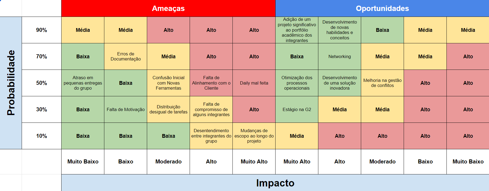
<sup>Fonte: Material produzido pelos autores (2024)</sup>
</div>

### Plano de Ação:

&emsp;A sub-seção de Plano de Ação pretende analisar os riscos descritos na seção Matriz de Risco e, a partir disso, estabelecer estratégias para mitigar o acontecimento dos riscos mapeados. Segue a metodologia estabelecida pela equipe:

1. **Erros de Documentação** 
   - Mitigação: Implementar uma revisão duplamente reforçada para garantir que nada seja negligenciado, prevenindo erros. Dessa forma, cada task terá um responsável por executá-la e um responsável por revisá-la.

   Para exemplificar, segue o refinamento realizado na Sprint 1 (sugeito a mudanças nas demais sprints), note os campos de "Feito por" e "Revisado Por", que simboliza o responsável por realizar e revisar cada tarefa:

    <div align="center">
    <sub>Figura 5 - Exemplo de parte do Refinamento Criado pela Equipe</sub>
    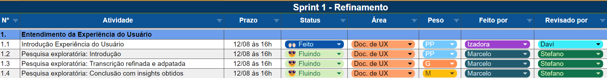
    <sup>Fonte: Material produzido pelos autores (2024)</sup>
    </div>

2. **Atraso em Pequenas Entregas do Grupo**
   - Mitigação: O *Scrum Master* e *Product Owner* será responsável verificando se as entregas estão acontecendo dentro do prazo e garantindo que as entregas sejam feitas no prazo a cada Sprint.

3. **Confusão Inicial com Novas Ferramentas**
   - Mitigação: Determinar quais serão as ferramentas utilizadas e exigir que todos os membros do grupo estude-as para estarem alinhados e preparados para o projeto.

4. **Falta de Alinhamento com o Cliente**
   - Mitigação: Confirmar após cada reunião com o cliente que o projeto está no caminho certo e que todos estão alinhados.

5. **Daily Ineficiente**
   - Mitigação: A equipe ágil deve garantir que cada membro saia da daily com clareza sobre o que cada membro do grupo está fazendo, assegurando transparência no desenvolvimento diário.

6. **Falta de Motivação**
   - Mitigação: Se houver sinais de falta de engajamento, focar em atividades de desenvolvimento em grupo para reanimar a equipe.

7. **Distribuição Desigual de Tarefas**
   - Mitigação: Analisar e ajustar a distribuição de tarefas para garantir equilíbrio, como descrito anteriormente.

8. **Falta de Compromisso de Alguns Integrantes**
   - Mitigação: Definir prazos de entrega claros e cumprir rigorosamente conforme estabelecido na planning, comunicando impedimentos.

9. **Desentendimento entre Integrantes do Grupo** 
   - Mitigação: Promover comunicação aberta e resolver conflitos rapidamente, como mencionado anteriormente.

10. **Mudanças de Escopo ao Longo do Projeto** 
    - Mitigação: Analisar as mudanças cuidadosamente, designar quem melhor se encaixa para a tarefa e garantir que o trabalho seja concluído dentro do prazo.

## <a name="22-canvas-proposta"></a> Canvas Proposta de Valor

&emsp;&emsp;O Value Proposition Canvas é um framework desenvolvido pelo Dr. Alexander Osterwalder, também criador do Business Model Canvas. Este instrumento tem como objetivo auxiliar no entendimento do valor que um produto, serviço ou negócio pode oferecer aos clientes. O framework é dividido em dois segmentos: um focado no cliente e outro na proposta de valor. No segmento voltado ao cliente, são identificadas as tarefas que os clientes desejam realizar, bem como suas dores e ganhos esperados. No segmento da proposta de valor, são analisados os benefícios oferecidos pelo produto ou serviço e como eles atendem às necessidades e aliviam as dores dos clientes. Dada a importância dessa ferramenta, apresentamos a seguir uma análise baseada no projeto atual, analisando como a equipe poderá agregar valor para o cliente G2 Tecnologia.

<div align="center">
<sub>Figura 6 - Canvas da Propost de Valor Geral</sub>
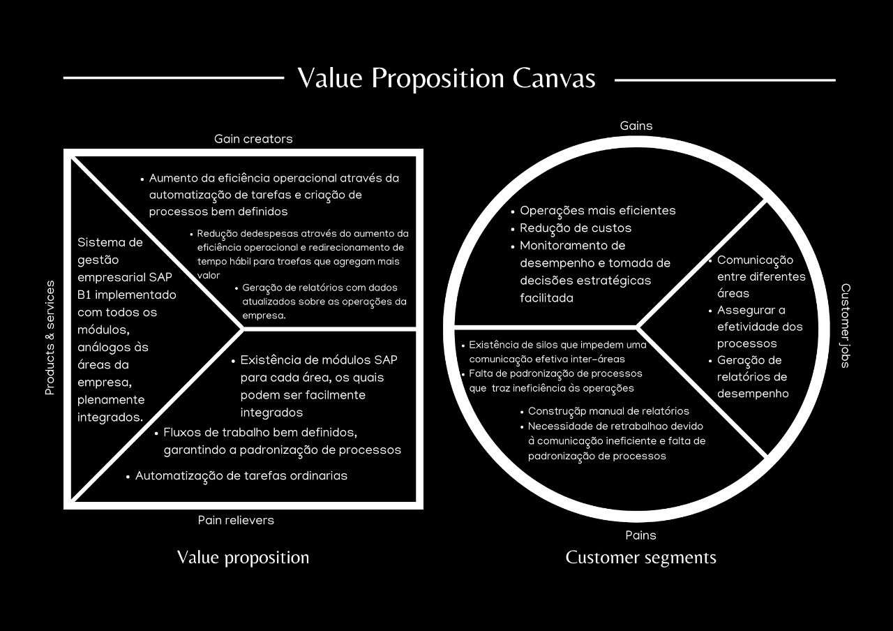
<sup>Fonte: Material produzido pelos autores (2024)</sup>
</div>

&emsp;&emsp;No contexto da análise de perfil do cliente, é essencial compreender as tarefas que enfrentam, suas principais dificuldades e os ganhos que esperam alcançar. Para nossos clientes, garantir uma comunicação eficaz entre diferentes áreas da empresa é fundamental, já que a entrega de valor envolve processos que abrangem todos os setores da organização, tanto direta quanto indiretamente. Além disso, é crucial assegurar a efetividade dos processos e gerar relatórios para auditoria, análise de processos e avaliação de desempenho.

&emsp;&emsp;As dificuldades enfrentadas pelos clientes estão diretamente relacionadas a essas tarefas. Silos de informação criam barreiras à comunicação eficiente entre áreas, a falta de padronização de processos resulta em ineficiências operacionais, e a necessidade de gerar relatórios manualmente consome tempo e aumenta o risco de erros. Outro desafio comum é o retrabalho, causado pela comunicação ineficaz e ausência de processos padronizados.

&emsp;&emsp;Para enfrentar essas dificuldades, os clientes buscam ganhos específicos: operações mais eficientes que reduzam retrabalho e custos, além de uma melhor capacidade de monitorar o desempenho e tomar decisões estratégicas com mais facilidade.

&emsp;&emsp;Nossa proposta de valor é o SAP Business One, um sistema de gestão empresarial que oferece uma solução integrada e abrangente. Com todos os módulos necessários para cobrir as diversas áreas da empresa, o SAP Business One elimina os silos de informação, facilita a comunicação entre setores e garante que todos os processos sejam bem definidos e padronizados. A automação de tarefas ordinárias, como a geração de relatórios e o cálculo de impostos, reduz a necessidade de trabalho manual e retrabalho.

&emsp;&emsp;Com a implementação do SAP Business One, os clientes podem esperar um aumento significativo na eficiência operacional, com menores despesas e mais tempo para se dedicar a tarefas que agregam valor. Além disso, a geração de relatórios com dados atualizados proporciona uma visão clara das operações da empresa, facilitando a tomada de decisões estratégicas.

&emsp;&emsp;Ademais, tendo em vista que dentro deste projeto o grupo trabalhará exclusivamente com a área de estoque, também foi feita a análise da proposta de valor daquilo que será entregue à área de estoque da G2 Tecnologia (Figura X). 

<div align="center">
<sub>Figura 7 - Canvas da Propost de Valor Específico</sub>
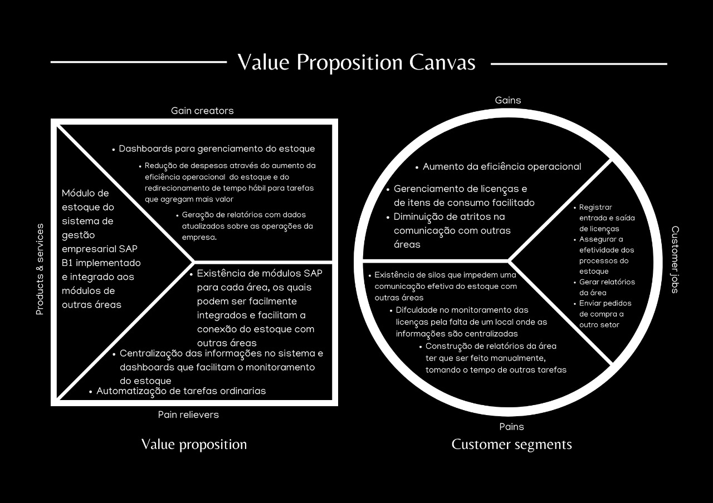
<sup>Fonte: Material produzido pelos autores (2024)</sup>
</div>

&emsp;&emsp;No que diz respeito ao setor supracitado, este é responsável por gerenciar as licenças SAP Business One - adquiridas tanto para o uso próprio quanto para os clientes - bem como os itens de consumo da empresa. Portanto, como tarefas do cliente foram elencados o registro da entrada e e da saída de licenças, o asseguramento da efetividade dos processos do setor de estoque, a geração de relatórios da área e o envio de pedidos de compra aos setores responsáveis.

&emsp;&emsp;No entanto, na realização de tais tarefas existem algumas dores que que são: a existênciade silos que impedem uma comunicação efetiva do estoque com outras áreas; a difculdade no monitoramento das licenças SAP Business One adqiridas pela G2 dado a falta de um local onde as informações possam ser centralizadas; a construção de relatórios da área ter que ser feito manualmente, o que toma o tempo de outras tarefas que quando realizadas geram mais valor para a empresa. 

&emsp;&emsp;A partir das tarefas e dores identificadas, foi possível entender os ganhos que o cliente gostaria de ter. Como principais ganhos pode-se citar uma maior facilidade no gerenciamento de licenças bem como dos itens de consumo existentes no estoque, a eliminação de silos organizacionais a qual euxiliará na extinção de atritos na comunicação com outras áreas, por fim, todos os aspectos citados têm como consequência o aumento da eficiência operacional, que pode acarretar na diminuição de custos operacionais.

&emsp;&emsp;No que tange à proposta de valor, tendo em vista as características e demandas do cliente, o serviço oferecido é a implementação do módulo de estoque do sistema de gestão empresarial SAP Business One, bem como a sua integração com os módulos de outras áreas. No que diz respeito às ferramentas para aliviar as dores dos clientes, pode-se citar a existência de módulos SAP para cada área da empresa, os quais podem ser facilmente integrados e facilitam a conexão do estoque com outras setores. Além disso, as informações da área serão centralizadas nomesmo sistema, o qual possui dashboards que facilitam o monitoramento do estoque. Este mesmo sistema também é capaz de fazer com que os processos da área sejam bem definidos e estabelecidos, sendo ainda capaz de automatizar algumas tarefas como a geração de relatórios - que atualmente é feota de forma manual.

&emsp;&emsp;A partir deste serviço são criados ganhos ao cliente, como dashboards para gerenciamento do estoque, a geração de relatórios com dados atualizados sobre as operações da empresa - que pode facilitar a tomada de decisões estratégicas - e, por fim, a redução de despesas através do aumento da eficiência operacional e do redirecionamento de tempo hábil para tarefas que agregam mais valor à área e à empresa.

&emsp;&emsp;Portanto, fica evidente que o SAP Business One aborda diretamente as principais questões enfrentadas pelo cliente. O serviço de implementação oferecido é ideal para o momento atual da empresa, proporcionando um aumento na eficiência operacional, redução de custos e facilidade na tomada de decisões estratégicas.

# <a name="3-configurações-iniciais"></a> 3. Configurações Iniciais

&emsp;&emsp;As configurações iniciais em um projeto SAP referem-se ao conjunto de ajustes e parametrizações realizadas para adaptar o sistema SAP às necessidades específicas de uma organização, no caso, a *G2 Tecnologia*. Essas configurações são essenciais para garantir que o sistema funcione de acordo com os processos de negócios da empresa e incluem a definição de estruturas organizacionais, contas contábeis, condições de pagamento, entre outros elementos. No caso específico do projeto, foram oferecidos materiais de apoio para a equipe desenvolvedora, com objetivo de auxiliar no projeto de construção das configurações iniciais, segue o material em questão:

&emsp;&emsp;[Como configurar um BBP.PPTX](https://docs.google.com/presentation/d/1xfat4G5Oeul3TM00iRpYwXe9OnJNZ3Eo/edit?usp=sharing&ouid=116445752223239648497&rtpof=true&sd=true): Arquivo desenvolvido pela *G2 Tecnologia* (parceiro), contêm um passo-a-passo detalhado de como configurar um BBP com as informações fornecidas pelo cliente.   

&emsp;&emsp;[B1AIP20 - Business Blueprint - G2.XLSM](https://docs.google.com/spreadsheets/d/1M91JBz_-NMy3KnbTqm9NHyBCVLo3SPG7/edit?usp=sharing&ouid=116445752223239648497&rtpof=true&sd=true): Arquivo preenchido pela *G2 Tecnologia* (cliente), nele contêm as informações específicas da empresa, necessárias para realizar as configurações iniciais.

&emsp;&emsp;Importante: Por motivos de proteção e segurança de dados, ambos os arquivos somente podem acessados por email com o domínio do Inteli - Instituto de Educação, Ciência e Tecnologia, pelos colaboradores da *G2 Tecnologia* e terceiros aprovados por uma das entidades citadas.

&emsp;&emsp;Dessa forma, a seguir, consta uma explicação detalhada do processo de Configuração Inicial, desenvolvido pelo Time de Estoque. Tais processos foram feitos de acordo com o arquivo oferecido "Como configurar um BBP" (e segue a ordem sugerida por este) e utiliza das informações oferecidas no arquivo "B1AIP20 - Business Blueprint - G2". O caminho para o acesso de cada uma das páginas citadas, podem ser encontrados do lado esquerdo das páginas. Contam também com dados e evidências, por meio de imagens da interface da *SAP Business One*, útil para corroborar a execução e capacitação. 

## <a name="31-primeiras-configurações-na-nova-base"></a> 3.1 Primeiras Configurações na Nova Base

&emsp;&emsp;Dessa é a primeira configuração feita dentro do módulo, segundo o documento oferecido pelo parceiro, *G2 Tecnologia*, essas primeiras configurações devem ser ativadas da mesma maneira para todos os clientes, de acordo com as boas práticas de implantação. Além disso, ao executar essa case da configuração, deve-se tomar um especial cuidado, pois contêm etapas cujos resultados são **irreversíveis** e o seu erro pode resultar em questões burocráticas relacionadas à **refazer a licença** e a perda de recursos financeiros e temporais. 

### 3.1.1 Marcar o flag Custo por Depósito

&emsp;&emsp;A seguir, processo de marcação do flag "Administrar Custo do Item por Depósito:

<div align="center">
<sub>Figura 8 - Administrar Custo por Item de Depósito (caminho mostrado na aba ao lado esquerdo)</sub>
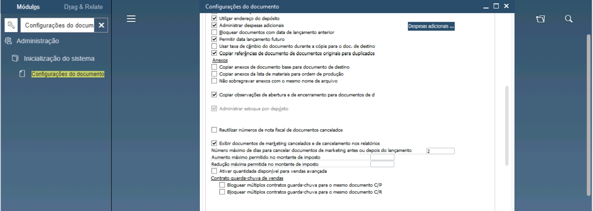
<sup>Fonte: Material produzido pelos autores (2024)</sup>
</div>

**Fluxo:** Administração 🡪 Inicialização do Sistema 🡪 Detalhes da Empresa 🡪 Aba Inicialização básica

<div align="center">
<sub>Figura 9 - Permitir a administração de item por depósito</sub>
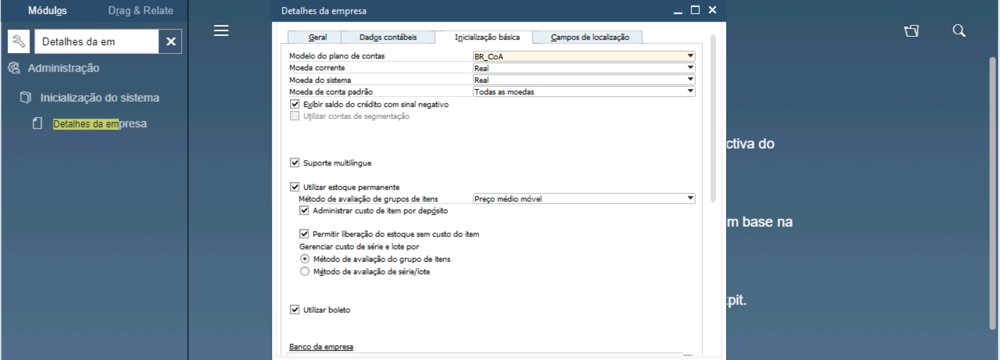
<sup>Fonte: Material produzido pelos autores (2024)</sup>
</div>

**Fluxo:** Administração 🡪 Inicialização do sistema 🡪 Configuração do documento 🡪 Aba Geral

### 3.1.2 Ativar o recurso de Múltiplas Filiais

**Atenção:** Essa é uma configuração **irreversível**

&emsp;&emsp;Segundo a *G2 Tecnologia*: O recurso multifiliais deverá ser habilitado sempre, independentemente se serão configurados mais de um CNPJ. 

&emsp;&emsp;É importante destacar que tentar aplicar a estapa 3.1.2, sem antes ter aplicado a etapa 3.1.2, irá gerar erro no sistema. 

<div align="center">
<sub>Figura 10 - Ative o recurso de multiplas filiais na seção de Detalhes da empresa</sub>
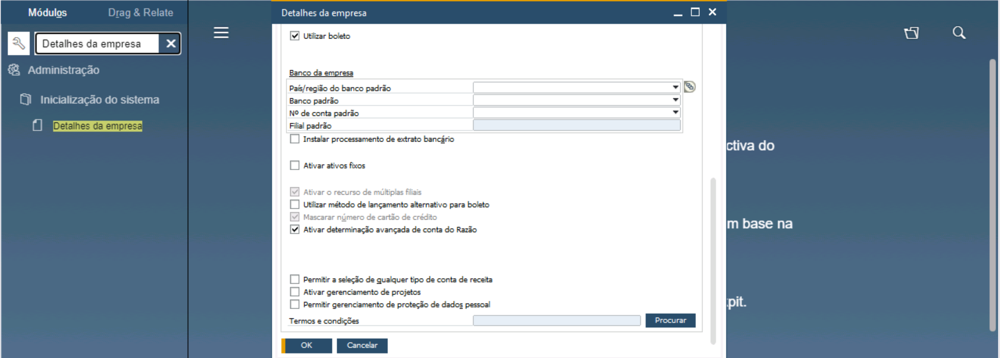
<sup>Fonte: Material produzido pelos autores (2024)</sup>
</div>

**Fluxo:** Administração 🡪 Inicialização do sistema 🡪 Detalhes da empresa 🡪 Aba Inicialização Básica

### 3.1.3 Ativar Determinação Avançada do Razão

&emsp;&emsp;Segundo a **G2 Tecnologia**: O recurso Determinação Avançada do Razão deverá ser habilitado sempre, independentemente se serão configurados mais de um CNPJ. 

<div align="center">
<sub>Figura 11 - Administrar Custo por Item de Depósito (caminho mostrado na aba ao lado esquerdo)</sub>

<sup>Fonte: Material produzido pelos autores (2024)</sup>
</div>

**Fluxo:** Administração 🡪 Inicialização do sistema 🡪 Detalhes da empresa 🡪 Aba Inicialização Básica

&emsp;&emsp;Tal configuração abrirá um pop up que deverá ser respondido da forma a seguir:

<div align="center">
<sub>Figura 12 - Pop UP - Migrar atribuições </sub>
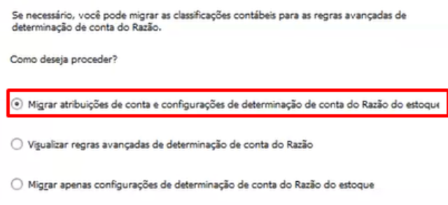
<sup>Fonte: Material produzido pelos autores (2024)</sup>
</div>

## <a name="32-informações-básicas-de-cadastro-da-empresa"></a> 3.2. Arquivo B1AIP Business Print (Configurações)

&emsp;&emsp;Finalizada as primeiras configurações da nova base, inicia-se o processo de configuração do BBP, dessa forma, as configurações a seguir variam de acordo com a empresa em questão. No caso da Equipe de Estoque, tais configurações ocorrerão de acordo com o arquivo [B1AIP20 - Business Blueprint - G2.XLSM](https://docs.google.com/spreadsheets/d/1M91JBz_-NMy3KnbTqm9NHyBCVLo3SPG7/edit?usp=sharing&ouid=116445752223239648497&rtpof=true&sd=true), arquivo com as informações da *G2 Tecnologia* (cliente) a serem integrados ao *SAP Business One*. Essa seção conterá configurações irreversíveis.

### 3.2.1 Informações Básicas de Cadastro da Empresa

&emsp;&emsp;A primeira configuração a ser feita no BBP envolve o cadastro das informações básicas da empresa.

### 3.2.2 Configuração de Moedas

&emsp;&emsp;A próxima etapa no processo de configuração do BBP envolve a definição das moedas que serão utilizadas nas operações de vendas e compras. Esta configuração garante que todas as transações financeiras sejam registradas corretamente no sistema, de acordo com as particularidades do cliente.

&emsp;&emsp;Para configurar a moeda corrente e a moeda do sistema, utilize o seguinte caminho:

**Fluxo:** Administração 🡪 Inicialização do sistema 🡪 Detalhes da empresa 🡪 Aba Inicialização Básica

&emsp;&emsp;É importante destacar que essa configuração é irreversível, e qualquer erro nesta etapa pode resultar em inconsistências nas transações financeiras da empresa.

<div align="center">
<sub>Figura 13 - Configuração de Moeda Corrente e Moeda do Sistema</sub>

<sup>Fonte: Material produzido pelos autores (2024)</sup>
</div>

&emsp;&emsp;Agora, definindo o uso da mesma:

<div align="center">
<sub>Figura 14 - Uso Moeda Corrente e Moeda do Sistema</sub>
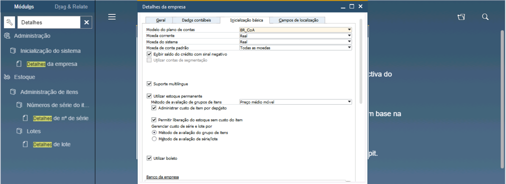
<sup>Fonte: Material produzido pelos autores (2024)</sup>
</div>

### 3.2.3 Iniciação Básica

&emsp;&emsp;Iniciação relacionada com  configurações bases do sistema, e incluem Suporte Multilíngue, Método de Avaliação de Estoque e Liberação de Estoque sem Custo do Item.

&emsp;&emsp;Por padrão, a opção de suporte multilíngue deve permanecer ativada, garantindo que o sistema SAP Business One possa operar em diversos idiomas conforme necessário. Nesta mesma página há a configuração de estoque, além da liberação do estoque sem custo de item.

&emsp;&emsp;O método de avaliação de estoque determina como os custos dos itens em estoque serão calculados e refletidos nos relatórios financeiros da empresa.

&emsp;&emsp;Por padrão, recomenda-se que a opção de liberação de estoque sem custo do item seja desmarcada. Essa configuração ajuda a evitar erros na contabilização dos custos de itens liberados do estoque.

**Fluxo:** Administração 🡪 Inicialização do sistema 🡪 Detalhes da empresa 🡪 Aba Inicialização Básica

<div align="center">
<sub>Figura 15 - Ativação do Suporte Multilíngue, Método de Avaliação de Estoque e Liberação de Estoque sem Custo do Item</sub>

<sup>Fonte: Material produzido pelos autores (2024)</sup>
</div>

### 3.2.4 Configurações Gerais

&emsp;&emsp;Após as configurações iniciais na aba de Inicialização Básica, a próxima etapa envolve ajustes nas Configurações Gerais, que abrangem diversos aspectos do sistema, como restrições de cliente, comissões, casas decimais, e formatação de data/hora.

#### 3.2.4.1 Restrições do Cliente e Definição de Comissão

&emsp;&emsp;Nesta etapa, é necessário configurar as restrições aplicáveis aos clientes e definir as comissões de acordo com o preenchido no arquivo BBP. Essas configurações são realizadas na Aba PN:

**Fluxo:** Administração 🡪 Inicialização do sistema 🡪 Configurações Gerais 🡪 Aba PN

<div align="center">
<sub>Figura 16 - Configurações de Restrições do Cliente e Definição de Comissão</sub>
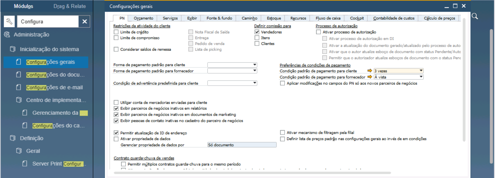
<sup>Fonte: Material produzido pelos autores (2024)</sup>
</div>

#### 3.2.4.2 Configuração de Casas Decimais e Formato de Data/Hora

&emsp;&emsp;Na aba Exibir, configure as casas decimais e o formato de data/hora. **É imperativo que o número de casas decimais seja configurado para 2 em todos os campos relevantes, conforme orientação do BBP.** Qualquer valor diferente de 2 pode comprometer a precisão dos relatórios financeiros e de inventário.

**Fluxo:** Administração 🡪 Inicialização do sistema 🡪 Configurações Gerais 🡪 Aba Exibir

<div align="center">
<sub>Figura 17 - Configuração de Casas Decimais e Formato de Data/Hora</sub>
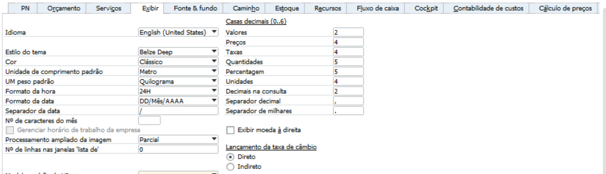
<sup>Fonte: Material produzido pelos autores (2024)</sup>
</div>

### 3.2.4.3 Configuração de Estoque

&emsp;&emsp;Ainda nas Configurações Gerais, na aba Estoque, devem ser configurados o método de atribuição de números de série/lote e a adição automática de todos os depósitos a novos itens. Recomendação: marque o flag "Adição automática de todos os depósitos a novos itens" como sim, para facilitar a gestão do inventário.

**Fluxo:** Administração 🡪 Inicialização do sistema 🡪 Configurações Gerais 🡪 Aba Estoque

## <a name="33-informações-de-bancos"></a> 3.3 Informações de Bancos

&emsp;&emsp;Nesta fase, deve-se configurar as contas bancárias da empresa. É essencial preencher os campos corretamente, como número da conta e dígito verificador, para garantir a correta integração e funcionamento do módulo financeiro no SAP Business One.

&emsp;&emsp;Lembre-se de não incluir o dígito verificador no campo do número da conta; este deve ser registrado separadamente no campo "Dígito de Controle da Conta". Além disso, a conta contábil do banco deve ser associada corretamente nas colunas "Banco de Cobrança" e "Banco de Desconto". A seguir o fluco seguido para Contas Bancárias de Empresa:

**Fluxo:** Administração 🡪 Definição 🡪 Banco 🡪 Contas bancárias da empresa

<div align="center">
<sub>Figura 18 - Fluxo de Contas Bancárias da Empresa</sub>

<sup>Fonte: Material produzido pelos autores (2024)</sup>
</div>

&emsp;&emsp;A seguir, as configurações para Contas Bancárias de Empresa:

<div align="center">
<sub>Figura 19 - Configuração de Contas Bancárias da Empresa</sub>
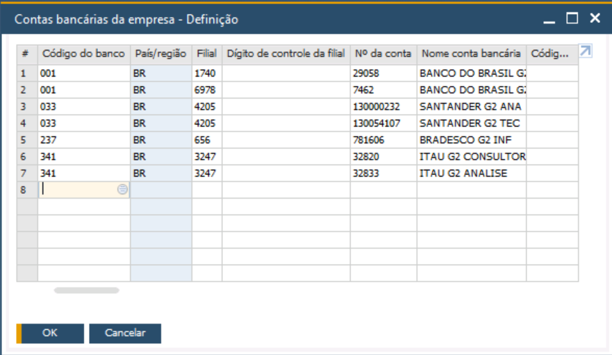
<sup>Fonte: Material produzido pelos autores (2024)</sup>
</div>

## <a name="34-determinação-de-conta-contábil"></a> 3.4 Determinação de Conta Contábil

&emsp;&emsp;Para garantir que todas as transações sejam corretamente registradas no sistema, é necessário configurar a determinação de contas contábeis. Esta configuração é feita para diversas áreas, incluindo vendas, compras, geral e estoque.

**Fluxo:** Administração 🡪 Definição 🡪 Finanças 🡪 Determinação de contas do razão

<div align="center">
<sub>Figura 20 - Configuração de Determinação de Contas Contábeis</sub>
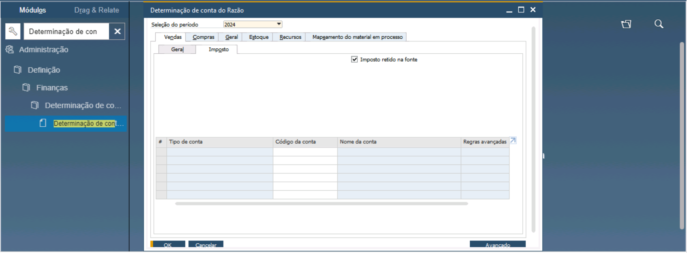
<sup>Fonte: Material produzido pelos autores (2024)</sup>
</div>

## <a name="35-configuração-de-centros-de-custo"></a> 3.5 Configuração de Centros de Custo

&emsp;&emsp;A configuração de Centros de Custo garante que a contabilidade de custos da empresa esteja alinhada com sua estrutura organizacional. Cada centro de custo deve ser corretamente identificado com um código, nome e uma dimensão específica.

**Fluxo:** Finanças 🡪 Contabilidade de Custos 🡪 Dimensões

&emsp;&emsp;É necessário garantir que o flag "Ativo" esteja sempre selecionado para cada centro de custo. A correta configuração dos centros de custo permite uma análise precisa dos custos associados a diferentes áreas da empresa.

<div align="center">
<sub>Figura 21 - Configuração de Centros de Custo e Dimensões</sub>
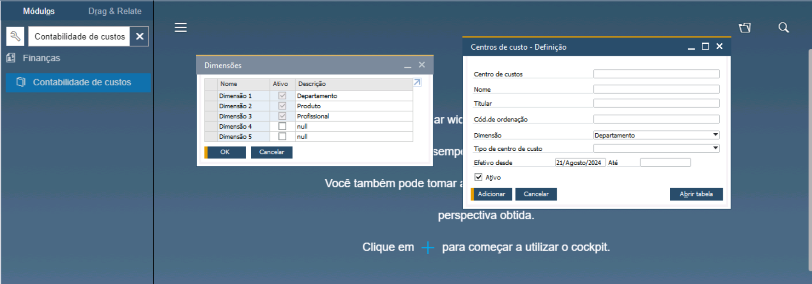
<sup>Fonte: Material produzido pelos autores (2024)</sup>
</div>

## <a name="35-configuração-de-centros-de-custo"></a> 3.6 Configuração de Despesas

&emsp;&emsp;Nesta etapa, são cadastradas as despesas que poderão estar envolvidas nas transações de entrada e saída. Essas despesas adicionais são configuradas de acordo com as necessidades específicas da empresa:

**Fluxo:** Administração 🡪 Definição 🡪 Geral 🡪 Despesas adicionais

&emsp;&emsp;Para despesas relacionadas a transações de importação, o caminho é:

**Fluxo:** Administração 🡪 Definição 🡪 Compras 🡪 Despesas de importação

<div align="center">
<sub>Figura 22 - Configuração de Despesas de Importação e Adicionais</sub>
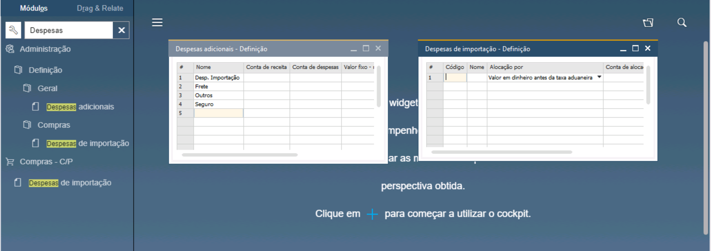
<sup>Fonte: Material produzido pelos autores (2024)</sup>
</div>

## 3.7 Configuração de Depósitos

&emsp;&emsp;Cada depósito mapeado deve ser obrigatoriamente vinculado a uma filial específica (CNPJ). É importante que cada filial tenha ao menos um depósito cadastrado. Essa configuração é essencial para garantir a correta gestão de estoques e inventários dentro do SAP Business One.

**Fluxo:** Administração 🡪 Definição 🡪 Estoque 🡪 Depósitos

<div align="center">
<sub>Figura 23 - Configuração de Depósitos</sub>
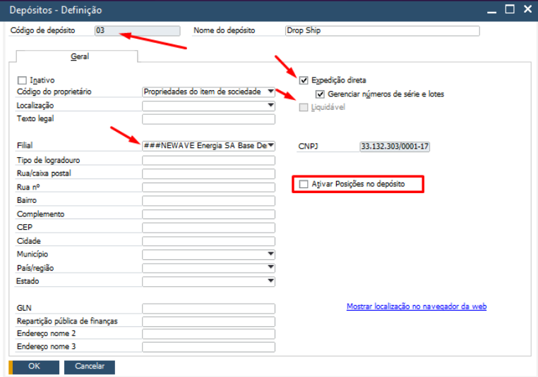
<sup>Fonte: Material produzido pela G2 Tecnologia (2024)</sup>
</div>

## 3.8 Configuração de Grupos de Itens

&emsp;&emsp;Os grupos de itens são criados para categorizar os produtos e facilitar a aplicação de regras de determinação contábil, bem como a geração de relatórios. Essa configuração é importante para a organização e o controle dos itens no estoque, módulo de foque do presente artigo. 

**Fluxo:** Administração 🡪 Definição 🡪 Estoque 🡪 Grupos de Itens

<div align="center">
<sub>Figura 24 - Configuração de Grupos de Itens</sub>
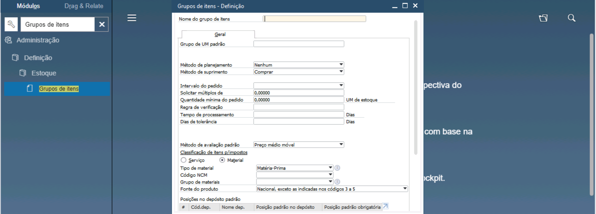
<sup>Fonte: Material produzido pelos autores (2024)</sup>
</div>

## 3.9 Configuração de IRF (Imposto Retido na Fonte)

&emsp;&emsp;Nesta etapa, as alíquotas e os impostos retidos são configurados conforme o mapeamento realizado junto ao cliente no BBP. 
**Fluxo:** Administração 🡪 Definição 🡪 Finanças 🡪 Imposto 🡪 Imposto Retido na Fonte

<div align="center">
<sub>Figura 25 - Configuração de IRF</sub>
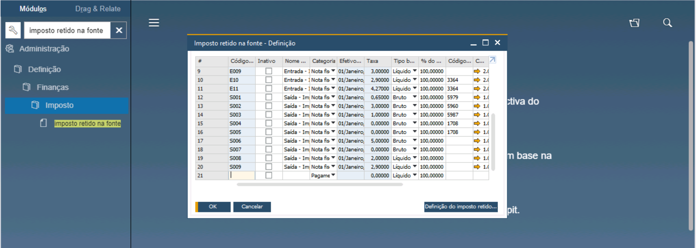
<sup>Fonte: Material produzido pelos autores (2024)</sup>
</div>

## 3.10 Condições de Pagamento

&emsp;&emsp;As condições de pagamento aplicáveis às operações de compra e venda devem ser configuradas conforme especificado no BBP. Essa configuração é importante para definir os prazos e termos de pagamento para os parceiros de negócios.

**Fluxo:** Administração 🡪 Definição 🡪 Parceiros de Negócios 🡪 Condições de Pagamento

<div align="center">
<sub>Figura 26 - Configuração de Condições de Pagamento</sub>
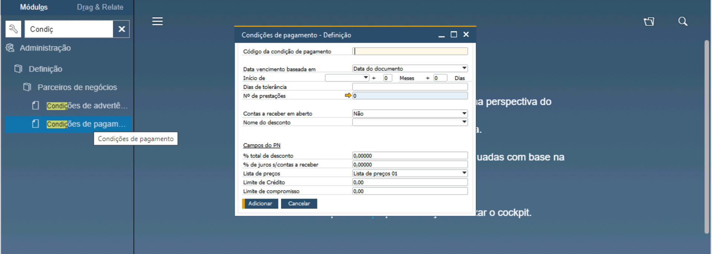
<sup>Fonte: Material produzido pelos autores (2024)</sup>
</div>

## 3.11 Cartões de Crédito

&emsp;&emsp;Essa etapa envolve a criação e configuração dos cartões de crédito que a empresa aceita como meio de pagamento de clientes e os cartões utilizados para pagar fornecedores. Essa configuração é importante para gerenciar os métodos de pagamento aceitos pela empresa.

**Fluxo:** Administração 🡪 Definição 🡪 Bancos 🡪 Cartões de Crédito

<div align="center">
<sub>Figura 27 - Configuração de Cartões de Crédito</sub>
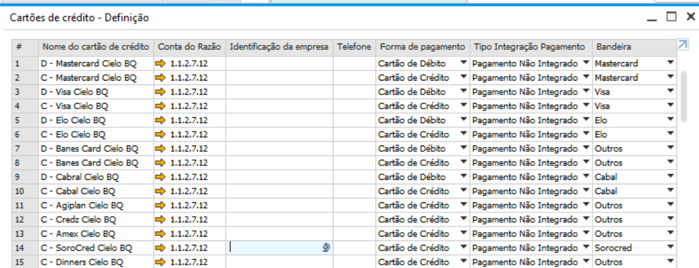
<sup>Fonte: Material produzido pela G2 Tecnologia</sup>
</div>

## 3.12 Cadastros de Usuários

&emsp;&emsp;Nesta fase, são criados os usuários que terão acesso ao sistema SAP Business One. 

**Fluxo:** Administração 🡪 Definição 🡪 Geral 🡪 Usuários

<div align="center">
<sub>Figura 28 - Cadastro de Usuários</sub>
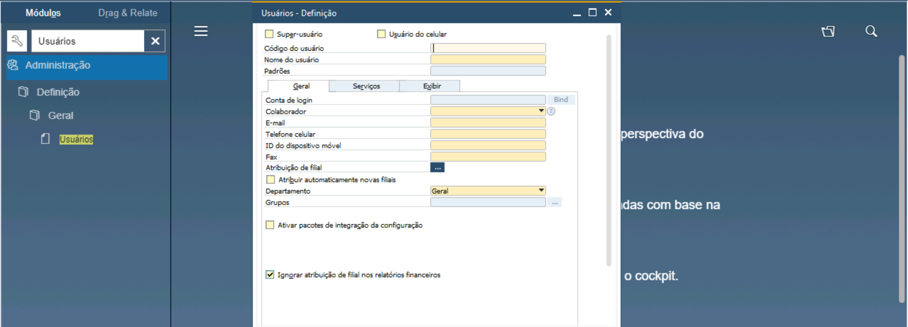
<sup>Fonte: Material produzido pelos autores (2024)</sup>
</div>

## 3.13 Cadastros de Territórios

&emsp;&emsp;A criação de territórios permite o agrupamento de clientes e fornecedores por região ou outros fatores.

**Fluxo:** Administração 🡪 Definição 🡪 Geral 🡪 Territórios

<div align="center">
<sub>Figura 29 - Cadastro de Territórios</sub>
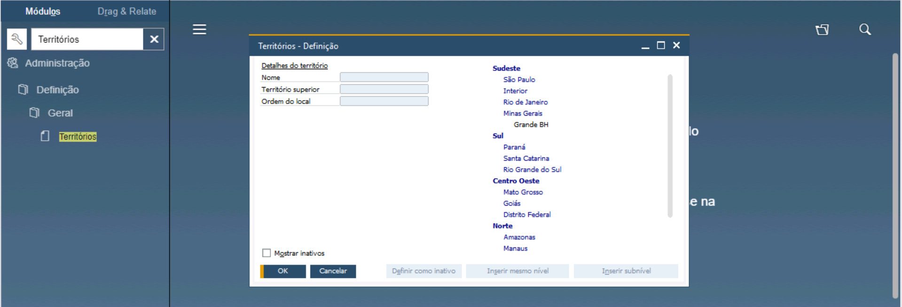
<sup>Fonte: Material produzido pelos autores (2024)</sup>
</div>

## 3.14 Vendedores/Compradores

&emsp;&emsp;Os vendedores e compradores são atribuídos aos parceiros de negócios e posteriormente aos documentos de compra e venda. 

**Fluxo:** Administração 🡪 Definição 🡪 Geral 🡪 Vendedores/Compradores

<div align="center">
<sub>Figura 30 - Cadastro de Vendedores e Compradores</sub>
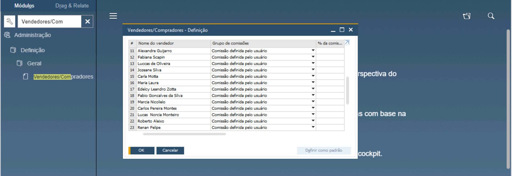
<sup>Fonte: Material produzido pelos autores (2024)</sup>
</div>

## 3.15 Níveis de Vendas

&emsp;&emsp;Nesta etapa, são cadastradas as etapas do funil de vendas ou compras, como reuniões, negociações e cotações.

**Fluxo:** Administração 🡪 Definição 🡪 Oportunidades 🡪 Níveis de Oportunidades

<div align="center">
<sub>Figura 31 - Configuração de Níveis de Vendas</sub>
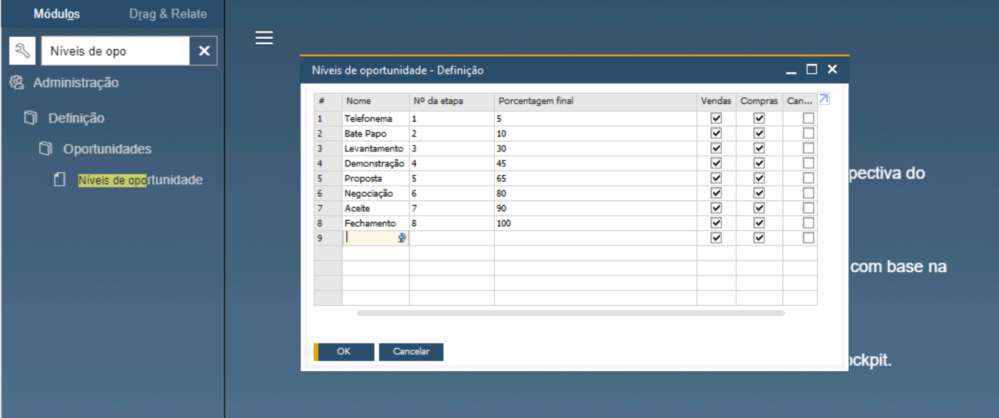
<sup>Fonte: Material produzido pelos autores (2024)</sup>
</div>

## 3.16 Grupos de Clientes

&emsp;&emsp;Os grupos de clientes são cadastrados para facilitar a gestão e segmentação dos clientes da empresa. 

**Fluxo:** Administração 🡪 Definição 🡪 Parceiros de Negócios 🡪 Grupos de clientes

<div align="center">
<sub>Figura 32 - Cadastro de Grupos de Clientes</sub>
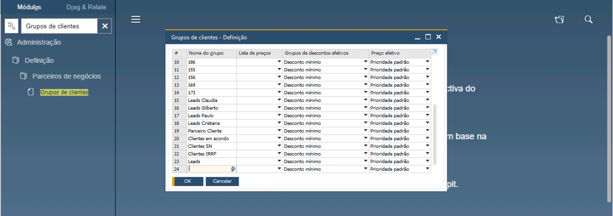
<sup>Fonte: Material produzido pelos autores (2024)</sup>
</div>

## 3.17 Grupos de Fornecedores

&emsp;&emsp;De maneira similar aos grupos de clientes, os grupos de fornecedores são configurados para melhorar a gestão de compras e o relacionamento com os fornecedores.

**Fluxo:** Administração 🡪 Definição 🡪 Parceiros de Negócios 🡪 Grupos de fornecedores

<div align="center">
<sub>Figura 33 - Cadastro de Grupos de Fornecedores</sub>
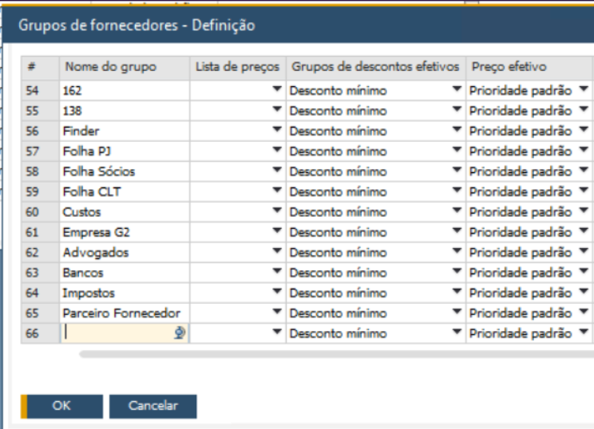
<sup>Fonte: Material produzido pela G2 Tecnologia (2024)</sup>
</div>

## 3.18 Tipos de Envio/Expedição

&emsp;&emsp;É configurada a forma como os pedidos serão enviados. A empresa pode definir os tipos de envio, como transporte aéreo ou serviço de entrega, de acordo com as necessidades operacionais e logísticas.

**Fluxo:** Administração 🡪 Definição 🡪 Estoque 🡪 Tipos de Envio

<div align="center">
<sub>Figura 34 - Configuração de Tipos de Envio</sub>
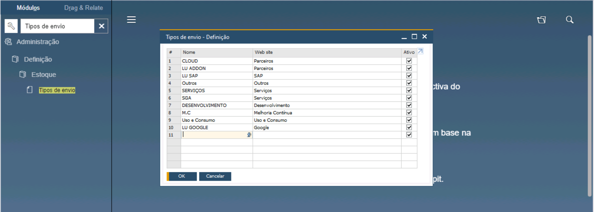
<sup>Fonte: Material produzido pelos autores (2024)</sup>
</div>

## 3.19 Configurações do Documento

&emsp;&emsp;Na última etapa, são realizadas as configurações dos documentos, conforme descrito no item 18 do BBP. Essas configurações abrangem vários aspectos dos documentos que serão emitidos e utilizados no sistema, como faturas, pedidos de venda, etc.

**Fluxo:** Administração 🡪 Inicialização do sistema 🡪 Configurações do documento

<div align="center">
<sub>Figura 35 - Configurações de Documentos</sub>
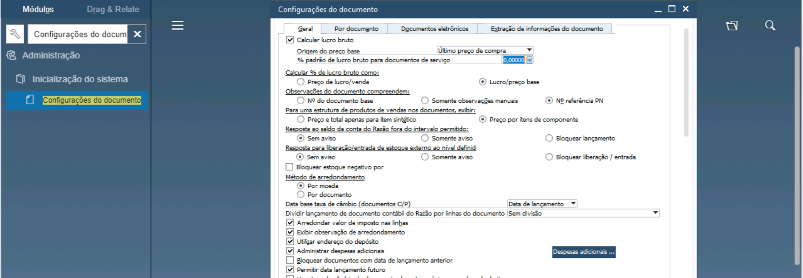
<sup>Fonte: Material produzido pelos autores (2024)</sup>
</div>

&emsp;&emsp;Essas configurações concluíram a fase de Configurações Iniciais no SAP Business One, conforme orientações da *G2 Tecnologia*. O processo descrito garante que o sistema esteja devidamente ajustado para as operações da empresa, conforme especificado no BBP.

## <a name="320-diagrama-configuração"></a>3.20 Diagrama de configurações inciais do BBP

&emsp;&emsp; Este diagrama hierárquico ilustra as configurações iniciais realizadas no SAP. As caixas não apenas identificam as configurações implementadas, mas também incluem os fluxos e caminhos seguidos durante o processo, garantindo a conformidade com as melhores práticas e a correta parametrização do sistema.

<div align="center">
<sub>Figura 36- Diagrama de configurações iniciais</sub>
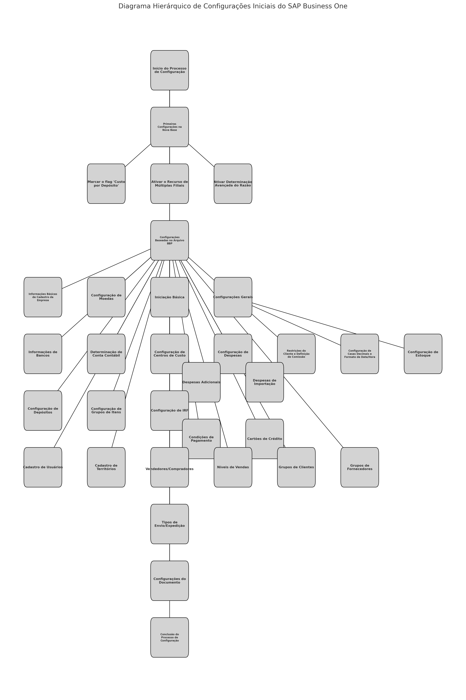
<sup>Fonte: Material produzido pelos autores (2024)</sup>
</div>


# <a name="4-solução-proposta"></a> 4. Solução Proposta

## <a name="41-desenho-da-solução"></a> 4.1 Desenho da Solução

&emsp;&emsp;Nesta seção, apresentamos o diagrama de macroprocessos desenvolvido, com um enfoque especial na área de Estoque. Este diagrama é parte fundamental do esforço de mapeamento e modelagem dos processos críticos para garantir uma gestão integrada e eficiente. O objetivo é proporcionar uma visão clara e estruturada dos principais fluxos de trabalho que sustentam a operação da G2, com ênfase nos processos de gestão de estoque.

   <div align="center">
   <sub>Figura 37 - Mapeamento dos Macro Processos</sub>
   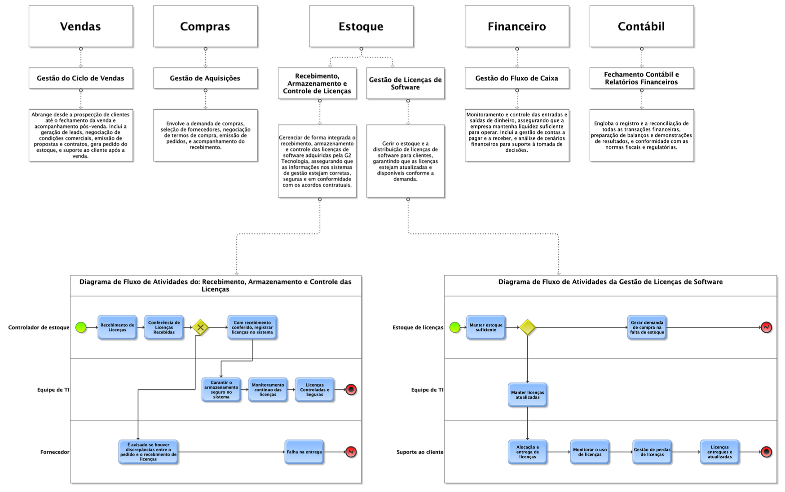
   <sup>Fonte: Material produzido pelos autores (2024)</sup>
   <sup>Link para melhor visualização: https://drive.google.com/file/d/10_4hXTG4c-jgKheU1xZsZ1ngih9VBSo6/view?usp=sharing </sup>
   </div>

### Descrição:
&emsp;&emsp;O diagrama de macroprocessos elaborado abrange as seguintes áreas operacionais da G2 Tecnologia: Vendas, Compras, Contabilidade, Finanças e Estoque. Cada área foi mapeada em termos de macroprocessos, oferecendo uma visão geral das atividades principais e seus objetivos dentro da empresa. Os diagramas de fluxo de atividades detalham os passos necessários para a execução dos macroprocessos de estoque, ilustrando as interações entre os diferentes papéis envolvidos, como Controlador de Estoque, Equipe de TI, e Fornecedores.

&emsp;&emsp;O diagrama de macroprocessos desenvolvido facilita a compreensão dos fluxos operacionais das áreas da G2. Com este mapeamento, a equipe poderá garantir que todas as etapas sejam executadas conforme planejado, promovendo a integração dos processos e assegurando que a gestão de estoque atinja um novo patamar de eficiência e controle.

# <a name="5-procedimentos-e-regras-de-negócio"></a> 5. Procedimentos e Regras de Negócio

&emsp;&emsp;Nesta seção explora-se a estruturação de processos empresariais essenciais, conforme as diretrizes estabelecidas por Michael Hammer e James Champy (_Reengineering the Corporation: A Manifesto for Business Revolution_), pioneiros da reengenharia de processos de negócios. Assim sendo, será abordado como a empresa define procedimentos claros e estabelece regras consistentes, visando garantir a eficiência operacional e a conformidade. Além disso, serão definidas as regras de negócio a serem utilizadas na implementação do SAP, assegurando que todas as operações estejam alinhadas com os objetivos estratégicos da *G2 Tecnologia*. Sendo assim, a seção contêm: 

## <a name="51-Necessidades-específicas-do-cliente"></a>  5.1 Necessidades específicas do cliente

&emsp;&emsp;Entender as necessidades do cliente em questão é essencial para a entrega de um produto que realmente enderece suas atuais dores e agregue valor à sua empresa. Nesta seção serão abordadas as necessidades específicas que a G2 Tecnologia trouxe ao time. Para o entendimento destas, foram utilizadas as informações transmitidas pelo cliente durante o _onboarding_, _kick-off_, validações de _sprint_ e demais encontros para sanar possíveis dúvidas. Tendo em vista estes fatores, abaixo segue a transcrição da conversa realizada com o cliente na quarta-feira, dia 21, onde houve uma entrevista com representantes da _G2 Tecnologia_ sobre a área de estoque:

**Classificação de Itens no Estoque**  
- **Como as licenças de software são classificadas no inventário? Elas são tratadas da mesma forma que os itens físicos?**  
  - Sim, todas as licenças de software, mesmo não sendo itens físicos, são tratadas como itens estocáveis e recebem valor correspondente. No cadastro, não há diferenciação entre itens físicos e não físicos.

- **Existe alguma diferenciação na gestão entre licenças de uso temporário e permanente?**  
  - O cliente ainda não lidou com esse cenário e não tem um processo definido para diferenciar entre licenças temporárias e permanentes. Ele precisaria entender como a empresa gerencia essas licenças. Se uma empresa cancelar uma licença, ainda não está claro como isso é tratado.

**Processo de Alocação de Licenças**  
- **Como é feito o processo de "locação" das licenças para os clientes? É gerado algum tipo de ordem de saída no sistema?**  
  - Atualmente, o processo envolve a criação de um documento de saída para registrar a alocação da licença. No entanto, com a implementação do SAP, haverá um módulo específico que gerenciará a alocação de licenças de forma automatizada, gerando o documento de saída correspondente.

- **Quais controles existem para assegurar que as licenças locadas não sejam contabilizadas como disponíveis no estoque?**  
  - O controle de estoque é feito através de documentos que registram a entrada das licenças no sistema. Após a venda, a licença é removida do estoque disponível. No entanto, existe um depósito de licenças não atribuídas, que são controladas separadamente. O cliente acredita que, na prática, as licenças são apenas intermediadas, não sendo efetivamente estocadas pela empresa.

**Gestão de Estoque Físico**  
- **Quais tipos de materiais são mantidos no estoque físico? Como eles são gerenciados em termos de entrada e saída?**  
  - O estoque físico é composto por materiais que entram através da produção interna ou compras. A saída desses materiais ocorre por meio de vendas ou descarte. As saídas podem ser gerenciadas manualmente, com registro em documento que gera histórico, ou automaticamente, através da integração de módulos do SAP. Embora o SAP permita a gestão de estoque negativo, a prática comum é manter o estoque acima do nível mínimo.

- **Nota fiscal de entrega futura**  
  - Para acrescentar algo no estoque, é necessário haver uma integração com a área de compras. O produto pode ser registrado no estoque a partir do módulo de compras ou diretamente da fábrica.


&emsp;&emsp; Com base nas perguntas e respostas visívies acima, juntamente com outros pontos que foram trazidos pelo cliente anteriormente, pode-se identificar que as principais necessidades da área de estoque são:

- Registrar as licenças do SAP no estoque (assim como é feito com ítens físicos);
- Automatizar o processo de gerenciamento de alocação de licenças SAP;
- Geração de relatórios automatizados sobre a alocação de licenças;
- Existência de um "Depósito de Licenças" para armazenamento de licenças alocadas;
- Integração com a área de compras para a adição de ítens no estoque.

&emsp;&emsp; A interação entre o grupo e o cliente *G2 Tecnologia* foi extremamente rica, pois possibilitou um melhor entendimento sobre a área de estoque, bem como seus processos e demandas. Assim, foi possível ao grupo obter insights valiosos, os quais são essenciais para um bom desenvolvimento do projeto e possibilitaram o mapeamento e construção de elementos como as [regras de negócio](#52-regras-negocios) do setor em questão.

## <a name="52-regras-negocios"></a>  5.2 Regras de Negócios
&emsp;&emsp;As regras de negócios são definidas como definições que uma organização adota para governar as operações diárias, garantindo que todos os processos estabelecidos sejam cumpridos da maneira correta. Elas definem as decisões a serem tomadas e qual direção os processos devem seguir caso algo aconteça.

*Tabela das Regras de Negócio*

| Número | Descrição da US | Descrição da RN | Critérios de Aplicação | Responsável | Relação com o Sistema |
| --- | --- | --- | --- | --- | --- |
| ES002 | Como gerente de produtos indiretos, quero validar a quantidade dos recebimentos de estoque diariamente para garantir que os registros estejam precisos e atualizados. | Para que o registro no sistema seja aceito, ele deve bater com a quantidade de produtos no contrato de compras feito. Caso contrário, o sistema deve notificar a diferença encontrada. | Recebimento de carga | Estoque, Compras | Relação Direta |
| ES003 | Como gerente de produtos indiretos, quero gerar relatórios de performance de estoque para identificar áreas de melhoria e sucesso. | Para que relatórios de performance sejam gerados, o sistema de monitoramento deve ser antes devidamente configurado. Caso ele não seja, o sistema deve bloquear a tentativa de emitir um relatório. | Gerenciamento do estoque | Estoque, Vendas, Compras | Nenhuma |
| ES004 | Como gerente de produtos indiretos, quero gerar relatórios de performance de estoque para identificar áreas de melhoria e sucesso. | O sistema somente gerará um relatório de performance se os dados de entrada e saída de itens baterem com os dados de compras e vendas - ou pedidos de retirada (em casos de produtos indiretos). | Gerenciamento do estoque | Estoque, Vendas, Compras | Relação Direta |
| ES005 | Como gerente de produtos indiretos, quero realizar controle de qualidade sempre que novos lotes de produtos chegarem, para assegurar que atendem aos padrões estabelecidos. | Para que a averiguação da qualidade dos produtos recebidos seja feita, é preciso registrá-los. | Averiguação da carga recebida | Estoquista | Nenhuma |
| ES006 | Como gerente de produtos indiretos, quero realizar controle de qualidade sempre que novos lotes de produtos chegarem, para assegurar que atendem aos padrões estabelecidos. | Para que a empresa tenha ciência da qualidade dos produtos entregues, anotações sobre defeitos devem ser registradas endereçando o produto em questão. | Averiguação da carga recebida | Estoque | Relação Parcial |
| ES007 | Como gerente de produtos indiretos, preciso gerenciar efetivamente a quantidade de materiais para garantir que a equipe tenha os recursos necessários sem incorrer em custos excessivos. | Para que o cálculo da quantidade certa de estoque necessário seja feito, é preciso estudar as necessidades da empresa. | Gerenciamento do estoque | Estoque | Nenhuma |
| ES008 | Como gerente de licenças SAP, quero automatizar a geração dos relatórios semanais de estoque, para garantir que todos os relatórios sejam gerados automaticamente. | O sistema deve automatizar a geração dos relatórios semanais do estoque. | Os relatórios devem ser gerados automaticamente em intervalos semanais definidos, contendo informações detalhadas sobre o número de licenças disponíveis, licenças utilizadas, e qualquer outra métrica relevante. | Estoque | Relação Direta |
| ES009 | Como gerente de licenças SAP, quero receber alertas automáticos quando o número de licenças atingir o nível mínimo, para que eu possa emitir pedidos de compra de forma proativa. | O sistema deve gerar automaticamente um alerta para o gerente de licenças quando o número de licenças atingir o nível mínimo definido como 10. | O alerta deve incluir detalhes claros sobre o status do estoque e recomendações para ação. | Estoque | Relação Direta |
| ES010 | Como gerente de licenças SAP, quero ter uma visualização simplificada e de fácil acesso do status das licenças, para que eu possa monitorar o estoque em tempo real. | O sistema deve permitir que o gerente de licenças SAP visualize, em tempo real, o status de todas as licenças disponíveis. A visualização deve ser clara, intuitiva e fácil de acessar para usuários autorizados, utilizando uma interface amigável. | A interface deve permitir fácil acesso aos status das licenças e interpretação dos dados apresentados. | Estoque | Relação Direta |
| ES011 | Como gerente de licenças SAP, quero que o sistema gere automaticamente pedidos de compra de licenças quando o estoque atingir um limite mínimo, para garantir que nunca faltem licenças disponíveis. | Os dados exibidos sobre o status das licenças devem ser atualizados automaticamente em tempo real, refletindo qualquer mudança instantaneamente. | A interface deve ser capaz de exibir o status atualizado de todas as licenças de forma compreensível e em tempo real. | Estoque | Relação Direta |
| ES012 | Como gerente de licenças SAP, quero acessar um histórico detalhado de todas as movimentações de licenças (entrada, saída, renovação), para que eu possa ter uma visão clara e completa do ciclo de vida das licenças. | O sistema deve registrar automaticamente todas as movimentações de licenças, incluindo entradas, saídas e renovações, com detalhes como data, tipo de movimentação, responsável pela ação, e motivo (se aplicável). | A interface deve exibir, de forma clara e detalhada, todas as movimentações de licenças registradas no sistema, permitindo filtragens específicas conforme os critérios definidos pelo usuário. | Estoque | Relação Direta |

## DMNs e BPMNs

&emsp;&emsp;Para as regras de negócios com ligação direta ou parcial com o sistema, será apresentado um **DMN** *(Decision Model Notation)* para cada uma delas, já para as regras de negócios que **NÃO** possuem ligação direta com o sistema, será apresentado um **BPMN** *(Business Process Model Notation)* já que se tratam, então, de processos do negócio em questão.

<div align="center">Figura
   <br><sub>Figura 38 - BPMN - Processo de Negócios relacionado a Primeira Regra de Negócios ES001</sub>
   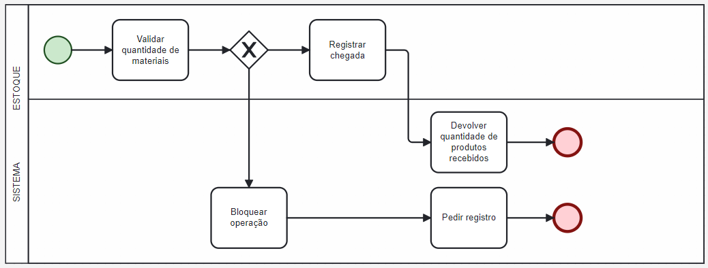
   <br>
   <sup>Fonte: Material produzido pelos autores (2024)</sup>
</div>

<div align="center">
   <br><sub>Figura 39 - DMN - Tabela de Decisão da Segunda Regra de Negócios ES002</sub>
   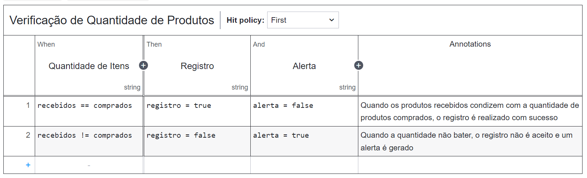
   <br>
   <sup>Fonte: Material produzido pelos autores (2024)</sup>
</div>

<div align="center">
   <br><sub>Figura 40 - BPMN - Processo de Negócios relacionado a Terceira Regra de Negócios ES003</sub>
   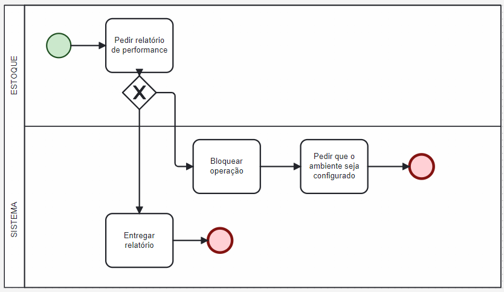
   <br>
   <sup>Fonte: Material produzido pelos autores (2024)</sup>
</div>

<div align="center">
   <br><sub>Figura 41 - DMN - Tabela de Decisão da Quarta Regra de Negócios ES004</sub>
   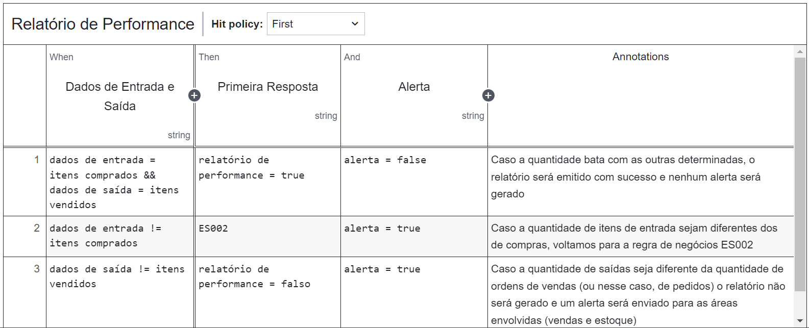
   <br>
   <sup>Fonte: Material produzido pelos autores (2024)</sup>
</div>

<div align="center">
   <br><sub>Figura 40 - BPMN - Processo de Negócios relacionado a Quinta Regra de Negócios ES005</sub>
   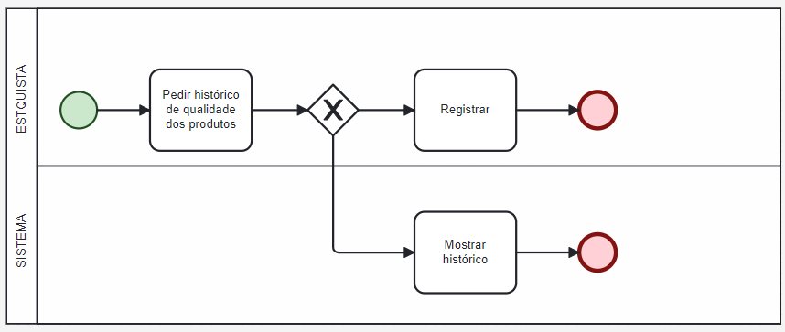
   <br>
   <sup>Fonte: Material produzido pelos autores (2024)</sup>
</div>

<div align="center">
   <br><sub>Figura 41 - DMN - Tabela de Decisão da Sexta Regra de Negócios ES006</sub>
   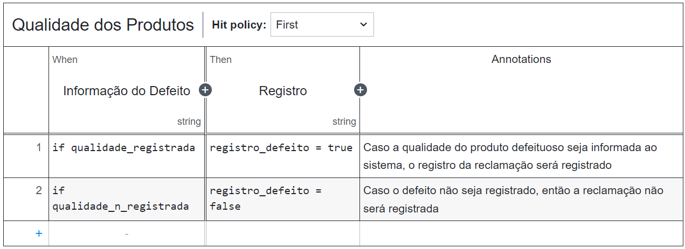
   <br>
   <sup>Fonte: Material produzido pelos autores (2024)</sup>
</div>

<div align="center">
   <br><sub>Figura 42 - BPMN - Processo de Negócios relacionado a Sexta Regra de Negócios ES007</sub>
   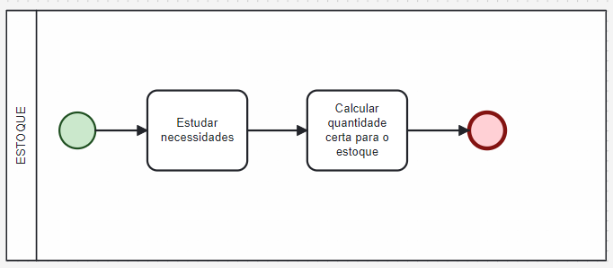
   <br>
   <sup>Fonte: Material produzido pelos autores (2024)</sup>
</div>

<div align="center">
   <br><sub>Figura 43 - DMN - Tabela de Decisão da Oitava Regra de Negócios ES008</sub>
   
   <br>
   <sup>Fonte: Material produzido pelos autores (2024)</sup>
</div>

<div align="center">
   <br><sub>Figura 44 - DMN - Tabela de Decisão da Nona Regra de Negócios ES009</sub>
   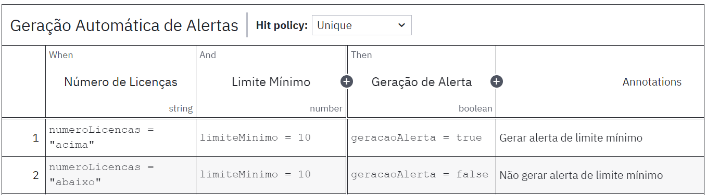
   <br>
   <sup>Fonte: Material produzido pelos autores (2024)</sup>
</div>

<div align="center">
   <br><sub>Figura 45 - DMN - Tabela de Decisão da Décima Regra de Negócios ES010</sub>
   
   <br>
   <sup>Fonte: Material produzido pelos autores (2024)</sup>
</div>

<div align="center">
   <br><sub>Figura 46 - DMN - Tabela de Decisão da Décima Primeira Regra de Negócios ES011</sub>
   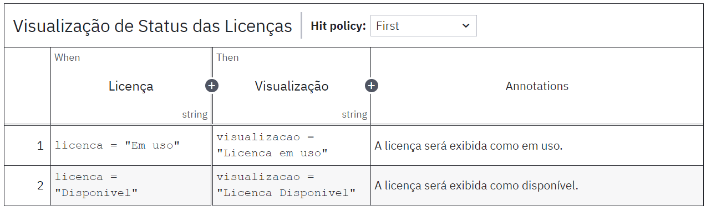
   <br>
   <sup>Fonte: Material produzido pelos autores (2024)</sup>
</div>

<div align="center">
   <br><sub>Figura 47 - DMN - Tabela de Decisão da Décima Segunda Regra de Negócios ES012</sub>
   
   <br>
   <sup>Fonte: Material produzido pelos autores (2024)</sup>
</div>

&emsp;&emsp;Concluindo, as regras de negócio apresentadas foram feitas a partir de um estudo de jornada e histórias de usuários buscando uma melhor aproximação da realidade. Todas as regras foram pensadas em um ambiente de estoque e principalmente na dinâmica de recebimento e despacho de mercadorias.

## <a name="53-Funcionalidade-do-sistema"></a>  5.3 Funcionalidades do Sistema
&emsp;&emsp;Para cada regra de negócio relacionada ao sistema, uma ou mais funcionalidades foram criadas. Funcionalidades essas que serão depois responsável por nortear as decisões de configuração, ou seja, o que o sistema precisa ter para garantir que tal regra de negócio será cumprida? É o que essa sessão descreve. 

&emsp;&emsp;Começando a partir das regras de negócios desenhadas, temos dois tipos: As relacionadas com o sistema e as não relacionadas com ele. Dito isso, somente estarão aqui presentes as que possuem relação direta ou parcial com o sistema. Que são: ES002, ES004, ES006, ES008. ES009, ES010, ES011 e ES012.

### ES002

&emsp;&emsp;*“Para que o registro no sistema seja aceito, ele deve bater com a quantidade de produtos no contrato de compras feito. Caso contrario, o sistema deve notificar a diferença encontrada.”*

| Título | Funcionalidade |
| --- | --- |
| Comparação de Pedido e Entrega | O sistema deve comparar as quantidades de itens comprados e de itens registrados; |
| Notificação de Inconsistência  | O sistema deve notificar o usuário caso haja diferença entre as quantidades apresentadas. |

### ES004

&emsp;&emsp;*“O sistema somente gerará um relatório de performance, se caso os dados de entrada e saída de itens baterem os dados de compras e vendas - ou pedidos de retirada (em casos de produtos indireto)”*

| Título | Funcionalidade |
| --- | --- |
| Comparação entre Dados de Entrada | Mesma funcionalidade que: "Comparação de Pedido e Entrega” |
| Comparação entre Dados de Saída | O sistema deve comparar a quantidade de produtos vendidos com a quantidade de saídas do estoque; |
| Bloqueio por Inconsistência  | Caso uma saída de um produto não esteja de acordo com um pedido de vendas, o sistema deve bloquear a ação.  |

### ES006

&emsp;&emsp;*“Para que a empresa tenha ciência da qualidade dos produtos entregues, anotações sobre defeitos devem ser registradas endereçando o produto em questão.”*

| Título | Funcionalidade |
| --- | --- |
| Campo de Anotação | O sistema deve possuir um campo de anotações para cada produto registrado, caso o usuário queira anotar uma inconsistência no padrão de qualidade. |

### ES008

&emsp;&emsp;*“O sistema deve automatizar a geração dos relatórios semanais do estoque.”*

| Título | Funcionalidade |
| --- | --- |
| Automatização de Relatórios | O sistema deve entregar semanalmente um relatório para o usuário. |

### ES009

&emsp;&emsp;*“O sistema deve gerar automaticamente um alerta para o gerente de licenças quando o número de licenças atingir o nível mínimo definido como 10.”*

| Título | Funcionalidade |
| --- | --- |
| Alerta de Nível | O sistema deve ter um alerta de nível que avisa o usuário quando o sistema identificar que o estoque está com um volume menor que 10. |

### ES010

&emsp;&emsp;*“O sistema deve permitir que o gerente de licenças SAP visualize, em tempo real, o status de todas as licenças disponíveis. A visualização deve ser clara, intuitiva e fácil de acessar para usuários autorizados, utilizando uma interface amigável.”*

| Título | Funcionalidade |
| --- | --- |
| Visualização de Licenças | O sistema deve oferecer um campo que deixa claro se uma licença foi vendida, alugada ou inutilizada. |

### ES011

&emsp;&emsp;*“Os dados exibidos sobre o status das licenças devem ser atualizados automaticamente em tempo real, refletindo qualquer mudança instantaneamente.”*

| Título | Funcionalidade |
| --- | --- |
| Visualização de Licenças 2 | Os status citados na funcionalidade “Visualização de Licenças” devem ser atualizados automaticamente a partir dos contratos gerados por outras áreas tais como: vendas e compras. |

### ES012

&emsp;&emsp;*“O sistema deve registrar automaticamente todas as movimentações de licenças, incluindo entradas, saídas e renovações, com detalhes como data, tipo de movimentação, responsável pela ação, e motivo (se aplicável).”*

| Título | Funcionalidade |
| --- | --- |
| First In First Out (FIFO) | O sistema deve conter uma funcionalidade que organiza o estoque usando a metodologia “First In, First Out” que diz que o produto que entrar primeiro, sai primeiro assim como uma fila; |
| Detalhes Específicos | O sistema deve conter um histórico de movimentação das licenças contendo: responsável, motivo, data e tipo. |

&emsp;&emsp;A criação de funcionalidades a partir das regras de negócio é essencial para garantir que o sistema atenda às necessidades da organização e cumpra suas diretrizes. Focando nas regras com relação direta ou parcial ao sistema, foram desenvolvidas funcionalidades críticas, como notificações de inconsistências, geração automatizada de relatórios e gestão de licenças. Essas funcionalidades asseguram que o sistema não apenas opere de forma eficiente, mas também suporte os objetivos estratégicos da empresa, promovendo a conformidade e a qualidade dos processos internos.

## <a name="54-instruções-de-acesso-as-funcionalidades"></a>  5.4 Instruções de Acesso às Funcionalidades

&emsp;&emsp;O objetivo desta subseção é guiar o usuário para que este possa acessar às funcionalidades inseridas no Sistema SAP Business One. Nesta etapa, faz-se importante ressaltar que estas foram adicionadas ao sistema tendo como base as regras de negócio, as quais, por sua vez, foram criadas a partir das necessidades demonstradas pelo cliente. Tendo isto em mente, dado que o grupo ainda está no processo de aplicação de todas as funcionalidades criadas no SAP B1, neste momento mostrar-se-ão as instruções referentes a como acessar a funcionalidade criada a partir da regra de negócio "Políticas de manutenção de itens no estoque". É importante salientar que o acesso às outras funcionalidades - ainda não implemnetadas - seguirão o mesmo padrão descrito aqui.

&emsp;&emsp; Sabendo que a regra de negócio supracitada - "Políticas de manutenção de itens no estoque" - diz respeito a elementos como o estoque mínimo e o estoque máximo definido para cada produto, uma forma de visualizar esta regra aplicada como funcionalidade do sistema é através do seguinte fluxo:

- Na página inicial, clique em: "Módulos";
- Na aba de módulos, clique em: "Estoque";
- Na aba de estoque, clique em: "Cadastro do Item";
- Na página de cadastro do item, clique em: "Dados de estoque";
- Na aba de Dados de estoque é possível visualizar o estoque mínimo e o máximo de cada produto.

&emsp;&emsp; As instruções acima podem ser acessadas visualmente através das Figuras 34 e 35, que encontram-se abaixo.

<div align="center">
    <br><sub>Figura 48 - Fluxograma de Acesso</sub>
    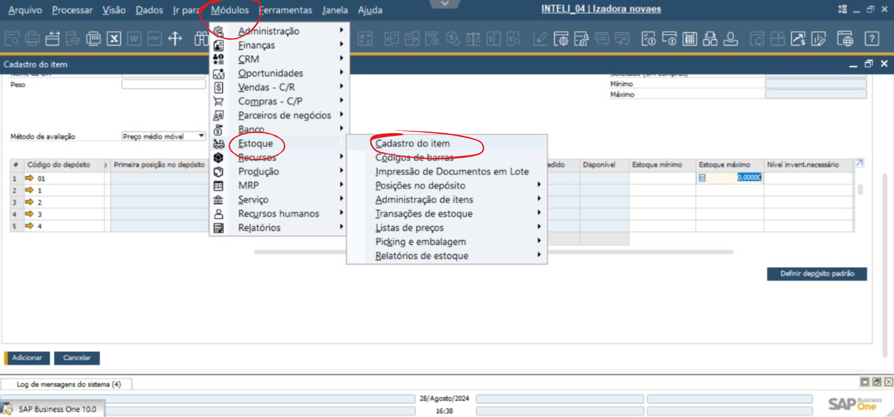
    <br>
    <sup>Fonte: Material produzido pelos autores (2024)</sup>
</div>

<div align="center">
    <br><sub>Figura 49 - Fluxograma de Acesso</sub>
    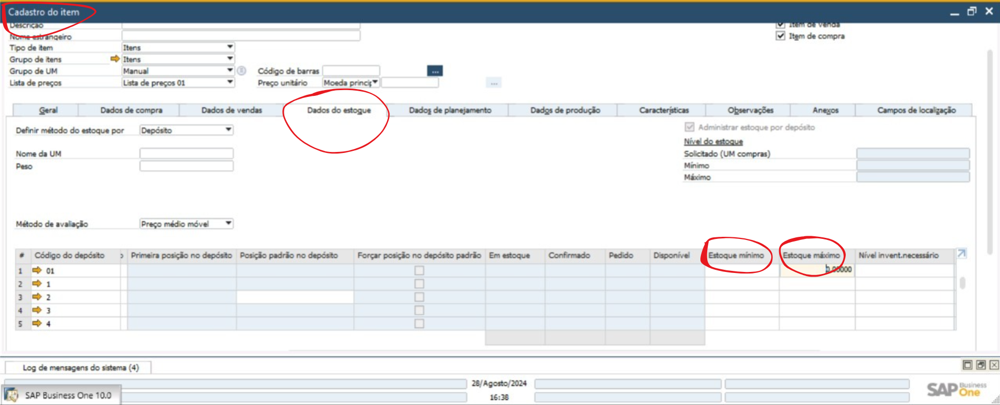
    <br>
    <sup>Fonte: Material produzido pelos autores (2024)</sup>
</div>

&emsp;&emsp; Com base nas instruções descritas, fica evidente o processo de navegação necessário para acessar a funcionalidade relacionada às "Políticas de manutenção de itens no estoque" no SAP Business One. Este procedimento assegura que o usuário possa gerenciar e monitorar os níveis de estoque mínimo e máximo de cada produto de forma eficiente, garantindo conformidade com as regras de negócio definidas. À medida que novas funcionalidades forem sendo implementadas no sistema, serão criados novas instruções - específicas para cada funcionalidade - para que os usuários possam entender os fluxos de navegação de maneira simples e fácil.


## <a name="55-Documentação-da-configuração-do-sistema"></a> 5.5 Documentação da Configuração do Sistema

&emsp;&emsp;O objetivo desta subseção é fornecer um guia sobre como configurar uma nova regra de negócio no SAP Business One, enfatizando a necessidade de compreender o fluxo específico que cada regra deve seguir. Dado que cada regra de negócio pode apresentar particularidades que não são capturadas em um único exemplo, esta explicação foi elaborada para abordar essa complexidade de forma abrangente para um caso de uso escolhido. 

&emsp;&emsp;Utilizando como exemplo a regra de negócio "Políticas de manutenção de itens no estoque", vamos explorar o processo de segmentação que chegou na criação da funcionalidade. Além disso, segue como utilizar o fluxograma de acesso, que serve como uma ferramenta visual para orientar o usuário através das etapas de configuração. Este fluxograma facilitará a compreensão dos passos necessários dentro do sistema.

&emsp;&emsp;A seguir, vamos detalhar o processo de cadastro de itens no SAP Business One, destacando os principais pontos de atenção e as ações a serem tomadas durante a configuração. Este guia busca não apenas ilustrar o processo, mas também fornecer uma base sólida para replicar a configuração de outras regras de negócio dentro do sistema, garantindo que as políticas sejam aplicadas de forma consistente e eficaz:

### Fluxorama de acesso

&emsp;&emsp;O fluxograma de acesso começa ao entrar na área marcada como 'Módulos' na tela, onde diversos tópicos são apresentados. Selecionando o tópico 'Estoque' e, em seguida, prossiga para 'Cadastro de Item'.

<div align="center">
    <br><sub>Figura 50 - Fluxograma de Acesso</sub>
    
    <br>
    <sup>Fonte: Material produzido pelos autores (2024)</sup>
</div>


### Fluxograma de Definição de Estoque Mínimo

&emsp;&emsp;Dentro da seção 'Cadastro de Item', acesse 'Cadastrar Novo Item' utilizando o atalho 'Ctrl + A'. Em seguida, vá para 'Dados de Estoque', onde é possível visualizar todos os códigos de depósito. Navegue até as configurações de 'Estoque Máximo e Mínimo', permitindo a definição da quantidade de estoque mínimo desejada para cada tipo de produto.

<div align="center">
    <br><sub>Figura 51 - Fluxograma de Acesso</sub>
    
    <br>
    <sup>Fonte: Material produzido pelos autores (2024)</sup>
</div>

&emsp;&emsp;Em resumo, este guia detalha os passos fundamentais para configurar e aplicar regras de negócio no SAP Business One, utilizando o exemplo específico de políticas de manutenção de itens no estoque. As instruções claras e os fluxogramas ilustrativos fornecem um caminho visual e estruturado para garantir uma compreensão completa do processo. Este método não só facilita a implementação de políticas de estoque, mas também serve como modelo para a configuração de outras regras de negócio dentro do sistema. Seguindo estas orientações, os usuários podem garantir a aplicação consistente e eficaz das regras de negócio, contribuindo para a eficiência operacional e a gestão otimizada dos recursos da empresa.

## <a name="56-Documentação-da-configuração-do-sistema-SAP"></a>  5.6 Documentação da Configuração do Sistema SAP

&emsp;&emsp;A sub-seção de "Documentação da Configuração do Sistema SAP" pretendende validar as configurações definidas na sub-seção [5.3 Funcionalidades do Sistema](#53-Funcionalidade-do-sistema). Enquanto a seção "Funcionalidades do Sistema" pretende estabelecer quais são as funcionalidades que o sistema deve ter, baseadas nas [User Stories](#14-user-stories) e nas [Regras de Negócios](#52-regras-negocios), a presente seção pretende oferecer uma descrição do avanço dessas configurações do grupo de Estoque no decorrer das sprints, dando uma visão clara de progresso do time desenvolvedor e funcionando também como um manual, pois aqui também está documentado os processos de configuração de tais funcionalidades.

### <a name="561-sprint2"></a> 5.6.1 Sprint 2
&emsp;&emsp;Como todas as sprints, a Sprint 2 teve duranção de duas semanas, essa sprint aconteceu entre os dias 19 e 31 de agosto de 2024, e teve como foco finalizar as [Configurações Iniciais](#3-configurações-iniciais), iniciadas na Sprint 1, e realizar a [Carga dos Dados Mestres](#6-documentação-carga-dados-mestres). Além disso, iniciou-se a configuração do sistema, para isso foram exploradas as necessidades do cliente *G2 Tecnologia* e levantadas as configurações do sistema. Segue as funcionalidades configuradas na Sprint 2.

**ES009 - Estoque Mínimo:**

&emsp;&emsp;A seguir, apresentamos a configuração da Regra de Negócio ES009. Essa regra já foi explicada na seção [Documentação da Configuração do Sistema](#55-documentação-da-configuração-sistema), onde foram descritas as etapas de sua configuração, e na seção [Instruções de Acesso às Funcionalidades](#54-instruções-de-acesso-as-funcionalidades), que trata sobre como utilizar essa regra no ambiente SAP. Abaixo, você encontrará a descrição da funcionalidade da regra:

&emsp;&emsp;*"O sistema deve gerar automaticamente um alerta para o gerente de licenças quando o número de licenças atingir o nível mínimo definido como 10."* Esta descrição é baseada na Regra ES009, conforme especificado na seção [Regras de Negócios](#52-regras-negocios).

&emsp;&emsp;A seguir, apresentamos a configuração efetiva desta regra. Observe que no campo "estoque mínimo" está definida a quantidade mínima de licenças, que, neste caso, é 10.

<div align="center">
    <br><sub>Figura 52 - Configuração da Regra de Negócio de Estoque Mínimo</sub>
    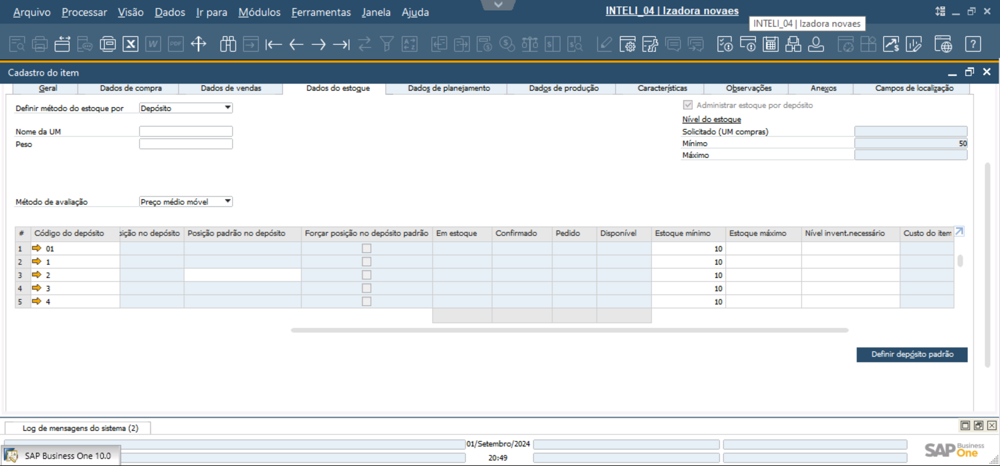
    <br>
    <sup>Fonte: Material produzido pelos autores (2024)</sup>
</div>

**ES012 - First In, First Out:**

&emsp;&emsp;Uma das funcionalidades destacadas na seção de Funcionalidades do Sistema é a organização dos dados de estoque, que visa garantir uma gestão eficiente e evitar problemas como o vencimento de licenças. Para isso, o sistema utiliza o método FIFO (First In, First Out), conforme descrito por Inseris (2024)<sup><a href="#referencia-12">12</a></sup>: "Nessa metodologia de gestão, conhecida como FIFO, os produtos que estão há mais tempo no estoque são priorizados para despacho, garantindo que sejam enviados primeiro aos consumidores." A seguir, são apresentadas imagens da configuração dessa fase.

<div align="center">
    <br><sub>Figura 53 - Padrão do SAP de Estoque</sub>
    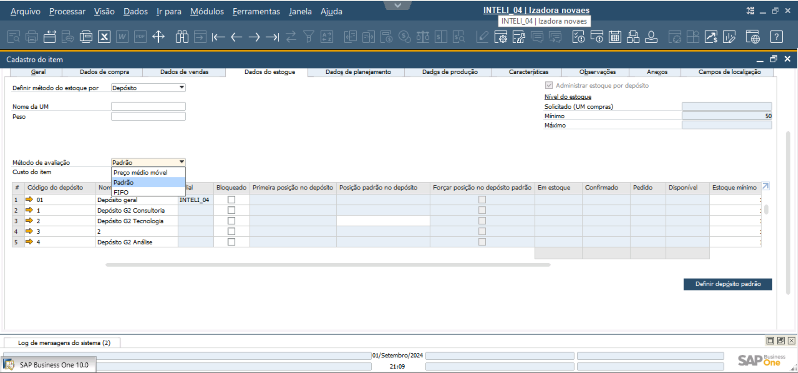
    <br>
    <sup>Fonte: Material produzido pelos autores (2024)</sup>
</div>

<div align="center">
    <br><sub>Figura 54 - Mudança para a metodologia FIFO</sub>
    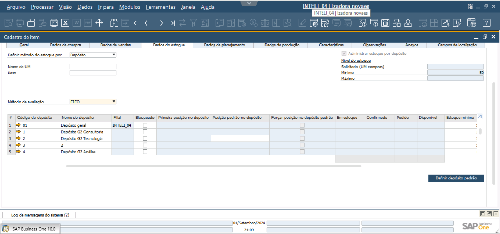
    <br>
    <sup>Fonte: Material produzido pelos autores (2024)</sup>
</div>

&emsp;&emsp;A implementação das regras de negócio e das funcionalidades no projeto SAP para a G2 Tecnologia foi conduzida com grande atenção aos detalhes, focando na melhoria da gestão de estoque e licenças. Esse trabalho conjunto não só potencializou a eficiência operacional como também alinhou as práticas da empresa com seus objetivos estratégicos. As configurações aplicadas são fundamentais para otimizar o uso de recursos e elevar a satisfação dos clientes, preparando a G2 Tecnologia para superar desafios futuros e aprimorar seus processos continuamente. Esse desenvolvimento estratégico é vital para manter a competitividade e a posição de liderança no mercado.

# <a name="6-documentação-carga-dados-mestres"></a> 6. Documentação Carga Sap B1

## <a name="61.Métodos-de-carga-de-dados-para-o-Sap-B1"></a> 6.1 Métodos de carga de dados para o Sap B1

&emsp;&emsp;Para realizar a configuração e implantação de uma solução como o Sap B1 em uma empresa, além da configuração inicial dos parâmetros únicos da empresa, é necessário importar informações referentes aos dados coletados ou gerados anteriormente à implantação do ERP. Para isso, são utilizados alguns métodos de carga de dados: 

 - Importação de Dados Através da Interface do Usuário (UI): Trata-se, em suma, da inserção manual das informações que irão compor os dados de estoque, contábil, vendas e de outras áreas da empresa;

 - DI-API (Data Interface API): Trata-se de uma API(Application Programming Interface) que permite a desenvolvedores criar scripts que automatizam a inserção de dados na aplicação;

 - XML e B1iF (SAP Business One Integration Framework):Utiliza Extensible Markup Language(XML) como método de integração entre o SAP B1 e diversas fontes externas;

 - UI API (User Interface API): Permite automações a partir de recriações das inserções que seriam feitas manualmente. Útil para quando se deseja apenas refletir o que um usuário faria sem scripts;

 - SQL Directo: Trata-se da inserção/interação direta com o banco de dados do SAP B1, algo não recomendado pois pode causar erros irreversíveis;

 - Template Management System (TMS): Baseia-se na criação de templates, esses padronizam as estruturas as quais os dados devem ser enviados para a aplicação, assim permitindo uma interação mais rápida com o Sap B1;

 - Data Transfer Workbench (DTW): Por último, há também o DTW, método nativo para inserção de dados em massa, isso pois a partir de planilhas em csv ou excel. Por permitir volumes de dados maiores, é mais indicado para novas integrações, migrações e atualizações.

&emsp;&emsp;Considerando que esse projeto trata-se de uma implementação de um módulo SAP em um curto período e exigindo a inserção de grandes volumes de dados, o método escolhido foi o de DTW. Permitindo então que os dados sejam reunidos em planilhas csv e então inseridos no SAP B1.


### Como realizar carga via Data Transfer Workbench(DTW)

&emsp;&emsp; O DTW é uma ferramenta nativa do SAP Business One, criado para facilitar a importação e exportação de dados em massa. Com isso, sendo especialmente útil durante as fases de implantação, pois nessa, dados da empresa cliente, que antes estavam em diferentes fontes externas, serão importados em grande volume, por exemplo, registros de clientes, fornecedores, itens do estoque, etc.

&emsp;&emsp; O DTW funciona a partir do mapeamento de campos de dados de arquivos externos(geralmente em formato CSV) para os campos correspondentes no SAP B1. Com isso, ele suporta diversos tipos de operações, adição, atualização e exclusão de registros. Para isso, os dados no arquivo externo devem corresponder aos campos de algum módulo dentro do sistema ERP aqui citado. Contudo se em algum grau, algum erro ocorrer, o DTW interrompe o _upload_ dos dados e retorna um erro ao usuário, como visto no seguinte fluxo:

<div align="center">
<sub>Figura 55 - Fluxo de erro no DTW</sub>
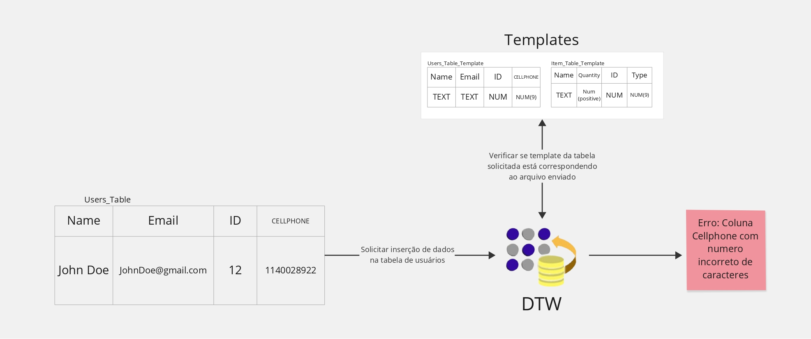
<sup>Fonte: Material produzido pelos autores (2024)</sup>
</div>

&emsp;&emsp;Contudo, quando há correspondência das colunas na tabela e os dados estão no formato correto, então o DTW se conecta ao SAP B1 através da camada de interação do SAP, chamada de DI API (Data Interface API), e realiza a carga das informações solicitadas e enviadas pelo usuário, o que pode ser visto no seguinte fluxo:


<div align="center">
<sub>Figura 56 - Fluxo de acerto no DTW</sub>
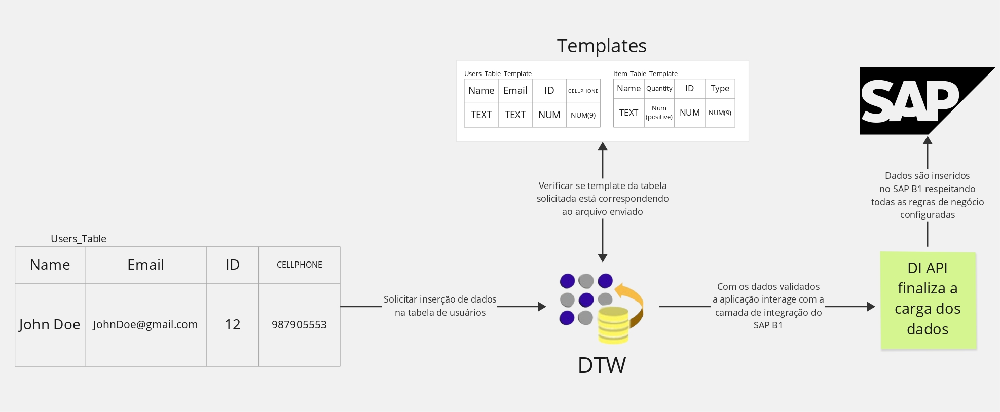
<sup>Fonte: Material produzido pelos autores (2024)</sup>
</div>

### Passo a passo para um DTW

 1. Selecione o Tipo de Operação:
 - Escolha a operação que deseja realizar, como “Add New Data” (Adicionar Novos Dados) ou “Update Existing Data” (Atualizar Dados Existentes).

 2. Selecione o Tipo de Objeto:
 - Escolha o tipo de objeto no SAP B1 ao qual os dados pertencem (ex.: Business Partners para clientes e fornecedores, Items para itens de inventário, etc.).

 3. Importe os Arquivos de Origem:
 - Importe os arquivos em TXT, CSV ou Excel preenchidos com seus dados. Certifique-se de que o arquivo esteja no formato correto e siga as convenções de nomenclatura e formatação dos templates.

 4. Mapeie os Campos:
 - O DTW permitirá que você revise e ajuste o mapeamento dos campos, garantindo que os dados do arquivo de origem correspondam aos campos no SAP B1.

 5. Execute a Carga de Dados:
 - Após o mapeamento, execute a carga de dados. O DTW processará os arquivos e importará os dados no SAP B1.

 - A ferramenta gera logs detalhados que indicam se a importação foi bem-sucedida ou se ocorreram erros. Esses logs ajudam a identificar e corrigir problemas.

 6. Verifique os Dados no SAP B1:
 - Após a importação, é essencial verificar se os dados foram carregados corretamente no SAP B1. Você pode fazer isso diretamente nas telas correspondentes ao tipo de dado importado.

&emsp;&emsp; Seguindo os passos acima citados é possível realizar a carga de dados de qualquer tabela listada no DTW. Isso se forem seguidos os padrões e _templates_ assumidos na aplicação. Com essa, evita-se processos manuais e repetitivos e então acelera-se o processo de implementação de um sistema tão complexo como o ERP SAP B1.

## <a name="62.Limpeza-dos-dados"></a> 6.2. Limpeza dos dados

&emsp;&emsp; Nesta seção, documentamos o processo de limpeza de dados aplicado a diversas tabelas utilizadas no projeto, incluindo as tabelas ODRD, CRD1, CRD7, OCRB e Template_Cadastro de Itens. A limpeza de dados é um passo crucial para garantir a consistência, integridade e precisão das informações, facilitando a análise e o uso correto dos dados em processos subsequentes. A seguir, detalhamos as ações realizadas em cada tabela, abordando desde a remoção de colunas desnecessárias até a padronização de formatos e correções específicas, com a aplicação de scripts em Python para automatizar e otimizar o processo.

### Tabela ODRD
- Deleção das colunas: `FAX`, `Notes`, `Freetext`.
- Reposicionamento de número de telefone (que estavam em colunas aleatórias).
- Separação entre número de telefone e DDD.

### Tabela CRD1
- Padronização da coluna `CEP`.
- Remoção de caracteres especiais.
- Padronização em caps lock.
- Ajustes nas colunas `TypeOfAddress`, `Street` e `StreetNo` para garantir que os dados estejam nas colunas corretas.
- Preenchimento de códigos de município em linhas que estavam ausentes.

### Tabela CRD7
- Exploração dos dados e identificação de linhas que não seguiam as diretrizes estabelecidas pela G2, criando colunas de 'tag' para categorizar as inconsistências detectadas. As tags utilizadas foram: 'preencher uma das taxas', 'ok', 'devolver' e 'verificar'.
- Após alinhamento com o parceiro, foram preenchidas as linhas necessárias. Em seguida, os dados foram padronizados para caps lock, e acentos e caracteres especiais como ‘ç’ foram removidos.
- Deletadas as linhas que deveriam ser devolvidas. IDs das linhas deletadas: `C0047, C0051, C0052, C0053, C0062, C0065, C0111, C0112, C0113, C0119, C0128, C0130, C0136, C0137, C0170, C0173, C0174, C0182, C0189, C0191, C0193, C0206, C0209, C0210, C0211, C0213, C0214, C0217, C0218, C0227, C0228, C0231, C0245, C0257, C0262, C0264, C0265, C0267, C0273, C0286, C0287, C0289, C0290, C0291, C0292, C0293, C0294, C0297, C0298, C0300, C0301, C0303, C0305, C0308, C0313, C0314, C0315, C0316, C0317, C0318, C0319, C0323, C0324, C0325, C0327, C0329, C0330, C0331, C0332, C0333, C0334, C0335, C0336, C0337, C0338, C0339, C0340, C0341, C0343, C0344, C0345, C0348, C0350, C0351, C0356, C0359, C0360, C0367, C0369, C0376, C0377, C0380, C0383, C0386, C0387, C0389, C0391, C0394, C0397, C0398, C0399, C0400, C0401, C0402, C0407, C0411, C0417, C0458, C0469, C0471, C0478, C0563, F0964, F0965, F0966, F0967, F0969, F0971, F0972, F0979, F0987, F0988, F0990, F0997, F0998, F1000, F1007, F1013, F1024, F1025, F1032, F1034, F1036, F1038, F1049, F1052, F1055, F1056, F1064, F1066, F1067, F1068, F1069, F1070, F1071, F1072, F1078, F1079, F1081, F1082, F1091, F1095, F1102, F1105`.
- Estes IDs acima devem ser devolvidos para o parceiro por falta de informação necessária para continuar a carga.

### Tabela OCRB
- Remoção de colunas com mais de 80% das linhas sem dados.

### Tabela Template_Cadastro de Itens
- Foi utilizado o seguinte código em Python para realizar as padronizações:

```python
import pandas as pd
import unicodedata

def normalize_string(s):
    return unicodedata.normalize('NFKD', s).encode('ASCII', 'ignore').decode('ASCII')

def remove_comma(df, column):
    df[column] = df[column].str.replace(',', '')
    return df
    
def remove_special_chars_of_df(df):
    for column in df.columns:
        if df[column].dtype == 'object':
            df[column] = df[column].str.replace(r'[^\w\s]', '')
    return df

def convert_to_yes_no(df):
    df = df.replace(to_replace=r'\b[Ss][Ii][Mm]\b', value='Y', regex=True)
    df = df.replace(to_replace=r'\b[Nn][ãã][Oo]\b', value='N', regex=True)
    return df

def update_item_group_code(template_df, itens_df):
    template_df['Nº do item'] = template_df['Nº do item'].str.strip()
    template_df['Grupo de itens'] = template_df['Grupo de itens'].str.strip()
    itens_df['ItemCode'] = itens_df['ItemCode'].str.strip()
    itens_df['ItemsGroupCode'] = 'UNMATCHED' 

    for i, item_row in itens_df.iterrows():
        item_code = normalize_string(str(item_row['ItemCode']).strip())
        mask = template_df['Nº do item'].str.strip().str.upper().apply(normalize_string) == item_code.upper()
        if mask.any():
            group_code = template_df.loc[mask, 'Grupo de itens'].values[0]
            itens_df.at[i, 'ItemsGroupCode'] = group_code
        else:
            itens_df.at[i, 'ItemsGroupCode'] = 'UNMATCHED'
            
    itens_df = itens_df[itens_df['ItemsGroupCode'] != 'UNMATCHED']
            
    return itens_df

def update_item_type(itens_df):
    itens_df['ItemType'] = 'I'
    return itens_df

def update_item_class(itens_df, column='ItemClass'):
    itens_df[column] = itens_df[column].replace(to_replace=['Material'], value='itcMaterial')
    itens_df[column] = itens_df[column].replace(to_replace=['Serviços', 'Serviço'], value='itcService')
    return itens_df

def update_material_type(itens_df):
    mappings = {
        'Mercadoria para Revenda': '0', 'Matéria-Prima': '1', 'Matéria Prima': '1', 'Embalagem': '2',
        'Produto em Processo': '3', 'Produto Acabado': '4', 'Subproduto': '5', 'Produto Intermediário': '6',
        'Material de Uso e Consumo': '7', 'Ativo Imobilizado': '8', 'Serviços': '9', 
        'Outros insumos': '10', 'Outros Insumos': '10', 'Outras': '99'
    }
    itens_df['MaterialType'] = itens_df['MaterialType'].replace(mappings)
    return itens_df

def update_product_source(itens_df):
    mappings = {
        'Nacional, exceto as indicadas nos códigos 3 a 5': '0',
        'Estrangeira - Importação direta, exceto a indicada no código 6': '1',
        'Estrangeira - Adquirida no mercado interno, exceto a indicada no código 7': '2',
        'Nacional, mercadoria ou bem com Conteúdo de Importação superior a 40% (quarenta por cento)': '3',
        'Nacional, cuja produção tenha sido feita em conformidade com os processos produtivos básicos de que tratam o Decreto-Lei no 288/1967, e as Leis no 8.248/1991, 8.387/1991,10.176/2001 e 11.484/2007': '4',
        'Nacional, mercadoria ou bem com Conteúdo de Importação inferior ou igual a 40% (quarenta por cento)': '5',
        'Estrangeira - Importação direta, sem similar nacional, constante em lista de Resolução CAMEX': '6'
    }
    itens_df = itens_df.replace(mappings)
    return itens_df

def remove_unmatched(itens_df):
    itens_df = itens_df[itens_df['ItemsGroupCode'] != 'UNMATCHED']
    return itens_df

def main():
    template_df = pd.read_csv('assets/template.csv', dtype=str)
    itens_df = pd.read_csv('assets/item.csv', dtype=str)
    columns_df = pd.read_csv('assets/columns.csv', dtype=str)
    columns_to_use = columns_df.columns.to_list()
    copy_of_first_line = columns_df.loc[0].copy()

    itens_df = itens_df[columns_to_use]
    itens_df = remove_special_chars_of_df(itens_df)
    itens_df = remove_comma(itens_df, "ItemName")
    itens_df = convert_to_yes_no(itens_df)
    itens_df = update_item_group_code(template_df, itens_df)
    itens_df = update_item_type(itens_df)
    itens_df = update_item_class(itens_df)
    itens_df = update_material_type(itens_df)
    itens_df = update_product_source(itens_df)
    itens_df["ShipType"] = ""
    
    first_line_df = pd.DataFrame([copy_of_first_line])

    itens_df = pd.concat([first_line_df, itens_df]).reset_index(drop=True)
    
    itens_df.to_csv('assets/itemUpdated.csv', index=False)

main()
```
&emsp;&emsp; Através das técnicas de limpeza de dados documentadas, foi possível garantir um conjunto de dados consistente, padronizado e pronto para ser utilizado em análises futuras e para carga em sistemas específicos. 

## <a name="63.Devolução-de-Dados-para-o-Cliente-G2-Tecnologia"></a> 6.3. Devolução de Dados para o Cliente *G2 Tecnologia*

## <a name="64.-Checklis-da-Carga"></a> 6.4. Checklist da Carga

&emsp;&emsp;Esta seção aborda metodicamente os procedimentos e métodos empregados para a carga de dados no SAP B1, detalhando a utilização eficaz da Data Transfer Workbench (DTW) e outras técnicas de integração. As estratégias adotadas garantem uma transição suave e precisa dos dados existentes para o sistema ERP, permitindo que a G2 Tecnologia aproveite ao máximo as funcionalidades do SAP B1. Este processo crítico não só aumenta a eficiência operacional, mas também assegura a integridade e a qualidade dos dados transferidos, estabelecendo uma base sólida para operações futuras e decisões estratégicas informadas.

&emsp;&emsp; Para realizar a carga dos dados via DTW, segue-se os passos acima para tabelas enviadas pelo cliente. Com isso, primeiramente, ocorre a limpeza e depois diversas tentativas de envio, com isso erros são gerados, a limpeza ocorre novamente e então é possível enviar os dados. O grupo realizou essa operação com diversas tabela e aqui teremos um _status report_ acerca do progresso de inserção de dados via DTW.

### Tabela OITM (itens em estoque)

&emsp;&emsp; Essa tabela foi limpa utilizando o codigo python encontrado na pasta assets a partir da raiz desse projeto. Com isso, foi possível enviar todos os dados da tabela para o DTW, com isso atualizando as informações de item no _business object_ "Estoque".

<div align="center">
<sub>Figura 57 - DTW tabela de itens</sub>
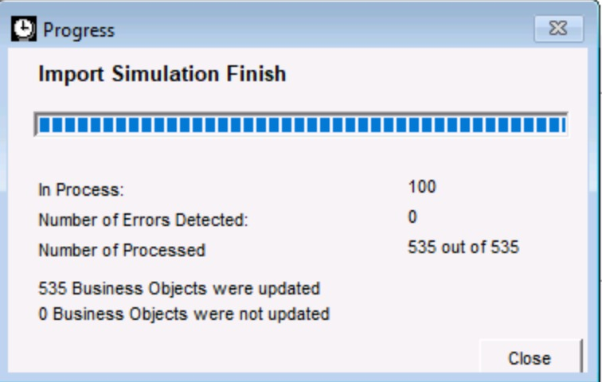
<sup>Fonte: Material produzido pelos autores (2024)</sup>
</div>

&emsp;&emsp; Como visto na imagem acima, o envio da tabela de itens, contendo informações de estoque foi completo, enviando todos os itens, atualizando seus _business objects_ sem gerar erros.

### Tabela CRD1 (Endereços dos parceiros de negócio)

&emsp;&emsp; A tabela CRD1 foi tratada utilizando ferramentas da aplicação Excel. Com isso, o processo para limpeza e padronização de dados ocorreu manualmente, isso pois essa tabela possui peculiaridades as quais tornariam a criação de um código padrão para realizar a limpeza de dados. 

<div align="center">
<sub>Figura 58 - DTW tabela CRD1</sub>
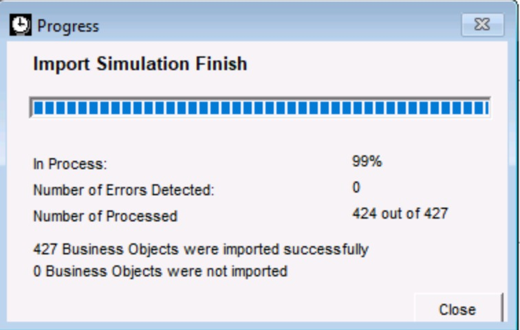
<sup>Fonte: Material produzido pelos autores (2024)</sup>
</div>

&emsp;&emsp; Após realizada a limpeza e padronização dos dados, foi possível realizar o envio das informações via DTW, como visto na imagem acima, sem gerar erros.

### Tabela OCRD (Informações gerais de Parceiros de Negócio)

&emsp;&emsp; A tabela OCRD também foi completamente tratada, de inicio apresentou erros, os quais foram validados com o cliente e que então nos permitiu realizar a limpeza de dados de uma maneira que refletisse as vontades do cliente.

<div align="center">
<sub>Figura 59 - DTW tabela CRD1</sub>
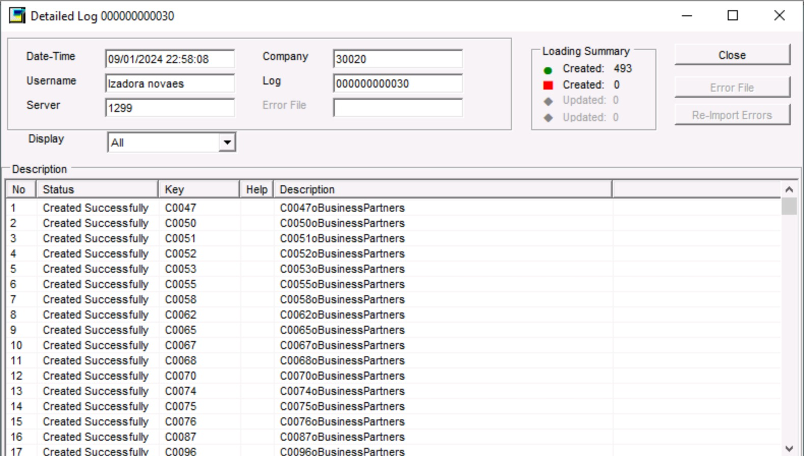
<sup>Fonte: Material produzido pelos autores (2024)</sup>
</div>

&emsp;&emsp; Com isso, como visto na imagem acima, foi possível realizar o _upload_ dos dados inseridos pelo cliente na tabela OCRD para assim conseguirmos informações sobre os parceiros de negócio

### Tabela CRD7

&emsp;&emsp; A tabela CRD7 foi completamente tratada, foram observados diversos erros na primeira instância, mas eles foram corrigidos e validados com o parceiro, posteriormente foi realizado o upload com sucesso.

### Tabela OCRB

&emsp;&emsp; A limpeza da tabela foi completa, em primeira instância foram observados muitos erros no tratamento da tabela, mas após validar eles com o parceiro e refazer o tratamento da tabela, o upload foi realizado com sucesso

# <a name="7-outras-configurações"></a> 7. Outras Configurações

&emsp;&emsp; Nesta seção, serão demonstrados os passos utilizados para realizar outras configurações do SAP Business One, que possuem a mesma importância das já apresentadas, mas não se enquadram nas especificações das seções anteriores.

## <a name="71-configurações-de-impostos"></a> 7.1 Configurações de Impostos
&emsp;&emsp; A configuração de impostos é uma etapa importante da parametrização do SAP Business One, pois, a partir deste processo, são inseridos no sistema os tipos e as combinações de impostos que incidem sobre os produtos ou serviços de uma empresa. Esta etapa foi realizada com base em uma planilha enviada pela G2 Tecnologia, a qual descreve os tipos de imposto que a companhia paga, bem como suas respectivas combinações. A planilha em questão pode ser visualizada na Figura 60.

<div align="center">
<sub>Figura 60 - Planilha de Impostos G2 Tecnologia</sub>
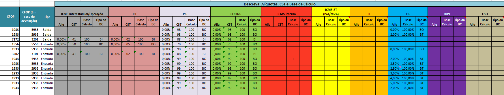
<sup>Fonte: Material enviado pela G2 Tecnologia (2024)</sup>
</div>

&emsp;&emsp; O primeiro passo necessário para a configuração foi averiguar se todos os tipos de impostos apresentados na planilha já estavam cadastrados no SAP Business One. Durante este processo, foram encontradas três variações diferentes de impostos que ainda não estavam registradas, como pode ser conferido na Figura 61, nas células demarcadas por um retângulo vermelho com o número "1". Dessa forma, esses tipos de impostos foram adicionados ao SAP através do seguinte caminho: "Módulos" -> "Administração" -> "Definição"-> "Finanças" -> "Impostos" -> "Tipos de Imposto" (Figura 62). Em "Tipos de Impostos", foi selecionado o imposto ao qual se desejava adicionar uma nova variação, clicando em cima do número que o acompanhava (Figura 63) e, após isso, inserindo, na tela mostrada na Figura 64, todas as especificações da variação. Após isso, basta clicar em "adicionar" para finalizar a operação. Esse procedimento foi realizado para as três variações de impostos demarcadas na Figura 61 pelo número "1".

<div align="center">
<sub>Figura 61 - Planilha de Impostos com Marcações</sub>
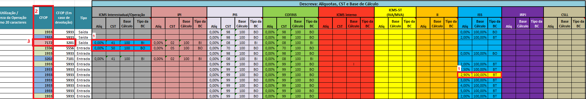
<sup>Fonte: Material produzido pelos autores (2024)</sup>
</div>

<div align="center">
<sub>Figura 62 - Fluxo de Tipos de Impostos</sub>
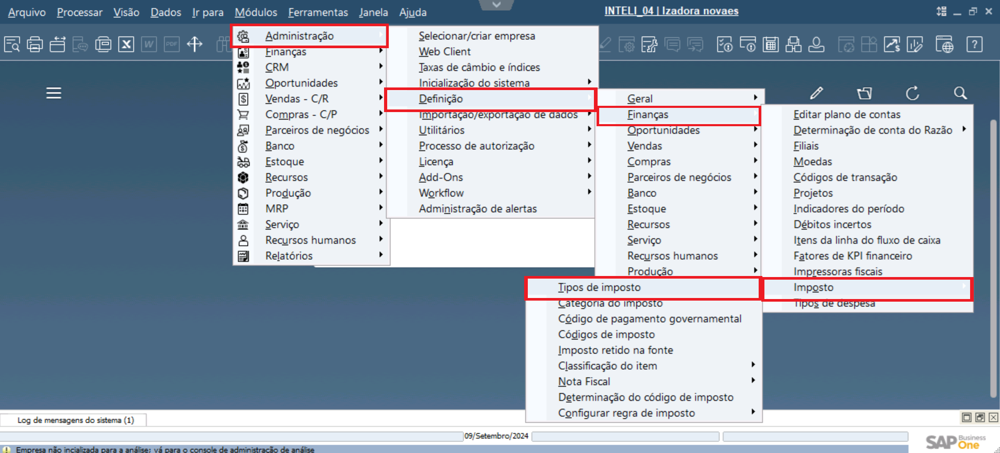
<sup>Fonte: Material produzido pelos autores (2024)</sup>
</div>

<div align="center">
<sub>Figura 63 - Seleção de Tipos de Impostos</sub>
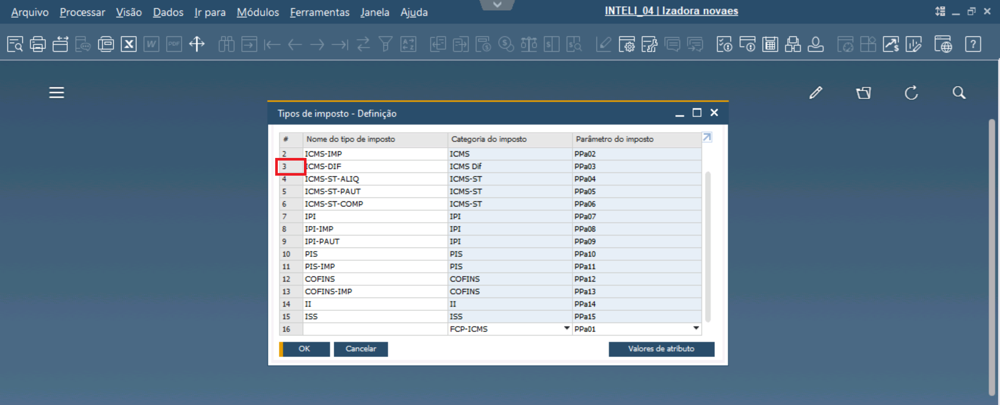
<sup>Fonte: Material produzido pelos autores (2024)</sup>
</div>

<div align="center">
<sub>Figura 64 - Adição de Impostos</sub>
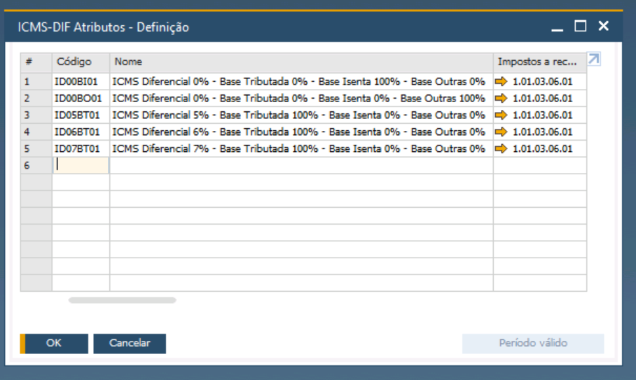
<sup>Fonte: Material produzido pelos autores (2024)</sup>
</div>

&emsp;&emsp; Após a adição das variações de impostos, iniciou-se a identificação de quais conjuntos de impostos (seleção criada com dois ou mais tipos de impostos que serão aplicados sobre um mesmo produto ou serviço) já estavam cadastrados no SAP. Esse processo foi realizado consultando os números de CFOP de cada conjunto de impostos no sistema. Essa coluna pode ser visualizada na Figura 61, no retângulo vermelho identificado como "2". Nela, o grupo marcou com a cor verde os CFOPs já cadastrados no sistema, com azul aqueles que não estavam cadastrados e com vermelho aqueles que apresentavam algum tipo de inconsistência.

&emsp;&emsp; Dessa forma, o processo de cadastramento iniciou-se com a inserção dos novos conjuntos no sistema, o que foi realizado através do seguinte caminho no SAP: "Módulos" -> "Administração" -> "Definição"-> "Finanças" -> "Impostos" -> "Códigos de Imposto". Esse caminho pode ser visualizado na Figura 65.

<div align="center">
<sub>Figura 65 - Fluxo de Códigos de Impostos</sub>
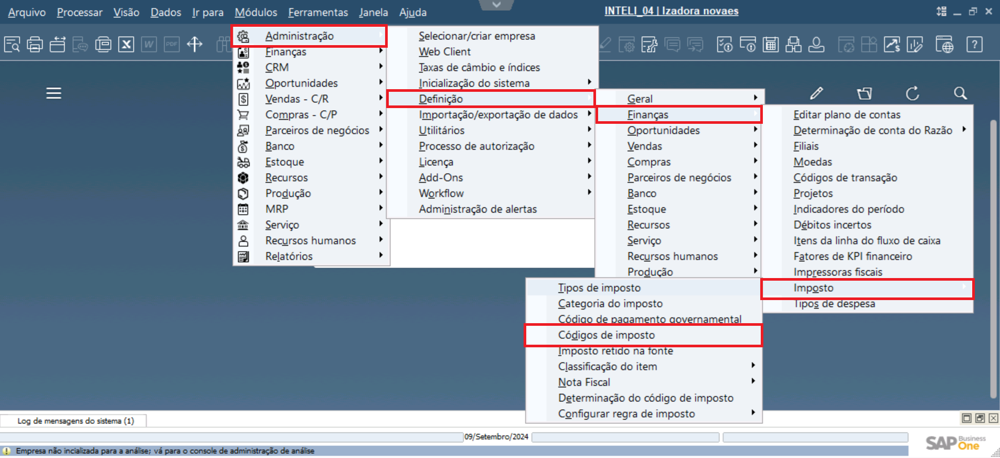
<sup>Fonte: Material produzido pelos autores (2024)</sup>
</div>

&emsp;&emsp; Após seguir o caminho acima, é possível adicionar novos conjuntos de impostos ao sistema. Para isso, basta preencher os campos marcados em vermelho na Figura 61, conforme os dados fornecidos na Figura 63. Após preencher os campos, na coluna "Tipos de Imposto" aparecerão todos os impostos que fazem parte do conjunto que está sendo criado. Dessa forma, é possível preencher o restante da tabela com os dados fornecidos pela G2 Tecnologia na Figura 63.

<div align="center">
<sub>Figura 66 - Adição de Códigos de Impostos</sub>
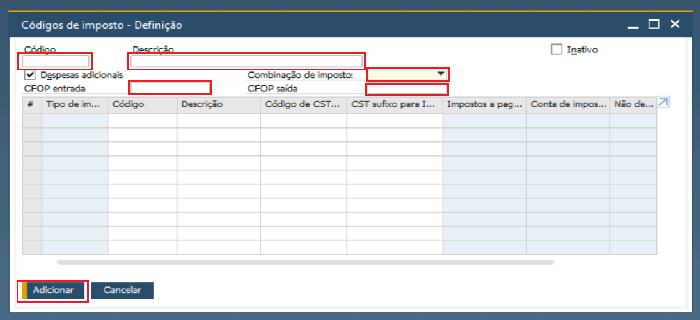
<sup>Fonte: Material produzido pelos autores (2024)</sup>
</div>

&emsp;&emsp; Deste modo, o correto cadastramento de impostos no SAP Business One é essencial para garantir a conformidade fiscal da empresa e otimizar o controle de tributações aplicáveis sobre produtos e serviços. Dessa forma, o sistema reflete com precisão as obrigações fiscais da empresa, evitando possíveis erros ou omissões que poderiam resultar em penalidades ou prejuízos financeiros.

# <a name="8-analise-financeira"></a> 8. Análise Financeira

&emsp;&emsp;A análise financeira do projeto será realizada sob a perspectiva do investidor responsável pela implementação do SAP B1 na sua empresa, que, neste caso, é o nosso cliente e parceiro, G2 Tecnologia.

&emsp;&emsp;Inicialmente, não será considerado um detalhamento completo dos custos, mas sim o valor do projeto e os custos anuais de manutenção.

## <a name="81-roi"></a> 8.1. ROI

&emsp;&emsp;O *Return on Investment* (ROI), ou Retorno Sobre o Investimento, é uma métrica amplamente utilizada pelas empresas para avaliar o retorno financeiro esperado sobre um investimento. Em termos simples, ela ajuda a responder à seguinte pergunta: considerando os custos envolvidos na implementação do projeto e os ganhos de eficiência gerados (receita), vale a pena realizar esse investimento?

## <a name="811-levantamento-de-informacoes"></a> 8.1.1. Levantamento de Informações

&emsp;&emsp;Para calcular o ROI, é necessário primeiro identificar os custos envolvidos e as receitas esperadas com o projeto. Com o auxílio do parceiro G2 Tecnologia, foram levantadas as seguintes informações:

### **8.1.2.1. Custos**

&emsp;&emsp;Os custos foram estimados considerando um cenário pessimista, no qual se espera que o valor máximo previsto seja gasto. Foram levados em conta o custo da consultoria SAP, das licenças e da hospedagem em nuvem.

**Consultoria SAP**

&emsp;&emsp;A seguir, o cálculo do custo estimado para a consultoria SAP:

| Descrição | Preço/hora (R$) | Quantidade | Horas Trabalhadas (+Extras) | Total por Sprint (R$) | Total do Projeto (R$) (5 sprints) |
| --- | --- | --- | --- | --- | --- |
| Consultor Junior | 75 | 34 | 20  | 51.000,00 | 255.000,00 |
| Consultor Sênior | 90 | 3 | 80 (8h p/dia) | 21.600,00 | 108.000,00 |
| Gerente de Projetos | 100 | 1 | 80  | 8.000,00 | 40.000,00 |
| **TOTAL** | - | - | - | - | 403.000,00 |

&emsp;&emsp;Obs: O valor de R$ 90,00/hora para o consultor sênior é uma estimativa especulativa.

**Licenças**

&emsp;&emsp;O cálculo a seguir considera o custo de cinco licenças, necessárias para cada *squad*, durante o período de três meses (aproximadamente 10 semanas):

| Descrição | Quantidade | Valor Unitário por Mês (R$) | Total por Mês (R$) | Total para 3 Meses (R$) |
| --- | --- | --- | --- | --- |
| Licenças | 5 | 740 | 3.700,00 | 11.100,00 |
| Nuvem | 5 | 60 | 300,00 | 900,00 |
| **TOTAL** | - | - | - | 12.000,00 |

**Custo Total de Implementação**

&emsp;&emsp;O custo total de implementação do SAP B1 inclui os valores de consultoria, licenças e nuvem:

| Descrição | Valor (R$) |
| --- | --- |
| Consultoria SAP | 403.000,00 |
| Licenças | 11.100,00 |
| Nuvem | 900,00 |
| **TOTAL** | **415.000,00** |

**Custo Total de Manutenção** 

&emsp;&emsp;Para o custo total de manutenção, foi considerado um período de um ano com licenças SAP para 20 funcionários, divididos entre os módulos implementados:

| Descrição | Quantidade | Valor Unitário por Mês (R$) | Período | Total (R$) |
| --- | --- | --- | --- | --- |
| Licenças | 20 | 740 | 12 meses  | 177.600,00 |
| Nuvem | 20 | 60 | 12 meses | 14.400,00 |
| **TOTAL** | - | - | - | **192.000,00** |

**Custo Total do Projeto**

&emsp;&emsp;Somando os custos de implementação e manutenção anual, temos o custo total do projeto ao longo de um ano:

- Custo Total de Implementação: **R$ 415.000,00**
- Custo Total de Manutenção (1 ano): **R$ 192.000,00**
- **Total: R$ 607.000,00**

### **8.1.2.2. Receitas**

&emsp;&emsp;A receita esperada com a implementação do SAP B1 está relacionada ao aumento da produtividade proporcionado pelo software.

- Receita anual da G2 antes da implementação do SAP B1: **R$ 35.000.000,00**
- Ganho de performance esperado com o SAP B1: **2%**
- Receita adicional gerada pelo SAP B1: **R$ 700.000,00** por ano

## <a name="812-calculo"></a> 8.1.2. Cálculo do ROI

&emsp;&emsp;A fórmula utilizada para o cálculo do ROI é a seguinte: 

&emsp;&emsp;**ROI (%) = [(Receitas - Custos) / Custos] x 100**

Com base nos valores levantados:

| Receitas - Custos | (R - C) / Custos | [(R - C) / C] x 100 | ROI (%) |
| --- | --- | --- | --- |
| R$ 700.000 - R$ 607.000 = R$ 93.000 | R$ 93.000 / R$ 607.000 = 0,1532 | 0,1532 x 100 = 15,32 | **15,32%** |

# 9. Relatórios Personalizados

&emsp;&emsp; Relatórios personalizados são de suma importância para que a empresa consiga ter suas necessidades supridas, considerando que apenas relatórios nativos do SAP podem ser insuficientes. Com isso, a partir de consultas SQL em **Ferramentas > Gerador de consultas** é possível interagir com as diversas tabelas alocadas no banco de dados do SAP B1. Após isso, é possível salvar a mesma consulta em **Ferramentas > Consultas Gravadas**.

&emsp;&emsp; Para esse projeto foi gerada a seguinte consulta:

```sql
SELECT 
    "T0"."ItemCode", 
    "T0"."ItemName", 
    "T1"."ItmsGrpNam", 
    CASE 
        WHEN "T0"."PrchseItem" = 'Y' THEN 'SIM' 
        ELSE 'NÃO' 
    END AS "PrchseItem", 
    CASE 
        WHEN "T0"."SellItem" = 'Y' THEN 'SIM' 
        ELSE 'NÃO' 
    END AS "SellItem", 
    "T0"."BuyUnitMsr", 
    "T0"."SalUnitMsr", 
    "T0"."InvntryUom", 
    CAST("T0"."OnHand" AS INTEGER) AS "OnHand", 
    CAST("T0"."IsCommited" AS INTEGER) AS "Quantidade Pedida(Vendas)", 
    CAST("T0"."OnOrder" AS INTEGER) AS "Quantidade Pedida(Compras)", 
    CAST(("T0"."OnHand" - "T0"."IsCommited" + "T0"."OnOrder") AS INTEGER) AS "Quantidade disponível", 
    "T0"."LastPurPrc"
FROM 
    OITM T0 
    INNER JOIN OITB T1
    ON "T1"."ItmsGrpCod" = "T0"."ItmsGrpCod"
WHERE 
    "T0"."InvntItem" = 'Y'
ORDER BY "T0"."ItemCode"
```

&emsp;&emsp; Com a consulta acima citada é possível verificar todos os itens estocáveis, seguindo a coluna "InvntItem" a qual informa se um item pode ser gerenciado via estoque ou não, com isso uma possível resposta é:

| Nº do item | Descrição do item                             | Nome do grupo | Item de compra | Item de venda | Unidade de medida de compra | Unidade de medida de venda | Unidade de medida de estoque | Em estoque | Quantidade Pedida (Vendas) | Quantidade Pedida (Compras) | Quantidade disponível | Último preço de compra |
|------------|-----------------------------------------------|---------------|----------------|---------------|-----------------------------|----------------------------|------------------------------|------------|----------------------------|-----------------------------|------------------------|-------------------------|
| 2TESTE     | COMPUTADOR DELL                               | Itens         | SIM            | NÃO           | UNID                        |                            |                              | 18         |                            |                             | 18                     | 290,0000                |
| I126       | HIGIENIZADOR DE ASSENTO KC 300MLX 2           | 114           | SIM            | NÃO           |                             | UNID                        |                              | 50         |                            |                             | 50                     | 15,0000                 |
| I127       | HIGIENIZADOR DE MAOS  KIMCARE SPRAY           | 100           | SIM            | NÃO           |                             |                            | UNID                         | 226        |                            |                             | 226                    | 24,0000                 |
| I143       | KLEENEX AUTOFOAM SOAP DERMO (ANTISSEPTICO)    | 100           | SIM            | SIM           |                             |                            |                              | 1          |                            |                             | 1                      | 0,1200                  |

&emsp;&emsp; Com isso é possível entender um exemplo de relatório personalizado via consulta SQL.

## 8.1.3. Análise do ROI

&emsp;Com um ROI de 15,32%, o projeto de implementação do SAP B1 demonstra um retorno financeiro positivo para a G2 Tecnologia. Isso indica que, ao final de um ano, a empresa espera recuperar todo o investimento inicial (R$ 607.000,00) e ainda obter um ganho adicional de 15,32% sobre esse valor, o que corresponde a R$ 93.000,00 em lucros.

&emsp;Esse ROI sugere que o projeto vale a pena do ponto de vista financeiro, considerando os ganhos em produtividade proporcionados pelo SAP B1. Mesmo em um cenário pessimista, onde os custos são calculados no valor máximo estimado, o retorno é positivo. Este resultado reforça que o aumento esperado de 2% na performance da G2 Tecnologia gera um impacto financeiro suficiente para justificar o investimento.

&emsp;Além disso, o ROI positivo também indica que a empresa conseguirá não apenas cobrir os custos operacionais anuais de manutenção (R$ 192.000,00), mas também gerar receitas adicionais ao longo dos anos subsequentes, criando um efeito acumulativo no longo prazo.

# Bibliografia

1. <a name="referencia-1"></a> TODOROV, Georgi. 61 Important SAP Stats and Facts [and Trends] in 2024. ThriveMyWay, 2023. Disponível em: https://thrivemyway.com/sap-stats/. Acesso em: 11 ago.

2. <a name="referencia-2"></a> MINDMINERS. O que é Desk Research?. Disponível em: https://mindminers.com/blog/o-que-e-desk-research/. Acesso em: 13 ago. 2024.

3. <a name="referencia-3"></a> PADILHA, T. C. C.; MARINS, F. A. S. Sistemas ERP: características, custos e tendências. Revista Produção, v. 15, n. 1, p. 102-113, jan./abr. 2005.

4. <a name="referencia-4"></a> Souza de Jesus, S.; Gomes, F.; Santana, A.; Pimenta, I. (2023). A Importância do ERP em Empresas de Logística, o Caso de uma Organização de Médio Porte. Sapientiae (8) 2, 253-267. www.doi.org/10.37293/sapientiae82.06. Acesso em: 15 ago. 2024.

5. <a name="referencia-5"></a> Au Yong, Hui Nee. Warehouse Management System and Business Performance: Case Study of a Regional Distribution Centre. Proceedings of the 7th International Conference on Operations and Supply Chain Management, 2007. Acesso em: 14 de agosto de 2024.

6. <a name="referencia-6"></a> SCHRIJVERS, John. NetSuite vs SAP Business One: An In-Depth Comparison. Rsult,. Disponível em: https://www.selleruniverse.io/blog/netsuite-vs-sap-comparison-guide. Acesso em: 15 ago. 2024.

7. EXAME, Da Redação. Controle de estoque: o que é, exemplos e como fazer?. Redação Exame, 29 jul. 2022. Disponível em: <https://exame.com/invest/guia/controle-de-estoque-o-que-e-para-que-serve-e-como-funciona/>. Acesso em: 12 ago. 2024.

8. SOUSA, Diego Camilo Ferreira; CLAUDINO, Calline Neves de Queiroz; AQUINO, Joás Tomaz de; MELO, Fagner José Coutinho de. Utilização de ferramentas gerenciais para o controle de estoques: Um estudo de caso de uma empresa do setor alimentício. GESTÃO.Org, v. 15, n. 2, p. 546-563, 2017. ISSN-e 1679-1827. Disponível em: <https://dialnet.unirioja.es/servlet/articulo?codigo=7326517>. Acesso em: 14 ago. 2024.

9. INTELIGÊNCIA ARTIFICIAL NA GESTÃO DE ESTOQUE. Fateclog, 2019. Disponível em: <https://fateclog.com.br/anais/2019/INTELIG%C3%8ANCIA%20ARTIFICIAL%20NA%20GEST%C3%83O%20DE%20ESTOQUE.pdf>. Acesso em: 11 ago. 2024.

10. EQUIPE CONTA AZUL. O que é estoque?. Conta Azul Blog, 26 jan. 2024. Disponível em: <https://blog.contaazul.com/glossario-estoque/>. Acesso em: 13 ago. 2024.

11. BAVARESCO, Fabiana. Gestão de Indicadores | KPIs. Scoreplan Blog, 1 abr. 2024. Disponível em: <https://scoreplan.com.br/blog/gestao-de-indicadores/>. Acesso em: 15 ago. 2024.

12. ALMEIDA, Vinicius Nóbile de. O que é e como fazer Mapeamento de Processos em 6 passos. Euax, 28 jun. 2016. Disponível em: <https://www.euax.com.br/2016/06/como-fazer-mapeamento-de-processos-em-6-passos/>. Acesso em: 12 ago. 2024.

13. <a name="referencia-12"></a> IDERIS. O que é FIFO, FEFO e LIFO? 3 de maio de 2024. Disponível em: https://www.ideris.com.br/blog/o-que-e-fifo-e-fefo/#:~:text=A%20sigla%20FIFO%20refere%2Dse,sejam%20despachados%20primeiro%20aos%20consumidores. Acesso em: 31 ago. 2024.

14. LINK para jornada do usuário final: https://www.canva.com/design/DAGRIk2fsrI/Q5MaEQdWaHfy7YdQmxULlg/edit?utm_content=DAGRIk2fsrI&utm_campaign=designshare&utm_medium=link2&utm_source=sharebutton
