# Plano e Extratégia de Cutover - Inteli

## Versionamento
| Versão | Data | Descrição das Alterações | Autor(es) | Justificação (opcional) |
| --- | --- | --- | --- | --- |
| 1.0 | 10/09/2024 | Documento inicial criado. | Izadora Luz |  |
| 1.1 | 15/09/2024 | 1. Visão Geral do Projeto; 2. Fluxos dos Macroprocessos; 3. Configurações; 4. Testes Unitários; 5. Manual de Treinamento  | Davi Motta, Erik Batista, Izadora Luz, Marcelo Saadi e Michel Khafif.  |  |
| 1.2 | 28/09/2024 | Estratégia de Cutover: Configurações do sistema, Validação do Ambiente de Produção, Integridade dos Dados, Validação Funcional, Checklist de Ações para Go Live, Plano de Contingência, Plano de Comunicação, Suporte Pós Go-Live, Testes Integrados  | Davi Motta, Erik Batista, Izadora Luz, Marcelo Saadi, Michel Khafif, Stefano Parente, Sophia Nóbrega.  |  |

## Grupo 4 - Estoque

### 👤<a href="https://www.linkedin.com/in/davi-motta/">Davi Motta</a>
### 👤<a href="https://www.linkedin.com/in/erik-batista-da-silva-455612215/">Erik Batista</a>
### 👤<a href="https://www.linkedin.com/in/izadoraluz-rsn/">Izadora Luz</a>
### 👤<a href="https://www.linkedin.com/in/marcelo-saadi-pessini/">Marcelo Saadi</a>
### 👤<a href="https://www.linkedin.com/in/michel-menahem-khafif-512791201/">Michel Menahem</a>
### 👤<a href="https://www.linkedin.com/in/sophianobrega/">Sophia Nobrega</a>
### 👤<a href="https://www.linkedin.com/in/stefano-parente/">Stefano Parente</a>

# Sumário
* [Plano de Cutover](#plano-de-cutover)
   * [1. Introdução](#1-introdução)
   * [2. Fluxos](#2-fluxos)
      * [2.1 Fluxos dos Macroprocessos da *G2 Tecnologia*](#21-fluxosMacroprocessos)
      * [2.2 Fluxos dos Macroprocessos da Área de Estoque](#22-fluxosMacroprocessosEstoque)
   * [3. Configurações](#3-configurações)
   * [4. Testes Unitários](#4-testes-unitários)
      * [4.1 Objetivo dos Testes](#41-objetivo-dos-testes)
      * [4.2 Metodologia](#42-metodologia)
      * [4.3 Escopo dos Testes](#43-escopo-dos-testes)
      * [4.4 Resultado dos Testes](#44-resultado-dos-testes)
      * [4.5 Conclusão](#45-conclusão)
   * [5. Manual de Treinamento](#5-manual-de-treinamento)
      * [5.1 Como usar SAP](#51-como-usar-sap)
      * [5.2 Como usar as Funcionalidades de Estoque](#52-como-usar-as-funcionalidades-de-estoque)
      * [5.3 Assinaturas](#53-assinaturas)
* [Estratégia de Cutover](#extratégia-de-cutover)
   * [6. Introdução](#6-introdução)
   * [7. Configurações do sistema](#7-configurações-do-sistema)
   * [8. Validação do Ambiente de Produção]()
      * [8.1 Integridade dos Dados](#81-integridade-dos-dados)
      * [8.2 Acesso de Usuários](#82-acesso-de-usuários)
      * [8.3 Validação Funcional](#83-validação-funcional)
   * [9. Checklist de Ações para Go Live](#9-checklist-de-ações-para-go-live)
   * [10. Plano de Contingência](#10-plano-de-contingência)
   *  [11. Plano de Comunicação](#11-plano-de-comunicação)
   * [12. Suporte Pós Go-Live](#12-suporte-pós-go-live)
   * [13. Testes Integrados](#13-testes-integrados)
      * [13.1 Metodologia](#131-metodologia)
         * [13.1.1 Roteiro de execução de testes integrados](#1311-roteiro-de-execução-de-testes-integrados)
         * [13.1.2 Apresentação dos critérios de aprovação](#1312-apresentação-dos-critérios-de-aprovação)
         * [13.1.3 Cronograma e sequência de testes definida](#1313-cronograma-e-sequencia-de-testes-definida)
      * [13.2 Cenário de Teste 1](#132-cenário-de-teste-1)
      * [13.3 Cenário de Teste 2](#133-cenário-de-teste-2)
      * [13.4 Cenário de Teste 3](#134-cenário-de-teste-3)
      * [13.5 Cenário de Teste 4](#135-cenário-de-teste-4)
      * [13.6 Cenário de Teste 5](#136-cenário-de-teste-5)

# Plano de Cutover
# <a name="1-introdução"></a> 1. Introdução
## **1. Visão Geral do Projeto**

&emsp;&emsp; O plano de **cutover** é uma etapa crucial em qualquer projeto, pois é ele que garante a transição do ambiente de desenvolvimento para o ambiente de produção. Em outras palavras, o **cutover** define o momento em que o sistema passa a ser utilizado de forma plena pelos usuários, integrando-se aos processos empresariais de maneira eficiente e segura. Um plano bem executado minimiza riscos e evita interrupções operacionais, assegurando que a migração ocorra de forma controlada e sem impactar negativamente as atividades da organização.
### 1.1 Informações Gerais

&emsp;&emsp; **Nome do projeto:** Implantação SAP B1 na G2 Tecnologia 

&emsp;&emsp; **Objetivo do cutover:** Realizar a transição eficiente do sistema legado para o SAP Business One, garantindo que todos os processos críticos da empresa, principalmente no setor de estoque, estejam operando corretamente antes, durante e após o go-live, minimizando interrupções e garantindo uma integração perfeita entre os módulos de ERP.

&emsp;&emsp; **Data do cutover:** Previsão: 27/09/2024

&emsp;&emsp; **LÍDER DO PROJETO:** Gabriel Lima

&emsp;&emsp; **PONTO FOCAL BACKUP**: Lucas Batista

&emsp;&emsp; **LÍDER TÉCNICO:** Gabriel Lima

&emsp;&emsp; **LÍDER EXECUTIVO [Onboarding Executivo]:** Eduarda/Patricia

&emsp;&emsp;**Representante de cada Equipe Desenvolvedora:**

&emsp;&emsp;Estoque: Izadora Luz

&emsp;&emsp;Vendas: Eduardo Santos

&emsp;&emsp;Contábil: Ana Carolina Martire

&emsp;&emsp;Compras: Keylla Oliveira

&emsp;&emsp;Finanças:Rafaella Cavalcante


&emsp;&emsp; **Principais partes interessadas:** Líder técnico SAP, equipe de estoque, equipe de vendas, equipe de compras, consultores SAP, equipe de TI, usuários das áreas impactadas (usuários chaves).

### 1.2 Matriz RACI
&emsp;&emsp; A **Matriz RACI** é uma ferramenta fundamental para definir e organizar as responsabilidades de cada equipe envolvida no processo de implementação do SAP, garantindo clareza em cada etapa. No contexto do projeto, a matriz foi elaborada com foco nas regras de negócio e funcionalidades relacionadas à gestão de estoque, tendo certeza que todas as atividades críticas sejam conduzidas de maneira eficiente. Com a matriz RACI, cada função tem seu papel claramente definido, seja na execução, consulta ou comunicação de informações, o que facilita o alinhamento das equipes e principalmente o cumprimento dos prazos.

<div align="center">
<sub>Figura 1 - Matriz RACI</sub>
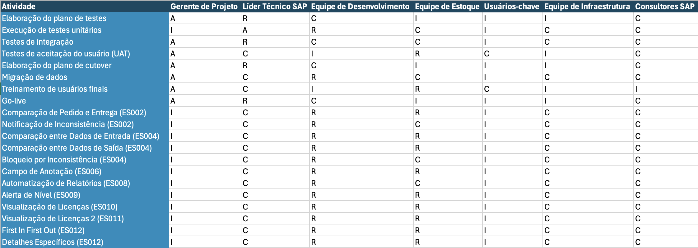
<sup>Fonte: Material produzido pelos autores (2024)</sup>
</div>

Onde:
- R (Responsável - Responsible): A pessoa ou equipe responsável pela execução da tarefa ou atividade. É quem faz o trabalho. Para cada tarefa, deve haver pelo menos um responsável.

- A (Aprovar - Accountable): A pessoa ou equipe responsável pela aprovação final e pelo resultado da tarefa. Essa pessoa tem a autoridade de aprovar ou rejeitar o que foi feito. Normalmente, há apenas um "A" por tarefa.

- C (Consultado - Consulted): São as pessoas que são consultadas durante a execução da tarefa. Elas têm conhecimento especializado ou informações relevantes e devem ser envolvidas no processo de tomada de decisão. A comunicação com os consultados é bidirecional, ou seja, eles fornecem feedback e orientação.

- I (Informado - Informed): São aqueles que devem ser informados sobre o progresso ou os resultados da tarefa. Eles não participam ativamente da execução, mas precisam ser mantidos atualizados. A comunicação aqui é unidirecional, ou seja, eles recebem informações, mas não tomam decisões.

Dessa forma, a matriz RACI acima está organizando as responsabilidades de diferentes equipes e funções dentro do projeto. Segue uma descrição geral com base nas principais responsabilidades descritas:

**Responsabilidades Distribuídas:**
   - **Gerente de Projeto** frequentemente aparece como responsável ou aprovado para aprovar atividades estratégicas, como "Go-live" e "Elaboração de plano de testes".
   - **Líder Técnico SAP** está muito envolvido na execução de atividades técnicas, como migração de dados e testes unitários.
   - **Equipe de Desenvolvimento** é a principal responsável por tarefas técnicas e de execução, como desenvolvimento e testes.
   - **Equipe de Estoque**: responsável por tarefas de desenvolvimento relacionadas à área de estoque e licenças.
   - **Usuários-chave**: são consultados em tarefas relacionadas às áreas funcionais e processos de negócio.
   - **Consultores SAP** aparecem consistentemente em atividades que exigem conhecimento especializado de SAP, sendo consultados em grande parte das atividades.

&emsp;&emsp;A matriz RACI feita pretende gerar uma divisão entre papéis estratégicos (Gerente de Projeto) e papéis técnicos e funcionais (Líder Técnico, Desenvolvimento, Estoque, etc.), garantindo que as responsabilidades estejam bem distribuídas e que haja consulta e informação para as partes envolvidas.

# <a name="2-fluxos"></a>2. Fluxos

## <a name="21-fluxosMacroprocessos"></a>2.1 Fluxos dos Macroprocessos da *G2 Tecnologia*

&emsp;&emsp;O **fluxo de macroprocessos** é uma visão de alto nível das principais atividades que ocorrem dentro de uma organização, agrupados em grandes blocos de operação. Em um projeto de ERP (Enterprise Resource Planning), esse fluxo mapeia como as áreas-chave da empresa (como finanças, compras, produção, vendas, logística e estoque) interagem e se conectam através de atividades integradas, alinhadas aos objetivos estratégicos do negócio.

&emsp;&emsp;No contexto de um **cutover de ERP** (momento de transição entre o sistema antigo e o novo ERP), o fluxo de macroprocessos é crucial porque permite a organização coordenar e estruturar essa mudança de maneira eficiente. Ele garante que todos os processos críticos da empresa estejam preparados para a migração, identificando pontos de dependência e áreas que precisam de atenção especial. 

&emsp;&emsp;Segue o fluxo dos macroprocessos criado pela Equipe de Estoque que mapeia as principais funcionalidades da empresa *G2 Tecnologia* desde a captação de um cliente até o momneto em que atuam somente como apoio contínuo para a empresa:

<div align="center">
<sub>Figura 1 - Planilha de Impostos G2 Tecnologia</sub>
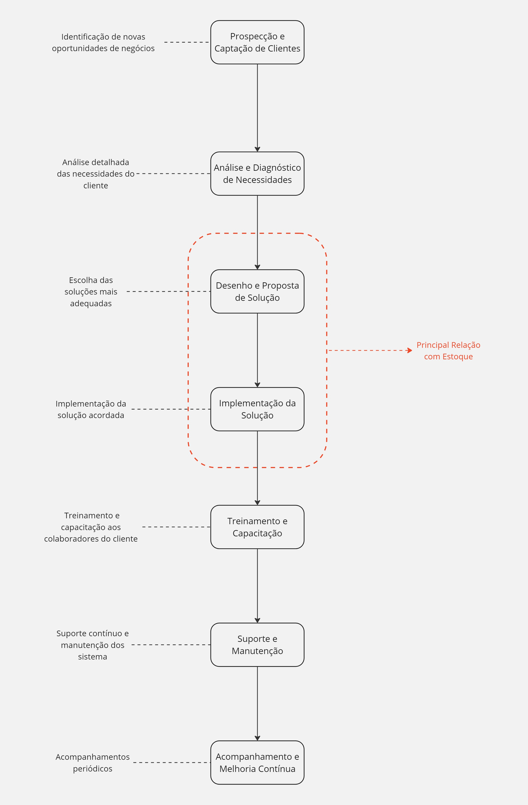
<sup>Fonte: Material produzido pelos autores (2024)</sup>
</div>

&emsp;&emsp;Em vermelho, estão destacados dois processos, pois o grupo entende que estes são os mais significativamente relacionados à área de estoque. A seguir, será detalhada essa relação. No entanto, é importante ressaltar que o estoque pode estar presente em todos os processos.

&emsp;&emsp;Desenho e Proposta de Solução: Aqui, se o cliente tem desafios relacionados ao estoque, a solução proposta geralmente envolve um sistema de gestão que otimize esse processo. O SAP Business One, oferecido pela G2, é amplamente utilizado para a gestão integrada de estoque, fornecendo recursos para rastrear, controlar e otimizar os níveis de inventário em tempo real.

&emsp;&emsp;Implementação da Solução: Durante a implementação, o módulo de gestão de estoque do SAP Business One é configurado. Esse processo inclui a integração de diferentes áreas da empresa (como vendas e compras) com o controle de estoque, permitindo visibilidade e gerenciamento mais eficientes.

## <a name="22-fluxosMacroprocessosEstoque"></a>2.2 Fluxos dos Macroprocessos da Área de Estoque

&emsp;&emsp;O diagrama que você abaixo descreve os macroprocessos de estoque de uma maneira visual, nela sintetiza-se as principais configurações realizadas ou testadas dentro do SAP Business One, essas mesma configurações são abordadas no decorrer dessa documentação, nas Configurações, Testes Unitários e Manual de Treinamento. Segue a imagem:

<div align="center">
<sub>Figura 2 - Macroprocessos de Estoque</sub>
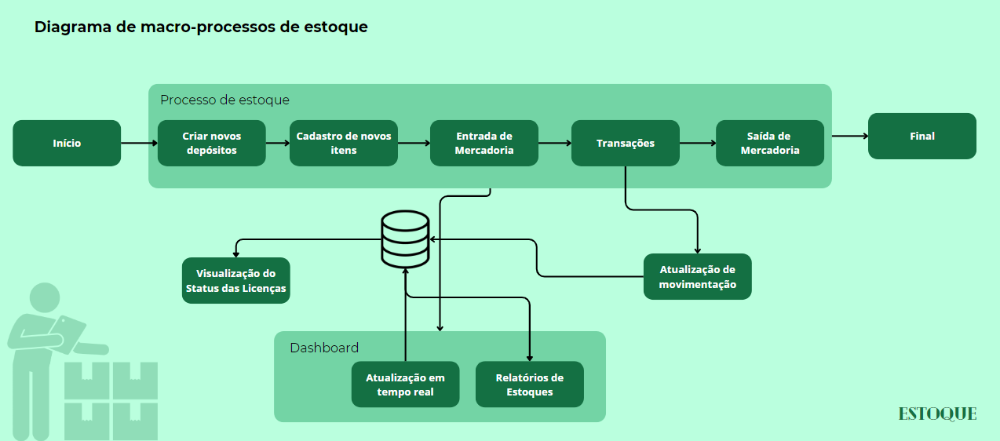
<sup>Fonte: Material produzido pelos autores (2024)</sup>
</div>

1. **Início**: O processo começa com a fase inicial, que é o ponto de partida para a organização do estoque.

2. **Criar novos depósitos**: Após o início, a primeira ação é criar novos depósitos, que são os locais onde os itens serão armazenados. Isso é essencial para organizar a logística do estoque.

3. **Cadastro de novos itens**: Com os depósitos definidos, o próximo passo é cadastrar os novos itens que entrarão no estoque. Esse processo envolve o registro de todas as informações relevantes sobre os produtos ou licenças.

4. **Entrada de Mercadoria**: Após o cadastro dos itens, ocorre a entrada de mercadoria, que representa o recebimento e o armazenamento de novos itens no estoque.

5. **Transações**: Uma vez que os itens estão no estoque, as transações relacionadas a esses itens, como vendas ou movimentações internas, são registradas. Isso inclui a parte financeira e o controle de fluxo de mercadorias.

6. **Saída de Mercadoria**: Após as transações, ocorre a saída de mercadoria, onde os itens são removidos do estoque para serem entregues ou utilizados.

7. **Final**: O processo então é concluído, levando ao ponto final após todas as etapas terem sido seguidas.

8. **Visualização do Status das Licenças**: Este macroprocesso acontece de forma paralela ao fluxo principal, permitindo que a equipe visualize o status das licenças SAP em qualquer momento, garantindo que estejam atualizadas e válidas.

9. **Dashboard**: O dashboard é uma configuração específica onde é posssível ao Gerenciador de Licenças (ver [Personas](https://github.com/Inteli-College/2024-2A-T10-SI07-G04/blob/main/document/docs.md#13-personas)) visualizar e monitorar as licenças que a empresa possui. Aqui, dois macroprocessos principais ocorrem:
    - **Atualização em tempo real**: Conforme os itens são cadastrados, entram no estoque, são transacionados e saem, todas as informações são atualizadas em tempo real, garantindo que o status atual do estoque seja sempre refletido com precisão.
    - **Relatórios de Estoques**: O sistema gera relatórios de estoque com base nos dados coletados, permitindo a visualização e análise das movimentações de itens e o status geral do estoque.

10. **Atualização de movimentação**: Todo o fluxo de entrada, transações e saída de mercadoria é refletido na atualização de movimentação, garantindo que cada ação seja registrada corretamente no banco de dados, mantendo o histórico e controle preciso das movimentações do estoque.

&emsp;&emsp;Dessa forma, o diagrama mostra um fluxo claro e organizado de processos de estoque, com um sistema centralizado (banco de dados) que se integra a várias ações, como transações, atualizações em tempo real, visualização de licenças e geração de relatórios, permitindo uma gestão eficiente e atualizada do estoque e das licenças.

# <a name="3-configurações"></a>3. Configurações

&emsp;&emsp; Para essa seção, será explanado como realizar as configurações necessárias para que sejam contempladas as funcionalidades requisitadas pelas regras de negócio definidas juntamente ao cliente(G2 Consultoria). Com isso, seguindo o passo a passo descrito abaixo, será possível realizar atividades como emitir alertas a cada entrada no estoque, gerar relatórios, cadastrar novos itens e  depósitos

## 3.1 Realizar entrada de mercadoria

&emsp;&emsp; Função primordial para a construção do estoque inicial da empresa. Diferentemente da entrada de mercadoria a partir de uma compra, essa função permite que um item seja registrado em depósito sem que tenha sido emitido uma nota fiscal. Por isso, deve ser utilizado em momento de implantação, isso pois os produtos já pertencentes a empresa precisarão ser cadastrados.

&emsp;&emsp; Para utilizar essa função deve-se seguir o caminho **Módulos** > **Estoque** > **Transações de estoque** > **Entrada de mercadoria**. Após isso, uma janela será aberta, nela será possível realizar a seleção do item a ser registrado em depósito, como mostrado nas imagens abaixo:

<div style="width: 100vw; display:flex; align-items:center; justify-content:center;">
   
</div>

<div style="width: 100vw; display:flex; align-items:center; justify-content:center;">
   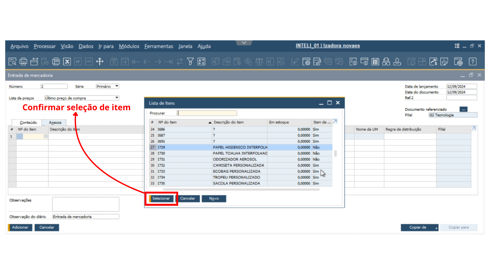
</div>

&emsp;&emsp; Contudo, considerando as configurações ditas previamente no Business Blueprint para esse projeto, está definido que custo do item sempre deve está atrelado ao produto que irá entrar no estoque, por isso, sempre deve-se inserir o custo do produto e a quantidade de produtos que irá entrar.

<div style="width: 100vw; display:flex; align-items:center; justify-content:center;">
   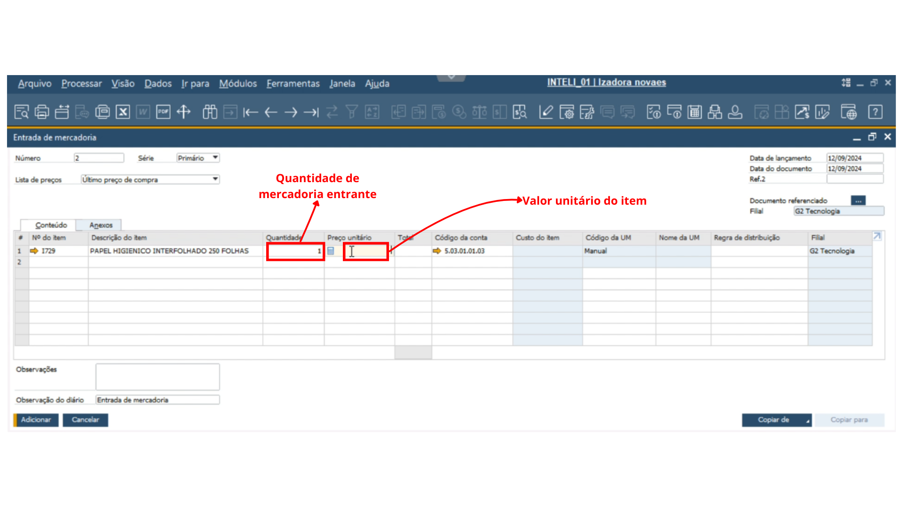
</div>

&emsp;&emsp; Após isso, basta selecionar a opção “Adcionar”, então o produto será adcionado ao estoque no sistema ERP. Com isso será possível realizar a entrada de qualquer produto em estoque


## 3.2 Saída de estoque

&emsp;&emsp; A saída de estoque é outra função que é essencial para o momento de implementação, isso pois ela não está atrelada a saída de produto para venda. Contudo, pode ser utilizada também para produtos de consumo, por exemplo, café, papel higiênico, etc. Os quais são utilizados no dia a dia da empresa e então terão de ser atualizados via função de saída do estoque no ERP.

&emsp;&emsp; O uso dessa ferramenta é possibilitada através do caminho **Módulos** > **Estoque** > **Transações de estoque** > **Saída de mercadoria**. Com isso, uma janela será aberta, possibilitando a seleção do item em estoque que deverá realizar a saída. o que será mostrado nas imagens abaixo. lembrando que o item selecionado para saída do estoque deve possuir alguma entrada no estoque, ou seja, sua quantia em estoque deve ser superior a 0.

<div style="width: 100vw; display:flex; align-items:center; justify-content:center;">
   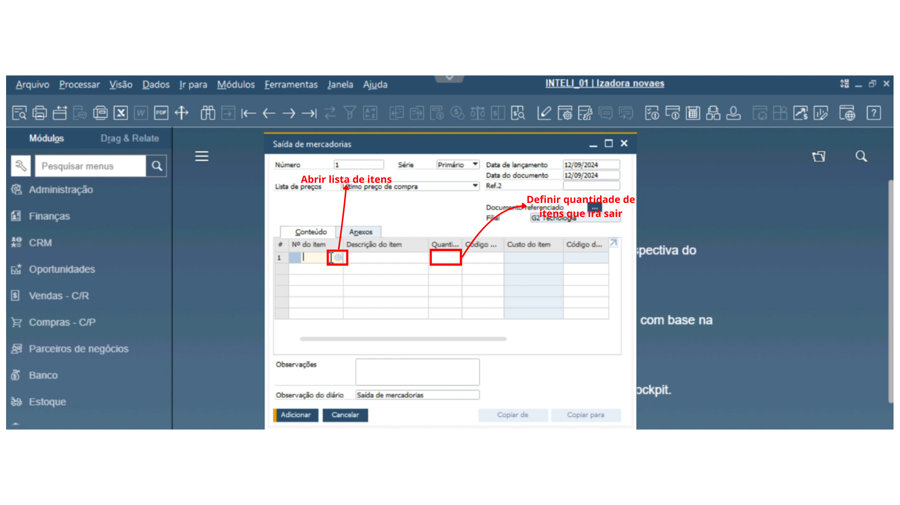
</div>

<div style="width: 100vw; display:flex; align-items:center; justify-content:center;">
   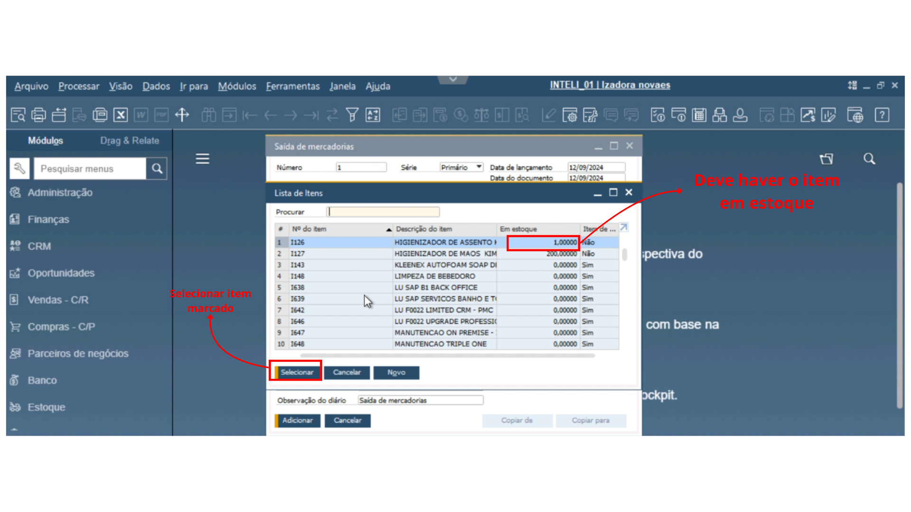
</div>

&emsp;&emsp; Após isso, basta selecionar a opção “Adcionar” e então a quantidade de produtos do item selecionado irá diminuir. Com isso é possível realizar a saída de estoque de qualquer produto que esteja em um depósito.

## 3.3 Transferência de estoque

&emsp;&emsp; Em alguns casos pode ser necessário transferir produtos de um depósito da empresa para outro. Para isso o SAP B1 possui uma função para transferência de produtos entre depósitos de uma mesma filial. 

&emsp;&emsp; Ao acessar o SAP,a utilização da funcionalidade de transferência é feita acessando **Módulos** > **Estoque** > **Transações de estoque** > **Transferência do estoque**. Lembrando que a transferência de estoque só é permitida para produtos cadastrados e que estejam em estoque, ou seja, com quantidade armazenada maior que 0. A demonstração da funcionalidade está na imagem abaixo.

<div style="width: 100vw; display:flex; align-items:center; justify-content:center;">
   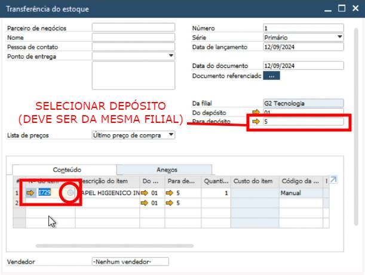
</div>

&emsp;&emsp;  Contudo, deve-se definir a filial do depósito como a mesma que o depósito de origem, isso pois a transferência de estoque só é possível entre estoques de uma mesma filial. Com isso, é necessário realizar a definição da filial do depósito de destino. Isso é possível seguindo os passos abaixo citados.

<div style="width: 100vw; display:flex; align-items:center; justify-content:center;">
   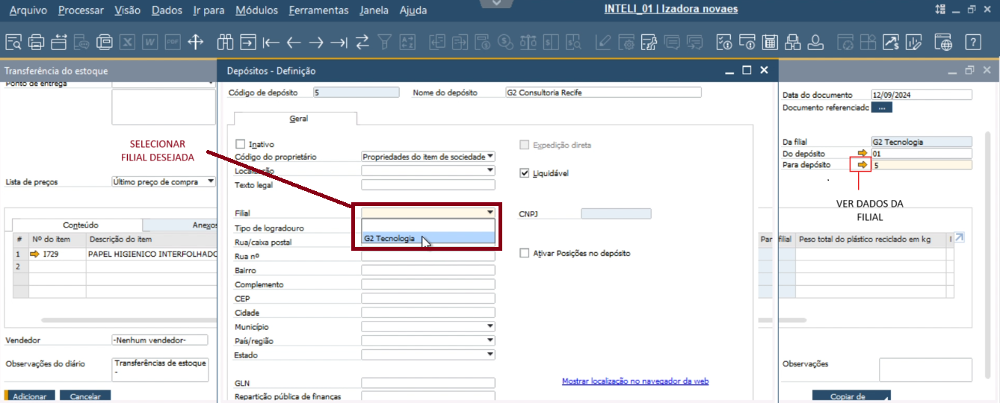
</div>

&emsp;&emsp; Após isso, basta aprovar a transferencia de estoque.

## 3.4 Relatórios de estoque

&emsp;&emsp; Os relatórios são ferramentas importantes para entendimento da situação de cada área. Com isso, diversos desses podem ser gerados para analisar a performance do estoque, para isso deve-se seguir o caminho **Módulos** > **Estoque** > **Relatórios de estoque**. Um relatório de suma importância para entendimento da situação atual do estoque é o de **Status do Estoque** que poderá ser visualizado abaixo ao selecionar a opção referente ao mesmo.

<div style="width: 100vw; display:flex; align-items:center; justify-content:center;">
   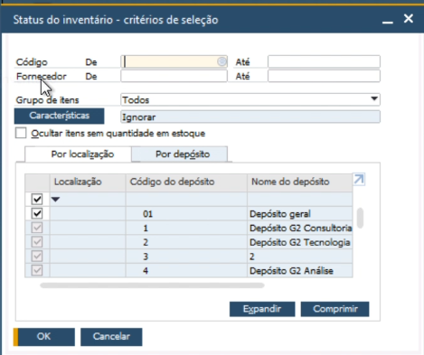
</div>

<div style="width: 100vw; display:flex; align-items:center; justify-content:center;">
   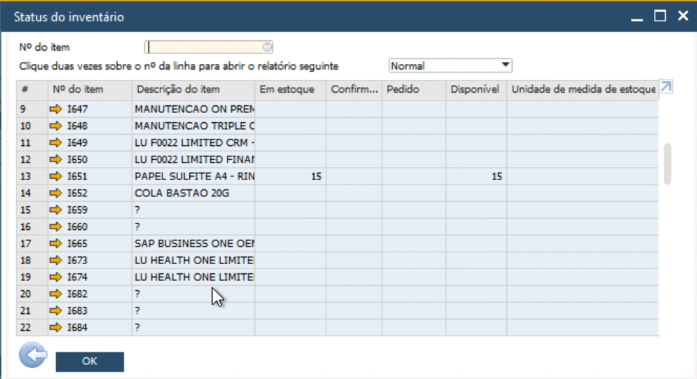
</div>

&emsp;&emsp; Com isso, é possível gerar quaisquer relatórios listados ou então personalizados. Através destes se torna plausível gerar insights baseados em dados reais da empresa

## 3.5 Acompanhamento em tempo real (Dashboards):

&emsp;&emsp; Ainda não implementados pois ainda haverá um aula referente ao tema.

## 3.6 Notificação para Gestor por movimentação no estoque(Relatório diário):

&emsp;&emsp; Para gerar relatórios personalizados é necessário criar consultas também personalizadas. Para isso, iremos na aba **Ferramentas** > **Consultas** >  **Gerador de Consultas**. Para fim de alcançar o objetivo da regra associada a essa funcionalidade, o comando sql a ser salvo será

```sql
	SELECT * FROM IGN1 WHERE  "DocDate" = CURRENT_DATE
```
&emsp;&emsp; Essa consulta retorna todas as movimentações realizada no dia presente, agora basta atrelar essa consulta a um alerta seguindo **Módulos** > **Administração** >  **Administração de alertas** e então na aba que abrir, deve ser selecionado ações, para então abrir "Criar novo alerta de usuário".

<div style="width: 100vw; display:flex; align-items:center; justify-content:center;">
   
</div>

&emsp;&emsp; Com isso, define-se um nome, prioridade e então a qual consulta irá este alerta estara atrelado.

<div style="width: 100vw; display:flex; align-items:center; justify-content:center;">
   
</div>

&emsp;&emsp; Isso será possível acessando a janela que abrir e então selecionar q consulta criada anteriormente

<div style="width: 100vw; display:flex; align-items:center; justify-content:center;">
   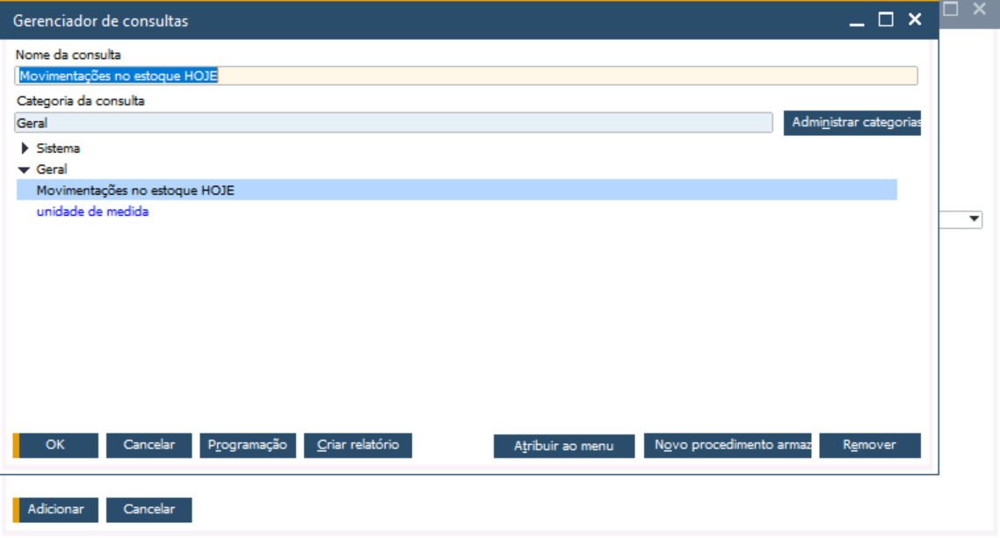
</div>

&emsp;&emsp; Com isso, uma consulta que retorna os dados referentes às movimentações de estoque que aconteceram no dia presente e envia internamente para a pessoa selecionada.

## 3.7 Cadastro de novos itens

&emsp;&emsp; Para que as funções ditas acima funcionem, é necessário cadastrar itens. Para isso basta seguir as etapas **Módulos** > **Estoque** > **Cadastro de item** e então definir informações como "Código interno", "Descrição"(Nome do item) e informações de venda, compra, estoque, entre outras.

<div style="width: 100vw; display:flex; align-items:center; justify-content:center;">
   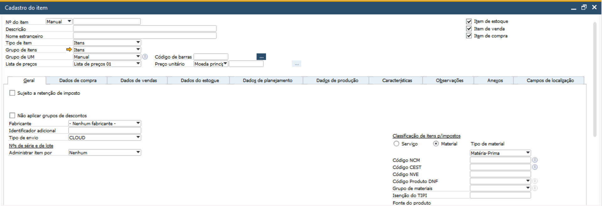
</div>

&emsp;&emsp;Com isso, será possível atrelar itens a entradas de estoque, alertas, relatórios, entre outros.


&emsp; Por fim, essas alterações foram necessárias que as funcionalidades definidas nas regras de negócio dessa implantação funcionassem. Com isso o projeto contemplará as necessidades expostas pela G2 Tecnologia, correspondendo às entrevistas e conversas com o cliente, as quais levaram às diversas funções definidas acima. 

# <a name="4-testes-unitários"></a>4. Testes Unitários

## <a name="41-objetivo-dos-testes"></a>4.1 Objetivo dos Testes
&emsp;&emsp;Os testes realizados nesta seção têm como objetivo validar o funcionamento das configurações implementadas no SAP Business One, conforme as Regras de Negócio estabelecidas para a área de estoque, validadas previamente com o cliente, *G2 Tecnologia*. A validação consiste em verificar se as funcionalidades traduzem corretamente as regras implementadas no sistema. Caso algum teste apresente um resultado insatisfatório, será realizada uma análise para ajustes ou reconfigurações. Funcionalidades com resultados positivos serão mantidas inalteradas.

## <a name="42-metodologia"></a>4.2 Metodologia
&emsp;&emsp;Os testes descritos foram conduzidos por três integrantes da Equipe de Estoque. Um deles atuou como o tester, responsável pela execução das funcionalidades; outro como documentador, documentando o processo de testagem e registrando o status de cada teste; e o terceiro integrante coordenou o processo, guiando o tester nas tarefas a serem realizadas e definindo a sequência dos testes.

## <a name="43-escopo-dos-testes"></a>4.3 Escopo dos Testes
&emsp;&emsp;Os testes foram realizados conforme o escopo definido na Tabela 2. Cada regra de negócio foi testada individualmente, incluindo tanto as funcionalidades nativas do SAP Business One quanto as adicionadas pela equipe. Os testes foram numerados e organizados em uma tabela, onde se encontram as regras, suas descrições, entradas e saídas esperadas, além dos resultados obtidos.

<div align="center">
<sub>Tabela 2 - Casos de Teste</sub>

| ID do Teste | Descrição | Pré-Condição | Entradas | Saídas Esperadas | Resultados | Status |
| --- | --- | --- | --- | --- | --- | --- |
| 001 | Após a entrada de mercadoria, visualização da movimentação do estoque com a UM definida. | Realizar o cadastro do item previamente | N° do item; Série; Quantidade; Preço unitário; Total; UM  | Visualização da entrada de mercadoria no estoque | Passou | Completo |
| 002 | Após a saída de mercadoria, visualização da movimentação do estoque com a UM definida. | Ter realizado ao menos uma entrada de mercadoria com a UM definida |  N° do item; Série; Quantidade | Visualização de uma movimentação de saída no estoque | Passou | Completo |
| 003 | Visualização do Lançamento Contábil | Realizar movimentações no estoque (entrada ou saída) para que possa ser feito o lançamento contábil destas | Transação (entrada ou saída) no estoque | Lançamento contábil realizado com sucesso | Não passou | Em revisão |
| 004 | Adição das Transações | Usuário existente no sistema | E-mail válido | E-mail de recuperação enviado | Passou | Completo |
| 005 | Visualização dos lançamentos em estoques gerados pelas movimentações | Usuário existente no sistema | E-mail válido | E-mail de recuperação enviado | Passou | Completo |
| 006 | O status das licenças são atualizados em tempo real | Existência de uma dashboard que consome dados de transações de estoque | Dados das transações de estoque (input automatizado) | Gráficos construídos com dados de transações do estoque | N/A | Aguardando para a realização |
| 007 | O sistema notifica caso exista movimentação | Usuário existente no sistema | Consulta de dados de transações de estoque realizada com sucesso | Geração de notificações sobre o estoque para os responsáveis | Não passou | Em revisão |
| 008 | O sistema permite que o gerente de licenças visualize, em tempo real, o status de todas as licenças disponíveis através de uma interface amigável. | Existência de uma dashboard que consome dados de transações de estoque  | Dados das transações de estoque (input automatizado) | Gráficos construídos com dados de transações de estoque | N/A | Aguardando para a realização |

<sup>Fonte: Material produzido pelos autores (2024)</sup>
</div>

&emsp;&emsp; Os testes "001", "002", "003", "004", "005" e "007" foram realizados conforme planejado. No entanto, os testes "006" e "008" não puderam ser executados durante a Sprint 3, pois dependem da conclusão da dashboard baseada em movimentações de estoque, que ainda está em desenvolvimento. A equipe aguarda um treinamento específico sobre a criação dessa dashboard.

## <a name="44-resultado-dos-testes"></a>4.4 Resultado dos Testes

&emsp;&emsp;Entre os testes executados, dois apresentaram falhas: o teste "003", relacionado à visualização do lançamento contábil, e o teste "007", sobre a geração de notificações de movimentação de estoque.

| ID do Teste | Descrição | Resultado Esperado | Resultado Obtido | Status | Link do Vídeo |
| --- | --- | --- | --- | --- | --- |
| 001 | Após a entrada de mercadoria, visualização da movimentação do estoque com a UM definida. | Visualização da entrada de mercadoria no estoque | Passou | Completo | [Clique aqui](https://drive.google.com/file/d/1QPr-949ZIqx6gSAj4NwBp_9M3NVLZWRV/view?usp=sharing) |
| 002 | Após a saída de mercadoria, visualização da movimentação do estoque com a UM definida. | Visualização de uma movimentação de saída no estoque | Passou | Completo | [Clique aqui](https://drive.google.com/file/d/1beVMpnus3noEfOpNKiSBW5a-6taKLZm6/view?usp=sharing) |
| 003 | Visualização do Lançamento Contábil | Lançamento contábil ser realizado com sucesso | Não passou | Em revisão | [Clique aqui](https://drive.google.com/file/d/1QPr-949ZIqx6gSAj4NwBp_9M3NVLZWRV/view?usp=sharing) |
| 004 | Adição das Transações | Conseguir realizar novas transações de estoque no SAP | Passou | Completo | [Clique aqui](https://drive.google.com/file/d/1QPr-949ZIqx6gSAj4NwBp_9M3NVLZWRV/view?usp=sharing) |
| 005 | Visualização dos lançamentos em estoques gerados pelas movimentações | Geração de relatórios que mostrem as movimentações de estoque | Passou | Completo | [Clique aqui](https://drive.google.com/file/d/1xNC2KAOLLVy9yfpxMnLLTg3G2_L47b0k/view?usp=drive_link) |
| 006 | O status das licenças são atualizados em tempo real | Gráficos construídos com dados de transações do estoque | N/A | Aguardando para a realização | N/A |
| 007 | O sistema notifica caso exista movimentação | Geração de notificações sobre o estoque para os responsáveis | Não passou | Em revisão | [Clique aqui](https://drive.google.com/file/d/1CaRc3cC6Vx-l805Tb3vNSRsGY_4nmlVt/view?usp=drive_link) |
| 008 | O sistema permite que o gerente de licenças visualize, em tempo real, o status de todas as licenças disponíveis através de uma interface amigável. | Gráficos construídos com dados de transações do estoque | N/A | Aguardando para a realização | N/A |

&emsp;&emsp;A Tabela 3, apresentada acima, contém os resultados detalhados dos testes realizados, incluindo links para os vídeos de execução dos testes. Nesse sentido, as imagens abaixo representam as conclusões dos testes que foram realizados e passaram com sucesso.

<div align="center">
<sub>Figura 3 - Conclusão do Teste 001 (parte 1)</sub>
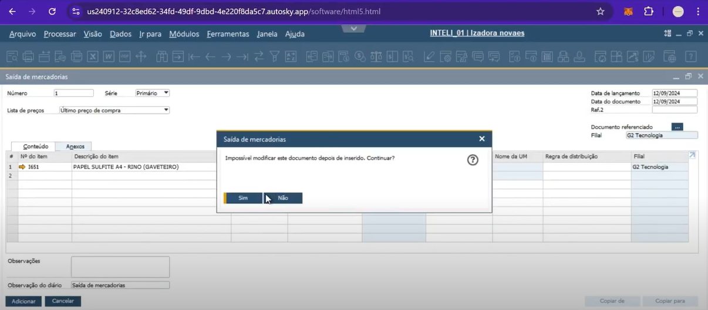
<sup>Fonte: Material produzido pelos autores (2024)</sup>
</div>

<div align="center">
<sub>Figura 4 - Conclusão do Teste 001 (parte 2)</sub>
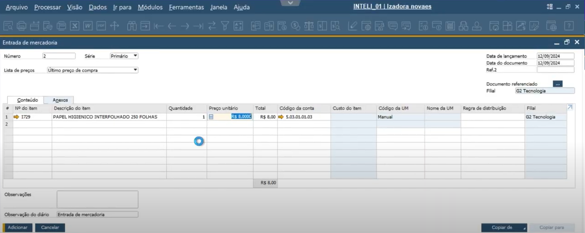
<sup>Fonte: Material produzido pelos autores (2024)</sup>
</div>

<div align="center">
<sub>Figura 5 - Conclusão do Teste 002 (parte 1)</sub>
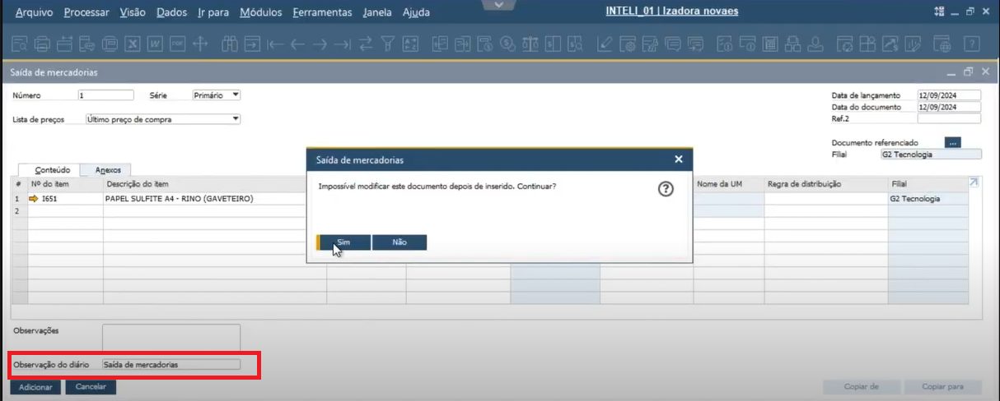
<sup>Fonte: Material produzido pelos autores (2024)</sup>
</div>

<div align="center">
<sub>Figura 6 - Conclusão do Teste 002 (parte 2)</sub>

<sup>Fonte: Material produzido pelos autores (2024)</sup>
</div>

&emsp;&emsp; Neste ponto faz-se interessante observar que as figuras 3 a 8 apresentam processos semelhantes - de entrada e saída de mercadorias. Estes, além de serem os testes de número 1 e 2, também representam o teste de número 4, dado que ointuito deste é realizar novas transações dentro do módulo de estoque, sendo as transações possíveis de entrada ou saída.

<div align="center">
<sub>Figura 7 - Conclusão do Teste 004 (parte 1)</sub>

<sup>Fonte: Material produzido pelos autores (2024)</sup>
</div>

<div align="center">
<sub>Figura 8 - Conclusão do Teste 004 (parte 2)</sub>

<sup>Fonte: Material produzido pelos autores (2024)</sup>
</div>

<div align="center">
<sub>Figura 9 - Conclusão do Teste 005</sub>
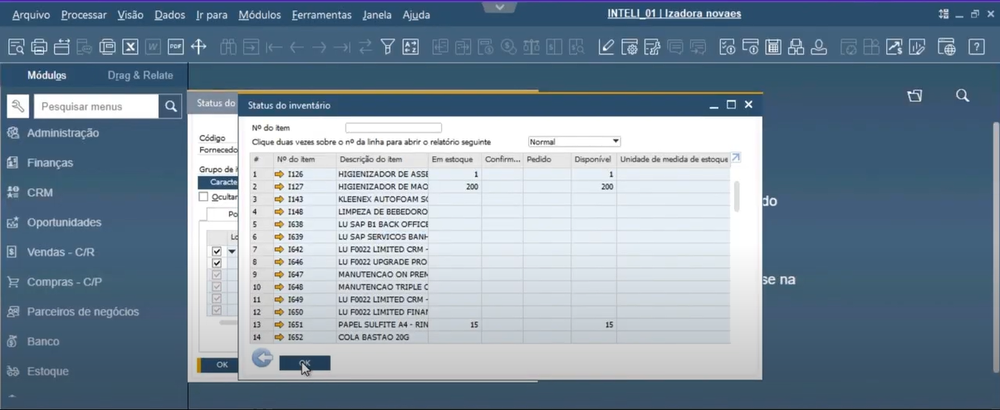
<sup>Fonte: Material produzido pelos autores (2024)</sup>
</div>


&emsp;&emsp; Abaixo, a fim de esclarecimento, segue uma análise dos testes que não passaram:

### Teste 003: Visualização do Lançamento Contábil
&emsp;&emsp;Este teste falhou porque o sistema não consegue realizar o lançamento contábil das transações de estoque. Ao tentar executar a operação, um erro é gerado, impedindo a conclusão. A equipe está investigando a causa do problema para aplicar as correções necessárias. O status atual é "Em revisão".

<div align="center">
<sub>Figura 10 - Erro do Teste 003</sub>
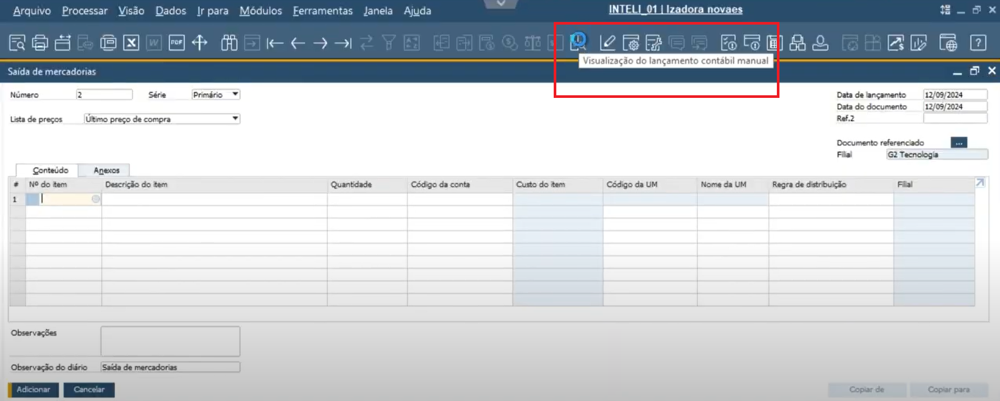
<sup>Fonte: Material produzido pelos autores (2024)</sup>
</div>

### Teste 007: Notificação de Movimentação no Estoque
&emsp;&emsp;O teste falhou na geração de notificações sobre movimentações no estoque, embora a consulta ao banco de dados da SAP, que armazena as transações, tenha sido realizada com sucesso. A equipe está buscando identificar o motivo pelo qual as notificações não estão sendo geradas corretamente. A consultora Valquíria, da G2 Tecnologia, está auxiliando a equipe na solução deste problema. Dado que não a houve a notificação no sistema, não se faz possível apresentar prints do erro.


### <a name="45-conclusão"></a>4.5 Conclusão

&emsp;&emsp;Os testes unitários desempenharam um papel muito importante  na validação das funcionalidades configuradas no SAP Business One. A maioria dos testes obteve sucesso, o que indica que as funcionalidades implementadas e nativas estão em conformidade com as regras de negócio estabelecidas. No entanto, as falhas observadas nos testes "003" e "007" destacam a necessidade de ajustes adicionais, tanto no lançamento contábil quanto na geração de notificações de movimentações no estoque. Com o apoio do parceiro de projeto G2 Tecnologia e o aprofundamento no entendimento das falhas, a equipe está comprometida em solucionar os problemas detectados e garantir a correta operação do sistema.


## <a name="5-manual-de-treinamento"></a>5. Manual de Treinamento

&emsp;&emsp;Este manual foi elaborado para fornecer orientações práticas sobre o uso do sistema SAP Business One (SAP B1), com foco na utilização eficiente de suas funcionalidades. Ele está dividido em duas seções principais: uma dedicada às configurações gerais do SAP B1 e outra focada nas funcionalidades específicas da área de Estoque.

Na primeira parte, intitulada ["Como usar SAP"](#51-como-usar-sap), você encontrará uma visão geral das configurações essenciais e do funcionamento básico do sistema, projetada para garantir uma experiência de navegação fluida e eficiente. Essa seção oferece um guia passo a passo para as principais configurações que podem ser aplicadas a diversas áreas funcionais dentro do SAP.

&emsp;&emsp;A segunda parte, ["Como usar as funcionalidades de estoque"](#52-como-usar-as-funcionalidades-de-estoque), explora de forma específica as operações relacionadas à gestão de estoque. Aqui, você aprenderá como configurar e utilizar funcionalidades específicas, garantindo um controle mais preciso e eficiente dos itens armazenados, movimentações e níveis de inventário.

&emsp;&emsp;Nosso objetivo é assegurar que você tenha as informações necessárias para utilizar o SAP B1 de forma eficaz, independentemente de sua função dentro da empresa. Com isso, esperamos que este manual contribua para uma melhor gestão dos recursos e processos, otimizando as operações diárias.

### <a name="51-como-usar-sap"></a>5.1 Como usar SAP

&emsp;&emsp;Nesta subseção, será abordado os principais elementos e funcionalidades do SAP Business One, oferecendo uma visão geral sobre a navegação no sistema. Você aprenderá a utilizar a **Página Inicial**, explorando a **barra do menu**, onde se encontram as ferramentas essenciais para a operação diária. Em seguida, serão explicadas as **Principais Funcionalidades**, destacando as áreas mais utilizadas no sistema, e, por fim, as **Funções Gerais**, que incluem as operações básicas e configurações que suportam as atividades de diferentes setores.

#### <a name="511-Página-inicial-barra-do-menu"></a>5.1.1 Página inicial - barra do menu

&emsp;&emsp;A navegação eficiente no SAP Business One é crucial para maximizar a produtividade e eficácia no uso do software. A interface do usuário é projetada para facilitar o acesso a diversas funcionalidades essenciais com rapidez e eficiência. Compreender a barra de menu superior e suas funções pode significativamente melhorar a gestão diária das operações comerciais, financeiras e de recursos humanos. Este guia explora as opções disponíveis na barra de menu, proporcionando uma visão clara de como cada uma pode ser utilizada para otimizar seu fluxo de trabalho. Os respectivos números mencionados abaixo de cada item da lista estão diretamente relacionados com a imagem fornecida, facilitando a localização e compreensão de cada funcionalidade.

<div align="center">
<sub>Figura 2 - Barra Menu</sub>
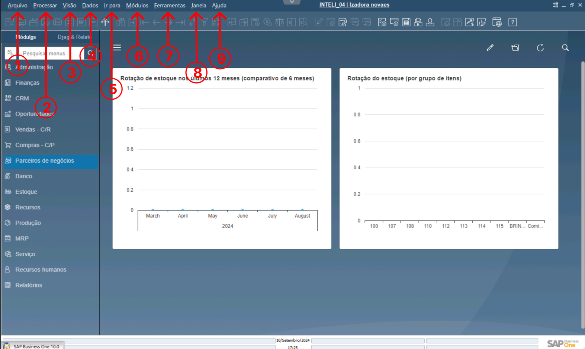
<sup>Fonte: Material produzido pelos autores (2024)</sup>
</div>

<div align="center">
<sub>Figura 2 - Barra Menu</sub>

<sup>Fonte: Material produzido pelos autores (2024)</sup>
</div>


1. Arquivo
   - Uso Comum: Este menu é tipicamente utilizado para operações de gerenciamento de arquivo, como salvar o trabalho atual, abrir documentos existentes, exportar dados para diferentes formatos para uso externo, ou fechar documentos abertos.

2. Processar
   - Uso Comum: Utilizado para processar transações comerciais específicas, como a postagem de documentos financeiros, alteração de status de pedidos, ou execução de tarefas em lote que afetam dados financeiros ou operacionais.

3. Visão
   - Uso Comum: Usado para personalizar a interface do usuário no SAP, como alterar a disposição das telas, esconder ou mostrar painéis, e ajustar configurações de visualização para atender às preferências pessoais ou necessidades específicas do trabalho.

4. Dados
   - Uso Comum: Permite aos usuários gerenciar os dados dentro do sistema, incluindo importação de dados de fontes externas, exportação de dados para análise ou uso fora do SAP, e manipulação de dados em massa para atualizações ou limpezas.

5. Ir para
   - Uso Comum: Oferece uma maneira rápida de navegar entre diferentes seções ou módulos do SAP, permitindo aos usuários saltar rapidamente para funções frequentemente usadas sem navegar pelos menus tradicionais.

6. Módulos
   - Uso Comum: Dá acesso direto aos vários módulos e funcionalidades do SAP, facilitando o acesso rápido a funções específicas do módulo, como Finanças, CRM, Vendas, e Compras, organizadas de forma intuitiva.

7. Ferramentas
   - Uso Comum: Contém uma variedade de utilitários e ferramentas para configuração e personalização do sistema, bem como acessos a funções de diagnóstico e ajustes que são essenciais para a manutenção e otimização do uso do SAP.

8. Janela
   - Uso Comum: Utilizado para gerenciar as janelas abertas dentro do sistema, ajudando a organizar e alternar entre diferentes documentos ou telas abertas, facilitando o gerenciamento de múltiplas tarefas.

9. Ajuda
   - Uso Comum: Fornece acesso a recursos de suporte e aprendizado, como a documentação do sistema, tutoriais, dicas de uso, e soluções para problemas comuns, ajudando os usuários a entenderem melhor as funcionalidades do SAP e a resolverem problemas operacionais.

Dominar a barra de menu no SAP Business One é fundamental para qualquer usuário que deseja aproveitar ao máximo o sistema. Cada opção do menu é projetada para oferecer acesso rápido e direto a funções específicas, facilitando a execução de tarefas rotineiras e a gestão de dados complexos. Ao familiarizar-se com essas funcionalidades, os usuários podem melhorar significativamente a eficiência operacional, adaptar o sistema às suas necessidades específicas e garantir que os processos de negócio sejam conduzidos de maneira suave e eficiente. A exploração dessas ferramentas é um passo importante para qualquer profissional que busca excelência no uso do SAP Business One.

#### <a name="512-Principais-funcionalidades"></a>5.1.2 Principais funcionalidades

O SAP Business One é uma ferramenta integrada crucial para a gestão eficiente de diversas áreas de um negócio. Este guia detalhado oferece um passo a passo para realizar tarefas essenciais em várias funções-chave do sistema, abrangendo RH, vendas, compras, gestão de estoque e operações financeiras. Com instruções claras e imagens ilustrativas para cada etapa, este manual é projetado para ajudar qualquer usuário a entender rapidamente como as funcionalidades do SAP Business One funcionam e como elas podem ser aplicadas para melhorar a eficiência operacional e a gestão de processos diários. Ideal para novos usuários ou para aqueles que estão buscando aprimorar seus conhecimentos, este guia é uma ferramenta valiosa para maximizar o potencial do software.

1. **Ação:** Realizar um lançamento contábil manual.

**Caminho:** Módulos > Finanças > Lançamento Contábil Manual

**Descrição da Ação:** Nesta ação, você insere manualmente uma transação financeira, preenchendo campos como a data de lançamento, contas de débito e crédito, e valores correspondentes. Essa funcionalidade é usada para ajustes e correções contábeis que não são registrados automaticamente pelo sistema.

<div align="center">
<sub>Figura 2 - Lançamento Contábil Manual</sub>
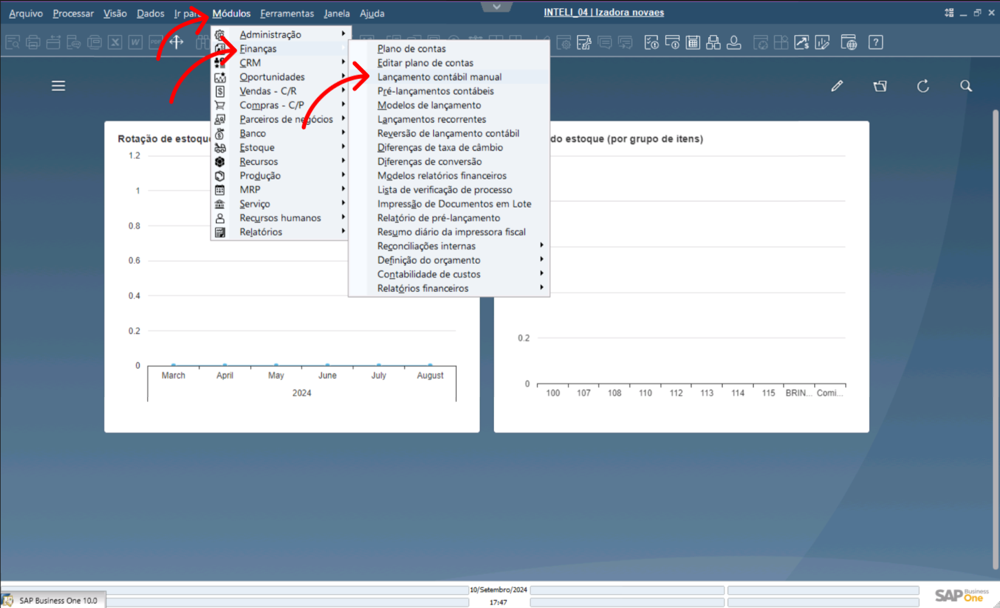
<sup>Fonte: Material produzido pelos autores (2024)</sup>
</div>

<div align="center">
<sub>Figura 3 - Lançamento Contábil Manual</sub>
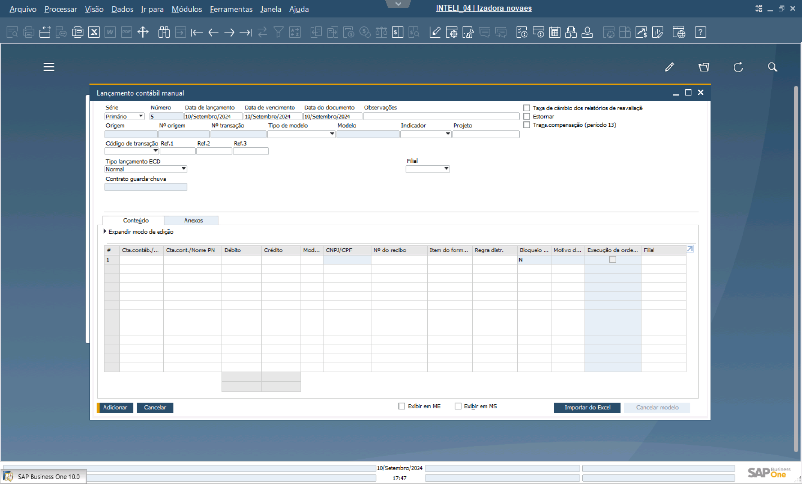
<sup>Fonte: Material produzido pelos autores (2024)</sup>
</div>

2.**Ação:** Criar um Pedido de Venda.

**Caminho:** Módulos > Vendas - C/R > Pedido de Venda

**Descrição da Ação:** Nesta tela, você preenche os detalhes necessários para criar um pedido de venda. Os campos incluem informações do cliente, detalhes do contato, data de lançamento, data de entrega, além dos itens vendidos com suas quantidades e preços. Esta função é crucial para gerenciar o processo de vendas, permitindo o acompanhamento detalhado de cada pedido desde a criação até a entrega e faturamento subsequente. A tela também oferece guias para detalhamento adicional, como logística, contabilidade e impostos, garantindo que todas as informações necessárias sejam capturadas de forma integrada e eficiente. 

<div align="center">
<sub>Figura 2 - Pedido de Venda</sub>
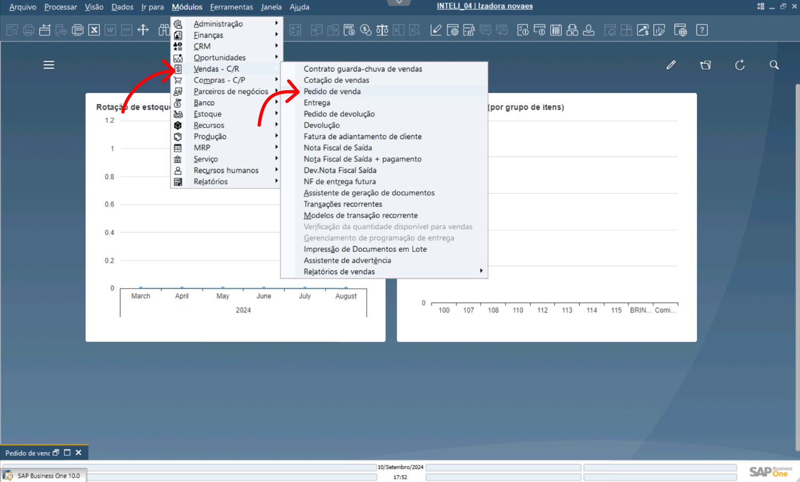
<sup>Fonte: Material produzido pelos autores (2024)</sup>
</div>

<div align="center">
<sub>Figura 3 - Pedido de Venda</sub>

<sup>Fonte: Material produzido pelos autores (2024)</sup>
</div>

3.**Ação:** Criar um Pedido de Compra.

**Caminho:** Módulos > Compras - C/P > Pedido de Compra

**Descrição da Ação:** Nesta tela, você insere detalhes necessários para formalizar a compra de produtos ou serviços. Os campos incluem informações sobre o fornecedor, data de lançamento e entrega, além dos itens específicos com quantidades e preços. Esta função é crucial para controlar e gerenciar eficientemente as compras, garantindo que todos os itens adquiridos sejam recebidos nas condições e prazos acordados, além de facilitar o processo subsequente de recebimento e pagamento.

<div align="center">
<sub>Figura 2 - Pedido de Compra</sub>

<sup>Fonte: Material produzido pelos autores (2024)</sup>
</div>

<div align="center">
<sub>Figura 2 - Pedido de Compra</sub>
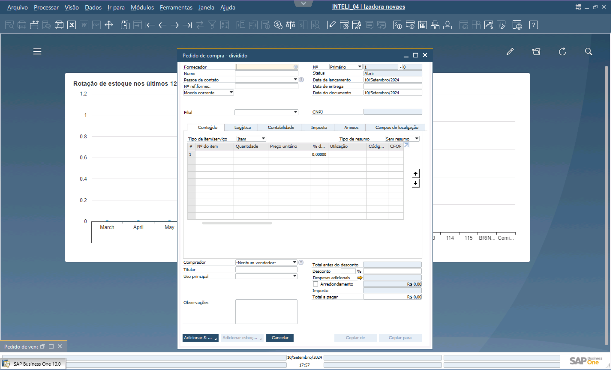
<sup>Fonte: Material produzido pelos autores (2024)</sup>
</div>

4.**Ação:** Registrar a entrada de mercadorias.

**Caminho:** Módulos > Estoque > Transações de estoque > Entrada de Mercadorias

**Descrição da Ação:** Esta tela é usada para documentar a recepção de produtos no estoque. Você pode inserir informações sobre o número de itens recebidos, a data de recebimento, e detalhes dos produtos como número do item, descrição, quantidade, e preço unitário. Isso é essencial para manter a precisão dos registros de estoque e é fundamental para o controle de inventário e planejamento de compras futuras. A função também permite vincular a entrada de mercadorias a documentos referenciados, como pedidos de compra, garantindo rastreabilidade e conformidade no processo de aquisição.

<div align="center">
<sub>Figura 2 - Entrada de Mercadorias</sub>
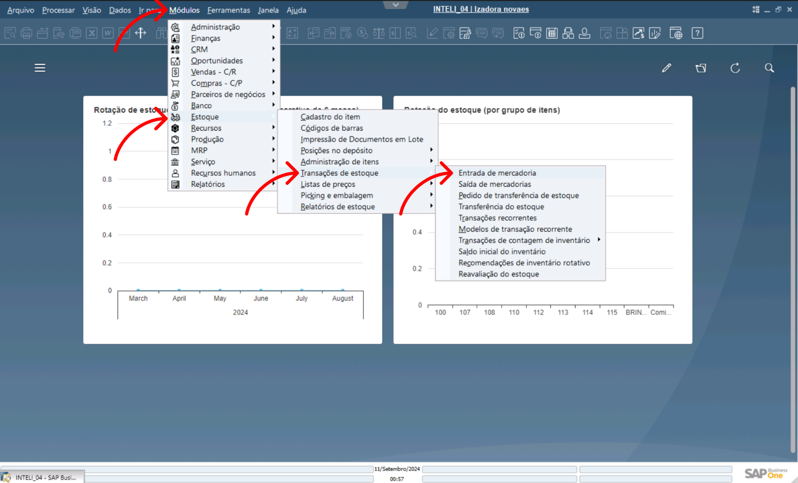
<sup>Fonte: Material produzido pelos autores (2024)</sup>
</div>

<div align="center">
<sub>Figura 2 - Entrada de Mercadorias</sub>
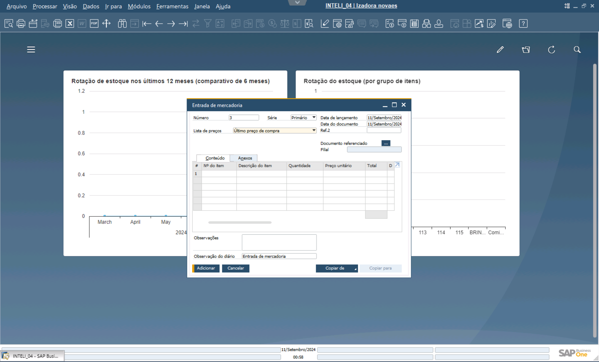
<sup>Fonte: Material produzido pelos autores (2024)</sup>
</div>

5.**Ação:** Registrar Atividades com o Cliente.

**Caminho:** Módulos > CRM > Atividade

**Descrição da Ação:** O registro de atividades com clientes permite documentar todas as interações, como chamadas telefônicas, reuniões, e-mails e outras comunicações. Esta função é essencial para manter um histórico detalhado das interações com cada cliente, o que é vital para personalizar o serviço, resolver problemas de forma eficaz e identificar oportunidades de vendas futuras.

<div align="center">
<sub>Figura 2 - Atividade</sub>
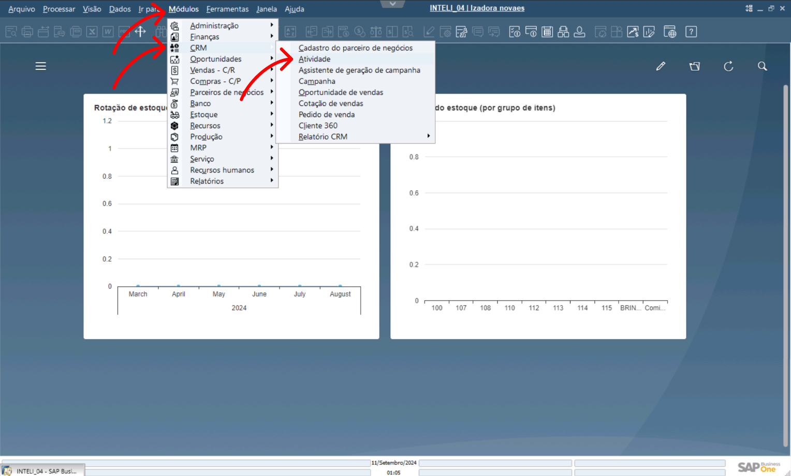
<sup>Fonte: Material produzido pelos autores (2024)</sup>
</div>

<div align="center">
<sub>Figura 2 - Atividade</sub>
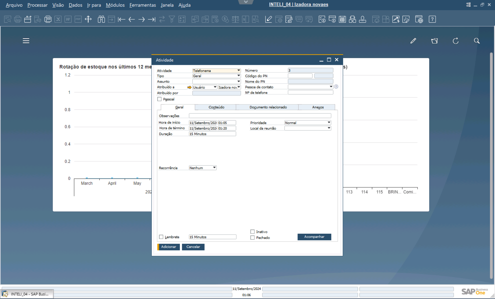
<sup>Fonte: Material produzido pelos autores (2024)</sup>
</div>

6.**Ação:** Cadastrar Novo Colaborador.
**Caminho:** Módulos > Recursos Humanos > Cadastrar Novo Colaborador
**Descrição da Ação:** O cadastro de um novo colaborador envolve inserir informações detalhadas sobre o empregado, como dados pessoais, informações de contato, histórico de emprego, qualificações educacionais, detalhes de remuneração, e outros dados relevantes. Esta ação é essencial para criar um registro completo que será usado para todas as futuras gestões relacionadas ao empregado, desde a folha de pagamento até o desenvolvimento profissional.


<div align="center">
<sub>Figura 2 -  Cadastrar Novo Colaborador</sub>
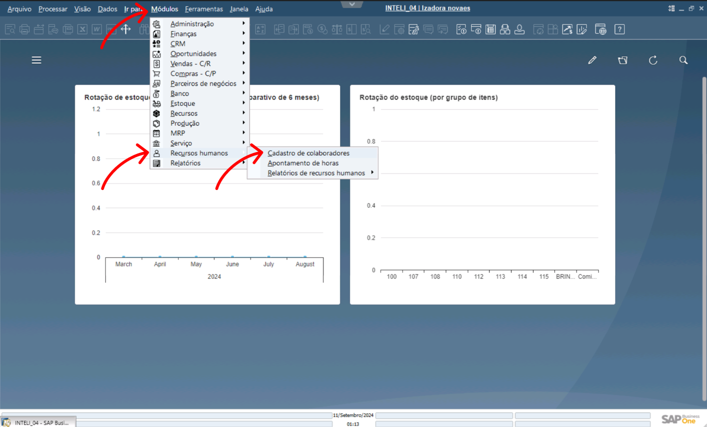
<sup>Fonte: Material produzido pelos autores (2024)</sup>
</div>

<div align="center">
<sub>Figura 2 -  Cadastrar Novo Colaborador</sub>
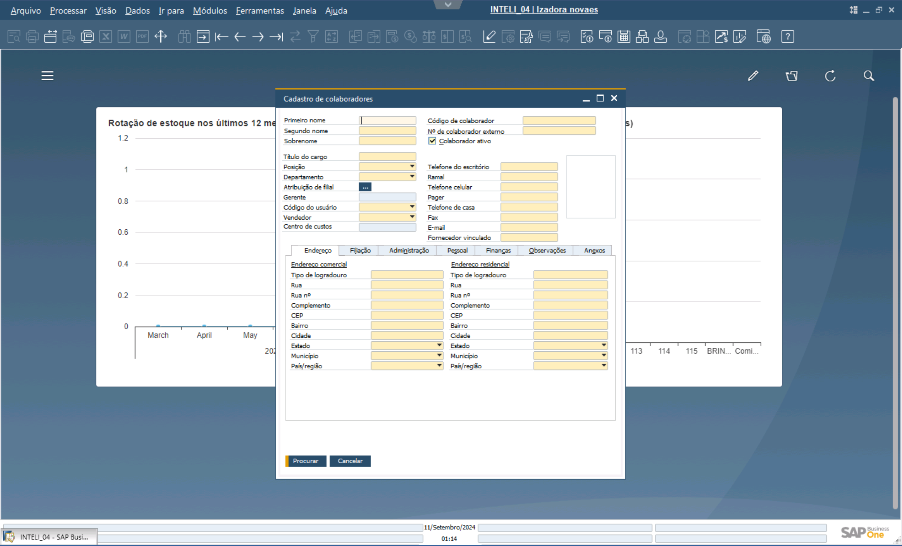
<sup>Fonte: Material produzido pelos autores (2024)</sup>
</div>

&emsp;&emsp;Este guia é uma fonte abrangente de informações sobre as funcionalidades essenciais do SAP Business One, facilitando uma compreensão profunda das capacidades do sistema e como elas podem ser utilizadas para impulsionar a eficiência e eficácia nas operações diárias de um negócio. As instruções detalhadas e os exemplos práticos garantem que os usuários possam implementar as tarefas com precisão e confiança. Ao seguir este manual, espera-se que os usuários não apenas melhorem suas habilidades práticas, mas também ganhem uma apreciação mais profunda de como o SAP Business One pode ser estrategicamente utilizado para o sucesso empresarial.

#### <a name="513-Funções-Gerais"></a>5.1.3 Funções Gerais

&emsp;&emsp;A seção de Funções Gerais no SAP Business One é o ponto de partida para o acesso eficiente às ferramentas e ajustes mais utilizados. Esta área centraliza recursos críticos, facilitando a execução de tarefas comuns e o ajuste de configurações pessoais, tudo a partir de um local acessível. Ideal para novos usuários e profissionais experientes, as Funções Gerais simplificam a navegação e aumentam a produtividade ao colocar as ferramentas necessárias ao alcance imediato.

<div align="center">
<sub>Figura 2 -  Funções Gerais</sub>
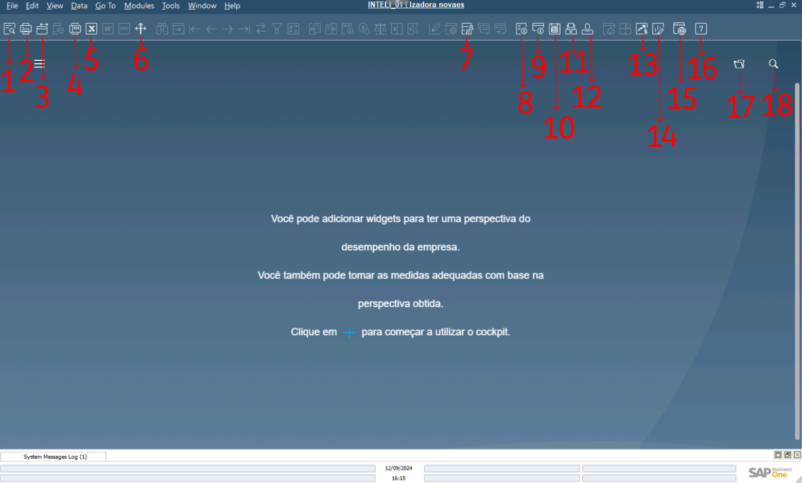
<sup>Fonte: Material produzido pelos autores (2024)</sup>
</div>

1. Preview - Permite visualizar documentos ou relatórios antes de finalizá-los.

2. Print - Imprime o documento ou relatório atualmente aberto.

3. SAP Business One Mailer - Envia emails diretamente do SAP, integrando comunicações com processos internos.

4. Fax - Envio de documentos via fax diretamente do sistema.

5. MS-EXCEL - Exporta dados para uma planilha do Excel para análise ou relatório adicional.

6. Launch Application - Permite abrir aplicações externas ou personalizadas integradas ao SAP.

7. Query Manager - Acessa e gerencia consultas personalizadas para análise de dados.

8. Work Messages Overview - Exibe uma visão geral das mensagens de trabalho e tarefas.

9. Messages/Alerts Overview - Mostra alertas e mensagens automatizadas baseadas em eventos específicos no sistema.

10. Calendar - Acessa o calendário para gerenciar compromissos e eventos relacionados ao trabalho.

11. Default Branch Selection - Seleciona o ramo ou departamento padrão para operações dentro do sistema.

12. My Personal Settings - Permite personalizar configurações e preferências do usuário no SAP.

13. Cash Flow Forecast - Fornece uma previsão do fluxo de caixa baseada em dados financeiros existentes.

14. Pervasive Analytics - Acessa ferramentas de análise avançada para insights de dados em tempo real.

15. Web Client - Permite acesso ao SAP Business One através de um navegador web.

16. Context Help - Fornece ajuda contextual e guias dentro do aplicativo para funcionalidades específicas.

17. Selecionar modelo - Escolhe modelos pré-definidos para documentos ou relatórios.

18. Realizar pesquisa - Busca rápida de informações ou dados dentro do sistema.

&emsp;&emsp;A familiarização com as Funções Gerais do SAP Business One é um investimento que rende retornos diários, melhorando a eficiência e a eficácia com que você e sua equipe gerenciam as operações do dia a dia. Com essas ferramentas facilmente acessíveis, você pode rapidamente adaptar o sistema às suas necessidades, assegurando que todas as funções do negócio sejam executadas sem interrupções e que as informações importantes estejam sempre ao seu alcance, facilitando decisões mais rápidas e informadas.

### <a name="52-como-usar-as-funcionalidades-de-estoque"></a>5.2 Como usar as funcionalidades de estoque

&emsp;&emsp;Nesta seção, vamos explorar as funcionalidades principais do módulo de Estoque no SAP Business One, com foco em como gerenciar eficientemente o inventário e as movimentações de produtos dentro da sua empresa. 

&emsp;&emsp;Além disso, apresentaremos o conceito de **"caminho feliz"**, que refere-se ao fluxo ideal de operação, onde todas as etapas são realizadas conforme esperado, sem erros ou exceções. Este caminho otimiza a execução das tarefas, garantindo um processo eficiente e sem interrupções.

&emsp;&emsp;Para cada funcionalidade, será explicado o **caminho feliz**, detalhando as ações e decisões necessárias para garantir o sucesso da operação, bem como os pontos críticos que merecem atenção. Nosso objetivo é garantir que você saiba n **o que** fazer e **como** fazê-lo de forma a maximizar a eficiência e precisão no gerenciamento de estoque.

**5.3.1 Entrada de Mercadoria**

&emsp;&emsp;Corresponde aos testes 001. A funcionalidade de Entrada de Mercadoria no SAP B1 é utilizada para registrar o recebimento de itens no estoque. Isso é feito após a chegada de produtos ou materiais, permitindo o controle e acompanhamento dos níveis de inventário.

<div align="center">
<sub>Figura x - Fluxograma da Entrada de Mercadoria</sub> 
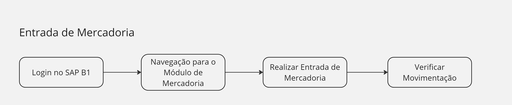 
<sup>Fonte: Material produzido pelos autores (2024)</sup>
</div>

**Descrição do caminho feliz:**  
O caminho feliz para a **Entrada de Mercadoria** envolve os seguintes passos:  
1. **Login no SAP B1.**
2. **Navegação para o Módulo de Estoque** através da barra de menu.
3. **Acessar a funcionalidade de "Entrada de Mercadoria".**
4. **Realizar a entrada de mercadoria**, preenchendo as informações necessárias.
5. **Verificar a movimentação no estoque** para garantir que a entrada foi registrada corretamente.

**Caminho para acessar a configuração:**  
&emsp;&emsp;Para acessar a funcionalidade de **Entrada de Mercadoria**, siga o seguinte caminho:
- Módulos > Estoque > Transações de estoque > Entrada de mercadoria.

<div align="center">
<sub>Figura x -  Caminho para Entrada de Mercadoria</sub>
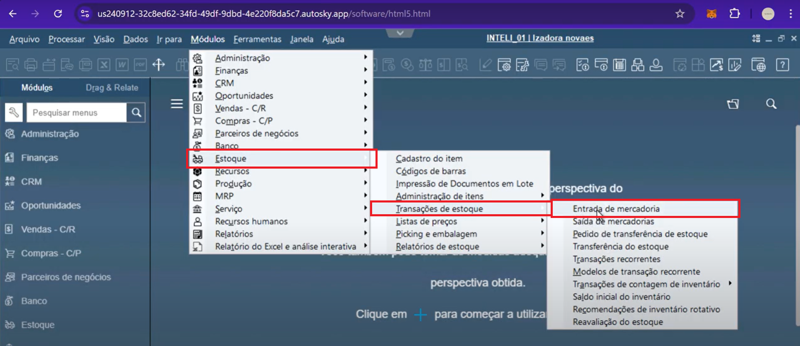
<sup>Fonte: Material produzido pelos autores (2024)</sup>
</div>

**Informação dos campos que devem ser preenchidos:**
- **N° do item:** Código do item que será inserido no estoque.
- **Série:** Número de série do item, se aplicável.
- **Quantidade:** Quantidade de itens recebidos.
- **Preço unitário:** Preço por unidade do item.
- **Total:** Valor total referente à quantidade de itens e seu preço unitário.
- **UM (Unidade de Medida):** Unidade de medida definida para o item no cadastro.


&emsp;&emsp;Pretende-se obter então a **visualização da entrada de mercadoria no estoque** com os detalhes da movimentação e a unidade de medida (UM) correspondente.

**5.3.2 Saída de Mercadoria**

&emsp;&emsp;Corresponde aos testes 002. A funcionalidade de **Saída de Mercadoria** no SAP B1 é utilizada para registrar a remoção de itens do estoque, seja por venda, transferência ou outra razão de saída de produtos ou materiais. Isso permite o controle e acompanhamento preciso dos níveis de inventário.

<div align="center">
<sub>Figura x - Fluxograma da Saída de Mercadoria</sub> 
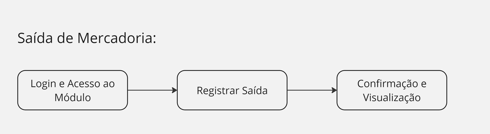 
<sup>Fonte: Material produzido pelos autores (2024)</sup>
</div>

**Descrição do caminho feliz:**  
&emsp;&emsp;O caminho feliz para a **Saída de Mercadoria** envolve os seguintes passos:  
1. **Login no SAP B1** e acesso ao módulo de Estoque.
2. **Registrar a saída de mercadoria** com as informações necessárias.
3. **Confirmar e visualizar a movimentação no estoque** para garantir que a saída foi registrada corretamente.

**Caminho para acessar a configuração:**  
&emsp;&emsp;Para acessar a funcionalidade de **Saída de Mercadoria**, siga o seguinte caminho:
- Módulos > Estoque > Transações de estoque > Saída de mercadorias.

<div align="center">
<sub>Figura X -  Caminho para Saída de Mercadoria</sub>
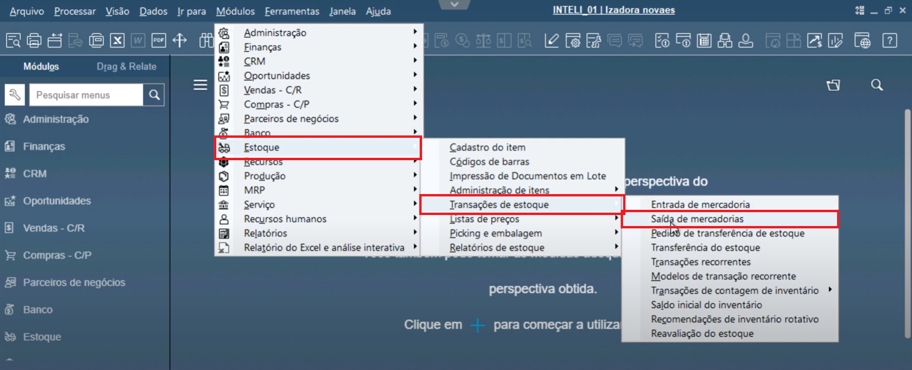
<sup>Fonte: Material produzido pelos autores (2024)</sup>
</div>

**Informação dos campos que devem ser preenchidos:**
- **N° do item:** Código do item a ser retirado do estoque.
- **Série:** Número de série do item, se aplicável.
- **Quantidade:** Quantidade de itens a serem removidos.

Dessa forma, pretende-se ter a **visualização da movimentação de saída** no estoque, com a unidade de medida (UM) correspondente, permitindo o acompanhamento das alterações no nível de inventário.

**5.3.3 Transferência de Estoque**

&emsp;&emsp;A funcionalidade de **Transferência de Estoque** no SAP B1 é utilizada para mover itens de um local de estoque para outro dentro da empresa. Esse processo é essencial para redistribuir o inventário entre diferentes armazéns ou locais de armazenamento.

<div align="center">
<sub>Figura x - Fluxograma da Transferência de Estoque</sub> 
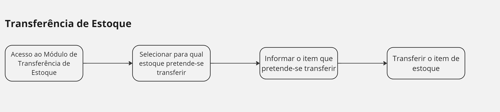 
<sup>Fonte: Material produzido pelos autores (2024)</sup>
</div>

**Descrição do caminho feliz:**  
&emsp;&emsp;O caminho feliz para a **Transferência de Estoque** envolve os seguintes passos:  
1. **Acessar o Módulo de Transferência de Estoque** no SAP B1.
2. **Selecionar o local de estoque atual** e o **estoque de destino** para onde o item será transferido.
3. **Informar o número do item** que será transferido.
4. **Confirmar e realizar a transferência** do item entre os estoques.

**Caminho para acessar a configuração:**  
&emsp;&emsp;Para acessar a funcionalidade de **Transferência de Estoque**, siga o seguinte caminho:
- Módulos > Estoque > Transações de estoque > Transferência de estoque.

<div align="center">
<sub>Figura x - Caminho para a Transferência de Estoque</sub> 
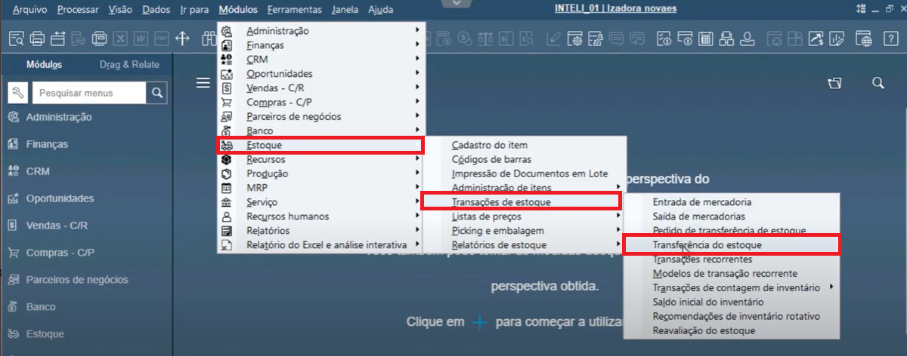 
<sup>Fonte: Material produzido pelos autores (2024)</sup>
</div>

**Informação dos campos que devem ser preenchidos:**
- **Do Depósito:** Local onde o item está atualmente armazenado.
- **Para o Depósito:** Local para onde o item será transferido.
- **N° do item:** Código do item que será transferido.

&emsp;&emsp;Dessa forma, pretende-se ter a **confirmação da transferência do item** entre os estoques, com a visualização da movimentação registrada no sistema.

**5.3.4 Relatórios de Estoques**

A funcionalidade de **Relatórios de Estoque** no SAP B1 permite a visualização e análise das movimentações ocorridas no estoque, sejam elas entradas, saídas ou transferências. Esses relatórios são fundamentais para o controle gerencial, fornecendo dados em tempo real sobre o inventário e permitindo uma gestão eficiente.

<div align="center">
<sub>Figura x - Fluxograma dos Relatórios de Estoque</sub> 
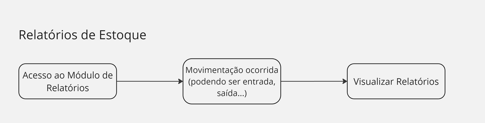 
<sup>Fonte: Material produzido pelos autores (2024)</sup>
</div>

**Descrição do caminho feliz:**  
O caminho feliz para os **Relatórios de Estoque** envolve os seguintes passos:  
1. **Acesso ao Módulo de Relatórios** dentro do SAP B1.
2. **Escolha do tipo de movimentação** a ser visualizada (entrada, saída, ou outra movimentação de estoque).
3. **Visualização dos relatórios gerados**, que fornecem as informações detalhadas sobre o status e movimentação do estoque.

**Caminho para acessar a configuração:**  
&emsp;&emsp;Para acessar a funcionalidade de **Relatórios de Estoque**, siga o seguinte caminho:
- Módulos > Estoque > Relatórios de estoque > Status do inventário.

<div align="center">
<sub>Figura X -  Caminho para Relatórios de Estoques - parte 1</sub>
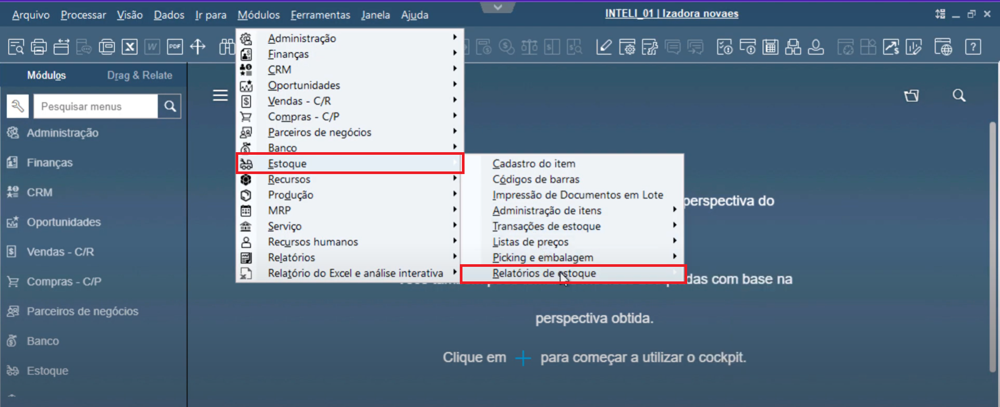
<sup>Fonte: Material produzido pelos autores (2024)</sup>
</div>

<div align="center">
<sub>Figura X -  Caminho para Relatórios de Estoques - parte 2</sub>
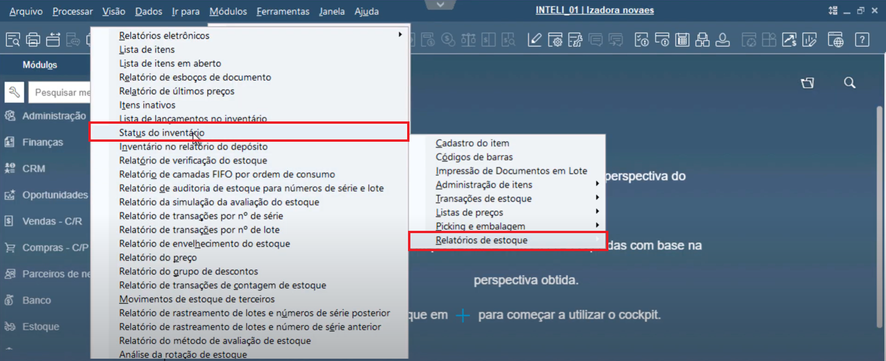
<sup>Fonte: Material produzido pelos autores (2024)</sup>
</div>

**Informação dos campos que devem ser preenchidos:**
- **Movimentação ocorrida:** Selecione o tipo de movimentação (entrada, saída, transferência).
- **Período:** Defina o intervalo de datas para visualização do relatório.
- **Filtros adicionais:** Caso seja necessário restringir o relatório por localização, lote ou número de série, utilize os filtros apropriados.

&emsp;&emsp;Dessa forma, pretende-se obter a **visualização dos relatórios detalhados** sobre o estoque, com todas as movimentações registradas, permitindo uma análise detalhada da situação do inventário.

**5.3.5 Visualização do Status das Licenças** 

&emsp;&emsp;Corresponde aos testes 006 e 008, ambos prevêm a configuração prévia de uma Dashboard para visualização das Licenças.

```
Este campo é um aviso e será removido no futuro. A configuração necessária para o Dashboard ainda não foi implementada, pois depende de uma capacitação que está pendente. Assim que a configuração for concluída, as evidências pertinentes serão adicionadas a esta subseção.
```
 
&emsp;&emsp;A funcionalidade de **Visualização do Status das Licenças** permite ao usuário verificar em tempo real o status de todas as licenças de software ou produtos em uso na empresa. A visualização inclui a utilização atual, licenças expiradas e disponíveis, facilitando o gerenciamento e a tomada de decisões.

<div align="center">
<sub>Figura x - Fluxograma da Visualização do Status das Licenças</sub> 
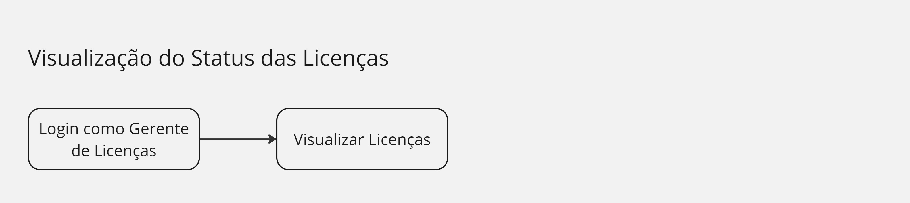 
<sup>Fonte: Material produzido pelos autores (2024)</sup>
</div>

**Descrição do caminho feliz:**  
&emsp;&emsp;O caminho feliz para a **Visualização do Status das Licenças** envolve os seguintes passos:  
1. **Login como Gerente de Licenças**, utilizando as credenciais apropriadas.
2. **Visualizar as licenças disponíveis** diretamente na dashboard, que consome dados de transações de estoque em tempo real e exibe gráficos informativos.

**Caminho para acessar a configuração:**  
&emsp;&emsp;Para visualizar o status das licenças, o usuário deverá acessar a dashboard na página inicial do sistema SAP B1 (que precisa estar previamente configurada). A dashboard é atualizada automaticamente com base nos dados de transações de estoque.

**Informação dos campos que devem ser preenchidos:**
- **Nenhum campo manual precisa ser preenchido** para a visualização, pois os dados são consumidos automaticamente das transações de estoque.

&emsp;&emsp;Ao final deve-se ser possível visualizar **gráficos construídos** com os dados de transações de estoque, mostrando a utilização atual, licenças disponíveis e status de licenças expiradas. Essas informações serão exibidas em tempo real na dashboard da página inicial.

## <a name="53-assinaturas"></a> 5.3 Assinaturas

&emsp;&emsp;A seção de **Assinaturas** refere-se ao documento denominado [Plano de Treinamento](Plano%20de%20Treinamento.xlsx), no qual estão descritos todos os testes realizados para garantir a qualidade e a conformidade do sistema implementado. Este plano contém informações detalhadas sobre os testes, incluindo o número do teste, área, nome do processo, caso de teste, condições de controle ou pré-requisitos, procedimentos de teste, número de testes, resultados previstos, duração estimada em minutos, data e hora de início do teste, sua relevância para o cliente, além dos responsáveis pelo teste, testemunhas e status de aprovação.

&emsp;&emsp;As principais informações contidas no **Plano de Treinamento** incluem:

- **Teste número**  
- **Área**  
- **Nome do Processo**  
- **Caso de teste**  
- **Condição de controle ou pré-requisito**  
- **Procedimentos de teste**  
- **Número de testes**  
- **Resultados previstos**  
- **Duração (min)**  
- **Data do teste**  
- **Horas de Início do teste**  
- **Relevante para o cliente**  
- **Responsável pelo teste**  
- **Testemunha**  
- **Status**  

&emsp;&emsp;Os testes descritos neste documento foram conduzidos de acordo com os procedimentos estabelecidos e acompanhados pelos envolvidos. Os resultados esperados foram comparados com os resultados reais, garantindo que todos os processos foram executados conforme esperado.

&emsp;&emsp;O documento é validado pelas assinaturas dos seguintes responsáveis, atestando que todas as informações são corretas e que os testes foram realizados com sucesso:

- **Erik Batista** - Responsável pelo Teste  
- **Davi Motta** - Testemunha do Teste  
- **Walquiria Novais** - Colaborador Testado  

&emsp;&emsp;Esses profissionais assinaram o documento confirmando que os testes ocorreram de maneira adequada.

&emsp;&emsp;*P.S.: As informações contidas no Excel são precisas e refletem os testes realizados, porém, as assinaturas não são reais, sendo incluídas apenas para fins acadêmicos.*

# Estratégia de Cutover
# 6. Introdução

&emsp;&emsp;A estratégia de cutover deve ser minuciosamente planejada para garantir uma transição fluida e controlada do ambiente de desenvolvimento para o ambiente de produção. Esse processo envolve a coordenação precisa de atividades essenciais, como migração de dados, integração de sistemas e ativação do novo ambiente, com o objetivo de minimizar qualquer impacto nas operações empresariais. Uma estratégia bem definida ajuda a assegurar a continuidade dos negócios e reduz o risco de interrupções ou falhas durante a mudança.

# 7. Configurações do sistema

&emsp;&emsp;Este guia detalha as etapas fundamentais para a configuração do SAP Business One, abordando desde as informações básicas de cadastro até a definição de parâmetros-chave para o gerenciamento eficiente de depósitos e finanças. O objetivo deste passo a passo é garantir uma implementação precisa, alinhada com as necessidades operacionais da empresa. Cada seção foi projetada para otimizar os processos internos, automatizar funções críticas e promover um controle abrangente das operações de estoque e financeiras, assegurando que o sistema atenda às demandas específicas do negócio.


<div align="center">
<sub>Figura x - Marcar o flag Custo por Depósito</sub> 
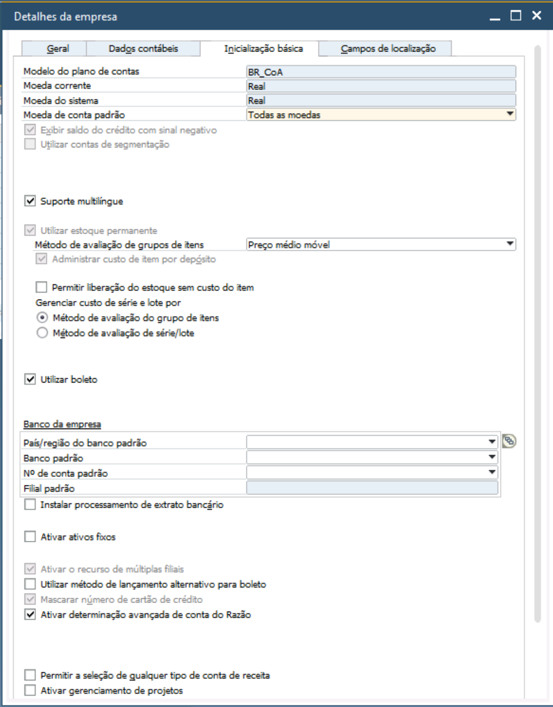 
<sup>Fonte: Material produzido pelos autores (2024)</sup>
</div>

<div align="center">
<sub>Figura x - Marcar o flag Custo por Depósito</sub> 
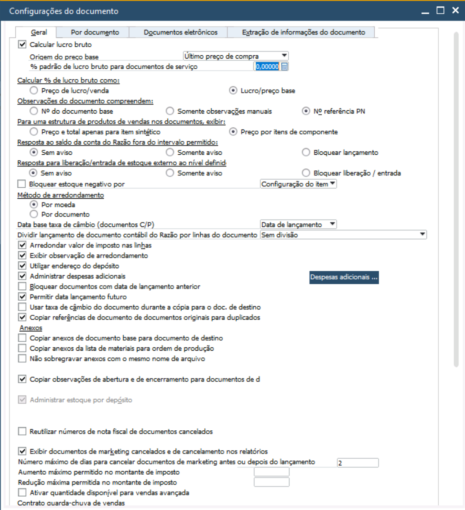 
<sup>Fonte: Material produzido pelos autores (2024)</sup>
</div>

<div align="center">
<sub>Figura x - Informações Básicas de Cadastro da Empresa</sub> 
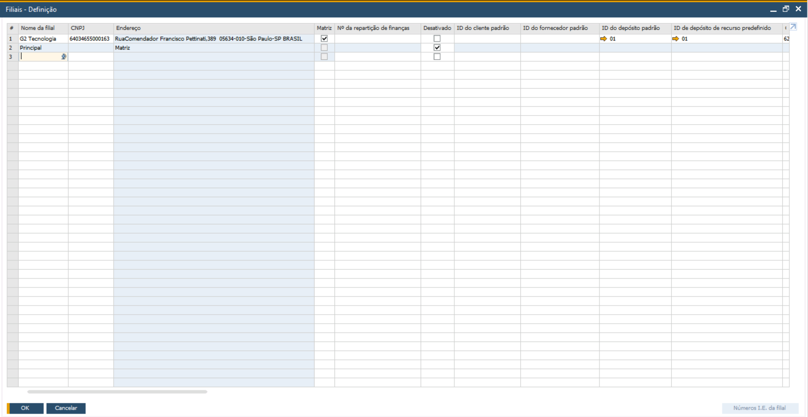 
<sup>Fonte: Material produzido pelos autores (2024)</sup>
</div>

<div align="center">
<sub>Figura x - Configuração de Moedas</sub> 
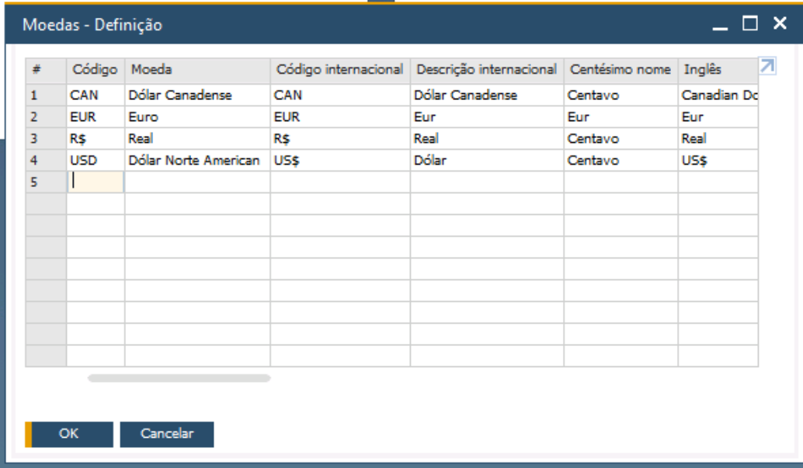 
<sup>Fonte: Material produzido pelos autores (2024)</sup>
</div>

<div align="center">
<sub>Figura x - Configuração de Moedas</sub> 
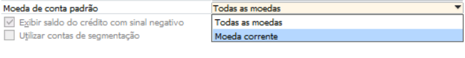 
<sup>Fonte: Material produzido pelos autores (2024)</sup>
</div>

<div align="center">
<sub>Figura x - Inicialização Básica</sub> 
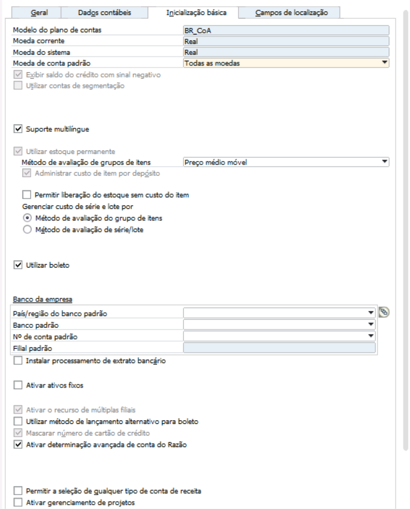 
<sup>Fonte: Material produzido pelos autores (2024)</sup>
</div>

<div align="center">
<sub>Figura x - Inicialização Básica</sub> 
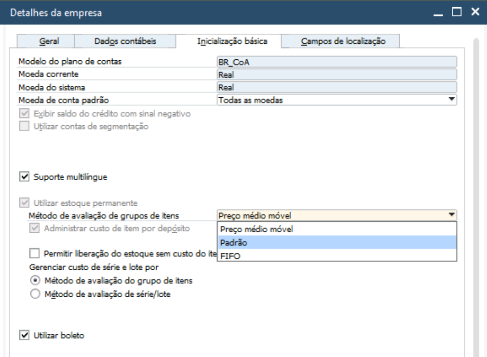 
<sup>Fonte: Material produzido pelos autores (2024)</sup>
</div>

<div align="center">
<sub>Figura x - Configurações gerais</sub> 
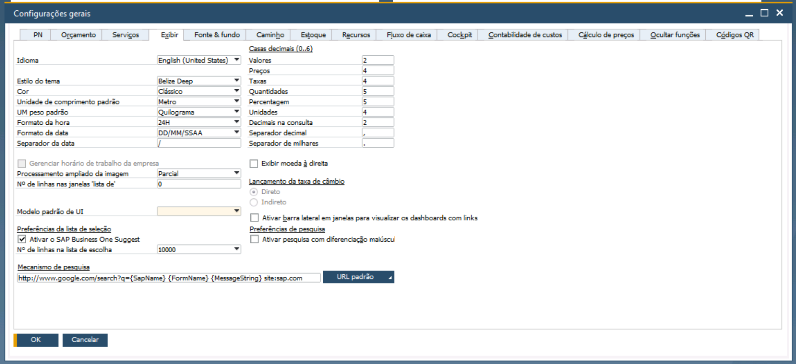 
<sup>Fonte: Material produzido pelos autores (2024)</sup>
</div>

<div align="center">
<sub>Figura x -  Informações de Bancos </sub> 
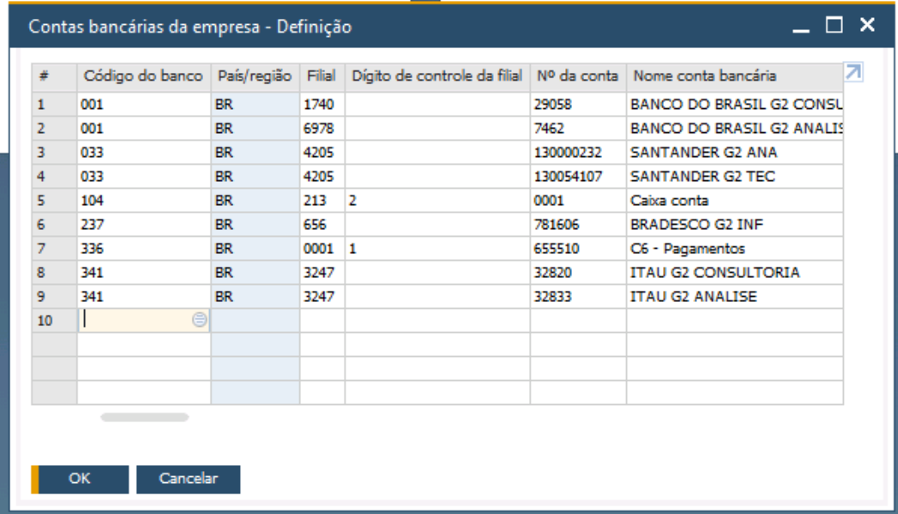 
<sup>Fonte: Material produzido pelos autores (2024)</sup>
</div>

<div align="center">
<sub>Figura x - Determinação de Conta Contábil</sub> 
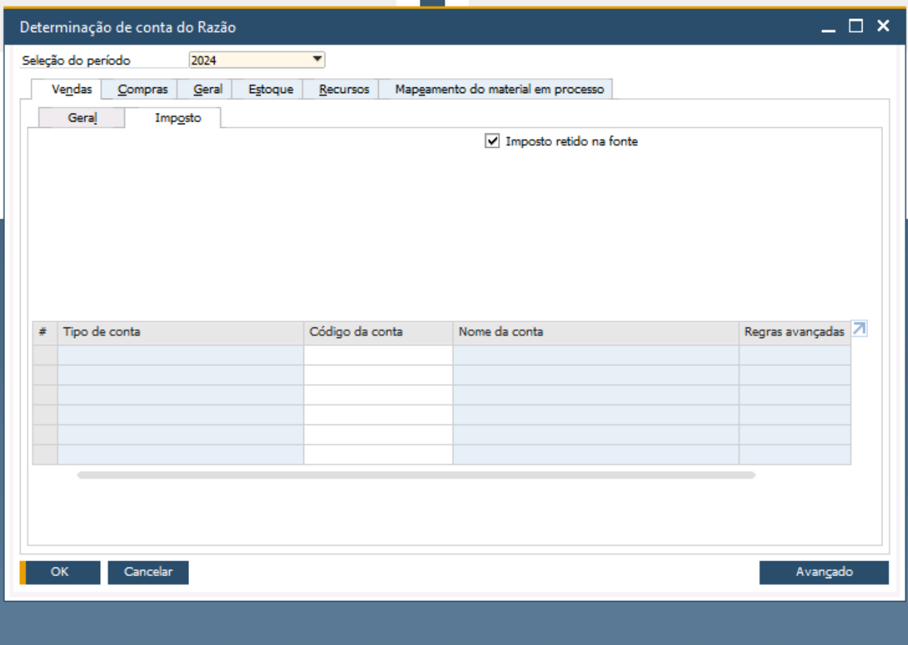 
<sup>Fonte: Material produzido pelos autores (2024)</sup>
</div>

<div align="center">
<sub>Figura x - Configuração de Centros de Custo</sub> 
 
<sup>Fonte: Material produzido pelos autores (2024)</sup>
</div>

<div align="center">
<sub>Figura x - Configuração de Centros de Custo</sub> 
 
<sup>Fonte: Material produzido pelos autores (2024)</sup>
</div>

<div align="center">
<sub>Figura x - Tipos de Envio/Expedição</sub> 
 
<sup>Fonte: Material produzido pelos autores (2024)</sup>
</div>

<div align="center">
<sub>Figura x - Configuração de Despesas
</sub> 
 
<sup>Fonte: Material produzido pelos autores (2024)</sup>
</div>

<div align="center">
<sub>Figura x - Configuração de Despesas</sub> 
 
<sup>Fonte: Material produzido pelos autores (2024)</sup>
</div>

<div align="center">
<sub>Figura x - Configuração de Depósitos</sub> 
 
<sup>Fonte: Material produzido pelos autores (2024)</sup>
</div>

<div align="center">
<sub>Figura x - Configuração de Grupos de Itens</sub> 
 
<sup>Fonte: Material produzido pelos autores (2024)</sup>
</div>

<div align="center">
<sub>Figura x - Configuração de IRF</sub> 
 
<sup>Fonte: Material produzido pelos autores (2024)</sup>
</div>

<div align="center">
<sub>Figura x - Condições de pagamento
</sub> 
 
<sup>Fonte: Material produzido pelos autores (2024)</sup>
</div>

<div align="center">
<sub>Figura x - Cartões de Crédito</sub> 
 
<sup>Fonte: Material produzido pelos autores (2024)</sup>
</div>

<div align="center">
<sub>Figura x - Cadastros de Territórios</sub> 
 
<sup>Fonte: Material produzido pelos autores (2024)</sup>
</div>

<div align="center">
<sub>Figura x - Cadastros de Usuário
</sub> 
 
<sup>Fonte: Material produzido pelos autores (2024)</sup>
</div>

<div align="center">
<sub>Figura x - Vendedores/Compradores</sub> 
 
<sup>Fonte: Material produzido pelos autores (2024)</sup>
</div>

<div align="center">
<sub>Figura x - Níveis de venda</sub> 
 
<sup>Fonte: Material produzido pelos autores (2024)</sup>
</div>

<div align="center">
<sub>Figura x - Grupos de clientes</sub> 
 
<sup>Fonte: Material produzido pelos autores (2024)</sup>
</div>

<div align="center">
<sub>Figura x - Grupos de fornecedores</sub> 
 
<sup>Fonte: Material produzido pelos autores (2024)</sup>
</div>

<div align="center">
<sub>Figura x - Configurações do Documento
</sub> 
 
<sup>Fonte: Material produzido pelos autores (2024)</sup>
</div>


&emsp;&emsp;Ao seguir as etapas descritas neste guia de configuração, espera-se que o SAP Business One esteja devidamente ajustado para suportar as operações diárias da empresa, garantindo maior controle, eficiência e transparência em todos os processos. A correta implementação dessas configurações proporcionará uma base sólida para a gestão de estoque, finanças e recursos, facilitando a tomada de decisões estratégicas e promovendo o crescimento sustentável do negócio.


# 8. Validação do Ambiente de Produção

&emsp;&emsp; A validação do ambiente de produção é um passo crítico na estratégia de *cutover*, pois garante que o novo sistema esteja plenamente funcional e adequado para suportar as operações empresariais. Antes da transição final, testes exaustivos devem ser realizados para verificar se todos os processos, dados e integrações estão operando conforme o esperado. Essa validação permite identificar e corrigir potenciais falhas, mitigando o risco de interrupções ou erros após o *go-live*. Assim, assegura-se uma transição mais segura, minimizando impactos negativos e garantindo que o ambiente de produção atenda aos requisitos de desempenho e confiabilidade da organização.

## 8.1 Integridade dos dados
&emsp;&emsp; Uma etapa crucial para a realização do _Cutover_ é a validação da integridade dos dados mestres. Isto é, uma verificação acerca dos dados de entrada iniciais, realizados nesse projeto via DTW(Data Transfer Workbench). Para isso, são realizadas consultas SQL, essas acessam os dados em diferentes tabelas e então é possível conferir se todos os dados foram transferidos.

<div align="center">
<sub>Figura X - Como gerar consultas</sub>

<sup>Fonte: Material produzido pelos autores (2024)</sup>
</div>

&emsp;&emsp; Os principais dados carregados no SAP primordialmente são referentes aos itens de estoque e os parceiros de negócio, esse último sendo dividido em 4 sub tabelas, com isso sendo necessário diversas consultas para entender sua integridade. 

### OITM(Tabela de itens)

&emsp;&emsp;&emsp; Para realizar a consulta de integridade dos dados referentes ao estoque, é necessário acessar a tabela OITM, nela são carregados cadastros de produtos que serão armazenados, quantidade em estoque, entre outras informações.

<div align="center">
<sub>Figura X - Consulta OITM</sub>

<sup>Fonte: Material produzido pelos autores (2024)</sup>
</div>

&emsp;&emsp;&emsp; A consulta acima consegue retornar ao usuário os dados referentes às informações de estoque de maneira válida. Com isso, a próxima etapa será conferir a integridade dos dados de Parceiros de Negócio

### Parceiros de Negócio

&emsp;&emsp;&emsp; Para a realização da conferência dos dados de Parceiros de Negócio é necessário acessar diversas tabelas, isso pois as informações estão divididas em informações gerais(OCRD), endereços do PN(CRD1), taxas do PN(CRD7) e dados bancários do PN(OCRB). Com isso, algumas consultas SQL serão executadas para que essas informações sejam confirmadas.

#### OCRD

&emsp;&emsp;&emsp;&emsp; Ao realizar uma consulta na tabela OCRD que retorne todas as informações(colunas) da tabela ela irá garantir ao usuário informações gerais de seus parceiros de negócio. Com isso, torna-se imprescindível que essa tabela tenha suas informações preenchidas.

<div align="center">
<sub>Figura X - Consulta OCRD</sub>

<sup>Fonte: Material produzido pelos autores (2024)</sup>
</div>

&emsp;&emsp;&emsp;&emsp; Como é possível observar na imagem acima, os dados de OCRD já foram adicionados. Com isso, o próximo passo para aplicar o _cutover_ será a análise da tabela referente aos endereços dos Parceiros de Negócio.

#### CRD1

&emsp;&emsp;&emsp;&emsp; A consulta à CRD1 retorna informações relevantes acerca dos endereços de cobrança e de destinatário. Sendo de suma importância para garantir que a empresa consiga identificar seus clientes.

<div align="center">
<sub>Figura X - Consulta CRD1</sub>

<sup>Fonte: Material produzido pelos autores (2024)</sup>
</div>

&emsp;&emsp;&emsp;&emsp; Como é possível ver, a consulta retorna informações, com isso, a integridade dos dados foi também conferida. O próximo passo seria 

#### CRD7

&emsp;&emsp;&emsp;&emsp; Ao consultar a tabela CRD7 serão adquiridas informações sobre taxas envolvidas a aquele PN. Com isso, informações de impostos e outras necessárias em casos de auditoria estarão armazenadas

<div align="center">
<sub>Figura X - Consulta CRD7</sub>

<sup>Fonte: Material produzido pelos autores (2024)</sup>
</div>	

&emsp;&emsp;&emsp;&emsp; Como é possível observar na imagem acima, a consulta à tabela retornou as informações necessárias. Com isso, é preciso seguir para o próximo passo, analisar as informações bancárias dos PN.

#### OCRB

&emsp;&emsp;&emsp;&emsp; A consulta à OCRB irá trazer informações bancárias de parceiros de negócios do usuário do SAP B1. Com isso ajudando em processos de pagamento, emissão de notas fiscais, auditoria, etc.

<div align="center">
<sub>Figura X - Consulta OCRB</sub>

<sup>Fonte: Material produzido pelos autores (2024)</sup>
</div>	

&emsp;&emsp;&emsp;&emsp; Como é possível observar na imagem acima. A consulta resultou em informações bancárias dos Parceiros de negócio encontrados anteriormente. Com isso, todas as informações realizadas em carga via DTW foram conferidas

&emsp;&emsp; Com isso, termina-se o processo de análise dos dados mestres via consultas no SAP. Então deve-se prosseguir o processo de _cutover_ com a análise de acesso de usuários no SAP B1.


## 8.2 Acesso dos usuários

&emsp;&emsp; O acesso dos usuários ao sistema é um dos pilares fundamentais para garantir a execução bem-sucedida dos procedimentos de go-live e cutover em projetos de implementação de sistemas, como o SAP Business One. Sem esse acesso, os usuários não podem interagir com o ambiente, realizar as tarefas necessárias e verificar o funcionamento correto das funcionalidades. Com isso, para garantir que o acesso dos usuários está acontecendo de forma correta, podemos aferir de forma indireta, como será mostrado a seguir:

<div align="center">
<sub>Figura X - Consulta Users</sub>

<sup>Fonte: Material produzido pelos autores (2024)</sup>
</div>

&emsp;&emsp;A imagem acima trata de uma consulta à tabela ligada ao saldo inicial. Nessa etapa, todos os usuários precisaram acessar o SAP, o DTW e realizar cargas de dados, garantindo acesso e inserção de informação. O "_Select_" acima mostra que todos os 5 usuários e o manager conseguiram acessar e inserir dados no SAP, garantindo assim que o acesso dos usuários está correto.


## 8.3 Validação Funcional
&emsp;&emsp;A verificação das funcionalidades implementadas no SAP Business One é essencial para garantir que o sistema esteja alinhado com os processos operacionais da empresa. Portanto, nessa secção comprovamos que as seguintes funcionalidades da área de estoque são operantes e efetivas no sistema:

**Adição de mercadoria:**


**Saída de mercadoria:**


**Transferência de estoque:**


**Geração de relatório**


**Conclusão:** 
&emsp;&emsp;Após a verificação das funcionalidades implementadas no SAP Business One, pode-se concluir que as operações essenciais do sistema estão funcionando conforme esperado, atendendo aos requisitos das regras de negócio definidas. As funcionalidades testadas incluem:

&emsp;**Alertas de Entrada Sem Nota Fiscal (NF):** O sistema gera alertas para entradas de mercadorias sem a Nota Fiscal, assegurando que essas inconsistências sejam registradas e tratadas.

&emsp;**Saída Sem Nota Fiscal (NF):** As saídas de mercadorias sem a Nota Fiscal também são registradas pelo sistema, e os alertas correspondentes são emitidos para os usuários responsáveis, garantindo a conformidade com os processos internos.

&emsp;**Transferência de estoque:** Todas as movimentações de estoque, de um estoque para o outro foram concluídas com sucesso.

&emsp;**Geração de Relatórios:** O relatório gerado reflete todas as movimentações de estoque realizadas, facilitando a visualização e o acompanhamento das operações no sistema.

&emsp;&emsp;Embora as operações de registro e monitoramento funcionem de maneira satisfatória, ou seja, resolvem o problema, existem algumas limitações inerentes ao SAP Business One que impactam a clareza e a customização dos alertas e notificações geradas, fazendo estas serem apenas logs. Estas limitações são:
&emsp;**Notificações Padrão:** As notificações emitidas pelo sistema, apesar de funcionais, apresentam uma estrutura padrão e menos detalhada. Isso dificulta a personalização das mensagens para tornar as informações mais específicas e claras para os usuários.
&emsp;**Customização Restrita:** O SAP Business One possui restrições em relação a customização de notificações e alertas. Embora seja possível configurar regras e condições para emissão de alertas, a limitação na formatação das mensagens impede uma comunicação mais eficiente e assertiva.

&emsp;&emsp;Apesar dessas restrições, as funcionalidades testadas cumprem o objetivo de registrar e monitorar as operações de estoque e a gestão de documentos fiscais. A utilização dessas funcionalidades possibilita um controle adequado e contribui para a conformidade dos processos internos da organização. Portanto, a adição de softwares terceiros e utilização de add-ons e pop-ups podem ser interessantes ao sistema no futuro.


# <a name="9-checklist-de-ações-go-live"></a>9. Checklist de Ações Go Live

&emsp;&emsp;O Go Live é o momento em que um novo sistema, ambiente ou processo entra em operação oficial, substituindo um sistema anterior ou marcando a transição de um projeto para seu estado operacional. Essa fase é crucial, pois envolve a mudança do ambiente atual para o novo sistema, garantindo que todas as funcionalidades estejam funcionando conforme o esperado, minimizando interrupções operacionais. Para garantir uma transição suave, é essencial ter um cronograma bem definido que contemple atividades pré e pós Go Live, como a validação de ambientes, migração de dados e testes de funcionamento.

&emsp;&emsp;Um cronograma pré Go Live, também conhecido como cutover, deve cobrir todas as ações necessárias antes da data oficial de lançamento, enquanto o cronograma pós Go Live foca na estabilização, validação e suporte contínuo para o novo sistema. A organização dessas atividades é fundamental para evitar erros e assegurar que todos os envolvidos estejam preparados e coordenados, o que minimiza riscos e facilita a correção de problemas de maneira ágil.

Nesta seção, são apresentados os responsáveis pelas atividades durante o Go Live, cada um com funções específicas para garantir que todas as etapas sejam executadas com sucesso:

- **Product Owner**: Responsável pelo projeto, tem função de coordenar e comunicar todas as partes envolvidas, garantindo que o cronograma seja seguido à risca e que todos os stakeholders sejam notificados no tempo correto. No projeto realizado com a *G2 Tecnologia*, cada equipe tem um P.O. o qual se comunica com os outros POs de cada e com o cliente.
- **Equipe de TI**: Responsável por executar a migração dos dados, validar o novo ambiente e garantir que o sistema esteja funcional antes e depois do Go Live. No projeto realizado com a *G2 Tecnologia*, há 5 equipes desenvolvedoras, cada uma representando um módulo, são elas: Compras, Contábil, Estoque, Financeiro e Vendas
- **Equipe de Suporte**: Após o Go Live, essa equipe monitora o sistema, corrige eventuais problemas e fornece treinamento adicional e suporte aos usuários finais, garantindo que todas as operações continuem funcionando conforme o esperado. No projeto realizado com a *G2 Tecnologia*, as equipes responsáveis pela área de TI funcionam também como suporte para as suas respectivas áreas.
- **Parceiro/Cliente:** A G2 Tecnologia participa de todas as fases do projeto, atuando tanto como facilitadora na implantação quanto como cliente. Ela oferece suporte técnico e é beneficiada diretamente pela implantação do novo sistema SAP B1, garantindo que o processo atenda às suas necessidades operacionais.

&emsp;&emsp;A estrutura desse planejamento, que inclui atividades que vão desde a comunicação inicial até a validação e suporte contínuo, é projetada para minimizar interrupções e garantir que o novo sistema esteja completamente operacional e otimizado.

&emsp;&emsp;Nesta seção, detalhamos as metodologias de testes integrados em sistemas ERP, destacando suas características e o papel fundamental que desempenham na garantia de uma integração eficiente e sem falhas entre os módulos. Optamos pelo teste de interface como a metodologia mais adequada para o cenário abordado, dada a necessidade de verificar a comunicação e o intercâmbio de informações entre diferentes áreas do sistema. 

&emsp;&emsp;A execução dos testes nos cenários descritos permitiu validar o funcionamento do ERP, identificando e corrigindo inconsistências que poderiam comprometer as operações cotidianas da empresa. Os resultados documentados demonstraram que, através de testes rigorosos e integrados, é possível assegurar a integridade do sistema e sua capacidade de atender às demandas operacionais. A conclusão desses testes com sucesso indica que as configurações do SAP Business One foram realizadas corretamente e que a solução está preparada para lidar com os processos da empresa.

## **Cronograma de Atividades Pré Go-Live (Cutover)**

| **Atividade** | **Descrição** | **Responsável** | **Data de Início** | **Data de Término** | **Dependências** |
| --- | --- | --- | --- | --- | --- |
| **Comunicação e Coordenação** | Notificação de stakeholders e coordenação entre equipes | Product Owner | 27 de Set. 2024 | 27 de Set. 2024 | Nenhuma |
| **Validação do Novo Ambiente** | Confirmar se o novo ambiente está pronto para migração | Equipes de TI | 30 de Set. 2024 | 01 de Out. 2024 | Nenhuma |
| **Backup de Dados e Sistemas** | Realizar backup completo do sistema atual | Não será realizado | Não será realizado | Não será realizado | Validação do Novo Ambiente |
| **Carga de Dados Preliminares** | Migrar dados não críticos antes do cutover | Equipes de TI | 02 de Out. 2024 | 03 de Out. 2024 | Backup de Dados e Sistemas |
| **Teste de Carga** | Verificar se o sistema suporta o número de usuários esperados simultaneamente | Equipe de Implantação | 16 de Set. 2024 | 19 de Set. 2024 | Nenhuma |
| **Desativação do Sistema Antigo** | Colocar o sistema atual em modo offline para impedir alterações | Não será realizado | Não será realizado | Não será realizado | Backup de Dados e Sistemas |
| **Entrar em Operação (Go-Live)** | Migrar os dados remanescentes para o novo sistema | Equipes de TI | 03 de Out. 2024 | 03 de Out. 2024 | Desativação do Sistema Antigo |


&emsp;&emsp;***Nota:*** Algumas tarefas como "Backup de Dados e Sistemas" e "Desativação do Sistema Antigo" foram incluídas no cronograma apenas para fins de referência e planejamento, mas não serão realizadas. Isso acontece porque a estratégia adotada neste projeto dispensa a necessidade dessas ações, seja por uma abordagem alternativa de migração ou por outros motivos técnicos e operacionais. No entanto, é importante destacar a importância de tais tarefas em outros cenários, onde backups e desativações garantem segurança e continuidade.

&emsp;&emsp; Também é importante ressaltar que durante, o período de realização dos testes integrados, foi conduzido o teste de carga, cujo principal objetivo é verificar se o sistema consegue suportar simultaneamente todos os usuários esperados. Isso é crucial para garantir que o produto fornecido aos clientes atenda suas demandas sem apresentar falhas, mesmo quando todos os usuários contratados se conectarem ao mesmo tempo.

&emsp;&emsp; No caso desta implantação, a G2 Tecnologia informou que, normalmente, não realiza esse tipo de teste em seus clientes de SAP, uma vez que a própria SAP já faz essa verificação antes de liberar as licenças. No entanto, a equipe de implantação optou por realizar um teste básico, garantindo que todos os usuários estivessem conectados simultaneamente durante os cenários de teste.

&emsp;&emsp;Os testes de carga foram realizados entre os dias 16 e 19 de setembro, predominantemente no horário das 16h às 18h. Durante esse período, não foram identificados erros ou falhas no sistema devido ao número de usuários ativos. Assim, o sistema passou com sucesso no teste de carga.

## **Cronograma de Atividades Pós Go-Live**

| **Atividade** | **Descrição** | **Responsável** | **Data de Início** | **Data de Término** | **Dependências** |
| --- | --- | --- | --- | --- | --- |
| **Reconfiguração de Integrações** | Atualizar interfaces e integrações com sistemas de terceiros | Parceiro com as Equipes de TI | 03 de Out. 2024 | 04 de Out. 2024 | Migração Final de Dados |
| **Validação Pós-Migração** | Testar o sistema após a migração para verificar a funcionalidade | Equipes de TI | 03 de Out. 2024 | 04 de Out. 2024 | Migração Final de Dados |
| **Testes de Aceitação de Usuários (UAT)** | Realizar testes com usuários finais para validar o funcionamento do novo sistema | Esquipes de TI | 04 de Out. 2024 | 04 de Out. 2024 | Validação Pós-Migração |
| **Monitoramento** | Acompanhar o comportamento do novo sistema após o cutover | Equipe de Suporte | 04 de Out. 2024 | 11 de Out. 2024 | Testes de Aceitação de Usuários |
| **Correção de Incidentes** | Corrigir problemas identificados durante o monitoramento pós-cutover | Equipe de Suporte | 04 de Out. 2024 | 18 de Out. 2024 | Monitoramento |
| **Treinamento e Suporte** | Realizar treinamentos adicionais e garantir suporte aos usuários | Equipe de Suporte | 04 de Out. 2024 | 18 de Out. 2024 | Testes de Aceitação de Usuários |
| **Encerramento e Avaliação** | Reunião de encerramento e avaliação de lições aprendidas | Product Owner | 04 de Out. 2024 | 18 de Out. 2024 | Correção de Incidentes |

&emsp;&emsp;O processo de Go Live é uma fase importante do ciclo de vida de um projeto de implantação SAP, exigindo um planejamento detalhado e comunicação eficiente entre as equipes envolvidas. O cronograma pré-Go Live assegura que todos os preparativos sejam realizados antes da migração, enquanto o pós-Go Live garante a estabilização do novo ambiente com a devida correção de problemas e suporte aos usuários. A preparação e a execução eficazes desses cronogramas contribuem diretamente para o sucesso do projeto, reduzindo riscos e promovendo uma transição suave.

# 10. Plano de Contingência

&emsp;&emsp; Em projetos de implantação de sistemas de SAP, a preparação para situações inesperadas é crucial, esse plano também é chamado de plano de contingência. Esse plano são várias ações que visam mitigar os impactos de falhas durante o processo de Go Live, garantindo que os dados não sejam perdidos ou corrompidos e as atividades sigam operantes. Esse plano é essencial para responder rapidamente a situações críticas, minimizando o tempo de inatividade e assegurando que a organização esteja pronta e tenha um plano para lidar com qualquer eventualidade sem grandes surpresas.
&emsp;&emsp; Durante o Go Live, a G2 irá migrar suas operações do sistema legado para o novo sistema SAP, o que pode causar riscos significativos, como a perda de dados, falhas de integração e interrupções nos processos de negócios. O plano de contingência serve como um guia para crise, detalhando os procedimentos a serem seguidos para restaurar os sistemas e comunicar as partes interessadas de maneira eficaz.
&emsp;&emsp; Esse plano é essencial, especialmente se não possuirmos backup nem acesso ao sistema legado. Isso significa que a possibilidade de restaurar o ambiente anterior é inexistente, tornando a identificação e resolução de problemas no novo sistema ainda mais críticas.

## **Estruturação do plano de contingência:**

&emsp;&emsp; Para entendermos o plano, é necessário compreender o conceito de Go Live, que é o momento em que a empresa começa a operar efetivamente com o novo sistema SAP, substituindo o sistema anterior. Este é um momento crucial que, se não for bem executado, pode causar sérios problemas operacionais. Em caso de falhas críticas durante o Go Live, o plano de contingência existe e dita ações adequadas para esse momento de estresse:

&emsp;**Descontinuar imediatamente o uso do novo sistema:**
Se a falha for muito grave, ao ponto que comprometa as operações, a primeira ação é parar imediatamente o uso do sistema SAP para evitar maiores problemas.
Esta ação é necessária para impedir que dados incorretos sejam registrados ou que processos críticos sejam interrompidos de maneira irreversível.

&emsp;**Restaurar o backup do sistema legado:**
Essa etapa só é possível se houver um backup completo do sistema antigo e acesso ao mesmo, o que não é o caso neste projeto. Portanto, é essencial que todas as medidas preventivas sejam tomadas antes do Go Live, uma vez que não será possível retornar ao sistema legado.
O objetivo seria restaurar o ambiente anterior para garantir a continuidade das operações, mas dada a ausência de backup, esta etapa se torna inviável.

&emsp;**Comunicar imediatamente todos os usuários sobre a situação:**
A comunicação clara e rápida é uma necessidade. Todos os usuários devem ser comunicados instantaneamente sobre a situação, explicando que o uso do novo sistema foi interrompido e que estão sendo tomadas medidas para resolver o problema.
Um canal de comunicação deve ser criado para manter todos informados sobre o progresso da resolução, tranquilizando assim os clientes e estabelecendo uma situação em que a quebra de confiança é menor.

&emsp;**Avaliar a natureza e a extensão do problema:**
Uma avaliação detalhada do problema deve ser conduzida pela equipe técnica para entender o por que da falha e os sistemas ou módulos afetados.
Essa análise é fundamental para determinar se o problema pode ser resolvido rapidamente ou se serão necessárias ações mais complexas.

&emsp;**Tentar resolver o problema rapidamente, se possível:**
Se a falha identificada puder ser resolvida em um curto período de tempo, a equipe deve agir de forma rápida para corrigir o problema e testar o sistema novamente.
A resolução rápida também conta com correções temporárias ou ajustes menores que permitam a continuidade das operações, se for necessário.

&emsp;**Se não for possível uma resolução rápida:**
Caso a falha seja grave e não possa ser solucionada rapidamente, o Go Live deve ser suspenso e uma nova data de entrega precisa ser definida após a correção do problema.
Essa decisão deve ser comunicada claramente aos stakeholders, juntamente com um plano de ação detalhado para a resolução e o novo cronograma, também com uma comunicação clara com os clientes.

| Cenário                                   | Ação de Contenção                                                                                  | Responsável           | Prazo     |
|-------------------------------------------|----------------------------------------------------------------------------------------------------|-----------------------|-----------|
| Falha grave durante o Go Live             | Descontinuar imediatamente o uso do novo sistema                                                    | Equipe de Suporte      | Imediato  |
| Impossibilidade de restaurar o sistema legado | Implementar medidas preventivas antes do Go Live, visto que não há backup do sistema anterior        | Gestor de Projeto      | Antes do Go Live |
| Falha comunicacional durante a crise      | Comunicar imediatamente todos os usuários sobre a interrupção do uso do sistema                      | Gestor de Comunicação  | Imediato  |
| Falha técnica durante o Go Live           | Avaliar a natureza e extensão do problema                                                           | Equipe Técnica         | Imediato  |
| Problema técnico resolvível rapidamente   | Tentar resolver o problema rapidamente e testar o sistema                                            | Equipe Técnica         | Até 2h    |
| Falha não resolvível rapidamente          | Suspender o Go Live e definir nova data de entrega, comunicando stakeholders e clientes               | Gestor de Projeto      | Até 24h   |
| Falha grave durante o Go Live             | Descontinuar imediatamente o uso do novo sistema                                                    | Equipe de Suporte      | Imediato  |
| Impossibilidade de restaurar o sistema legado | Implementar medidas preventivas antes do Go Live, visto que não há backup do sistema anterior        | Gestor de Projeto      | Antes do Go Live |
| Falha comunicacional durante a crise      | Comunicar imediatamente todos os usuários sobre a interrupção do uso do sistema                      | Gestor de Comunicação  | Imediato  |
| Falha técnica durante o Go Live           | Avaliar a natureza e extensão do problema                                                           | Equipe Técnica         | Imediato  |
| Problema técnico resolvível rapidamente   | Tentar resolver o problema rapidamente e testar o sistema                                            | Equipe Técnica         | Até 2h    |
| Falha não resolvível rapidamente          | Suspender o Go Live e definir nova data de entrega, comunicando stakeholders e clientes               | Gestor de Projeto      | Até 24h   |
| Falha na integração de módulos (Financeiro, Estoque, Vendas) | Interromper a integração e priorizar a resolução dos módulos críticos, permitindo continuidade dos não afetados | Equipe Técnica | Até 4h |
| Inconsistências de dados migrados         | Isolar dados inconsistentes e criar logs, realizar correções manuais e agendar revisão dos dados | Equipe de Dados | Até 12h |
| Problemas de conexão com a hospedagem em nuvem | Verificar conectividade com o provedor de nuvem e escalar temporariamente recursos locais, se possível | Equipe de Infraestrutura | Imediato |
| Sobrecarga no sistema no primeiro dia     | Monitorar a carga do sistema, reduzir acessos simultâneos e escalar recursos de hospedagem em nuvem  | Equipe de Infraestrutura | Até 2h |
| Falha no gerenciamento de usuários        | Revisar e ajustar permissões de usuários, garantindo acesso para os principais responsáveis | Equipe de Segurança e TI | Até 3h |


&emsp;Podemos concluir que o plano de contingência é uma ferramenta indispensável para a gestão de riscos nesse projeto. Nesta seção, abordamos a importância de estar preparado para falhas críticas durante o Go Live e as etapas que devem ser seguidas para minimizar os impactos. Embora o plano contemple ações como descontinuação do uso do sistema e restauração de backup, é crucial lembrar que, no contexto deste projeto, não possuímos um backup do sistema legado, o que torna a prevenção e o monitoramento ainda mais vitais.

&emsp;É importante colocar que se o plano de contingência for utilizado, é fundamental realizar uma análise das falhas para identificar as suas causas e ajustar o plano para futuros Go Lives. A experiência adquirida neste processo deve servir como aprendizado para fortalecer os procedimentos de contingência e assegurar que a empresa esteja preparada para enfrentar qualquer desafio, garantindo a continuidade das operações e a integridade dos dados.

# 11. Plano de Comunicação

# <a name="11-plano-de-comunicação"></a> 11. Plano de Comunicação

&emsp;&emsp; O **Plano de Comunicação** é um elemento fundamental da estratégia de **Cutover** no processo de implantação de um sistema como é o caso do SAP Business One. Ele define a forma e a frequência com que o time de implantação e os stakeholders se comunicarão durante esse período crítico, garantindo o alinhamento e a eficiência na tomada de decisões.

&emsp;&emsp; Durante o Cutover, que envolve a transição das operações da empresa para o novo ambiente, a comunicação eficaz é indispensável para mitigar riscos, resolver problemas rapidamente e garantir que o processo ocorra dentro do cronograma estabelecido. Este plano detalha os meios de comunicação, os responsáveis e a frequência das atualizações para cada grupo de stakeholders, assegurando uma transição organizada e eficiente.Tendo isso em mente, a tabela a seguir organiza os stakeholders envolvidos no Cutover, especificando a forma de comunicação, a frequência com que ocorrerão as interações, e os responsáveis por cada área. O objetivo é garantir que as informações fluam de maneira consistente entre todos os envolvidos, facilitando a resolução de problemas e o cumprimento das metas estabelecidas. Cada um dos responsáveis pelos módulos estará em contato constante, via reuniões e e-mails, para garantir o progresso contínuo durante o Cutover.

| Stakeholder                     | Forma de Comunicação | Frequência                                 | Responsável                           |
|----------------------------------|----------------------|--------------------------------------------|---------------------------------------|
| Módulo de Vendas                 | Reuniões e E-mails   | De segunda à sexta durante o Cutover  | eduardo.oliveira@sou.inteli.edu.br    |
| Módulo de Compras                | Reuniões e E-mails   |  De segunda à sexta durante o Cutover  | keylla.bispo@sou.inteli.edu.br        |
| Módulo de Contabilidade          | Reuniões e E-mails   |  De segunda à sexta durante o Cutover  | rafaella.cavalcante@sou.inteli.edu.br |
| Módulo Financeiro                | Reuniões e E-mails   |  De segunda à sexta durante o Cutover  | ana.martire@sou.inteli.edu.br         |
| Módulo de Estoque                | Reuniões e E-mails   |  De segunda à sexta durante o Cutover  | izadora.novaes@sou.inteli.edu.br      |
| G2 Tecnologia                    | Reuniões e E-mails   | Segunda, quarta e sexta durante o Cutover  | Gerentes dos módulos representados    |

&emsp;&emsp; Os pontos focais de cada módulo possuem a frequência descrita na tabela, ou seja, de segunda à sexta durante o Cutover, pois esses são os dias em que estão dedicados ao desenvolvimento do projeto de implantação do SAP B1. Isso garante que o acompanhamento e a comunicação sejam contínuos e eficazes, minimizando qualquer risco de atraso ou falhas no processo. Já a G2 Tecnologia tem a disponibilidade programada para segunda, quarta e sexta, conforme especificado, pois esses são os dias em que a equipe estará presente no Inteli, facilitando a interação direta com a equipe de implantação e oferecendo suporte técnico conforme necessário para o sucesso da transição.

&emsp;&emsp; Este plano fornece uma diretriz clara para assegurar o sucesso da implantação do SAP durante o Cutover. Ao seguir essas orientações, os envolvidos estarão preparados para mitigar riscos, resolver problemas de maneira eficiente e garantir que o processo de transição ocorra de forma organizada, minimizando interrupções. Dessa forma, este documento não só destaca a importância da comunicação, como também oferece um roteiro prático para que todos os envolvidos mantenham o alinhamento necessário durante as fases mais críticas do Cutover.

# 12. Suporte Pós Go-Live
### Suporte Pós Go-live - SAP Business One

&emsp;&emsp;O suporte pós-go-live refere-se ao acompanhamento oferecido ao cliente após a implantação completa do ERP, neste caso, o **SAP Business One**. Essa etapa é crucial, pois, de acordo com consultores da **G2 Tecnologia**, estima-se que o período necessário para uma adaptação plena ao novo sistema seja de aproximadamente 1 ano. Durante esse período, todos os processos e demandas da empresa serão executados pelo menos uma vez no novo ambiente. Parte da estratégia pós go-live está descrita na seção 9. Checklist de Ações para Go Live de forma a sintetizar as datas de apoio, essa seção dedica-se a estabelecer os contatos mais diretos e como se dará o suporte.

&emsp;&emsp;Por essa razão, o suporte pós-go-live é indispensável. É natural que, durante esse período, surjam diversas dúvidas e desafios na execução das tarefas diárias. Isso torna essencial a presença de uma equipe de suporte dedicada, que auxilia na resolução de questões e na adaptação das operações do cliente ao sistema, garantindo que suas necessidades sejam plenamente atendidas dentro da nova plataforma.

&emsp;&emsp;Tendo em mente esses fatores, aliados a uma perspectiva de custo, o grupo prestará à **G2 Tecnologia** um suporte de 30 dias após a realização do go-live. O período foi definido com base em três fatores principais:
- **Necessidades específicas do módulo**;
- **Necessidades específicas do cliente**;
- **Custos associados**.

&emsp;&emsp;A escolha do período de 1 mês leva em consideração que o módulo de estoque possui poucas funcionalidades excessivamente complexas, o que facilita seu entendimento e uso pelos clientes. Além disso, a **G2 Tecnologia** lida com produtos de estoque de alta rotatividade. Licenças, o principal produto de estoque da empresa, só podem ser adquiridas com a SAP quando o cliente da **G2 Tecnologia** assina os contratos de compra. Por isso, estima-se que, no período de 1 mês, todos os processos da área de estoque serão executados ao menos uma vez no **SAP Business One**. Durante esse tempo, os consultores da **G2** poderão auxiliar na execução dos processos e colaborar para o pleno entendimento da ferramenta pelos colaboradores.

&emsp;&emsp;Ademais, o período de 1 mês permitirá que o cliente redirecione mais recursos para o suporte em áreas mais críticas, onde há diferentes tipos de processos executados em intervalos maiores, como é o caso da área de contabilidade.

### Alocação dos Consultores

&emsp;&emsp;Serão alocados **três consultores** para o suporte à **G2 Tecnologia**. Eles seguirão um rodízio, com um consultor presente na empresa em três dias por semana: segunda (para processos de abertura da semana), quarta (um dia intermediário) e sexta-feira (para processos de fechamento da semana). Cada consultor fará um plantão de **8 horas diárias**, das **9:00 às 18:00**, e haverá sempre **dois consultores presentes** em cada plantão para auxiliar a área de estoque como um todo. Por se tratar de uma PME, acreditamos que mais de dois consultores seja desnecessário, enquanto a presença de apenas um poderia gerar gargalos no processo.

&emsp;&emsp;Abaixo está a planilha de alocação dos consultores por dia da semana:

### Plantão de Consultores

| Horário     | Segunda        | Quarta         | Sexta          |
|-------------|----------------|----------------|----------------|
| 09:00-18:00 | Izadora Luz, Erik Batista | Izadora Luz, Marcelo Saadi | Erik Batista, Marcelo Saadi |

### Ações de Suporte

&emsp;&emsp;Durante o período de suporte, os consultores realizarão as seguintes ações:
- Auxílio na execução dos processos de estoque dentro do SAP Business One;
- Reconfiguração de funcionalidades, caso seja encontrada alguma irregularidade prevista no contrato do projeto;
- Atendimento a questões adjacentes ao módulo de estoque.

**O suporte não contempla**:
- Reimplantação do módulo SAP Business One;
- Adição de novas configurações não previstas em contrato;
- Inclusão de novos módulos ou add-ons.

&emsp;&emsp;Caso o cliente deseje, esses serviços poderão ser contratados em um novo projeto. Além disso, durante o período de suporte, os consultores rodarão formulários semanais na área de estoque, a fim de receber feedback sobre erros ou dificuldades apresentadas pelos usuários. Se tais problemas estiverem previstos nas cláusulas do projeto, serão endereçados pela equipe de consultores.

&emsp;&emsp;Dessa forama, o suporte pós-go-live de 30 dias para a **G2 Tecnologia** foi planejado para garantir que os processos críticos de estoque sejam plenamente compreendidos e executados dentro do **SAP Business One**. Com a presença de consultores capacitados e um acompanhamento semanal organizado, a empresa terá o suporte necessário para uma transição tranquila. Ao mesmo tempo, o plano otimiza o uso de recursos, permitindo que áreas mais complexas sejam priorizadas no futuro, de acordo com as necessidades específicas da empresa. Este período de suporte é fundamental para consolidar o uso eficiente da ferramenta e garantir a continuidade dos negócios sem interrupções.

# <a name="13-testes-integrados"></a> 13. Testes Integrados

&emsp;&emsp;Nesta seção, será explorada as metodologias de testes integrados aplicadas em sistemas ERP, destacando a importância da correta integração entre diferentes módulos, como financeiro, estoque, vendas e compras, para garantir a estabilidade do sistema como um todo. A realização de testes integrados é crucial para validar a comunicação entre os componentes, identificar possíveis erros e assegurar que os processos operacionais funcionem conforme o planejado. 

&emsp;&emsp;Serão apresentados diversos tipos de testes, incluindo métodos incrementais, testes de interface, regressão, volume e desempenho, entre outros. A descrição de cada metodologia permitirá compreender suas características, diferenças e aplicações práticas dentro do ambiente de um ERP. Adicionalmente, será detalhada a escolha da metodologia mais adequada ao cenário da empresa em questão, considerando as particularidades e necessidades do projeto. Em seguida, abordaremos a execução dos testes integrados, documentando os resultados obtidos, as inconsistências encontradas e as ações corretivas aplicadas.

&emsp;&emsp;O objetivo é fornecer uma visão detalhada e completa de todo o processo de testes, desde o planejamento até a análise dos resultados, ilustrando como essas práticas contribuem para a implementação bem-sucedida de um sistema ERP.

## <a name="131-metodologia"></a> 13.1 Metodologia

&emsp;&emsp;Existem alguns tipos de metodologias de testes integrados de módulos ERP. Entre eles temos: teste de integração incremental; teste de integração big bang; top-down integration; bottom-up integration; teste de regressão; teste de interface; teste de integração de serviços; teste de integração contínua; teste de volume e desempenho e teste de integração funcional. Cada um deles possuí um jeito próprio de testar a integração entre módulos, abaixo estão as específicações de cadaum deles:

- **Teste de Integração Incremental**: Testa cada módulo ou componente individualmente, integrando-os de forma incremental. Primeiro, duas ou mais unidades são testadas juntas, e então novos módulos são integrados e testados em conjunto.
  
- **Teste de Integração Big Bang**: Todos os módulos ou subsistemas do ERP são integrados de uma vez e testados como um sistema completo.
  
- **Teste de Integração de Topo para Baixo (Top-Down Integration)**: Começa com a integração dos módulos de nível superior e, em seguida, desce para os módulos de nível inferior, substituindo módulos ainda não implementados por "stubs" (substitutos temporários).
  
- **Teste de Integração de Baixo para Cima (Bottom-Up Integration)**: Inicia com a integração dos módulos de nível mais baixo, subindo progressivamente até os módulos de nível superior, substituindo os de nível superior por "drivers" (controladores temporários).
  
- **Teste de Regressão**: Testa novamente o sistema inteiro ou partes específicas após atualizações, integrações ou mudanças para garantir que novos erros não tenham sido introduzidos.
  
- **Teste de Interface**: Verifica se a comunicação entre diferentes módulos e subsistemas do ERP ocorre de forma correta, validando a troca de dados e a funcionalidade das interfaces.
  
- **Teste de Integração de Serviços**: Foca na integração entre o ERP e outros sistemas ou serviços externos, como APIs de pagamento, sistemas de e-commerce, ou soluções de CRM.
  
- **Teste de Integração Contínua**: Envolve a automação dos testes de integração, onde o código é integrado frequentemente (várias vezes ao dia), e uma suíte de testes automatizados é executada para verificar se a integração de novos componentes não quebra o sistema.
  
- **Teste de Volume e Desempenho**: Avalia como o ERP se comporta sob grande volume de dados e transações, testando a capacidade do sistema de integrar e processar informações em larga escala.
  
- **Teste de Integração Funcional**: Garante que a funcionalidade do ERP esteja operando corretamente ao integrar diferentes módulos. Verifica se os fluxos de trabalho funcionam conforme o esperado de ponta a ponta.

&emsp;&emsp;Agora que já temos a descrição de alguns métodos de testagem integrada, será descrito aquele que mais se encaixa. Para isso, uma breve descrição de como os testes estão sendo feitos será necessária:

&emsp;&emsp;Para que os testes integrados sejam realizados, todos os grupos se juntam, decidem uma ordem de testes e alguns cenários a serem testados, e juntos realizam, um por vez, o seu teste. Tudo é gravado e documentado. Por isso, a metodologia mais próxima seria a de **Teste de Interface**.

&emsp;&emsp;O **teste de interface** é um tipo de teste de software que se concentra em verificar a comunicação entre diferentes módulos ou sistemas dentro de uma aplicação, garantindo que a troca de dados e informações ocorra corretamente. 

&emsp;&emsp;No contexto de sistemas ERP, onde múltiplos módulos, como financeiro, estoque, compras, vendas e contábil precisam operar de forma integrada, o teste de interface é essencial para garantir que essas interações funcionem sem falhas. Ele verifica se os dados são transmitidos, recebidos e processados conforme esperado, e se as funcionalidades compartilhadas entre módulos estão corretas, garantindo assim a integridade e a consistência do sistema como um todo.

## <a name="132-cenário-de-teste-1"></a> 13.2 Cenário de Teste 1
### 13.2.1 Elaboração do Plano de Testes  

&emsp;&emsp;Os testes apresentados nesta seção correspondem ao cenário 1, descrito pela G2 Tecnologia, onde o objetivo é realizar um processo empresarial que abrange todas as áreas da empresa: Vendas, Estoque, Compras, Financeiro e Contabilidade. O macroprocesso destacado neste documento cobre todas as ações necessárias no SAP para o cadastro de um item no estoque, a venda deste item pelo time de Vendas, o pedido de compra dos itens vendidos para reposição no estoque, o cálculo dos impostos a serem pagos, a geração de ordem de pagamento aos clientes, até a reconciliação do sistema com dados bancários externos. Na Tabela X, é possível ver todas as etapas testadas, bem como as condições para sua realização, os procedimentos, os resultados esperados, o status, o consultor e o responsável por cada processo do teste.

| **Teste número** | **Processo** | **Caso de teste** | **Local** | **O que ocorre no B1?** | **Condição de controle ou pré-requisito** | **Procedimentos de teste** | **# Qtd Testes** | **Resultados previstos** | **Data do teste** | **Horas  de Início teste** | **Relevante para cliente** | **Responsável pelo teste** | **Status** | **Observações** | **Consultor** | **User story relaiconada** |
| --- | --- | --- | --- | --- | --- | --- | --- | --- | --- | --- | --- | --- | --- | --- | --- | --- |
| 1 | Estoque | A G2 irá começar a revender licenças da solução bancária B1Bank | SAP B1 | Criar Cadastro de Item Estocável do tipo serviço a ser utilizado nos módulos de vendas e compras | N/A | - Entrar em "Módulos" depois em "Estoque" - Acessar "Cadastro de item" - Ações em "Cadastro de itens": - Classificação de itens para impostos: Serviços - Adicionar N° do item - Adicionar descrição - Adicionar tipo de item - Adicionar grupo de itens - Adicionar grupo de UM - Adicionar lista de preços - Entrar em "Dados de compra" - Adicionar nome da UM de compras - Entrar em "Dados de vendas" - Adicionar nome da UM de vendas - Entrar em "Dados do estoque" - Adicionar nome da UM - Clicar em "Adicionar" para finalizar o cadastro de item | 1 | Cadastro de um item do tipo licença no SAP | 16-set. | 15:50h |  | Gabriel | OK |  | Izadora Luz | Gestão de Invetário (11, 12, 13 3 14) |
| 2 | Vendas | Um cliente entrou em contato com a G2 solicitando 5 licenças do addon B1Bank. Ele deseja saber quanto será cobrado por esse produto antes de decidir se irá comprar. | SAP B1 | Criar 2 Cotações de Vendas para 2 clientes distintos | Cliente e Itens de venda Criados | Localização:1. Acesse "Módulos", clique em "Vendas C/R"2 Clique em "Cotação de Venda" para criar uma;Passos:1. Preencha os seguintes campos:- Cliente: (escolha aleatoriamente)- Número do Item: S0844- Preço: 100 reais- Quantidade: 52. Após isso, clique em "Adicionar" e "OK" | 1 | 1. A cotação de venda será criada corretamente para o cliente com as 5 licenças do addon B1Bank.2. O preço de R$ 100 por licença será aplicado automaticamente, totalizando R$ 500.3. A cotação será armazenada e poderá ser consultada posteriormente. | 16-set. | 16h | - | Gabriel | OK | - | Pedro Faria | Não localizada |
| 3 |  | Um segundo cliente entrou em contato com a G2 solicitando 8 licenças do addon B1Bank. Ele também deseja saber quanto será cobrado por esse produto antes de decidir se irá compra. | SAP B1 |  |  | Localização:1. Acesse "Módulos", clique em "Vendas C/R"2 Clique em "Cotação de Venda" para criar uma;Passos:1. Preencha os seguintes campos:- Cliente: (escolha aleatoriamente)- Número do Item: S0844- Preço: 100 reais- Quantidade: 82. Após isso, clique em "Adicionar" e "OK" | 1 | 1. A cotação de venda será criada corretamente para o segundo cliente, solicitando 8 licenças do addon B1Bank.2. O preço de R$ 100 por licença será aplicado automaticamente, totalizando R$ 800.3. A cotação será armazenada e poderá ser consultada posteriormente. | 16-set. | 16h | - | Gabriel | OK | - | Pedro Faria | Não localizada |
| 4 |  | Ambos os clientes acharam a oferta interessante e desejam prosseguir com a compra. | SAP B1 | "Copiar Para" Pedido de Vendas | Cotação de Vendas Criada | Localização:1. Acesse ""Módulos"", clique em ""Vendas C/R""2 Clique em ""Cotação de Venda"";3. No canto superior esquerdo, clique em "Registro anterior" até chegar na primeira cotação;4. Clique em "Copiar para" e depois em "Pedido de Venda";5. Observação: esse processo será realizo duas vezes (para a primeira e para a segunda cotação), a diferença é que será necessário clicar mais de uma vez em "Registro anterior" para a segunda cotaçãoPassos:1. Preencha os seguintes dados:- Data de entrega: (escolha aleatoriamente)- Utilização: Venda Adic. Terc.2. Após isso, clique em "Adicionar" e "OK" | 1 | 1. Os dois pedidos de venda serão criados com base nas cotações previamente registradas.2. Os itens solicitados (licenças do addon B1Bank) e as condições de venda serão mantidos conforme as cotações.3. As datas de entrega serão inseridas corretamente, e o sistema confirmará a criação dos pedidos. | 16-set. | 16h | - | Gabriel | OK | - | Pedro Faria | Não localizada |
| 5 | Estoque | Diante dos pedidos de venda que entraram, o estoque precisa verificar se existe estoque suficiente e se planejar para atender aos clientes. | SAP B1 | Criar Oferta de Compras para dois Fornecedores diferentes | Pedidos de Venda Criados e Verificação de Disponibilidade avançada ativada | - Entrar em "Módulos" depois em "Estoque" - Acessar "Cadastro de item" - Clicar no ícone de "Binóculo" (pesquisa) - Adicionar o "N° do item" cadastrado - Pressionar o botão "Enter" - Entrar em "Dados do estoque" - Observar a coluna "Disponível" - Sair do SAP - Abrir o email - Enviar um email ao time de compras identificando o código do item e a quantidade que a área de estoque precisa | 1 | Comunicar ao time de compras a quantidade e o código dos itens que a área de estoque precisa | 16-set. | 16:20 |  | Gabriel | OK |  | Izadora Luz | Verificação de Itens com Baixo Estoque (41) e Notificações e Alertas de Baixo Estoque (37) |
| 6 | Compras | Como não temos licenças disponíveis em estoque, precisamos comprar. A política da empresa é realizar ao menos duas cotações com diferentes fornecedores antes de decidirmos de quem iremos comprar. | SAP B1 | Criar Oferta de Compras para dois Fornecedores diferentes | Fornecedor e Itens de compra criados | 1. Entrar em "Módulos".2. Entrar em "Compras".3. Entrar em "Oferta de Compras".- Adicionar "Fornecedor".- Utilizar a "data de entrega" que foi colocada no pedido gerado pelo Estoque. "Válido até:" (Caso a Caso, conversar com o cliente)- Adicionar "Filial".- Adicionar "Produto". - Adicionar "Quantidade". - Adicionar "Preço unitário". | 1 | Criar com sucesso as "Ofertas de Compras" que será utilizado nas fases seguintes. | 16-set. | 16h |  | Gabriel | OK |  | Daniel Zular | Seleção de Fornecedores (27) |
| 7 |  | Após as cotações realizadas, o gestor de compras utiliza o SAP para validar quem oferece o melhor preço e entrega e decide quem será o fornecedor escolhido. | SAP B1 | Utilizar "Mapa de Comparação de Oferta de Compras" para validar a melhor oferta e "Criar Pedido de Compras" com base nessa oferta escohida. | Ofertas de Compras Criadas no SAP | 1. Entrar em "Módulos". 2. Entrar em "Compras". 3. Entrar em "Relatório de comparação de oferta de compras" (pega todos os orçamentos solicitados, e te fala quem te entrega com a melhor condição). - Selecionar "Tipo Item" - Colocar o código do produto - Identificar melhor oferta - Gerar pedido a partir da melhor oferta | 1 | Identificar e gerar o pedido a partir da melhor oferta disponível, que será utilizado nas fases seguintes. | 16-set. | 16h |  | Gabriel | OK |  | Daniel Zular | Seleção de Fornecedores (27), Pedido de Compra (28) e Visualização de Estoque (37) |
| 8 | Compras | O fornecedor informa que somente irá realizar a entrega das licenças após o pagamento de 50% do valor do pedido de compras. | SAP B1 | Criar "Fatura de Adiantamento a Fornecedor" no valor de 50% do pedido de Compras utilizando o "copiar para" | Pedido de Compras Aprovado adicionado no SAP | 1. Entrar em "Módulos". 2. Entrar em "Compras". 3. Entrar em "Pedido de Compra". Vai aparecer o orçamento aprovado na fase 7 - Clicar em "Copiar para" --> Fatura de Adiantamento para Fornecedor - Configurar adiantamento para 50% - Adicionar (Para conseguir usar o adiantamento, ele precisa estar pago, então nós vamos gerar uma fatura, financeiro vai pagar essa fatura, e assim que estiver pago podemos vincular na nota fiscal. Assim que o fornecedor enviar a nota, vincularemos esse adiantamento na nota, e faremos o mesmo processo quando os outros 50% forem pagos) | 1 | Adicionar com sucesso a fatura de adiantamento solicitada pelo cliente. Gerar fatura que será paga pelo financeiro para conseguir o adiantamento. | 16-set. | 16h |  | Gabriel | OK |  | Daniel Zular | Gestão de Fornecedores (3) |
| 9 | Financeiro |  | SAP B1 | Utilizar o módulo "Contas a Pagar" para registrar o pagamento da fatura de adiantamento | Fatura de Adiantamento criada no SAP | "Localização:- Selecionar ""Módulos"" - Clicar em ""Bancos""- Clicar em ""Contas a Pagar""- Clicar em ""Contas a Pagar""Dentro da tela, selecione o fornecedor e a nota fiscal. Após isso, utilize o cabeçalho para selecionar "Meio de Pagamento"Preencha os dados do meio de pagamentoClique em "OK"Clique em "Adicionar" | 1 | A conta a pagar deve estar relacionada a transação realizada em uma conta razão. Além disso, essa nota fiscal de entrada não deve aparecer no relatório de investimentos | 16-set. | 16h | Sim | Gabriel | OK |  | Yan Mendonça Coutinho | Não localizada |
| 10 | Contabilidade | O contador da empresa está realizando mudanças nas regras de contabilização. Ele deseja que quando o grupo de itens for (O ESCOLHIDO PELO TIME DE ESTOQUE NO PRIMEIRO TESTE), seja criada e utilizada uma conta diferente de ‘1.01.02.01.01 - Mercadorias para Revenda’. | SAP B1 | Criar nova conta contábil analitica no plano de contas | N/A | Plano de Contas:Localização da Área:- No menu principal, navegue até o Módulo de Finanças.- Selecione Plano de ContasPassos da Área:- Selecionar a área do ativo onde deseja criar um novo ativo.- Na barra de ferramentas, clicar em Adicionar.- Abrir o Plano de Contas.- Preencher o nome e a conta do razão (sempre seguindo uma ordem de numeração de acordo com seu banco de dados).- Clicar em Adicionar.Editar plano de contas:Localização da Área:- No menu principal, navegue até o Módulo de Finanças.- Selecione Editar Plano de ContasPassos da Área:-Clique no ativo que deseja editar-Com ele selecionado voce podera editar o mesmo nas areas de "Conta do razão", "Nome da conta", "Nível", "Emissor", "Item superior", "Posição no nível principal"-Na area de "Posição no nível principal" voce podera editar a posição do ativo | 1 | -Criação de um plano de contas-Edição de um plano de contas | 16-set. | 16h | Sim | Gabriel | OK |  | Ricardo | Gestão de Plano de Contas (15 e 16) |
| 11 |  |  | SAP B1 | Utilizar a determinação de conta do Razão Avançada para criar a regra de quando o grupo for "x" a conta de Estoque utilizada seja a determinada no passo anterior | Conta contábil analitica criada no plano de contas | Localização:- Selecionar "Módulos" - Clicar em "Adiministração"- Clicar em "Definição"- Clicar em "Finanças"- Clicar em "Determinação de conta do Razão"- Selecionar "Determinação de conta do Razão"Passos:1. Clique avançado2. Preencha as colunas "Código" e "Descrição" com as informações da "Lista de Itens"3. Clique em "Critério de determinação - Estoque"4. Selecione os itens do 1 ao 10 e clique em "Atualizar" e em seguida "Ok"5. Feche a aba "regra avançada da conta do razão"6. Clique novamente em avançado 7. Preencha a coluna "Código" com o mesmo numero8. Na coluna "Grupo de itens" selecione a opção licenciamento 9. Na coluna conta de estoque, clique no botão a direita10. Abra a lisa de contas e procure o seu numero de conta11. Selecione a sua conta12. Clique em "Ok" e depois "Ok" novamente | 1 | -Criaço de um grupo de regras | 16-set. | 16:41 | SIm | Gabriel | OK |  | Ricardo | Gestão de Plano de Contas (15 e 16) |
| 12 | Compras | A mercadoria do pedido de compras chegou no depósito principal | SAP B1 | Utilizar o relatório "lista de itens em aberto" para encontrar o pedido de compras e "Copiar Para" o Recebimento de Mercadorias. Utilizar o "Visualizar Lançamento Contábil Manual" para ter certeza que a contabilização está de acordo" | Pedido de Compras em aberto adicionado no SAP | 1. "Módulos"2. "Compras"3. "Relatório de Compras"4. "Lista de Itens em aberto"    - Localizar pedido (adicionar filial e colocar documentos em aberto, pedidos de compra)     - Clicar no número de documento (seta)    - Vai abrir o pedido de compra    - Descer tudo    - Copiar para    - Recebimento de mercadoria     - Fornecedor ainda não faturou, mas adiantou a mercadoria    - Adicionar número da nota, Série, Modelo (nfe).    - Adicionar | 1 | Localizar o pedido gerado e solicitar com sucesso o recebimento do mesmo. | 16-set. | 16h |  | Gabriel | OK |  | Daniel Zular | Não localizada |
| 13 | Contabilidade | Após recebido nos conformes, precisasse registrar o documento fiscal da operação, e também gerar uma obrigação de pagamento dos 50% restantes que não foram adiantados. A nota do fornecedor contém (13% IPI, 5% ICMS, 0,65% PISe 3,00% COFINS) | SAP B1 | Utilizar a janela Tipo de Impostos para criar as aliquotas dos tributos que não existem | N/A | Localização:- Selecionar "Módulos" - Clicar em "Adiministração"- Clicar em "Definição"- Clicar em "Finanças"- Clicar em "Imposto"- Selecionar "Tipos de imposto"Passos:1. Clique no número 1, após abrir o ICMS Atributos, na última linha preencha as colunas "imposto a recuperar sobre compra", "imposto a pagar sobre venda", "conta de crédito de imposto sobr compra" e a "conta de débito sobre a venda"2. Na mesma linha marque a coluna incluondo no preço.3. Clique no número  da linha, após abrir o período válido, dentro de efetivo desde selecione o data do teste.4. Preencha a alíquota com o mesmo ICMS e na coluna base de cálculo coloque a mesma base tributada selecioanda anteriormente, clique em "atualizar" e depois em "ok".5. Clique em "atualizar" e em "ok" novamente. | 1 | Criação das aliquotas dos tributos que não existem | 16-set. | 17:03:00H | Sim | Gabriel | OK |  | Ricardo | Gestão de Impostos (20) |
| 14 | Contabilidade |  | SAP B1 | Utilizar a janela código de impostos para criar a combinação dos 4 tributos e respectivas aliquotas. | N/A | Localização:- Selecionar "Módulos" - Clicar em "Adiministração"- Clicar em "Definição"- Clicar em "Finanças"- Clicar em "Imposto"- Selecionar "Codigo de imposto"1. Clique no ícone de binóculos e depois preencha com o código e adicione um "*" e aperte a tecla "Enter" para abrir a lista de códigos de impostos.2.  Crie um novo código de imposto de acordo com as informações das base, preencha a Descrição, CFOP dde entrada e saída e a combinação de impostos.3. Uma sugestão é abrir o último registro anterior na seta para a esquerda na barra de tarefas e utilizar um exemplo com referência e allterar os valores antigos pelos atuais.4. Ao finalizar o código de imposto clique em "adicionar" | 1 | Criação da combinação dos 4 tributos e respectivas aliquotas | 16-set. | 16h | Sim | Gabriel | OK |  | Ricardo | Gestão de Impostos (20) |
| 15 | Compras |  | SAP B1 | Inserir nota fiscal de entrada utilizando o "copiar para" com o código de imposto correspondente | Recebimento de Mercadorias já criado no SAP | - Abrir o "Recebimento de mercadorias"- Acessar o pedido de compra gerado e escolhido. - "Copiar para" --> Nota fiscal de entrada "Utilização" --> "Compra Comercial""Código de Imposto"- Adicionar: Número, série e modelo. --> Na aba imposto (nota)- Adicionar o adiantamento de 50%- Adicionar | 1 | Colocar com sucesso o recebimento do pedido de compras e ter a nota fiscal preenchida com os impostos correspondentes. Ademais, notificar com sucesso o adiantamento na nota. | 16-set. | 16h |  | Gabriel | OK |  | Daniel Zular | Nota Fiscal de Entrada (30), Acesso à informações bancárias (58), Gestão de Fornecedores (3) e Recebimento de Mercadoria (29) |
| 16 | Financeiro | Precisamos registrar no sistema o pagamento do valor restante da compra realizada com nosso fornecedor. Ele nos concedeu 10% de desconto por termos realizado o pagamento antes do vencimento. | SAP B1 | Inserir pagamento utilizando o módulo de contas a pagar com 10 reais de desconto. | Nota fiscal de Entrada Registrada no SAP | Localização: - Selecionar "Módulos" - Clicar em "Banco" - Clicar em "Contas a pagar" - Clicar em "Contas a pagar" Ao entrar na tela, selecione o fornecedor, selecione a nota fiscal e clique na opção "meio de pagamento" que está no cabeçalhoSelecione o meio de pagamento desejadoPreencha os dados, informando o valor total com descontoApós isso clique em "ok" e depois em "adicionar" | 1 | O valor reduzido do saldo deve ser equivalente ao valor com desconto. Além disso, essa pendência não deve aparecer em "vencimento de contas a pagar" | 16-set. | 16h | sim | Gabriel |  |  | Yan Mendonça Coutinho | Gestão de Fornecedores (3) |
| 17 | Vendas | Com as licenças em estoque, podemos enviar ao cliente. | SAP B1 | Inserir "Entrega" de Mercadorias utilizando o "copiar para" | Pedido de Venda em Aberto no SAP | Localização:1. Acesse ""Módulos"", clique em ""Vendas C/R""2 Clique em ""Pedido de venda";3. Clique em "Registro anterior";4. Observação: esse processo será realizo duas vezes (para a primeiro e para a segundo pedido), a diferença é que será necessário clicar mais de uma vez em "Registro anterior" para o segundo pedido de venda;Passos:1. Clique em "Copiar para" e depois selecione "Entrega";2. Conferir se os dados estão os mesmos que em "Pedido de Venda";3. Após isso, clique em ""Adicionar"" e "OK" | 1 | 1. A entrega de mercadorias será criada corretamente para ambos os pedidos de venda.2. Os dados do pedido de venda serão conferidos e confirmados antes de concluir a entrega.3. O status de entrega será atualizado para "Concluída" no sistema, permitindo o envio das mercadorias ao cliente. | 16-set. | 16h | - | Gabriel | OK | - | Pedro Faria | Não localizada |
| 18 | Contabilidade | A G2 definiu internamente, que todas as operações de venda que tiverem o grupo (ESCOLHIDO PELO ESTOQUE) e a utilização “Comercialização Adquirida Terc” devem ser tributadas por: (0% IPI, 0% ICMS, 0% PIS, 0% COFINS) | SAP B1 | Criar a Utilização "Comercialização Adquirida Terc" | N/A | Localização:- Selecionar "Módulos" - Clicar em "Adiministração"- Clicar em "Definição"- Clicar em "Finanças"- Clicar em "Imposto"- Selecionar "Tipos de imposto"Passos: 1. Clique no número 1, após abrir o ICMS Atributos, na última linha preencha as colunas "imposto a recuperar sobre compra", "imposto a pagar sobre venda", "conta de crédito de imposto sobr compra" e a "conta de débito sobre a venda" 2. Na mesma linha marque a coluna incluondo no preço. 3. Clique no número  da linha, após abrir o período válido, dentro de efetivo desde selecione o data do teste. 4. Preencha a alíquota com o mesmo ICMS e na coluna base de cálculo coloque a mesma base tributada selecioanda anteriormente, clique em "atualizar" e depois em "ok". 5. Clique em "atualizar" e em "ok" novamente. Criação da utilização "Comercialização Adquirida Terc" | 16-set. | 16h | Sim | Gabriel | OK |  | Ricardo | Não localizada |
| 19 |  |  | SAP B1 | Utilizar a tela "Determinação de Código de Imposto" para criar uma regra para itens de material com o grupo escolhido e a utilização criada | Utilização Criada e Código do Imposto Criado | Localização:- Selecionar "Módulos" - Clicar em "Adiministração"- Clicar em "Definição"- Clicar em "Finanças"- Clicar em "Imposto"- Selecionar "Codigo de imposto"1. Clique no ícone de binóculos e depois preencha com o código e adicione um "*" e aperte a tecla "Enter" para abrir a lista de códigos de impostos.2.  Crie um novo código de imposto de acordo com as informações das base, preencha a Descrição, CFOP dde entrada e saída e a combinação de impostos.3. Uma sugestão é abrir o último registro anterior na seta para a esquerda na barra de tarefas e utilizar um exemplo com referência e allterar os valores antigos pelos atuais.4. Ao finalizar o código de imposto clique em "adicionar" | 1 | Criação de uma regra para itens de material com o grupo escohido e a utilização criada | 16-set. | 16h | Sim | Gabriel | OK |  | Ricardo | Gestão de Impostos (20) |
| 20 | Vendas | Precisamos faturar o cliente para gerar uma obrigação de pagamento para ele. | SAP B1 | Criar uma NF de Saída com base na Entrega do SAP | Entrega em aberto criada | Localização: 1. A partir do passo realizado anteriormente no módulo de vendas; Caso não esteja na mesma aba, basta clicar em "Módulos", depois "Vendas - C/R" e depois "Entrega"2. Clique em "Registro anterior até voltar para  a última entrega;3. Clique em "Copiar para" e selecione "Nota Fiscal de Saída";"4. Observação: esse processo será realizo duas vezes (para a primeira e para a segunda entrega), a diferença é que será necessário clicar mais de uma vez em "Registro anterior" para a segunda entrega;Passos:1. Preencha os campos:- Código de imposto: 1933-0142. Clique em "Adicionar" e "OK"; | 1 | 1. As Notas Fiscais de saída serão criadas corretamente com base nas entregas em aberto.2. O código de imposto (1933-014) será aplicado corretamente a ambas as notas fiscais.3. As obrigações de pagamento serão geradas para os clientes, conforme os valores das entregas. | 16-set. | 16h | - | Gabriel | OK | - | Pedro Faria | Recebimento de Mercadoria (29), Nota Fiscal de Entrada (30) e Acesso ao Histórico de Alterações do Item (46) |
| 21 | Financeiro | Precisamos registrar no sistema o recebimento do valor pago pelo cliente. | SAP B1 | Utilizar o módulo do Contas a Receber para pagar as notas fiscais de saídas em aberto | Nota Fiscal de Saída Registrada no SAP | Localização: - Selecionar "Módulos" - Clicar em "Banco" - Clicar em "Contas a receber" - Clicar em "Contas a receber" Ao entrar na tela, selecione o cliente, selecione a nota fiscal e clique na opção "meio de pagamento" que está no cabeçalhoSelecione o meio de pagamento utilizadoPreencha os dados, informando o valor totalApós isso clique em "ok" e depois em "adicionar" | 1 | A conta a receber deve estar associada ao valor incrementado na conta-razão e não deve aparecer no relatório de vencimentos de contas a receber | 16-set. | 16h | sim | Gabriel | OK |  | Yan Mendonça Coutinho | Notificações do Sistema de contas a Receber (58), Gestão de Contas (5)e Atualização de Quantidade Após Venda (42). |
| 22 | Financeiro | O extrato bancário foi disponibilizado pelo banco e precisamos registrar os pagamentos e recebimentos do último mês. No extrato observamos que houve uma tarifa bancaria cobrada. | SAP B1 | Utilizar a janela "Processar Extrato Bancário" para registrar as linhas de recebimento e pagamento na conta contábil do banco sendo utilizado para os testes. | Conta Contábil do Banco Criada |  | 1 |  | 16-set. | 16h | sim | Gabriel | OK |  | Yan Mendonça Coutinho | Gestão de Contas (6), Gestão Bancária (9), Gestão de Plano de Contas (15 e 16) |
| 23 | Financeiro | Precisamos reconciliar os dados do sistema e os dados do extrato bancário. | SAP B1 | Utilizar a janela "Reconciliação" para fazer o vinculo entre os dados do extrato e do sistema, e criar a transação de compensação para as tarifas bancárias cobradas pelo banco | Extrato Bancário Externo Registrado no Sistema |  | 1 |  | 16-set. | 16h | sim | Gabriel | OK |  | Yan Mendonça Coutinho | Reconciliações Internas (24) e Veriificação de Extratos Integrados (54) |

&emsp;&emsp;Este teste é importante, pois apresenta tarefas comuns no cotidiano do cliente, que precisará realizá-las com êxito dentro do SAP Business One após a sua implantação. Para este teste integrado, foram necessários dois integrantes do time de Estoque, sendo estes Izadora Luz Novaes e Erik Batista, um integrante do time de Vendas(Pedro Faria), um do time de Compras(Daniel Zular), um do time de Financeiro(Yan Mendonça) e um de Contabilidade(Rafaella).

### 13.2.2 Execução dos Testes Integrados  

&emsp;&emsp;O teste integrado do primeiro cenário foi realizado no dia 16/09/2024, no período das 15:30 às 18:00. Este seguiu as tarefas descritas na aba “Cenário 1” da planilha, disponível no anexo x. Participaram ao menos dois representantes de cada área — Vendas, Estoque, Compras, Financeiro e Contabilidade — e o consultor (Gabriel) da G2 Tecnologia, que conduziu a equipe de maneira unificada.  
&emsp;&emsp;O cenário descrito era que a G2 começaria a revender licenças da solução bancária da SAP, chamada B1bank. Diante disso, a primeira tarefa do time de Estoque era cadastrar as licenças no SAP, classificadas como itens estocáveis do tipo serviço, para que pudessem ser utilizados nos módulos de Vendas e Compras. Essa tarefa poderia ser realizada seguindo o fluxo abaixo:

- Módulos  
  - Estoque  
  - Cadastro de item  
  - Ações em cadastro de itens:  
    - Definir a classificação de itens para impostos como “serviços”  
    - Adicionar o N° do item  
    - Adicionar a descrição  
    - Adicionar o tipo de item  
    - Adicionar o grupo de itens  
    - Adicionar o grupo de UM  
    - Adicionar a lista de preços  
- Dados de compra  
  - Adicionar o nome da UM de compras  
- Dados de vendas  
  - Adicionar o nome da UM de vendas  
- Dados do estoque  
  - Adicionar o nome da UM  
- Clicar em “Adicionar” para finalizar o cadastro do item

&emsp;&emsp; No segundo cenário, diante dos pedidos de venda registrados no sistema pela área de Vendas, a equipe precisava verificar a existência de estoque suficiente e se planejar para atender aos clientes. Para isso, a tarefa era criar ofertas de compra para dois fornecedores diferentes, o que seria realizado pela área de Compras. No entanto, para enviar o pedido de compra à área responsável, eram necessárias ao menos duas informações: o código do item a ser comprado e a quantidade a ser adquirida. Para descobrir a quantidade necessária, era preciso verificar o volume disponível no estoque, seguindo o fluxo abaixo:

- Módulos  
  - Estoque  
  - Cadastro de item  
  - Clicar no ícone de "Binóculo" (pesquisa)  
  - Adicionar o "N° do item" cadastrado  
  - Pressionar o botão "Enter"  
- Dados do estoque  
  - Verificar o volume de estoque na coluna "Disponível"  

&emsp;&emsp;Após esses passos, a ação necessária era enviar um email ao time de Compras, informando o número de itens a serem adquiridos (com base nos pedidos de Vendas e no volume disponível em estoque) e o código do item. Estes foram os procedimentos realizados no módulo de Estoque.

&emsp;&emsp; Para um entendimento mais detalhado sobre os testes, estão disponíveis dois vídeos que demonstram as tarefas realizadas pelo módulo de Estoque no cenário 1. O primeiro vídeo corresponde à etapa inicial do teste e pode ser acessado clicando [aqui](https://drive.google.com/file/d/1-mfw-J8q_0ddvNJ1kulbIzUkRB74mi0J/view?usp=drive_link). Já o segundo vídeo, que conclui as atividades do módulo de Estoque, está disponível [aqui](https://drive.google.com/file/d/1S8hSuuw5rOENhE9gbATwYpr8VaMx6eej/view?usp=sharing).  

&emsp;&emsp; É importante notar que, neste cenário, não houve uma gravação integrada de todas as áreas envolvidas no teste. Cada equipe registrou apenas a execução de suas respectivas tarefas.

### 13.2.3 Documentação dos Resultados  

&emsp;&emsp; A execução dos testes do setor de Estoque não apresentou inconsistências ou erros durante a realização das tarefas previstas no cenário 1. Isso confirma a integridade e a adequação das configurações realizadas no SAP Business One para essa área. Todas as funcionalidades esperadas — desde o cadastro de itens até a verificação e consulta de estoque — foram executadas conforme o planejado, sem falhas operacionais. Nas figuras subsequentes é possível ver as barra azuis, demarcadas por retângulos vermelhos, que representam o sucesso de cada uma das operações de estoque no cenário 1.

<div align="center">
<sub>Figura X - Etapa 1 do Cenário 1</sub>

<sup>Fonte: Material produzido pelos autores (2024)</sup>
</div>

<div align="center">
<sub>Figura X - Etapa 2 do Cenário 1</sub>

<sup>Fonte: Material produzido pelos autores (2024)</sup>
</div>

 &emsp;&emsp; Os resultados dos testes foram registrados em conformidade com o plano de testes, detalhando cada etapa, as condições de teste e os resultados esperados. Além disso, a equipe de Estoque, representada por Izadora Luz Novaes e Erik Batista neste cenário, atesta que as atividades descritas foram concluídas de maneira eficiente e dentro do tempo previsto, sem a necessidade de ajustes adicionais neste módulo do sistema.

&emsp;&emsp; De maneira geral, as demais áreas envolvidas (Vendas, Compras, Financeiro e Contabilidade) também obtiveram resultados satisfatórios. Cada etapa foi monitorada pelo Gabriel Batista, consultor da G2 Tecnologia, que acompanhou o processo de integração dos módulos de maneira unificada. Não foram reportados problemas que impedissem a conclusão das tarefas.

&emsp;&emsp; Esses resultados são especialmente importantes para garantir a estabilidade do sistema em situações cotidianas do cliente, uma vez que cobrem todo o fluxo de trabalho essencial, como o cadastro de itens, processamento de vendas, reposição de estoque e conciliação financeira. Além disso, o sucesso deste primeiro cenário dos testes integrados é um indicativo da correta configuração e parametrização dos módulos no SAP Business One, reforçando que a solução estará apta para lidar com as demandas operacionais da empresa. Para suporte adicional, as execuções das tarefas podem ser revisadas através dos vídeos disponibilizados, que ilustram detalhadamente os passos seguidos pela equipe de Estoque.

## <a name="133-cenário-de-teste-2"></a> 13.3 Cenário de Teste 2

&emsp;&emsp; Este cenário envolve o teste da criação de itens de serviço em estoque para que as demais áreas consigam utilizá-los em suas operações. Com isso, em suma, a função da área de estoque foi criar um item em estoque relacionado a um serviço de consultoria de TI. Esse deveria ser contratado pela área de Compras. Com isso, Estoque definiria o fornecedor principal para esse serviço, Contábil define os impostos envolvidos e o Financeiro então nega essa contratação pois houve um atraso e então, após outra análise, o processo de compra é reaberto.
### 13.3.1 Plano de Teste

&emsp;&emsp; Os responsáveis pelo teste deste cenário relacionados às suas respectivas áreas foram:

- Estoque: Erik(Documentação), Izadora(Executora)
- Contábil: Ricardo(Documentação), Rafaela(Executora)
- Financeiro: Daniel Mendes(Documentação), Yan(Executor)
- Compras: Keyla(Documentação), Otto(Executor) 

&emsp;&emsp; Para esse teste, reuniram-se responsáveis por cada área e realizaram o teste seguindo uma ordem definida na tabela que será anexada abaixo. Com isso, era necessário definir horário de início para cada passo executado no teste, casos de erro, casos de acerto, pré-requisitos, quantidades de testes necessários até a execução com êxito, entre outros os quais podem ser visualizados na planilha anexada abaixo.

| **Teste número** | **Processo** | **Caso de teste** | **Local** | **O que ocorre no B1?** | **Condição de controle ou pré-requisito** | **Procedimentos de teste** | **# Qtd Testes** | **Resultados previstos** | **Data do teste** | **Horas  de Início teste** | **Relevante para cliente** | **Responsável pelo teste** | **Status** | **Observações** | **Consultor** | **User story relacionada** |
| --- | --- | --- | --- | --- | --- | --- | --- | --- | --- | --- | --- | --- | --- | --- | --- | --- |
| 1 | Estoque | O setor de TI da G2 precisa contratar serviços de Consultoria. Eles necessitam passar a necessidade ao setor de compras. | SAP B1 | Criar o item de serviço | n/a | Caminho: Módulos > Estoque > Cadastro de itemDefinir código e nome para o item. Defini-lo como item de venda apenas e como serviço | 2 |  | 18-set. | 11:28 |  | Estoque |  |  | Erik Batista | Não localizada |
| 2 | Compras |  | SAP B1 | Criar solicitação de Compras no SAP | Ter o Item de serviço Criado no SAP. | Caminho: Módulos - Compras - Criar Solicitação de Compras | 2 | Solicitação de compras criada | 18-set. | 11:29 | Sim | Compras | OK |  | Keylla | Seleção de Fornecedores (27) e Pedido de Compra (28), |
| 3 | Compras | O Item de serviço, é sempre comprado com três fornecedores que a empresa possui uma boa relação. O sistema precisa refletir essa boa relação para esse item. Um dos fornecedores ainda não foi incluso no sistema.(CNPJ 20.690.351/0001-89) | SAP B1 | Criar um fornecedor utilizando o módulo de Parceiro de Negócios. | n/a | Caminho:Modulos -> Compras -> Cadastro de parceiros de negócios1. Código do fornecedor2. Nome do fornecedor3. Selecionar como fornecedor | 2 | Fornecedor criado | 18-set. |  | Sim | Compras |  | Dia 17:O fornecedor foi criado como cliente. Portanto, tivemos que criar outro fornecedor | Keylla | Seleção de Fornecedores (27) |
| 4 | Estoque |  | SAP B1 | Utilizar o campo "Fornecedores Preferidos" da Aba Dados de Compra do cadastro do item. | Ter o Item de serviço Criado no SAP. | Caminho: Módulos >  Estoque > Cadastro de itemNa aba Dados de Compra, selecionar o Fornecedor Principal definido no passo anterior | 2 | Fornecedor criado | 18-set. | 11:34 |  |  |  |  | Erik Batista | Seleção de Fornecedores (27) |
| 5 | Compras | No caso do serviço em questão, o time de compras deseja agilizar o processo de cotação com os três fornecedores preferidos desse item. | SAP B1 | Utilizar o "Assistente de Criação de Ofertas de Compras" para vincular as 3 cotações a solicitação de compras criada pela área. | Ter o item de serviço Criado no SAP e vinculado aos fornecedores preferidos. | Caminho:Módulos - Compras - Assistente de criação de oferta de comprasCriar um novo grupoAgrupar por cotaçõesSelecionar a data de emissãoA filialSeguir até a finalização | 2 | Solicitações selecionadas são vinculadas às cotações feitas | 18-set. |  | Sim | Compras | OK | Dia 16:Primeira tentiva: Erro nas datas corrigido as 17:17Erro na seleção das filiais as 17:19 | Keylla | Seleção de Fornecedores (27) e Pedido de Compras (28) |
| 6 | Contabilidade | O setor de TI, informou ao time de compras que devido uma especificidade técnica, somente o primeiro fornecedor cotado pode atender a necessidade do time. Além disso, o setor de controladoria passou a utilizar "centros de custos" para rastrear melhor suas despesas. A compra em questão faz parte de um novo tipo de Operação. | SAP B1 | Criar novo centro de custos na dimensão tipo de operação | Dimensão Tipo de Operação Criada | Localização:1. Acessar  "Módulos" e clicar em "FInanças".2. Após isso, clicar em "Contabilidade de Custos".3. Então, clicar em "Centros de Custo".Passos: 1. Inserir "Nome", "Código", e "Dimensão".2. Em dimensão colocar "Departamento".3. Apertar em criar. | 2 | Centro de Custos correspondente criado | 18-set. | 11:39 | Sim | Contábil | OK |  | Rafaella Cavalcante | Centros de Custos (21) |
| 7 | Compras |  | SAP B1 | Utilizar o relatório "lista de itens em aberto" para encontrar a oferta de compras em questão e utilizar o botão "copiar para" Pedido de Compras. No pedido criado incluir os centros de custos das 3 dimensões referentes a essa operação. | Ofertas de Compras Criadas no SAP | Caminho:Módulos - Compras - Relatórios de Compras -> Lista de Itens em AbertoVisualizar Ofertas de ComprasSelecionar a oferta corretaCopiar para Pedido de ComprasSelecionar as Regras de Distribuição | 2 | Pedido de compras criado, baseado na oferta de compras;Informações de centros de custos vinculadas ao pedido | 18-set. | 11:40 | Sim | Compras | OK | Dia 16Foi necessário criar um pedido de compra por outro caminho, sendo este: Modulos - Compras - Solicitação de Compras - Copiar para - Pedido de Compras (aqui foi feita adição do pedido)Erro 17:26 inserção das informações sem finalizar o processo | Keylla | Centros de Custos (21) e Gerar relatórios (34) |
| 8 | Compras/Contabilidade | Após a prestação do serviço, ocorre o registro da nota fiscal de entrada no SAP. Durante o preenchimento do documento, o responsável precisou pausar o preenchimento para continuar depois, mas ele não deseja perder o que foi registrado. A nota fiscal em questão possui uma aliquota de 1,65% dePIS Retido na Fonte, a ser retido na nota fiscal. | SAP B1 | Criar aliquota de 3,65% PIS Retido na Nota Fiscal através da  janela de Imposto retido na fonte. | n/a | Localização:1. Acesse "Módulos", clique em "Administração" e vá até "Definição".2. Clique em "Finanças" e, em seguida, em "Imposto".3. Depois disso, vá até "Imposto retido na fonte".Passos:1. Criar o "Código IRF".2. Inserir o "Nome do imposto retido na fonte"3. Selecionar categoria "Nota fiscal".4. Adicionar a "Conta" de acordo com o PIS.5. Após isso, clicar em "Definição do imposto retido na fonte - Definição", preencher "Efetivo desde" e "Taxa".6. Clicar em "OK", depois em "Atualizar" e em "OK". | 2 | Criação | 18-set. | 11:42 | Sim |  | OK | Priemiro teste: Foi inserido erroneamente 1000% na descrição do Imposto outros, mas o erro de digitação já foi corrigido para 100%. Porem esses passos estavam errados e o tese teve que ser refeito corretamente | Rafaella Cavalcante | Gestão de Impostos (20) |
| 9 |  |  | SAP B1 | Utilizar o botão "salvar como esboço" na tela da NF de Entrada e depois o relatório de esboços para localizar e continuar a dar entrada na nota fiscal não esquecendo da retenção de imposto mencionada acima. | Pedido de compras em aberto registrado no SAP | Caminho:Módulos - Compras - Pedido de Compras - Verificar o pedido de compras feito anteriormenteMódulos -> Pedido de compras1. Copiar para nota fiscal de entrada2. Sujeito a IRF3. Valor do imposto retido (escolhe o código de imposto)4. Escolhe numero e modelo da NF5. Salva como esboço6. Visualizar o esboço7. Adicionar a nota de fato | 2 | Esboço criado;Dada a entrada na nota fiscal | 18-set. | 11:46 | Sim | Compras | OK | Dia 17:Erro 17h31: A aliquota foi criada mas o grupo de items de impostos não, e por isso não foi possível concluir o teste. Erro 17h45: Nenhum registro concordante encontrado.Erro 17h53: | Keylla | Nota Fiscal de Entrada (30) |
| 10 | Financeiro | É necessário registrar o pagamento da nota fiscal no sistema. Devido alguns problemas internos, o pagamento da nota foi atrasado acarretando na necessidade do pagamento de R$ 2 de juros. | SAP B1 | Utilizar a tela  do contas a pagar para realizar o pagamento com juros. | NF de Entrada registrada no SAP | Caminho:Módulos --> Banco --> Contas a pagar --> Contas a pagarEm contas a pargar, selecionar o forncedor, depois selecionar as Notas Fiscais (NFs). Selecionar a NF, depois o meio de pagamento, em seguida selecionar a conta que sairá o dinehro, a data de transferência e preencher o valor total já adicionando os encargos bancários (juros/tributos). Clicar em "Ok" e depois em "adicionar" | 2 |  | 18-set. | 11:51 | Sim |  | OK | **Dia 18:Não está contabilizando como juros, mas sim com um pagamento amais (erro) mesmo fazendo o processo correto.  A solução é ir em administração -> definição -> finanças -> moedas. Prosseguindo, achar a linha (3) de Real e alterar a diferença de saída e entrada permitida para 100.** | Yan Mendonça Coutinho | Notificações do sistema de contas a pagar (60) |
| 11 | Financeiro | Após a nota e o pagamento já haverem sido lançados no SAP, o time contabil verificou que o lançamento da despesa ocorreu numa conta diferente do desejado. A conta em questão não deve ser mais utilizada em nenhum processo. | SAP B1 | Localizar o pagamento realizado e utilizar o botão direito para cancelar o pagamento | Pagamento lançado no SAP | Caminho:Módulos --> Contas a pagar --> Contas a pagar Uma vez na tela, clicar em "último registro" depois clicar com o botão direito do mouse em  uma parte branca da tela e clicar em "cancelar". Feito isso, clicar em "sim" para finalizar o processo. Para confirmar se foi de fato cancelado, entrar no registro do pagamento e olhar em "observações do diário",  é para estar escrito: Cancelado. | 2 |  | 18-set. | 11:52 |  |  | OK |  | Yan Mendonça Coutinho | Não localizada |
| 12 | Compras |  | SAP B1 | Localizar a nota fiscal de entrada e com o botão direito "cancelar" o documento | Nota Fiscal de Entrada em Aberto registrada no SAP | Modulos -> Compras -> Relatório de Compras -> Lista de Itens em AbertoVisualizar Notas Fiscais de EntradaSelecionar a nota (seta laranja)Com o botão direito na nota, cancelarAdicionar o pedido de cancelamento | 2 | Nota Fiscal cancelada | 18-set. | 11:53 | Sim | Compras | OK |  | Dayllan | Não localizada |
| 13 | Contabilidade |  | SAP B1 | Localizar a conta de despesa na "determinação de conta do razão" aba contabilidade e inativar a mesma. Selecionar uma outra conta do plano de contas para que sejam registradas as despesas da G2. | N/A | Localização:1. Acesse "Módulos", clique em "Administração" e vá até "Definição".2. Clique em "Finanças" e, em seguida, em "Determinação da conta do razão".3. Depois disso, clique em "Determinação da conta do razão" novamente.Passos:1. Vá em "Compras", em seguida clique em "Geral"2.  Localize "Contas de despesa", depois clique na seta laranja.3. Vá em "Detalhes da conta",  selecione a opção "Inativo" e depois clique em "Atualizar".4. Clique em novamente em "Atualizar" e depois em "Ok".5. Em "Contas de despesa" clique no ícone de globo.6. Selecione uma nova conta e depois clique em "Atualizar".7. Clique em novamente em "Atualizar" e depois em "Ok". | 2 | Inativar a conta a conta do "determinação de conta do razão"  e selecionar outra conta do plano de contas para que as despesas sejam registradas na conta correspondente | 18-set. | 11:56 | , |  | OK |  | Rafaella Cavalcante | Gestão do Plano de Contas (16) |
| 14 | Compras |  | SAP B1 | Refazer a nota fiscal de entrada utilizando o botão "Copiar Para" do Pedido de Compras e validar se ocorreu de forma correta a contabilização utilizando o botão "visualizar lançamento contábil manual" | Pedido de Compras reaberto lançado no SAP | Modulos -> Compras -> Relatório de Compras -> Lista de Itens em AbertoVisualizar Pedidos de ComprasSelecionar o PedidoCopiar para Nota Fiscal de EntradaConfigurar a NotaVisualizar o lançamento ContábilEnviar | 2 | Nota Fiscal criada | 18-set. | 11:57 | Sim | Compras | OK | **Dia 17:Estoque havia criado item de estoque, então não foi possível visualizar a conta solicitada. Dessa forma, foi preciso criar um item de serviço e refazer o teste;Mudar a configuração de moedas do módulo financeiro** | Dayllan | Nota Fiscal de Entrada (30) |

### 13.3.2 Execução dos Testes Integrados

&emsp;&emsp; As tarefas referentes a áreas de estoque se resumiam na criação de um item que representaria o serviço de uma consultoria de tecnologia. Para isso era necessário criar um item de serviço e armazená-lo como item “Para compra” Após isso, era necessário alterar o cadastro do mesmo item para selecionar um Fornecedor Principal para esse produto, a evidência do teste pode ser vista na tabela abaixo.

| Tarefa a ser executada no B1 | Data do teste | Hora do teste | Evidência |
|-----------------------------------------|--------------------|-------------------|---------------|
|    Criar o item de serviço       |      18/09        |      11:28       |     [link](https://drive.google.com/file/d/1SQZCdOB1Dv-mPqKWexbGFrDwmHF3Z6qH/view?usp=drive_link)     |
| Utilizar o campo "Fornecedores Preferidos" da Aba Dados de Compra do cadastro do item. | 18/09 | 11:34 | [link](https://drive.google.com/file/d/1Bt6A_aHo_aB18xErg-KNCQfLwbYA7m7T/view?usp=drive_link) |

### 13.3.3 Documentação dos Resultados

&emsp;&emsp; O teste foi realizado em dois dias, isso pois, em um primeiro momento, muitas dúvidas surgiram. Com isso, mais um dia foi necessário para que, juntamente a um consultor da G2 Tecnologia, os testes fossem executados com sucesso. Abaixo, segue duas figuras as quais representam o sucesso de ambas as etapas realizadas pela área de estoque no cneário em questão.

<div align="center">
<sub>Figura X - Etapa 1 do Cenário 2</sub>

<sup>Fonte: Material produzido pelos autores (2024)</sup>
</div>

<div align="center">
<sub>Figura X - Etapa 2 do Cenário 2</sub>

<sup>Fonte: Material produzido pelos autores (2024)</sup>
</div>

&emsp;&emsp;  Com isso, em um primeiramente no dia 17/09/2024, às 16:40 foi iniciado o cenário de teste, o qual a área de estoque deveria, primordialmente, definir um item de serviço no estoque. Com isso, um novo item foi definido, contudo o tipo de produto foi definido como “De Estoque”. Isto é, o item poderia ser contabilizado em estoque, porém, com essa definição do produto, ao haver uma tentativa de compra não seria possível atribuir essa a sua respectiva conta de cobrança. Contudo, esse erro não foi percebido nessa mesma seção de testes. Com isso o teste deu continuidade, nisso foram encontrados erros nos módulos contábil e compras. Primeiramente, ao definir os impostos atrelados a essa compra, a área Contábil criou um imposto genérico, o qual não poderia ser atrelado na compra, o mesmo deveria ser um imposto retido na fonte. Todos esses erros encontrados no primeiro dia podem ser encontrados no link abaixo:

[Link para o teste do cenário 2 - dia 1.](https://drive.google.com/file/d/1Ywu1mN6anE2UW4zgD1NotnG4-TLnhgsX/view?usp=drive_link)

&emsp;&emsp; Então, no dia 18/09/2024 o teste foi iniciado novamente juntamente a um consultor SAP da G2 Tecnologia. Com isso, os erros apontados anteriormente foram evidenciados pelo gestor e então às 11:30 foi iniciado um último teste, finalizado às 12:00 sem apresentar erros, isso pois o item de serviço foi definido como “para compras” apenas e da classe de “serviços”, os impostos foram definidos como retidos na fonte e com isso os erros foram corrigidos o que é evidenciado no seguinte link:

[Link para o teste do cenário 2 - dia 2.](https://drive.google.com/file/d/1In8EhrmfxR9MWvHdAh2t8SxW232vkcMn/view?usp=drive_link)

## <a name="134-cenário-de-teste-3"></a> 13.4 Cenário de Teste 3

### 13.4.1 Elaboração do Plano de Testes

&emsp;&emsp;Este cenário envolve o teste do processo de estocagem e venda de um item de software em resposta a uma demanda específica de um cliente da G2 Tecnologia. O objetivo é assegurar que o item seja corretamente cadastrado, listado, e posteriormente vendido, com todos os detalhes específicos do cliente refletidos no pedido final.

#### Participantes do Teste:
- **Estoque**: Izadora Luz (Documentadora), Stefano Parente (Executor)
- **Vendas**: Thiago Goulard (Documentador), Pedro Faria (Executor)
- **Financeiro**: Daniel Mendes (Documentador), Yan Mendonça Coutinho (Executor)

#### Tabela de Planejamento de Testes:
&emsp;&emsp;A tabela de planejamento incluirá informações sobre as tarefas atribuídas, seus respectivos responsáveis, datas, horários de início, e o número necessário de testes até a conclusão bem-sucedida.

| **Teste número** | **Processo** | **Caso de teste** | **Local** | **O que ocorre no B1?** | **Condição de controle ou pré-requisito** | **Procedimentos de teste** | **# Qtd Testes** | **Resultados previstos** | **Data do teste** | **Horas  de Início teste** | **Relevante para cliente** | **Responsável pelo teste** | **Status** | **Observações** | **Consultor** | **User story relacionada** |
| --- | --- | --- | --- | --- | --- | --- | --- | --- | --- | --- | --- | --- | --- | --- | --- | --- |
| 1 | Estoque | Um novo cliente entrou em contato com a G2 solicitando 10 Licenças SAPB1 Professional. O cliente já havia consultado os valores com o time comercial e portanto não foi necessário utilizar uma cotação de Vendas. O preço do produto é de acordo com a tabela de preços padrão utilizada pela empresa. O cliente também deseja que o seu código interno para o produto apareça no pedido de vendas. | SAP B1 | Adicionar o valor do item I626 a Lista de preços 01 e validar se ela está atribuida ao cadastro do item em questão. | n/a | Localização 1: Cadastrar Novo Item1. Acesse "Módulos", clique em "Estoque" e vá até "Cadastrar Novo Item".2. Definir código e nome para o item.3. Cadastrá-lo como "Item de Estoque", "Item de Compra" e "Item de Venda". O código do produto de teste escolhido foi "S0845".Passos 1: Cadastrar Novo Item1. Acesse "Módulos" > "Estoque" > "Cadastrar Novo Item".2. Definir o código e nome do item como "S0845".3. Cadastrar o item como "Item de Estoque", "Item de Compra" e "Item de Venda".4. Salvar o item.Localização 2: Definir Lista de Preços1. Acesse "Módulos", vá até "Estoque" e clique em "Lista de Preços".2. Pesquisar o produto "S0845" criado anteriormente.3. Defini-lo como "Lista de Preços 01".Passos 2: Definir Lista de Preços1. Vá para "Módulos" > "Estoque" > "Lista de Preços".2. Pesquisar o produto "S0845" e selecioná-lo.3. Definir a "Lista de Preços 01" e atribuir o preço correspondente.4. Salvar e validar.Localização 3: Verificar Preço Atribuído1. Acesse "Módulos", clique em "Estoque" e vá até "Cadastrar Novo Item".2. Pesquisar o item "S0845".3. Conferir se o preço atribuído está correto e corresponde à "Lista de Preços 01".Passos 3: Verificar Preço Atribuído1. Acesse "Módulos" > "Estoque" > "Cadastrar Novo Item".2. Pesquisar o produto "S0845" criado anteriormente.3. Verificar se o preço corresponde ao atribuído na "Lista de Preços 01".4. Salvar e finalizar o processo. | 2 | 1. O item "S0845" será cadastrado corretamente como "Item de Estoque", "Item de Compra" e "Item de Venda".2. O produto será associado corretamente à "Lista de Preços 01" com o preço atribuído.3. O preço atribuído ao item será exibido corretamente ao consultar o cadastro do item. | 18-set. | 16:55 |  | Estoque | OK |  | Stefano Parente | Gestão de vendas (10) |
| 2 | Vendas |  | SAP B1 | Cadastrar um novo cliente no Sistema (Utilizar os dados de um dos integrantes do grupo, ou dados ficticios) | n/a | Localização:1. Clique em "Módulos", depois em "Parceiro de negócios" e, por fim, "Cadastro do parceiro de negócios"; Passos: 1. Preencha os seguintes campos na aba "Geral":- Código: "Manual" e aleatoriamente um código (por exempo, "C13245")- Telefone 1- Email1. Preencha os seguintes campos na aba "Endereços":- ID do endereço: COBRANCA- Tipo de logradouro: (preenchido aleatoriamente, ex.: rua)- Rua/caixa postal: (preenchido aleatoriamente)- Rua n0: (preenchido aleatoriamente)- Complemento:(preenchido aleatoriamente)- CEP: (preenchido aleatoriamente)- Bairro: (preenchido aleatoriamente)- Cidade: (preenchido aleatoriamente)- Estado: (preenchido aleatoriamente)- Município: (preenchido aleatoriamente)- País/região: Brasil2. Clique nas duas setas (>>) e, após isso, clique no canto esquerdo em "COBRANCA";3. Clique novamente nas duas setas (>>) e, ao invés de "COBRANCA" no campo "ID de endereço", colocar "ENTREGA";4. Clique, em baixo, no botão com três pontos (...) e, ao abrir um pop-up, preencha somente o campo "CPF" ou "CNPJ";5. Clique em "Atualizar" depois em "Sim";6. Para finalizar, clique em "Adicionar". | 2 | 1. O cliente será cadastrado corretamente com todas as informações exigidas (como código, endereço e CPF/CNPJ).2. A tela de Parceiro de Negócios será atualizada com os dados preenchidos.3. O cadastro será concluído com sucesso. | 18-set. | 16:57 | - | Vendas | OK | - | Pedro Faria | Não localizada |
| 3 | Estoque |  | SAP B1 | Utilizar a funcionalidade de Nº do Catálogo de PN para inserir o código do cliente para o item I626 criado por vendas no sistema. | Cliente e Item criados | Localização:Acesse "Módulos", clique em "Estoque", vá até "Administração de itens" e selecione "Números de Catálogo de Parceiro de Negócios".Insira o código do cliente criado.Em "N° do Item", coloque o Item que foi criado no passo anterior.Passos:Criar um "N° de catálogo" para o item.Salvar e validar. | 2 | 1. O código do cliente será associado corretamente ao item "I626".2. O número de catálogo será registrado corretamente no sistema para o item e estará visível no pedido de vendas correspondente. | 18-set. | 17:04 |  | Estoque | OK |  | Stefano Parente | Não localizada |
| 4 | Vendas |  | SAP B1 | Inserir um Pedido de Vendas no SAP, sendo que o mesmo deverá trazer o preço a ser cobrado automáticamente e Nº do catalogo do PN na coluna correspondente. | Cliente e Item criados, com a correta lista de preços vinculadas e o Nº de Catalogo do PN registrada no sistema | Localização:1. Acesse "Módulos", clique em "Vendas C/R"2 Clique em "Pedido de Venda" para criar um;Passos:1. Preencha os seguintes campos:- Cliente: o mesmo que foi criado - C12345- Filial: G2 Tecnologia- Número do Item: S0845- Dara de entrega: escolhida aleatoriamente2. Acrescente outros campos na tabela "Conteúdo", clicando em "Configurações de formulário" no canto superior , seguido de "Formato da tabela" e depois acrescente os campos como visível: "nO do catálogo do PN";3. Confira se is dados do pedido são os mesmos registrado no sistama anteriormente pelo módulo de Estoque3. Após isso, clique em "Adicionar" e "OK" | 2 | 1. O pedido de venda será criado corretamente com os campos preenchidos (cliente, filial, item).2. O número do catálogo do PN será exibido na coluna correspondente no pedido de vendas.3. O preço será aplicado automaticamente, de acordo com a lista de preços vinculada. | 18-set. | 17:07 | - | Vendas | OK | - | Pedro Faria | Não localizada |
| 5 | Estoque | O local mais proximo do cliente em questão é o Dep123 inaugurado recentemente. O Estoque identificou no entanto que possui quantidade desse item no Depósito principal. O Estoque também está registrando uma nova posição de depósito no armazem do recebimento. | SAP B1 | Utilizar o relatório de status do inventario para identificar o que há em estoque no momento. Criar um novo depósito, nova posição de Depósito seguindo os passos (subnível de depósito e posição de deposito) | Depósitos e itens criados | Localização 1: Relatório de Status do Inventário1. Acesse "Módulos", vá até "Relatórios" e clique em "Estoque".2. Selecione "Status do Inventário".3. Insira o código do Item e verifique a quantidade em estoque e a disponibilidade.Passos 1: Relatório de Status do Inventário1. Acesse "Módulos" > "Relatórios" > "Estoque" > "Status do Inventário".2. Insira o código do Item que deseja consultar.3. Verifique a quantidade disponível e a quantidade total em estoque.4. Salve o relatório gerado para referência futura.Localização 2: Definir Novo Subnível de Depósito1. Acesse "Módulos", vá até "Administração" e selecione "Definição".2. Clique em "Estoque" e depois em "Posições no Depósito".3. Crie um novo subnível de depósito preenchendo os campos "Código" e "Descrição".Passos 2: Definir Novo Subnível de Depósito1. Acesse "Módulos" > "Administração" > "Definição" > "Posições no Depósito".2. Clique em "Novo" para criar um subnível de depósito.3. Preencha o campo "Código" com o código desejado.4. Preencha o campo "Descrição" com uma breve descrição do subnível.5. Salvar a nova posição de depósito.Localização 3: Cadastro da Nova Posição no Depósito1. Acesse "Módulos", vá até "Estoque" e selecione "Posições no Depósito".2. No campo "Depósito", insira o nome do depósito.3. No campo "Subnível 1", selecione o novo subnível de depósito criado.Passos 3: Cadastro da Nova Posição no Depósito1. Acesse "Módulos" > "Estoque" > "Posições no Depósito".2. No campo "Depósito", insira o depósito relevante.3. No campo "Subnível 1", selecione o subnível de depósito recém-criado.4. Salve e valide as informações inseridas. | 2 | 1. O relatório de status do inventário exibirá corretamente a quantidade atual em estoque e disponível para o item "I626".2. O novo subnível de depósito será criado corretamente com o código e descrição fornecidos.3. A nova posição no depósito será criada e vinculada ao depósito e subnível de forma correta, permitindo futuras movimentações. | 18-set. | 17:08 |  | Estoque | OK | Erro no minuto 14:07 (17h09) pois houve uma tentativa de adicionar outra posição, mas não havia nada preenchido. | Stefano Parente | Visualização de Estoque (35) e Acesso a relatórios de estoque (39) |
| 6 |  |  | SAP B1 | Inserir uma transferência de estoques do item I626 entre o Depósito Principal e o Dep123 na nova posição criada. |  | Localização 1: Análise do Item1. Acesse "Módulos", clique em "Estoque" e vá até "Cadastro de Item".2. Vá para a análise do item e veja em qual depósito ele está cadastrado.Passos 1: Análise do Item1. Acesse "Módulos" > "Estoque" > "Cadastro de Item".2. Pesquise o item "I626".3. Verifique o depósito ao qual o item está vinculado.4. Anote o nome do depósito atual para realizar a transferência.Localização 2: Transferência de Estoque1. Acesse "Módulos", clique em "Estoque" e vá até "Transações de Estoque".2. Selecione "Transferência de Estoque".3. Escolha o item em "N° do Item" e selecione o depósito de origem.Passos 2: Transferência de Estoque1. Acesse "Módulos" > "Estoque" > "Transações de Estoque" > "Transferência de Estoque".2. Pesquise o item "I626" no campo "N° do Item".3. Selecione o depósito de origem, que é o depósito atual do item.4. Selecione o depósito de destino "Dep123", que é onde o item será transferido.Localização 3: Seleção de Posição no Depósito1. Acesse "Módulos", clique em "Estoque" e vá até "Posições no Depósito".2. Selecione a nova posição no depósito criada para o item.Passos 3: Seleção de Posição no Depósito1. Acesse "Módulos" > "Estoque" > "Posições no Depósito".2. Selecione o depósito de destino "Dep123".3. Escolha a nova posição criada no passo anterior para o item "I626".4. Confirme a transferência e salve. | 2 | 1. O item "I626" será visualizado corretamente no depósito atual durante a análise de estoque.2. A transferência de estoque será concluída com sucesso, movendo o item "I626" do depósito principal para o "Dep123".3. A nova posição no depósito será selecionada corretamente para o item durante a transferência, refletindo a nova localização do estoque no sistema. | 18-set. | 17:12 |  | Estoque | OK | Erro no minuto 14:15 pois não foi colocado a posição que o item deveria ter sido transferido. Foi corrigido no minuto 14h17. | Stefano Parente | Localização Rápida de Itens (44) |
| 7 | Vendas | Exigimos do cliente, que ele pague o valor total da compra antes que realizemos o envio da mercadoria. | SAP B1 | Inserir uma fatura de adiantamento de cliente no sistema | Pedido de Vendas em aberto registrado | Localização: 1. A partir do passo realizado anteriormente no módulo de vendas; Caso não esteja na mesma aba, basta clicar em "Módulos", depois "Vendas - C/R" e depois "Pedido de Venda" 2. Clique em "Copiar para" e selecione "Adiantamento de cliente";Passos:1. No canto inferior direito, preencha o campo "Adiantamento" com "100%"2. Clique em "Adicionar" e depois em "OK" | 2 | 1. A fatura de adiantamento será gerada corretamente com 100% do valor total do pedido.2. O pedido de vendas será atualizado com o status de adiantamento registrado.3. O sistema confirmará o pagamento antes do envio da mercadoria. | 18-set. | 17:17 | - | Vendas | OK | - | Pedro Faria | Gestão de Fornecedores (3) |
| 8 | Financeiro | O cliente nos pagou e precisamos registrar no sistema | SAP B1 | Utilizar o módulo de contas a receber para registrarmos o recebimento desse cliente. | Fatura de adiantamento em aberto criada | Caminho:Módulos --> Banco --> contas a receber --> contas a receberDentro da página, clique em código e selecione o "código do cliente". Em seguinda, selecione a "Nota Fiscal (NF) de adiantamento (AT)". Depois, clique em "meio de pagamento" no cabeçário. Preencha os dados de acordo com o pagamento realizado e clique em "OK". Por fim, clique em adicionar. | 2 |  | 18-set. | 17:18 |  |  |  |  | Yan Mendonça Coutinho | Gestão de contas (4) |
| 9 | Vendas | Com o armazem em questão abastecido enviamos a mercadoria ao cliente. | SAP B1 | Inserir uma Entrega de Mercadorias utilizando o Dep222 | Dep222 com saldo do item I626 | Localização:1. A partir do passo realizado anteriormente no módulo de vendas; Caso não esteja na mesma aba, basta clicar em "Módulos", depois "Vendas - C/R" e depois "Pedido de venda"2. Clique em "Registro anterior até voltar para  a último pedido de venda realizado;3. Clique em "Copiar para" e selecione "Entrega";Passos:1. Adiocione, na tabela, o campo "Depósito". Para fazer isso, basta clicar em "Configurações de formulário" > Formato da tabela > Selecionar como ativo o campo "Depósito";2. Colocar como "Depósito" o número "222" e manter o campo "Alocação de posição no depósito"3. Colocar "Venda Adquirida de Terc." no campo "Utilização";4. Colocar como código de imposto o número: 1556-001;5. Clique em "Adicionar" e depois em "Sim". | 2 | 1. A entrega de mercadorias será gerada corretamente com o item do pedido.2. O Depósito 222 será vinculado ao pedido, e o saldo do item será corretamente alocado no depósito.3. A mercadoria será enviada ao cliente com a devida identificação de depósito e imposto. | 18-set. | 17:20 | - | Vendas | OK | - | Pedro Faria | Não localizada |
| 10 | Vendas | Precisamos faturar o cliente para apurar os devidos impostos | SAP B1 | Inserir uma NF de saída utilizando o botão "copiar para" na tela de entrega. Se não estiver com a entrega aberto pode-se utilizar o relatorio "lista de itens em aberto". | Entrega em aberto no sistema | Localização:1. A partir do passo realizado anteriormente no módulo de vendas; Caso não esteja na mesma aba, basta clicar em "Módulos", depois "Vendas - C/R" e depois "Entrega"2. Clique em "Registro anterior até voltar para  a última entrega;3. Clique em "Copiar para" e selecione "Nota Fiscal de Saída";Passos:1. Na aba "Contabilidade", coloque a confição de pagamento como "À vista";2. Confira se o adiantamento do cliente está como "100%";3. Para finalizar, clique em "Adiocionar" e em "Sim". | 2 | 1. A Nota Fiscal de saída será gerada corretamente com base na entrega aberta.2. O adiantamento de 100% do cliente será confirmado.3. O sistema calculará os impostos devidos e a NF será emitida corretamente. | 18-set. | 17:24 | - | Vendas | OK | - | Pedro Faria | Notificação de Vendas (38), Acesso a Relatórios de Estoque (39), Atualização de Quantidade Após a Venda (42), Acesso ao histórico de alterações do item (46), Gestão de Inventário (11 e 12) |
| 11 | Financeiro | A nota fiscal de saida não deve gerar obrigação de pagamento ao cliente já que houve o adiantamento. O financeiro utiliza o sistema para validar o que está pendente recebimento por parte do clientes. | SAP B1 | Utilizar o relatorio "vencimento do contas a receber" | n/a | Caminho:Módulos --> Parcerios de negócios --> Relatórios do parcerio de negócios --> Vencimento --> Vencimento de contas a receberDentro da página, selecione "Filial" e escolha filial que o cliente pagou (no nosso caso temos apenas uma filia a G2. Em seguida, clique em "OK"OBS: O parceiro de negócios que realizou o adiantamento, não deve aparecer no relatório. | 2 |  | 18-set. | 17:26 |  |  |  |  | Yan Mendonça Coutinho | Relatórios Financeiros (19 e 20)) |

### 13.4.2 Execução dos Testes Integrados

&emsp;&emsp;As tarefas da área de Estoque foram focadas em garantir que o item de software "S0845" fosse corretamente cadastrado como "Item de Estoque", "Item de Compra", e "Item de Venda". Após o cadastro, era necessário associar o item à "Lista de Preços 01" e verificar se o preço atribuído estava correto e listado no sistema.

#### Tabela de Execução dos Testes:

| Tarefa a ser executada no B1 | Data do teste | Hora do teste | Evidência |
|------------------------------|---------------|---------------|-----------|
| Editar o item "S0845" como "Item de Estoque", "Item de Compra", e "Item de Venda" | 18/09 | 16:55 | [Vídeo - Edição do item](https://drive.google.com/file/d/1otnQKlu8zK1c5xcnevQz1yGnYijrb5tX/view?usp=drive_link) |
| Associar o item "S0845" à "Lista de Preços 01" e definir o preço | 18/09 | 17:08 | [Vídeo - Definição de lista de preços](https://drive.google.com/file/d/1Eca7_QxSQJFw9CzQM0T7Ci3Ru-pjL90w/view?usp=drive_link) |
| Verificar se o preço do item "S0845" está correto conforme a "Lista de Preços 01" | 18/09 | 17:12 | [Vídeo - Verificação do preço](https://drive.google.com/file/d/1Eca7_QxSQJFw9CzQM0T7Ci3Ru-pjL90w/view?usp=drive_link) |

&emsp;&emsp;Cada passo foi documentado com um link para o vídeo correspondente que demonstra a execução bem-sucedida e as verificações realizadas durante os testes. Estas evidências são fundamentais para validar a correta execução dos processos estabelecidos no plano de testes.

### 13.4.3 Documentação dos Resultados

&emsp;&emsp;Os testes foram conduzidos em um único dia. A colaboração com um consultor especializado da *G2 Tecnologia* Walquíria Rodrigues foi essencial para identificar e corrigir os problemas encontrados no primeiro teste.

&emsp;&emsp;O primeiro teste, o teste começou em 19/09 às 16:39, focando na correta classificação e cadastro do item "S0845". Um erro foi detectado durante a execução do teste número 06, onde o item não foi cadastrado como "Item de Estoque", apesar de essa ser uma necessidade explícita para a operação. Esse erro impediu a progressão do teste conforme planejado, resultando na necessidade de retestagem.

&emsp;&emsp;Após a correção, um novo teste foi conduzido no dia subsequente, 19/09, começando às 17:00. A reexecução foi bem-sucedida, com todos os parâmetros corretamente configurados e o item "S0845" finalmente cadastrado como "Item de Estoque". Isso permitiu que os seguintes passos do teste prosseguissem sem maiores problemas, validando a integridade do processo de cadastro e listagem de preços. Abaixo é possível visualizar figuras que representam o sucesso das tarefas no cenário.

<div align="center">
<sub>Figura X - Etapa 1 do Cenário 3</sub>

<sup>Fonte: Material produzido pelos autores (2024)</sup>
</div>

<div align="center">
<sub>Figura X - Etapa 2 e 3 do Cenário 3</sub>

<sup>Fonte: Material produzido pelos autores (2024)</sup>
</div>

#### Caso de Acerto:
&emsp;&emsp;O reteste no dia 19/09 confirmou a correção dos problemas iniciais. O item foi corretamente cadastrado e listado com o preço apropriado na "Lista de Preços 01". Isso foi evidenciado em um teste que transcorreu sem intercorrências das 17:00 às 17:30. A evidência do teste bem-sucedido pode ser vista no link abaixo:
- [Link para o teste do cenário 3 - tentativa 2](https://drive.google.com/file/d/1FwVvGoMn5LThhZ0FMseGlQpCdWYNjTly/view?usp=sharing)


Este processo demonstra a importância de verificações rigorosas e da capacidade de resposta rápida a erros durante os testes integrados, assegurando a qualidade e precisão dos processos internos da empresa.


## <a name="134-cenário-de-teste-4"></a> 13.5 Cenário de Teste 4

&emsp;&emsp; Este cenário envolve o teste unitário de atividades relacionadas ao estoque. Cada área foi testada de forma isolada, sem integração entre elas. No primeiro teste, foi realizada a entrada de mercadoria sem nota fiscal, caracterizada como ajuste de estoque para brinde temporário. No segundo teste, houve a saída de mercadoria sem nota fiscal, referindo-se ao ajuste de estoque para mercadorias estragadas. Por fim, no terceiro teste, o gestor de estoque realizou a contagem de itens no depósito 1, com o objetivo de garantir que o estoque físico estivesse de acordo com o sistema. Cada uma dessas tarefas foi executada no SAP B1 e analisada individualmente. Segue a tabela com as missões que envolviam o cenário do teste 04 de estoque e seus respectivos resultados:

| Teste número | Processo | Caso de teste | Local | O que ocorre no B1? | Condição de controle ou pré-requisito | Procedimentos de teste | # Qtd Testes | Resultados previstos | Data do teste | Horas  de Início teste | Relevante para cliente | Responsável pelo teste | Status | Observações | Consultor | User story relacionada  |
| --- | --- | --- | --- | --- | --- | --- | --- | --- | --- | --- | --- | --- | --- | --- | --- | --- |
| 1 | Estoque | Entrada de Mercadoria sem nota fiscal (ajuste de estoque) - Brinde temporario | SAP B1 | Após a entrada de mercadoria, visualização da movimentação do estoque com a UM definida. | Após entrada de mercadoria sem nota fiscal por ser classificada como Brinde temporário, visualizar movimentação do estoque | Caminho: Módulos -> Estoque -> Cadastro do itemCadastrar item manualmente, com descrição, tipo de item, grupo de item (BRINDES), grupo de UM (Manual).Após isso: Módulos -> Estoque -> Transações de estoque -> Entrada de mercadoriaSelecionar o item cadastrado, verificar a UM e adicionar esta entrada de mercadoria. | 1 | Entrada de mercadoria brinde sem nota fiscal, visualizada na movimentação de estoque | 19-set. | 17:19 |  | Estoque |  |  | Sophia Nóbrega | Gestão de Inventário (11 e 14) |
| 2 | Estoque | Saída de Mercadoria sem nota fiscal (ajuste de estoque) - Mercadorias Estragadas | SAP B1 | Após a saída de mercadoria, visualização da movimentação do estoque com a UM definida. | Após realizar saída de mercadoria sem nota fiscal por ser classiicada como Mercadorias estragadas, visualizar movimentação do estoque | Caminho: Módulos -> Estoque -> Cadastro do itemAchar um Item de estoque, cadastrar a UM e atualizar.Após isso: Módulos -> Estoque -> Transações de estoque -> Saída de mercadorias.Selecionar o item cadastrado, verificar a UM e adicionar esta saída de mercadoria. | 1 | Saída de mercadoria estragada sem nota fiscal, visualizada na movimentação de estoque | 19-set. | 17:25 |  | Estoque |  |  | Sophia Nóbrega | Gestão de Inventário (11 e 14) |
| 3 | Estoque | O Gestor de Estoque deseja realizar a contagem dos itens no Dep1 para garantir que o estoque físico e o estoque do sistema estão iguais | SAP B1 | Utilizar o módulo de contagem de inventario para realizar a contagem, incluir dados com diferença do que está no sistema para realizar o lançamento de ajuste. | Após contagem dos itens no Dep1 e encontrar discrepâncias, enviar relatorio para ajuste | Caminho: Módulos -> Estoque -> Transações de estoque -> Transações de contagem de inventário -> Contagem de estoqueSelecionar um item em estoque no Dep1, selecionar a posição no depósito, clicar em "Contado", e verificar se a quantidade contada está igual, para se houver desvio, adicionar um relatorio para ajuste. | 1 | Conseguir realizar a contagem e relatórios de ajuste | 19-set. | 17:33 |  | Estoque |  |  | Sophia Nóbrega | Gestão de Inventário (11 e 14) |

### 13.5.1 Plano de Teste

&emsp;&emsp; Os responsáveis pelo teste deste cenário foram:

- Estoque: Stefano Parente (Documentação), Sophia Nóbrega (Executora), Erik Batista (Auxílio)

&emsp;&emsp; Durante o teste, era necessário definir horário de início para cada passo executado no teste, casos de erro, casos de acerto, pré-requisitos, quantidades de testes necessários até a execução com êxito.

### 13.5.2 Execução dos Testes Integrados

&emsp;&emsp; As tarefas referentes às áreas de estoque se resumem na entrada e saída de mercadoria sem nota fiscal, além da contagem de inventário. Cada teste foi realizado no SAP B1. Abaixo estão as tarefas e detalhes de execução:

| Tarefa a ser executada no B1 | Data do teste | Hora do teste | Evidência |
|-----------------------------------------|--------------------|-------------------|---------------|
|    Entrada de Mercadoria sem nota fiscal (ajuste de estoque) - Brinde temporário.       |      19/09        |      17:19       |     [Vídeo - Teste 1](https://drive.google.com/file/d/1Rs81qbnfyCvWK9rTMu5lCbB9gtaqU4TN/view?usp=sharing)     |
| Saída de Mercadoria sem nota fiscal (ajuste de estoque) - Mercadorias Estragadas. | 19/09 | 17:25 | [Vídeo - Teste 2](https://drive.google.com/file/d/1lZcE5NtmhLeGAy8RxHMkpzukAQRdGKk1/view?usp=sharing) |
| Realizar a contagem dos itens no Dep1, para garantir que os estoques físico e do sistema estejam iguais. | 19/09 | 17:33 | [Vídeo - Teste 3](https://drive.google.com/file/d/1A9Sh2jU-p2bVLOdBTjU11fTm_GxrLdKq/view?usp=sharing) |

### 13.5.3 Documentação dos Resultados

&emsp;&emsp; O teste foi realizado em um dia e envolveu 3 participantes para que os testes fossem executados com sucesso. 

&emsp;&emsp; No dia do teste, foram realizadas três operações distintas dentro da área de estoque, e todas foram concluídas com sucesso. O primeiro teste envolveu a entrada de mercadoria sem nota fiscal, como ajuste de estoque para brinde temporário. A operação foi realizada corretamente, e a movimentação do estoque foi visualizada com a unidade de medida definida. O segundo teste foi referente à saída de mercadoria sem nota fiscal, relacionada ao ajuste de estoque para mercadorias estragadas, e também foi executado com sucesso, com a movimentação do estoque sendo corretamente registrada. No terceiro teste, foi utilizado o módulo de contagem de inventário para realizar a contagem dos itens no Dep1. Durante a contagem de um determinado item, foi identificado um desvio entre o estoque físico e o registrado no sistema. O desvio foi então inserido no sistema. Todos os testes foram realizados no SAP B1. Nas figuras a seguir é possível visualizar os resultados obtidos durante as realização das tarefas de teste concernentes à área de estoque.

<div align="center">
<sub>Figura X - Etapa 1 do Cenário 4</sub>

<sup>Fonte: Material produzido pelos autores (2024)</sup>
</div>

<div align="center">
<sub>Figura X - Etapa 2 do Cenário 4</sub>

<sup>Fonte: Material produzido pelos autores (2024)</sup>
</div>

<div align="center">
<sub>Figura X - Etapa 3 do Cenário 4</sub>

<sup>Fonte: Material produzido pelos autores (2024)</sup>
</div>

&emsp;&emsp;Este processo demonstra a importância de verificações rigorosas e da capacidade de resposta rápida a erros durante os testes integrados, assegurando a qualidade e precisão dos processos internos da empresa.


## <a name="135-cenário-de-teste-5"></a> 13.6 Cenário de Teste 5

&emsp;&emsp;O cenário 5 foi testado de forma integrada com os outros módulos, tendo como objetivo final verificar como eles se comportam em conjunto e, por fim, analisar o extrato bancário externo registrado no sistema. Para isso, os grupos se reuniram para realizar o teste, organizando-se com uma planilha.

### 13.6.1 Plano de Teste

&emsp;&emsp;Cada grupo elegeu dois representantes para perfomar o teste, um para documentar e outro para realizar. Abaixo estãos os integrantes escolhidos de cada:

- Estoque: Sophia(Documentação), Davi(Executor)
- Contábil: Enzo(Documentação), Rafaela(Executora)
- Financeiro: Daniel Mendez(Documentação), Yan(Executor)
- Compras: Henrique Cox(Documentação), João Pedro(Executor)
- Vendas: Celine(Documentação), Thiago Goulart(Executor) 

&emsp;&emsp;O teste começou de forma tranquila, sem apresentar erros graves. O primeiro erro apresentado foi na realização da primeira tarefa do cenário, dirigida pela equipe de estoque, nesta, ao invés de selecionar o botão "cancelar", o time selecionou o botão "Adicionar, o que ocasionou o erro. Portanto, o erro apresentado não está relacionado à configuração das funcionalidades, mas sim ao fluxo que deveria ser seguido. Após o erro ser detectado, a equipe realizou a ação novamente, utilizando o fluxo certo e obtendo sucesso. Na realização das tarefas de compras também surgiram alguns erros, o que resultou no atraso da conclusão dos testes (inicialmente prevista para 30 minutos). Para um maior detalhamento do cenário e das tarefas realizadas pelas outras áreas, é possível acessar o link abaixo, o qual redireciona para a planilha que traz todas essas informações.

Link para a planilha: [Planilha de Testes](https://docs.google.com/spreadsheets/d/1bN1q_n384_40onycTcUB1AytAIFhOuxw/edit?usp=sharing&ouid=118179228224735691860&rtpof=true&sd=true)

### 13.6.2 Execução dos Testes Integrados

&emsp;&emsp;Como mencionado, alguns erros ocorreram, o que resultou no atraso da finalização do teste. Em relação ao teste de estoque, este foi foi bem-sucedido, e a única dificuldade foi um erro de clique, onde o botão "Cancelar" foi pressionado ao invés do botão "Adicionar". Na tabela abaixo é possível observar mais detalhes acerca do cenário de teste em questão.


| **Teste número** | **Processo** | **Caso de teste** | **Local** | **O que ocorre no B1?** | **Condição de controle ou pré-requisito** | **Procedimentos de teste** | **# Qtd Testes** | **Resultados previstos** | **Data do teste** | **Hora de Início** | **Responsável pelo teste** | **Status** | **Observações** | **Consultor** | **User story relacionada** |
| --- | --- | --- | --- | --- | --- | --- | --- | --- | --- | --- | --- | --- | --- | --- | --- |
| 1 | Estoque | A G2 irá inaugurar um novo Estoque com controle de posições. Precisamos registrar o novo depósito no sistema e criar uma posição para o mesmo. | SAP B1 | Criação de Depósito com o flag "Ativar Posição no Depósito". Criar Subnível de Depósito (Prédio, Prateleira, Nível) e criar uma Posição de Depósito vinculada ao Novo Depósito. | Ativação do Campo da Posição no Depósito realizada e renomeadas como Rua, Prédio e Nível (já realizado) | 1. Acesse "Administração" > "Definição" > "Estoque" > "Depósitos". 2. Defina uma identificação para o depósito, selecione filial e ative a opção "Ativar posições no depósito". 3. Acesse "Estoque" > "Posições no depósito" para cadastrar posições no estoque. | 1 | Criação de um depósito e posição no estoque. | 23/09/2024 | 16h40 | Estoque | OK | Erro inicial de gravação da posição corrigido (erro de clique). | Davi Motta | |
| 2 | Vendas | Um cliente solicitou 20 licenças de solução fiscal. Usaremos o novo depósito para atender. | SAP B1 | Cotação de Venda. | Cliente e Itens criados: I507 - R$ 200,00 / I50790 - R$ 250,00 (sem estoque no depósito escolhido). | 1. Acesse "Vendas C/R" > "Cotação de Venda". 2. Configure o formulário para incluir o campo "Depósito". 3. Preencha cliente, item, quantidade, preço e depósito. | 1 | Criação de cotação de venda com base no novo depósito. | 23/09/2024 | 16h55 | Vendas | OK | | Thiago Goulart de Oliveira | Seleção de fornecedores |
| 3 | Vendas | O cliente aceitou a oferta e deseja seguir com o fornecimento das licenças. | SAP B1 | "Copiar Para" Pedido de Venda. | Cotação de Vendas Criada. | 1. Acesse "Vendas C/R" > "Cotação de Venda". 2. Use "Copiar para" para gerar o Pedido de Venda. | 1 | Pedido de venda gerado com sucesso baseado na cotação. | 23/09/2024 | 17h05 | Vendas | OK | É necessário ajustar o número do depósito para "03". | Thiago Goulart de Oliveira | Gestão de compras |
| 4 | Estoque | O setor logístico precisa verificar o estoque disponível. | SAP B1 | Verificação do número de itens disponíveis no estoque. | Item lançado. | 1. Acesse "Estoque" > "Relatórios de estoque" > "Status do inventário". 2. Selecione o código do produto e verifique o valor disponível. | 1 | Visualização do estoque disponível. | 23/09/2024 | 17h00 | Estoque | OK | | Davi Motta | Visualização de estoque (1) |
| 5 | Compras | Precisamos comprar as licenças e realizar cotações com dois fornecedores. | SAP B1 | Criar Oferta de Compras para os fornecedores F1006 (I507) e F0454 (I50790). | Fornecedor e Itens de compra criados. | 1. Acesse "Compras" > "Oferta de Compra". 2. Registre as ofertas de compra, ajustando os campos necessários. | 1 | Ofertas de compra registradas corretamente para ambos os fornecedores. | 23/09/2024 | 17h07 | Compras | OK | Erros corrigidos: falta de número do item e campos obrigatórios não preenchidos. | João | Seleção de Fornecedores |
| 6 | Compras | O gestor de compras valida quem oferece o melhor preço e decide o fornecedor. | SAP B1 | Utilizar "Mapa de Comparação de Oferta de Compras" para validar a melhor oferta e criar Pedido de Compras. | Ofertas de Compra Criadas. | 1. Acesse "Relatório de Comparação de Oferta de Compra". 2. Selecione o fornecedor preferido e crie o Pedido de Compra. | 1 | Pedido de compra gerado corretamente a partir da melhor oferta. | 23/09/2024 | 17h20 | Compras | OK | Erro corrigido: dupla criação de pedido. | João | Pedido de Compra |
| 7 | Contábil | Mudança nas regras de contabilização. O grupo de itens deve usar uma conta específica. | SAP B1 | Utilizar a determinação de conta do Razão Avançada para criar a regra. | Conta contábil analítica criada no plano de contas. | 1. Acesse "Determinação de conta do razão" e crie a regra para o grupo de itens específico. | 1 | Regra de contabilização criada com sucesso. | 23/09/2024 | 17h35 | Contábil | OK | | Rafaella Cavalcante | Gestão de Plano de Contas |
| 8 | Contábil | Registrar a entrada da Nota Fiscal com apuração de impostos. | SAP B1 | Criar alíquotas dos tributos que não existem. | N/A | 1. Acesse "Administração" > "Finanças" > "Imposto" > "Tipos de imposto". 2. Crie as alíquotas necessárias para a entrada fiscal. | 1 | Alíquotas criadas corretamente. | 23/09/2024 | 17h40 | Contábil | OK | | Rafaella Cavalcante | Gestão de Impostos |
| 9 | Contábil | Criar combinação dos tributos e respectivas alíquotas. | SAP B1 | Criar código de impostos para combinar os tributos. | N/A | 1. Acesse "Administração" > "Finanças" > "Imposto" > "Código de imposto". 2. Crie o código de imposto com as combinações de tributos e alíquotas. | 1 | Código de impostos criado corretamente. | 23/09/2024 | 17h45 | Contábil | OK | | Rafaella Cavalcante | Gestão de Impostos |
| 10 | Compras | Inserir Nota Fiscal de Entrada com o código de imposto correspondente. | SAP B1 | Usar "Copiar para" para criar Nota Fiscal de Entrada. | Pedido de compras e alíquotas de imposto criadas no SAP. | 1. Acesse "Relatório de Compras" > "Lista de Itens em aberto". 2. Copiar o pedido para Nota Fiscal de Entrada. | 1 | Nota Fiscal de Entrada gerada corretamente com a alocação correta no depósito. | 23/09/2024 | 17h46 | Compras | OK | | João | Nota fiscal de entrada |


[Link para o teste do cenário 5](https://drive.google.com/drive/folders/1eVVmL-0koGN7ukVUpxFRByvFwY-AuwiR)


### 13.6.3 Documentação dos Resultados 

&emsp;&emsp;O cenário de teste número 5 foi conduzido de maneira integrada, envolvendo as equipes de Estoque, Contábil, Financeiro, Compras e Vendas. O objetivo principal era verificar o comportamento do sistema SAP Business One durante a execução das atividades de diferentes módulos em conjunto, com foco na criação e verificação de um depósito e posições no módulo de Estoque. Abaixo estão descritos os principais resultados, incluindo eventuais erros e correções.

&emsp;&emsp;O cenário testado envolveu a criação de um novo depósito com controle de posições, onde o estoque foi gerenciado de acordo com a demanda de vendas e compras. O teste foi bem-sucedido, porém, alguns erros menores de fluxo e operação foram detectados durante a execução.

- **Criação do Depósito:** Foi testada a funcionalidade de criação de um novo depósito com posições, sendo possível ativar o controle de posições no sistema SAP B1. No primeiro teste, ocorreu um erro de clique, onde o botão "Adicionar" foi pressionado ao invés do botão "Cancelar". Após a correção do erro, o processo foi concluído com sucesso.

- **Visualização do Estoque:** O setor logístico conseguiu visualizar corretamente a quantidade disponível de itens no novo depósito criado. Não foram identificados erros críticos nesta etapa.

| **Teste número** | **Processo** | **Resultados previstos** | **Resultados obtidos** | **Status** | **Observações** |
| --- | --- | --- | --- | --- | --- |
| 1 | Criação de Depósito | Depósito e posição criados com sucesso. | Depósito e posição criados corretamente após correção do erro de clique. | OK | Ocorreu um erro inicial de gravação por causa de um clique equivocado. |
| 4 | Verificação do Estoque | Visualização correta dos itens disponíveis no estoque. | Itens visualizados corretamente no novo depósito. | OK | Nenhum erro registrado. |

&emsp;&emsp;O principal erro identificado foi um clique incorreto no botão "Adicionar" ao invés de "Cancelar" durante a criação do depósito. Esse erro foi rapidamente identificado e corrigido, sem impacto no restante do teste.

&emsp;&emsp;O módulo de compras enfrentou alguns atrasos devido a erros de preenchimento de campos obrigatórios e números de item, o que estendeu o tempo total do teste além do previsto.

&emsp;&emsp;A execução do teste integrado do cenário 5 foi concluída com sucesso, com alguns erros menores, que foram prontamente corrigidos. O módulo de Estoque apresentou um desempenho satisfatório, com todas as funcionalidades previstas funcionando corretamente após as correções. O atraso registrado na conclusão dos testes foi causado por problemas no módulo de Compras, mas não comprometeu o sucesso geral do teste. Nesse sentido, abaixo são apresentadas algumas figuras que comprovam o sucesso das tarefas de estoque.

<div align="center">
<sub>Figura X - Etapa 1 do Cenário 5</sub>

<sup>Fonte: Material produzido pelos autores (2024)</sup>
</div>

<div align="center">
<sub>Figura X - Etapa 2 do Cenário 5</sub>

<sup>Fonte: Material produzido pelos autores (2024)</sup>
</div>

&emsp;&emsp;Para mais detalhes, consulte a planilha de testes completa [aqui](https://docs.google.com/spreadsheets/d/1bN1q_n384_40onycTcUB1AytAIFhOuxw/edit?usp=sharing&ouid=118179228224735691860&rtpof=true&sd=true).
